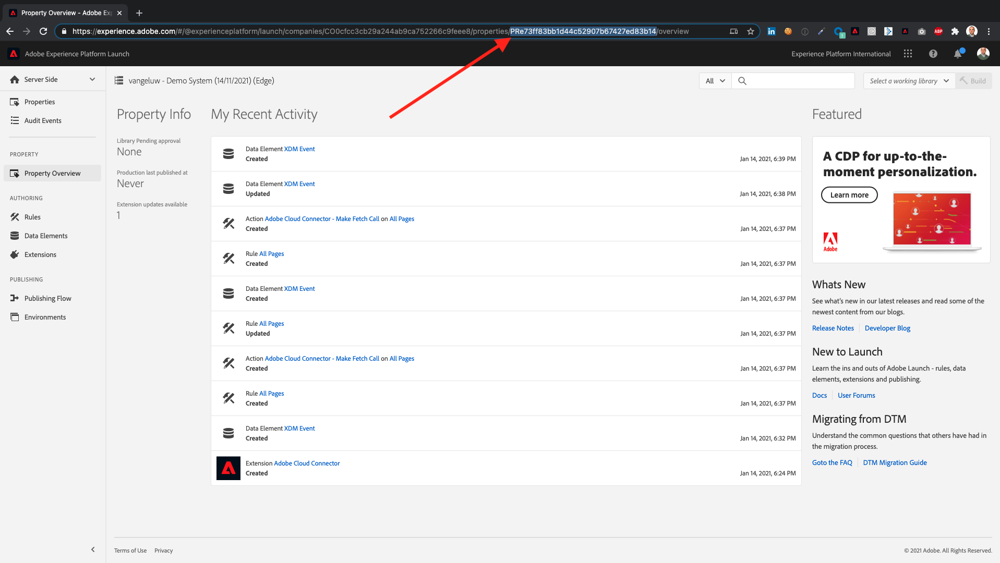

# Comprehensive Technical Tutorial for Adobe Experience Platform - How is Completion Measured?

You can update your completion of the Comprehensive Technical Tutorial for Adobe Experience Platform on the Admin homepage of the AEP Demo website, by going to [https://public.aepdemo.net/admin.html](https://public.aepdemo.net/admin.html). 

On the demo website, upon first load, you'll have to enter your **Configuration ID**, followed by clicking **Load Configuration**.

After loading your configuration, scroll down and click **Save Configuration**.

You'll then be on the **Admin** homepage. 

Go to **Select LDAP**, search and select your ldap and click **Save**.

You'll then be back on the homepage, and you'll see your personal progress.

You are in charge of updating your own progress, so every time you complete a module, you'll have to go back to [https://public.aepdemo.net/admin.html](https://public.aepdemo.net/admin.html), select your LDAP as indicated above, and then go to the page **Complete Module**.

On the **Complete Module**-page, you'll only see the modules you haven't completed yet. To complete every module, you're expected to input a proof of completion.

Below are the expected proofs of completion for every module.

## Module 0

The expected proof of completion for module 0 is the Configuration ID that you created in Module 0.

The Configuration ID format looks like this: **TogD1ESZj2**.

Then go to the **Complete Module**-page, select **M0. Configuration ID**, enter your **Configuration ID** and click the **Submit** - button.

You should get a confirmation email within minutes.

## Module 1

Module 1 will be re-released in August 2020.

## Module 2

The expected proof of completion for module 2 is the Dataset ID for the 2 datasets that you created in Module 2.

The Dataset ID format looks like this: **5f069724723ef41916a8b5d2**.

Then go to the **Complete Module**-page, select **M2. Data Ingestion**, enter your **Dataset ID** for both datasets in the input fields and click the **Submit** - button.

You should get a confirmation email within minutes.

## Module 3

The expected proof of completion for module 3 is the **Segment ID** of the segment that you created through the API.

The Segment ID format looks like this: **a01f438d-5cbe-40dc-b57a-169c6b15b025**.

Then go to the **Complete Module**-page, select **M3. Real-time Customer Profile**, enter your **Segment ID** in the input field and click the **Submit** - button.

You should get a confirmation email within minutes.

## Module 4

The expected proof of completion for module 4 is your **AWS Alexa Skill ID**.

The **AWS Alexa Skill ID** looks like this: **amzn1.ask.skill.96574e23-f765-4e8c-9924-3ba950cab891** and can be found here: 

Then go to the **Complete Module**-page, select **M4. Voice Assistant**, enter your **AWS Alexa Skill ID** in the input field and click the **Submit** - button.

You should get a confirmation email within minutes.

## Module 5

The expected proof of completion for module 5 are the Batch IDs of your **Informatica Jobs**. There are 2 batch IDs to submit, from 2 different datasets: the **ETL - Profile Data**-dataset and the **ETL - Offline Orders**-dataset.

The expected format is a batch ID looks like this: **01E4XH8N5WS2XAM8V03J15XB4F**. Make sure to have both your batch IDs available.

Then go to the **Complete Module**-page, select **M5. ETL**, enter your 2 **Batch IDs** in the input fields and click the **Submit** - button.

You should get a confirmation email within minutes.

## Module 6

The expected proof of completion for module 6 is the Journey Orchestration Event ID for your **Account Creation Signup** - journey that you configured in Module 6.

The format looks like this: **aa00b8ac11f4b75bb4166874152ce86e23960a422a2c7f22c9e672c3c729b050**.

Then go to the **Complete Module**-page, select **M6. JO - Account Creation**, enter your **Event ID** in the input field and click the **Submit** - button.

You should get a confirmation email within minutes.

## Module 7

The expected proof of completion for module 7 is the Dataset ID for your **ldap\_callcenter\_interaction_analysis** - dataset that you get after completing module 7.

The format looks like this: **5e2f4f46654d2318a87c7b03**.

Then go to the **Complete Module**-page, select **M7. Query Service**, enter your **Dataset ID** in the input field and click the **Submit** - button.

You should get a confirmation email within minutes.

## Module 8

The expected proof of completion for module 8 is the Recipe Name for your **Recommendations Recipe** that you get after completing Module 8.

The format looks like this: **ldapRecommendations**.

Then go to the **Complete Module**-page, select **M8. DSW - Recommendations**, enter your **Recipe Name** in the input field and click the **Submit** - button.

You should get a confirmation email within minutes.

## Module 9

The expected proof of completion for module 9 is the ID of your **GTM Container ID** that you get after completing Module 9.

The format looks like this: **GTM-WPCG4CK**.

Then go to the **Complete Module**-page, select **M9. Data Ingestion with Google**, enter your **GTM Container ID** in the input field and click the **Submit** - button.

You should get a confirmation email within minutes.

## Module 10

The expected proof of completion for module 10 is the ID for your **Product Purchase Propensity Customer AI Service** that you configured Module 10.

The format looks like this: **10888** and you can retrieve it from the URL when having opened your service.

Then go to the **Complete Module**-page, select **M10. Intelligent Services**, enter your **Product Purchase Propensity Customer AI Service ID** in the input field and click the **Submit** - button.

You should get a confirmation email within minutes.

## Module 11

The expected proof of completion for module 11 is the ID of your **Adobe Target Activity** that you configure during Module 11.

The format looks like this: **111804**.

Then go to the **Complete Module**-page, select **M11. RTCDP**, enter your **Adobe Target Activity ID** in the input field and click the **Submit** - button.

You should get a confirmation email within minutes.

## Module 12

The expected proof of completion for module 12 is the ID of your **JO Journey** that you configure during Module 12.

The format looks like this: **b5cb6f43-3c02-460d-acf2-30833e3da018**.

Then go to the **Complete Module**-page, select **M12. JO - Location-based Personalization**, enter your **Journey ID** in the input field and click the **Submit** - button.

You should get a confirmation email within minutes.

## Module 13

The expected proof of completion for module 13 is the ID of the **CJA - Analysis Workspace Project** that you configured during Module 13.

The format looks like this: **5e3bb1642ef79f7b4ef41d66**, you can find it in the URL when you've opened your project.

Then go to the **Complete Module**-page, select **M13. Customer Journey Analytics**, enter your **Project ID** in the input field and click the **Submit** - button.

You should get a confirmation email within minutes.

## Module 14

The expected proof of completion for module 14 is the ID of the **Offer Activity** that you created.

You can find the **Offer Activity ID**, which looks like this **xcore:offer-activity:1122fcc4603ea499**, here:

Then go to the **Complete Module**-page, select **M14. Offers**, enter your **Offer Activity ID** in the input field and click the **Submit** - button.

You should get a confirmation email within minutes.

## Module 15

The expected proof of completion for module 15 is the ID of the **ML Service ID** that you created.

You can find the **ML Service ID**, which looks like this **b9ae569a-20ac-440e-8902-44e9868307cb**, here:

Then go to the **Complete Module**-page, select **M15. DSW - Car Insurance Sales Propensity**, enter your **ML Service ID** in the input field and click the **Submit** - button.

You should get a confirmation email within minutes.

## Module 16

The expected proof of completion for module 16 is the ID of your **BigQuery**-connection.

You can find the **BigQuery Connection ID**, which looks like this **85a2394d-8b94-410c-a239-4d8b94b10c38**, here:

Then go to the **Complete Module**-page, select **M16. Google BigQuery**, enter your **BigQuery Connection ID** in the input field and click the **Submit** - button.

You should get a confirmation email within minutes.

## Module 17

The expected proof of completion for module 17 is the ID of your **Microsoft Power Automate Flow**.

You can find the **Flow ID**, which looks like this **8358d616-f465-420b-917d-b3f998c34f0f**, here:

Then go to the **Complete Module**-page, select **M17. Microsoft Dynamics 365**, enter your **Microsoft Power Automate Flow ID** in the input field and click the **Submit** - button.

You should get a confirmation email within minutes.

## Module 18

The expected proof of completion for module 18 is the ID of your **Microsoft Azure Event Hub** destination in Adobe Experience Platform.

You can find the **Microsoft Azure Event Hub Destination ID**, which looks like this **fa3f7ce5-86fd-4096-bf7c-e586fdc096ba**, here:

Then go to the **Complete Module**-page, select **M18. RTCDP + Azure EventHub**, enter your **Microsoft Azure Event Hub Destination ID** in the input field and click the **Submit** - button.

You should get a confirmation email within minutes.

## Module 19

The expected proof of completion for module 19 is your **ServiceNow Instance URL**.

You can find the **ServiceNow Instance URL**, which looks like this **https://dev88675.service-now.com/**, here:

Then go to the **Complete Module**-page, select **M19. ServiceNow**, enter your **ServiceNow Instance URL** in the input field and click the **Submit** - button.

You should get a confirmation email within minutes.

## Module 20

The expected proof of completion for module 20 is your **Stackchat App ID**.

You can find the **Stackchat App ID**, which looks like this **cmwkerql16t2sw**, here:

Then go to the **Complete Module**-page, select **M20. Stackchat**, enter your **Stackchat App ID** in the input field and click the **Submit** - button.

You should get a confirmation email within minutes.

## Module 21

The expected proof of completion for module 21 is your **Launch Server Side Environment ID**.

You can find the **Launch Server Side Environment ID**, which looks like this **PRe73ff83bb1d44c52907b67427ed83b14**, here:

Then go to the **Complete Module**-page, select **M21. Launch Server Side Forwarding**, enter your **Launch Server Side Environment ID** in the input field and click the **Submit** - button.

You should get a confirmation email within minutes.

## Module 22

The expected proof of completion for module 22 is the endpoint of your **Project Firefly Dashboard**.

The endpoint URL looks like this **https://133309-vangeluwexpnews-development.adobeio-static.net**, and you can find it here:

Then go to the **Complete Module**-page, select **M22. Adobe I/O Firefly**, enter your **Project Firefly Endpoint URL** in the input field and click the **Submit** - button.

You should get a confirmation email within minutes.

## Module 23

The expected proof of completion for module 23 is the Journey ID of your **ldap - Back in stock Journey**.

The Journey ID looks like this **9aa9f9bc-7710-4b2d-bfc5-276e26bdcef6**, and you can find it here:

Then go to the **Complete Module**-page, select **M23. Project Sierra**, enter your **ldap - Back in stock Journey** in the input field and click the **Submit** - button.

## Module 24

The expected proof of completion for module 24 is the Flow ID of your **ldap - Kafka Dataflow**.

The Flow ID looks like this **48fc1361-96f2-4903-8a30-56efd405824a**, and you can find it here:

Then go to the **Complete Module**-page, select **M24. Apache Kafka**, enter your **Flow ID** in the input field and click the **Submit** - button.

You should get a confirmation email within minutes.

[Go Back to All Modules](./overview.md)
