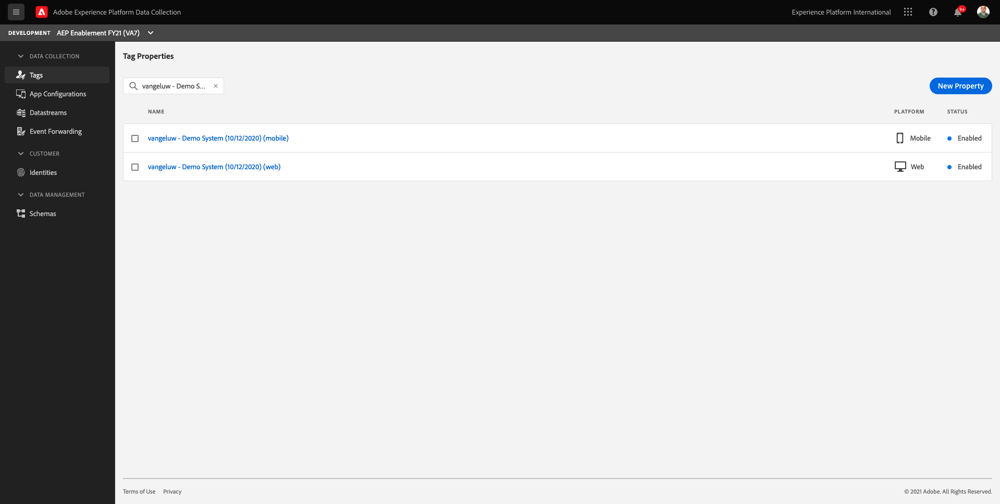

# 0.1 Use Demo System Next to setup your Launch property

After signing up for the Comprehensive Technical Tutorial for Adobe Experience Platform, there's an automated process that will provide you with access to Demo System Next, so that you can access and run the below configuration.

Once you've got access to Demo System Next, proceed with the below steps.

Go to [https://dashboard.adobedemo.com/](https://dashboard.adobedemo.com/).

You'll see a similar homepage:

Click on the card for your specific Adobe Experience Platform instance, in this case:

- **Experience Platform International**
- IMS Org ID: **907075E95BF479EC0A495C73@AdobeOrg**

>[!NOTE]
>
> You can find your IMS Org ID, Org Name and your Adobe Experience Platform sandbox on your company's github repository that was set up by your Adobe contact.

In the menu on the right side, click **Apply Configuration**.

In the next screen, select the template named **Team International AEP Enablement Environment v1.2**. 

Click **Next**.

In the next screen, enter a name. Please use this naming convention: **Demo System (DD/MM/YYYY)**. FYI: your LDAP will be appended automatically, you do not need to add it yourself.

Click **Next**.

In the next screen, you'll see a screen like the below. Demo System Next offers two steps: 

- Setup an Adobe Experience Platform instance with schemas, mixins, datasets and more
- Setup Launch properties for Web and Mobile. 

In this case, the setup of schemas, mixins and datasets has already been done so you can only create the Launch properties you'll use.

Have a look at **Step 2 - Launch**. Click **Start**.

You'll have to wait 1-2 minutes while Demo System Next is configuring the Launch properties.

After a couple of minutes you'll see this:

Click **Next**.

You'll then see this screen. 

>[!IMPORTANT] 
>
>Don't click any of the buttons as these options aren't available for the Team International Demo & Enablement environment.

Click **Finish**.

Two Launch properties have now been created and are ready to be used.

Go to [https://experience.adobe.com/#/data-collection/](https://experience.adobe.com/#/data-collection/).

Enter your LDAP as search term. You should now see the two Launch properties that have been created.

In order to use the Launch properties, you'll need to create a Datastream in the next exercise.

Next Step: [0.2 Create your Datastream](./ex2.md)

[Go Back to Module 0](./getting-started.md)

[Go Back to All Modules](./../../overview.md)
