# 0.3 Create your Enablement Configuration ID

Open an incognito browser window and go to [https://public.aepdemo.net/admin_configuration_view.html](https://public.aepdemo.net/admin_configuration_view.html).

You'll see the **View Configuration ID** page:

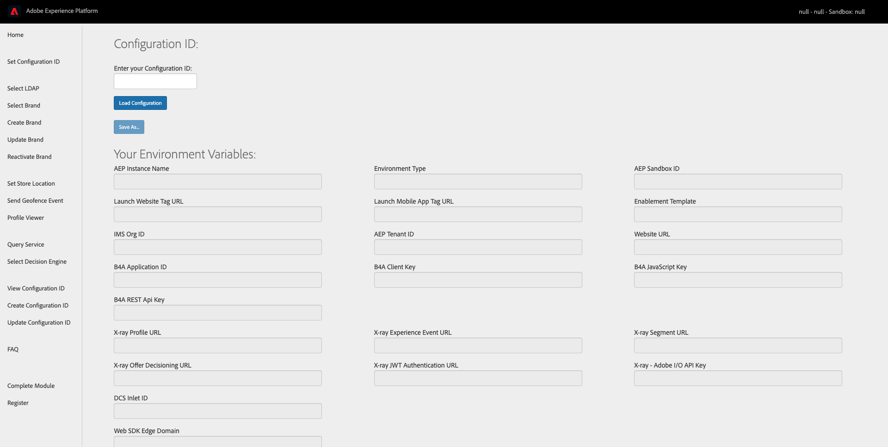

Enter your default Configuration ID (you can find this on the homepage of your GitHub repo) and click **Load Configuration**. You're now seeing the default configuration for this Adobe Experience Platform instance in the context of the enablement.

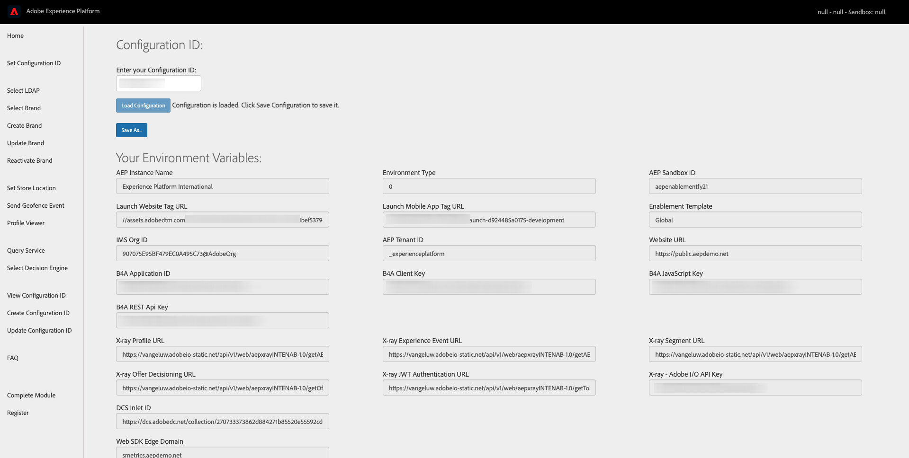

To create your own Configuration ID, click **Save As...**

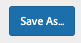

You'll be taken to the **Create a new Configuration ID** page.

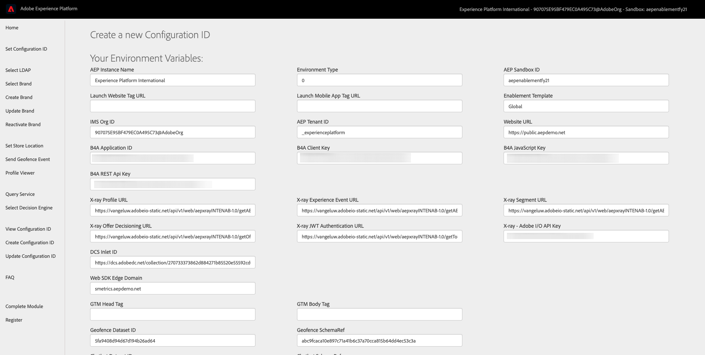

All default variables are already filled out for you. The first thing to do is to add the Data Collection tags for your desktop and mobile app Data Collection properties.

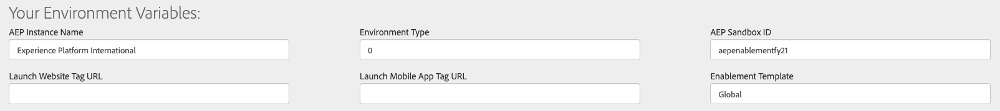

You can find the tags for your Data Collection properties here:

## Web

Go to [https://experience.adobe.com/#/data-collection/](https://experience.adobe.com/#/data-collection/), click **Tags** and search for your properties with the search term **ldap - Demo System**. Open your **Web** property.

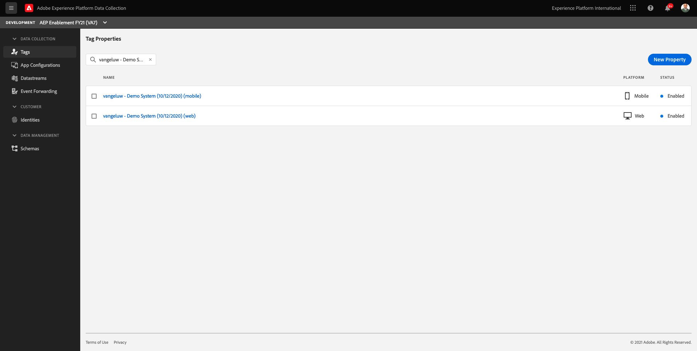

You'll then see this, go to **Environments**.

In Environments, click the **Install** icon for the Development environment.

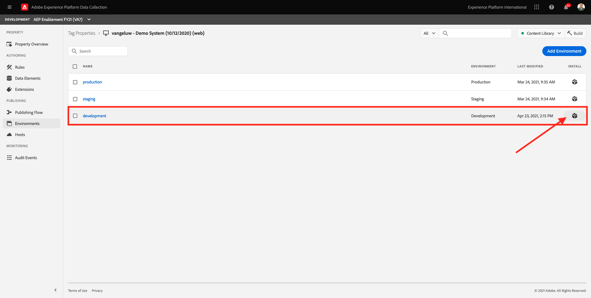

In the popup, you need to select the tag. 

>[!IMPORTANT] 
>
>Don't copy all the code, only copy the url of the tag which is all text between the quotes.

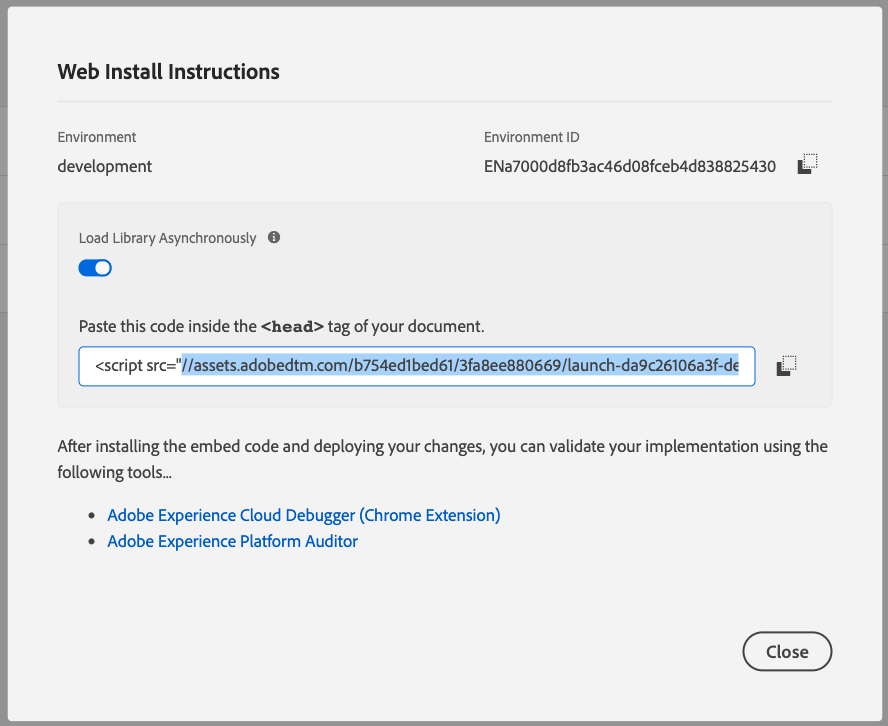

The tag that you need to copy, needs to look like this:
`//assets.adobedtm.com/b754ed1bed61/3fa8ee880669/launch-dadddddddd106a3f-development.min.js`.

Paste this value in the **Create New Configuration ID** screen, in the field **Launch Website Tag URL**.

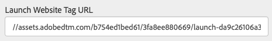

## Mobile 

Go to [https://experience.adobe.com/#/data-collection/](https://experience.adobe.com/#/data-collection/) and search for your properties with the search term **ldap - AEP Demo**. Open your **Mobile** property.

You'll then see this, go to **Environments**.

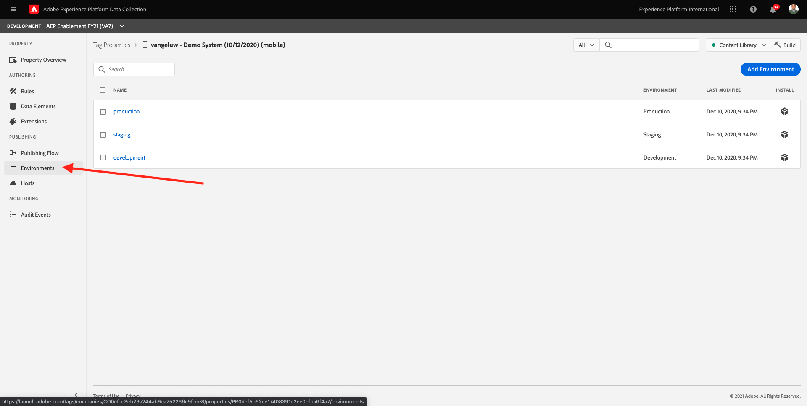

In Environments, click the **Install** icon for the Development environment.

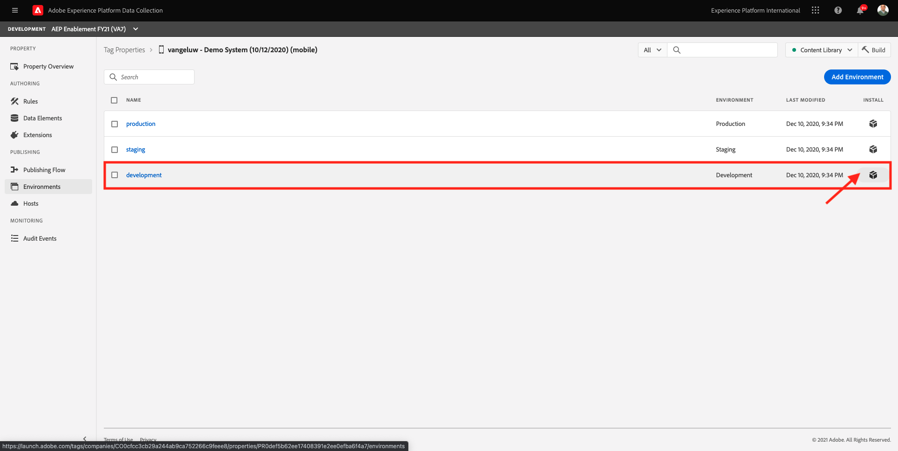

In the popup, copy the Environment File ID as indicated below. 

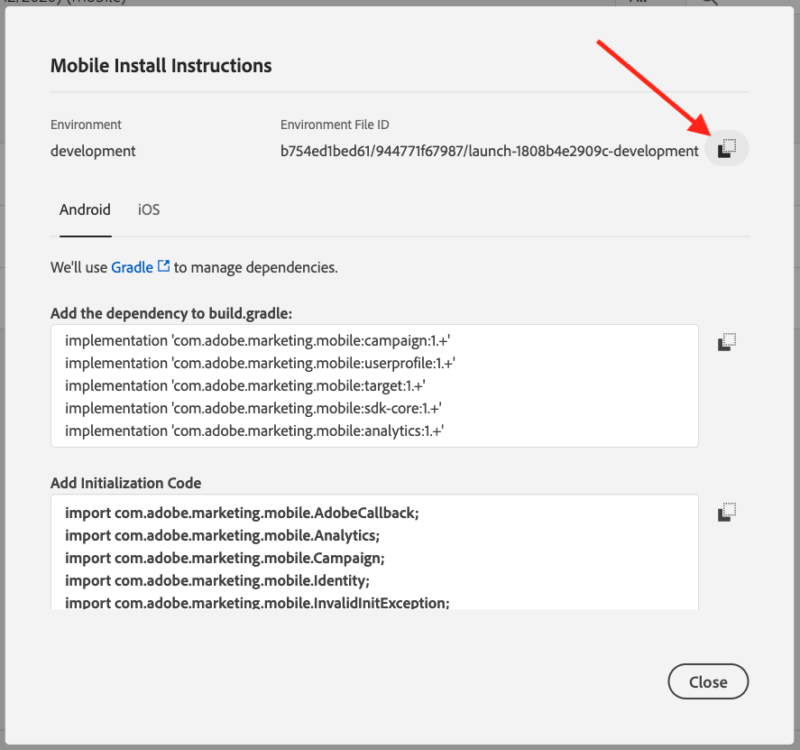

The tag that you need to copy, needs to look like this:
**b754ed1bed61/944771f67987/launch-18ddddddd2909c-development**

Paste this value in the **Create New Configuration ID** screen, in the field **Launch Mobile App Tag URL**.

Next, you need to enter your Demo Profile information. This will be used on the website to simplify the **Create Account** flow. Fill out the fields as indicated in the screenshot. Please enter a real phone number (including the + and your countrycode, for instance: +32473622044) and a real email address, as they will be used to send text messages and emails.

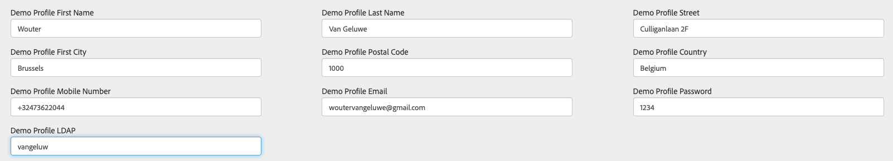

Finally, scroll down and click **Create New Configuration ID**

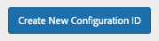

After a couple of seconds, you'll get a confirmation that your Configuration ID has been created. The website will now automatically load the Configuration ID in the website, which will take 10-15 seconds. You'll then see this:

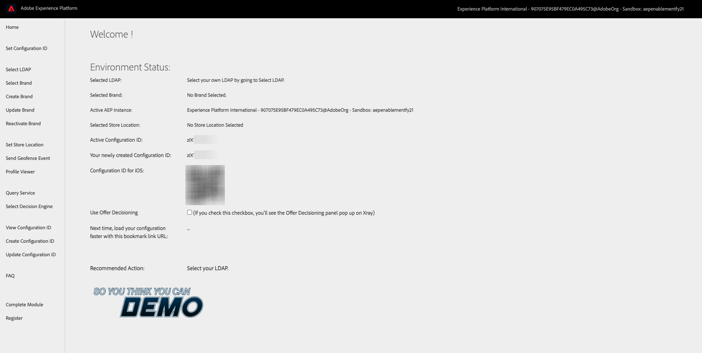

Your Configuration ID is visible on the admin page, please ensure to write down your Configuration ID as you'll need it to use the website, mobile application and several other applications and also, during the enablement modules. Write it down so you don't forget it.

Next Step: [0.4 Use the website](./ex4.md)

[Go Back to Module 0](./getting-started.md)

[Go Back to All Modules](./../../overview.md)
https://experience.adobe.com/#/data-collection/