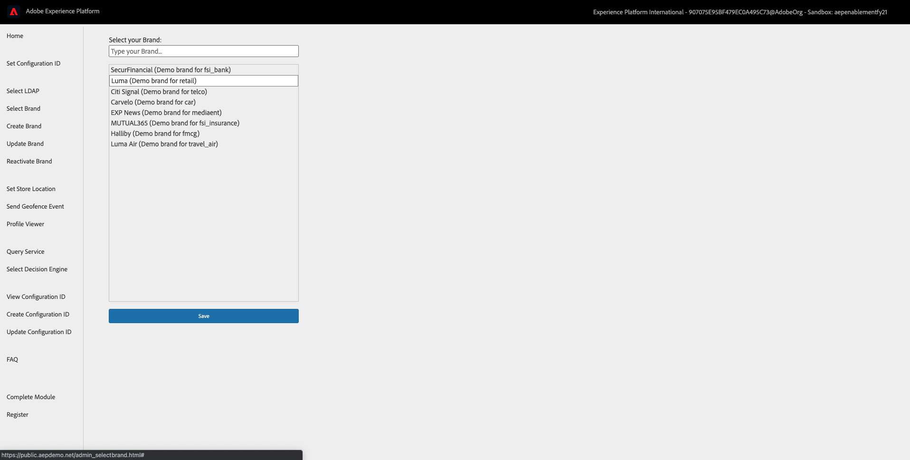
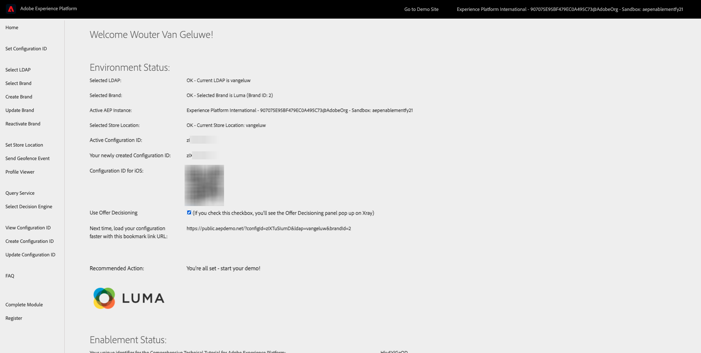
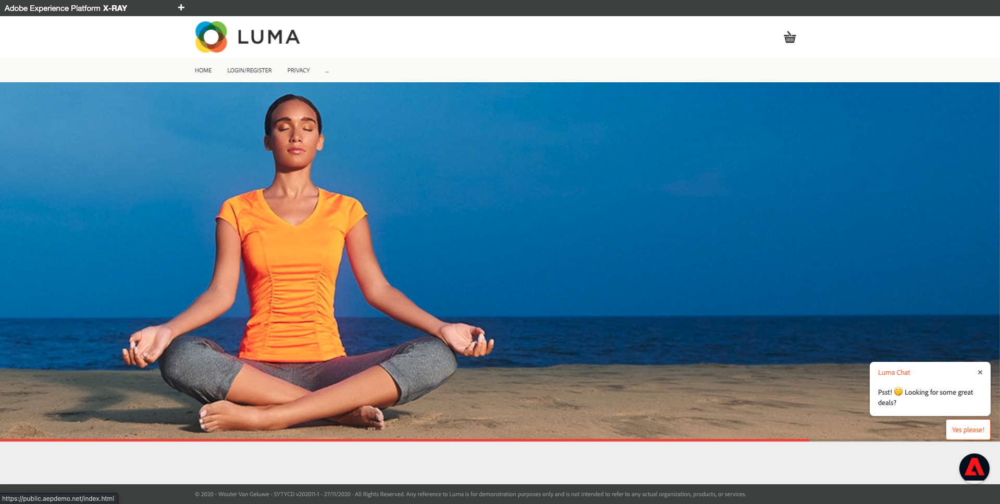
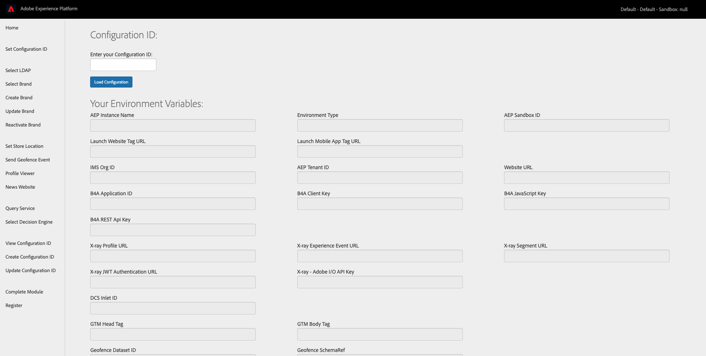
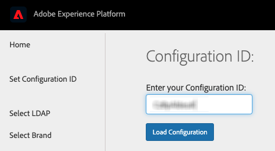
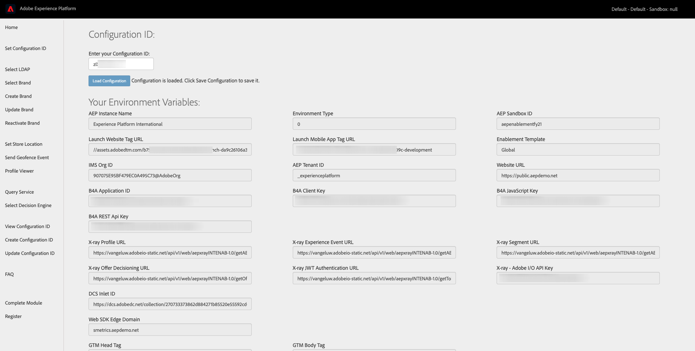
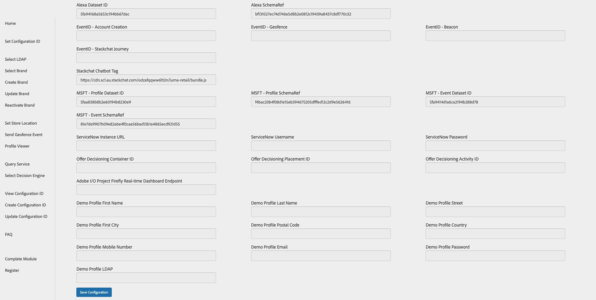

# 0.4 Use the website

## 0.4.1 Option 1: Continue from previous exercise

After exercise 0.2, you now see this:

Go to **Select LDAP** in the left side menu, select your LDAP in the list and click **Save**.

Your LDAP will now be loaded and you'll be redirected to the Admin homepage.

Next, go to **Select Brand** in the left side menu, select a brand of choice and click **Save**.

Your selected brand will now be loaded and you'll be redirected to the Admin homepage.

You'll now see a similar Admin homepage. Click the brand logo to go to the demo website.

You'll now see the homepage of your demo brand and you're now ready to start your demo.

## 0.4.2 Option 2: Start with a new incognito browser window

For every demonstration, you'll need to use a fresh, incognito browser window. After opening a fresh, incognito browser window, go to [https://public.aepdemo.net/](https://public.aepdemo.net/).

You'll be redirected to this page:

Enter the Configuration ID you created in the previous step. Click **Load Configuration**.

You'll then see this:

Scroll down so you can see the **Save Configuration** button. Click **Save Configuration**.

After a couple of seconds you'll be redirected to the Admin homepage and you'll see this:

Go to **Select LDAP** in the left side menu, select your LDAP in the list and click **Save**.

Go to **Select Brand** in the left side menu, select a brand of choice and click **Save**.

You'll now see a similar Admin homepage. Click the brand logo to go to the demo website.

You'll now see the homepage of your demo brand and you're now ready to start your demo.

Next Step: [0.5 Use the mobile app](./ex5.md)

[Go Back to Module 0](./getting-started.md)

[Go Back to All Modules](./../../overview.md)
