# 0.5 Use the mobile app

The mobile application that is used in the context of this demo and enablement environment is only available for **iOS**.

Take your **iOS** device, open the **AppStore** and search for **Platform - Edge**. Click the **DOWNLOAD/INSTALL** button.

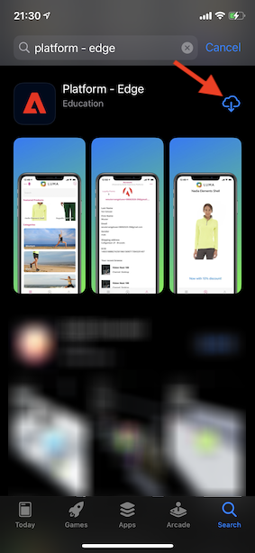

Next, click **OPEN**.

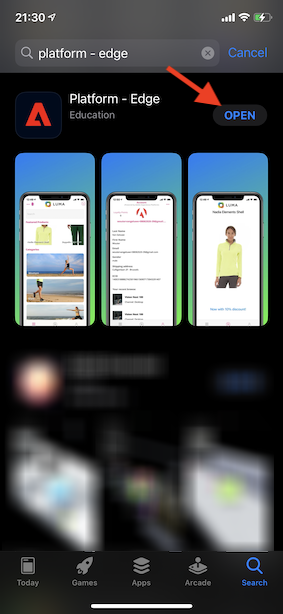

You'll now see this screen. You can either manually enter the **Configuration ID** you created, or else, you can click the **QR code scan** icon to scan a QR code.

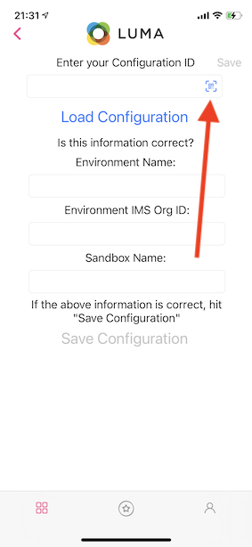

On the Admin homepage of your demo website, you'll find a QR code you can scan. 

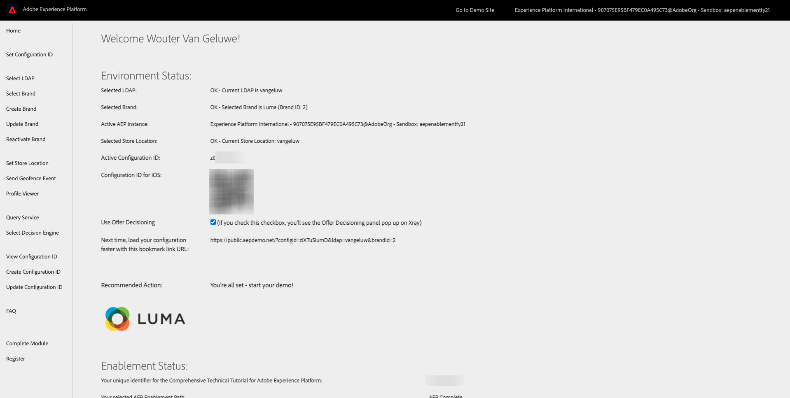

After clicking the **QR code scan** in the app, you'll see this. Click **OK** to scan a QR code.

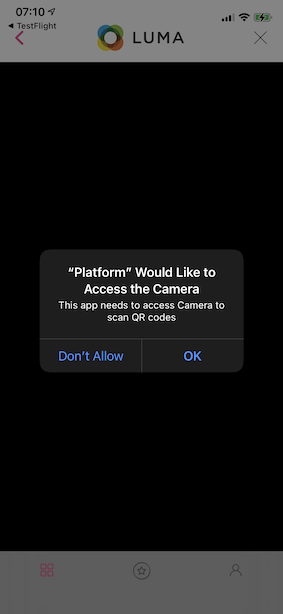

After scanning the QR code, you'll be back in this screen, with the Configuration ID filled out for you. Click **Load Configuration**.

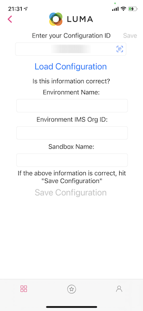

You'll then see a confirmation of which environment you'll be loading. Click **Save Configuration**.

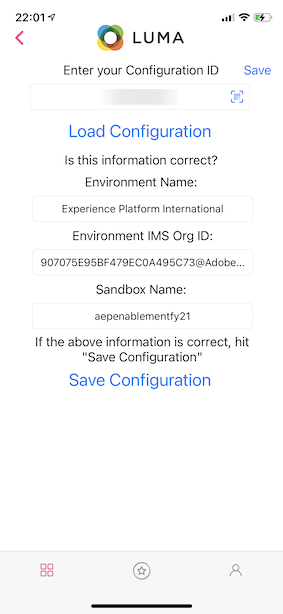

After a couple of seconds, you'll be presented with the **Select LDAP** screen. Select your LDAP and click **Save**.

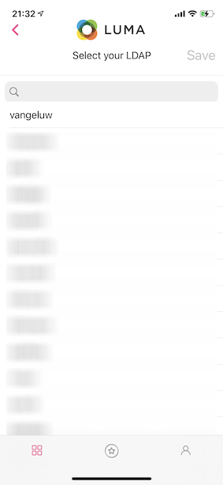

After a couple of seconds, you'll see that the demo brand **Luma** is being loaded automatically.

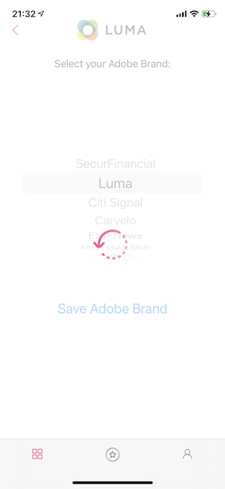

And finally, you'll see the Luma homepage in the app.

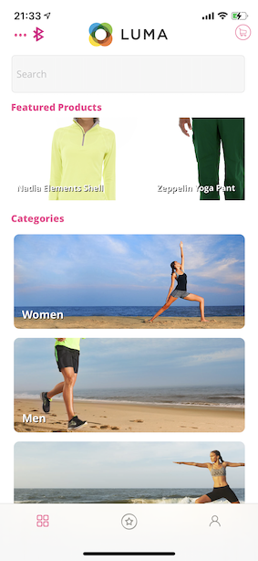

Kill the app by swiping the app up, and swiping it up completely so that the app is killed.

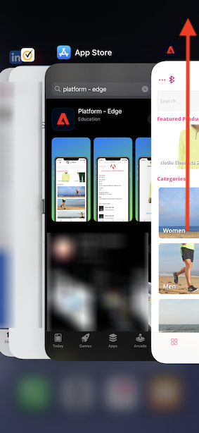

>[!NOTE]
>
> After restarting the app, you'll be asked to accept up to 3 permission prompts. Accept those prompts by clicking **OK**, **Allow while using the app** or **Allow** as they are required by the app.

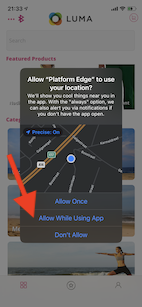
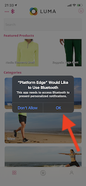
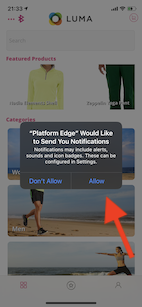

You'll then see the Luma homepage in the app again, which means you're ready for your demo and enablement.

Next Step: [0.6 Install the Chrome extension for the Experience League documentation](./ex6.md)

[Go Back to Module 0](./getting-started.md)

[Go Back to All Modules](./../../overview.md)
