# 0.6 Install the Chrome extension for the Experience League documentation

All documentation is available on Experience League by going [here](https://experienceleague.adobe.com/docs/platform-learn/comprehensive-technical-tutorial/overview.html).

The documentation has been made generic so that it can easily be reused by anyone, using any Adobe Experience Platform instance. 
By making the documentation reusable, **Environment Variables** were introduced in the documentation, which means that you'll find the below **keys** in the documentation. When you see one of those keys, you should change that into the specific value for your specific Adobe Experience Platform instance.

| Name     | Key | 
|:-------------:| :---------------:|
| AEP IMS Org ID         | `--aepImsOrgId--` |
| AEP Tenant ID         | `--aepTenantId--` |
| DCS Inlet ID         | `--dcsInletId--` | 
| Back4App Application ID        | `--parseAppKey--` | 
| Back4App Javascript Key       | `--parseJavaScriptKey--` | 
| X-ray Adobe I/O Profile URL       | `--jwtProfile--` | 
| X-ray Adobe I/O Experience Event URL       | `--jwtExperienceEvent--` | 
| X-ray Adobe I/O Segment URL       | `--jwtSegment--` | 

This results in the documentation looking like this, which gives you a lot of manual copy and paste work to replace those variables by their real values.

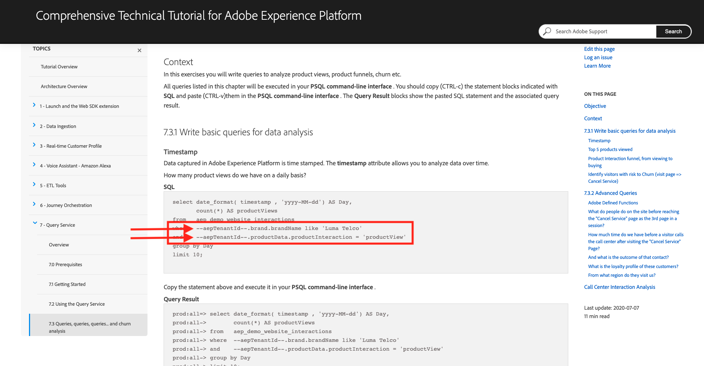

In order to make this process easier, a Chrome extension was built to automatically load and translate those keys into your specific values, based on the Configuration ID you created in [Exercise 0.2](./ex2.md).

To install that Chrome extension, open your Chrome browser.

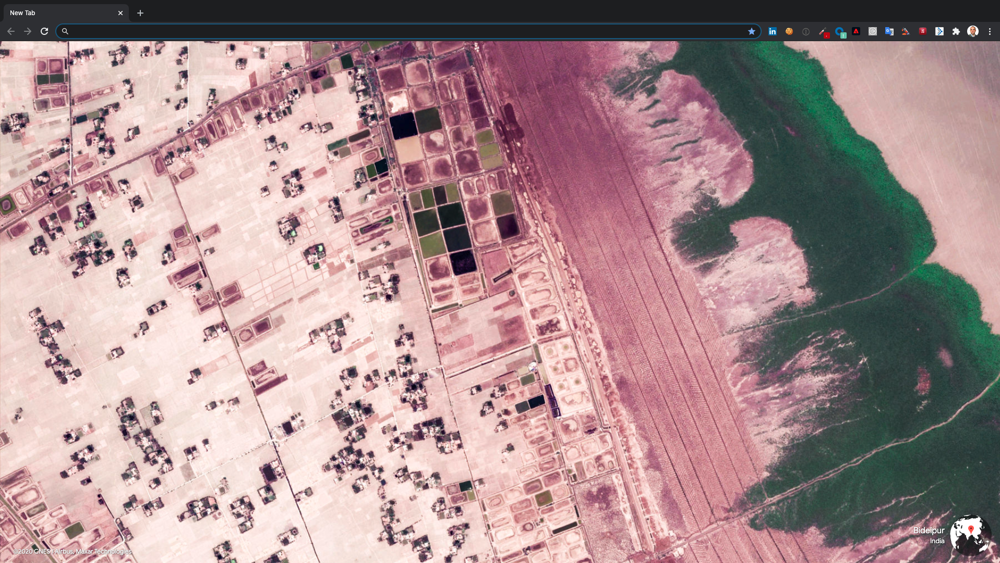

Go to: [https://chrome.google.com/webstore/detail/platform-learn-configurat/hhnbkfgioecmhimdhooigajdajplinfi/related?hl=en&authuser=0](https://chrome.google.com/webstore/detail/platform-learn-configurat/hhnbkfgioecmhimdhooigajdajplinfi/related?hl=en&authuser=0). You'll then see this. 

Click **Add to Chrome**. 

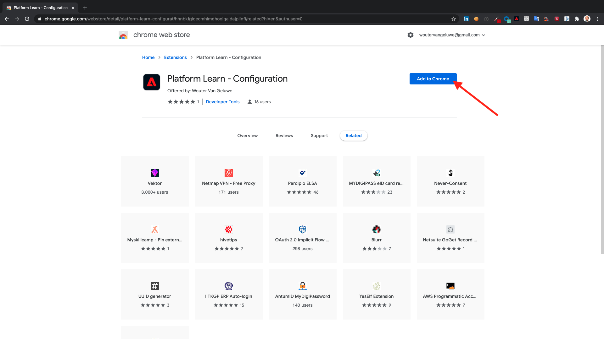

You'll then see this. Click **Add extension**.

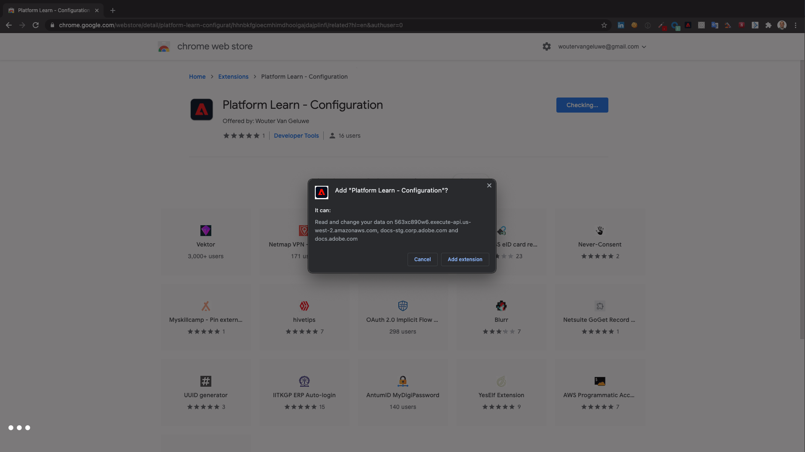

The extension will then be installed, and you'll see a similar notification.

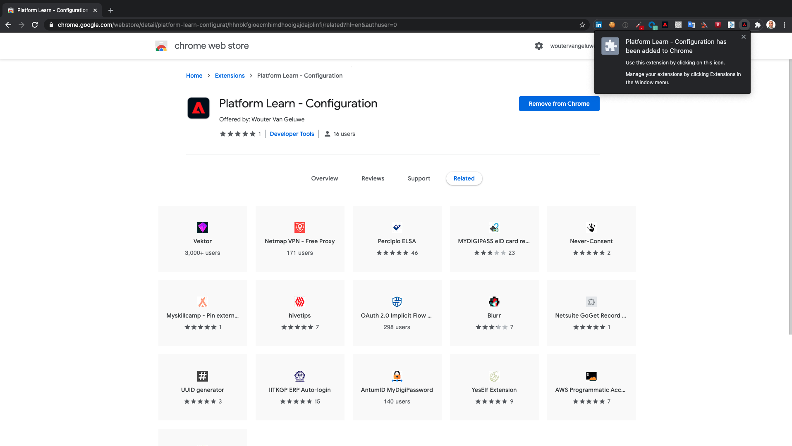

In the **extensions** menu, click the **puzzle piece** icon and pin the **Platform Learn - Configuration** extension to the extension menu.

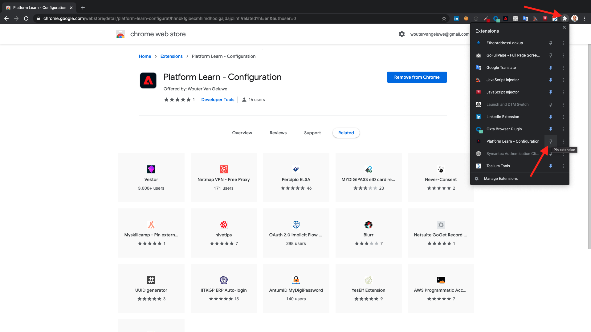

Go to [https://experienceleague.adobe.com/docs/platform-learn/comprehensive-technical-tutorial/overview.html](https://experienceleague.adobe.com/docs/platform-learn/comprehensive-technical-tutorial/overview.html) and then click the extension icon to open it.

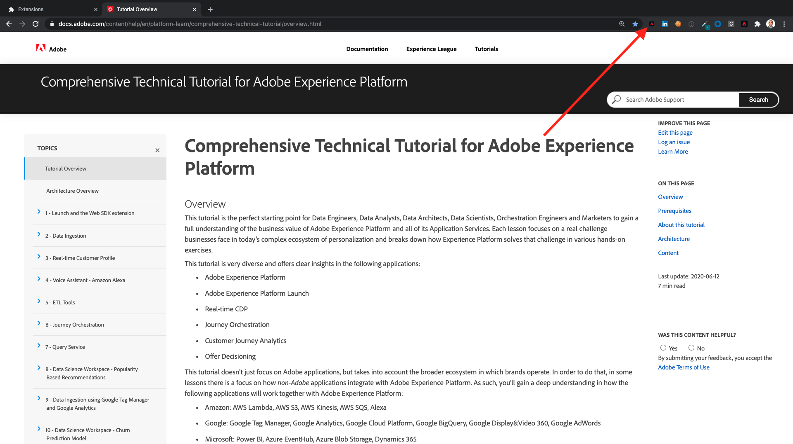

You'll then see this popup.

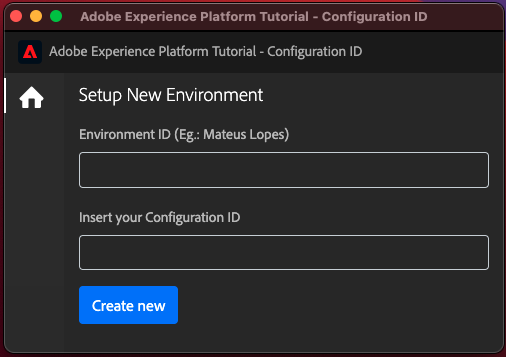

Enter your name and the Configuration ID you created in [Exercise 0.2](./ex2.md). Click **Create New**.

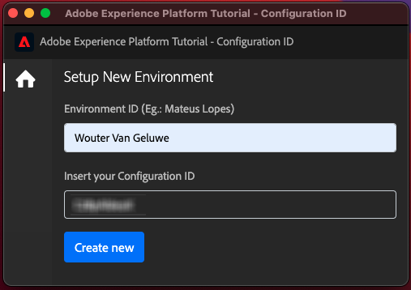

In the left menu of the extension, you'll now see an icon with your initials. Click it. You'll then see the mapping between the **Environment Variables** and your specific Adobe Experience Platform instance values.

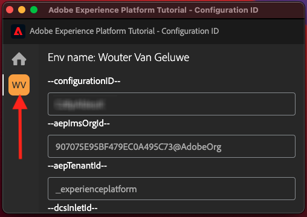

Scroll down (or make the popup a bit bigger) until you see the button **Activate Configuration**. Click the button **Activate Configuration**.

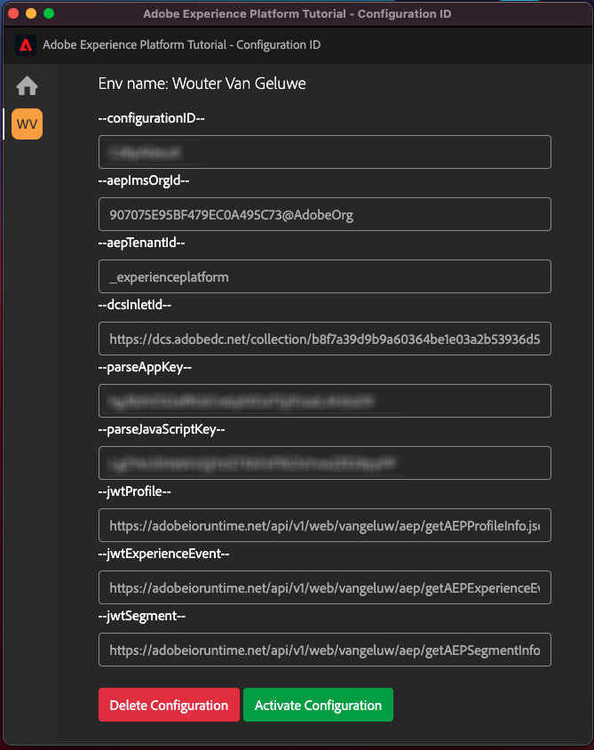

You'll then see a green dot next to your initials. This means that your Configuration ID is now active.

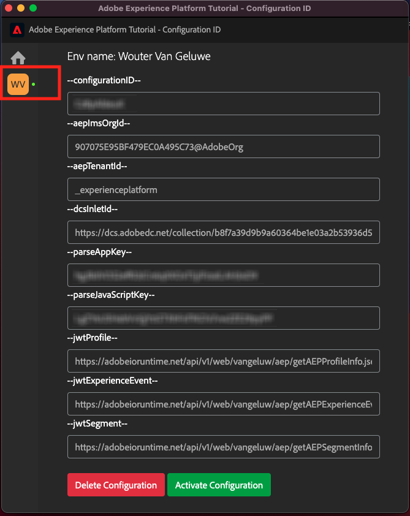

Close the popup.

As a test, go to [this page](https://experienceleague.adobe.com/docs/platform-learn/comprehensive-technical-tutorial/module7/ex3.html).

You should now see that all **Environment Variables** have been replaced by their true values, based on the Configuration ID in the chrome extension.

You should now have a similar view to the below, where the environment variables `--aepTenantId--` has been replaced by your Tenant ID, which in this case is **_experienceplatform**. 

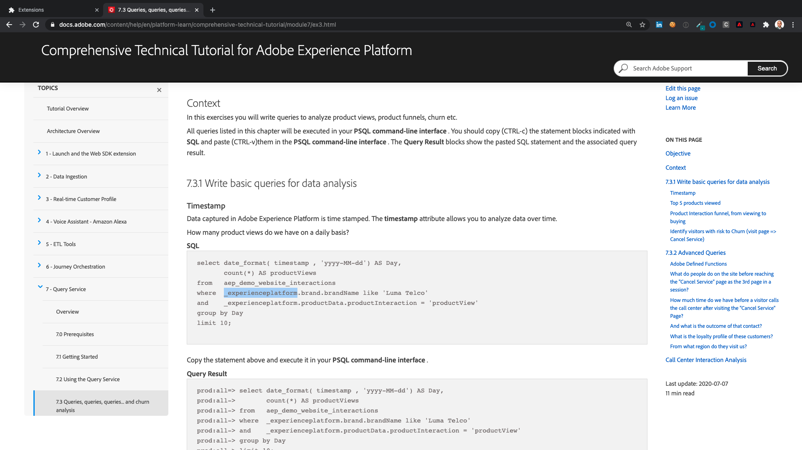

[Go Back to Module 0](./getting-started.md)

[Go Back to All Modules](./../../overview.md)
