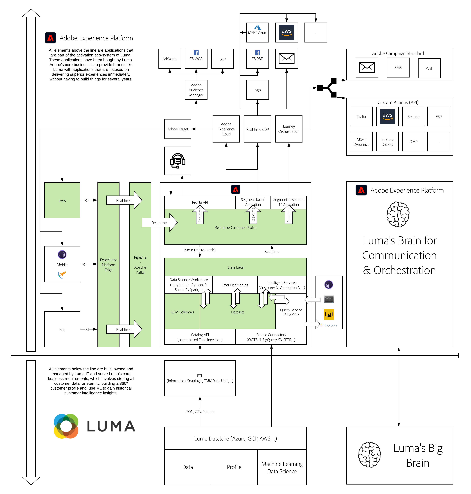

# 1. Foundation - Setup of Adobe Experience Platform Data Collection and the Web SDK extension

**Author: [Matthew Joseph Woolley](https://www.linkedin.com/in/matthewjwoolley/), [Wouter Van Geluwe](https://www.linkedin.com/in/woutervangeluwe/)**

This foundational module introduces you to Adobe's data collection vision and explains how to get data from a website and mobile application into Adobe Experience Platform and other applications via Adobe Experience Platform Data Collection, the Adobe Experience Platform SDKs and Adobe Experience Platform Edge Network. This module introduces some concepts and technologies that have an impact beyond the scope of an Adobe Experience Platform technical tutorial. It should be clear which parts of these exercises are foundational to the rest of the comprehensive tutorial, which teach you more about Experience Edge and its capabilities, and where to go for further information and tutorials.

## Learning Objectives

- Learn how a brand uses Adobe Experience Platform Data Collection as their Tag Management System (TMS).
- Learn the data flows used by a brand to ingest data to their Adobe products.
- Learn how to send data to the Adobe Experience Platform and other products via the Adobe Experience Platform Edge Network.
- Learn how to create Data Elements and Rules that collect data from Web and Mobile.
- Learn about the Web SDK tracking events and how to debug their contents.
- Learn what a data layer is and what Adobe recommends when implementing one.
- Learn what the steps are to implement Web SDK from scratch.
- Learn the difference between a web and mobile implementation.

## Prerequisites

- Access to Adobe Experience Platform: [https://experience.adobe.com/platform](https://experience.adobe.com/platform)
- Access to Adobe Experience Platform Data Collection: [https://experience.adobe.com/#/data-collection/](https://experience.adobe.com/#/data-collection/)
- Access to the demo website

>[!IMPORTANT]
>
>This tutorial was created to facilitate a particular workshop format. It uses specific systems and accounts to which you might not have access. Even without access, we think you can still learn a lot by reading through this very detailed content. If you're a participant in one of the workshops and need your access credentials, please contact your Adobe representative who will provide you with the required information.

## Architecture Overview

Have a look at the below architecture, which highlights the components that will be discussed and used in this module.

## Sandbox to use

For this module, please use this sandbox: `--aepSandboxId--`.

>[!NOTE]
>
>Don't forget to install, configure and use the Chrome Extension as referenced in [0.6 - Install the Chrome extension for the Experience League documentation](../module0/ex6.md)

## Exercises

[1.1 Understanding Adobe Experience Platform Data Collection](./ex1.md)

In this exercise, explore the Adobe Experience Platform Data Collection UI and get an understanding of its capabilities.

[1.2 Edge Network, Datastreams and Server Side Data Collection](./ex2.md)

In this exercise, you'll learn how to forward data to Adobe products in the Adobe Experience Platform Data Collection interface and investigate the data streams used by the demo website.

[1.3 Introduction to Adobe Experience Platform Data Collection](./ex3.md)

In this exercise, you'll learn how to set-up an Extension, build Data Elements and Rules and publish them to the web.

[1.4 Client-side Web Data Collection](./ex4.md)

In this exercise, debug the Web SDK that has been installed to understand how it works and what data will be used in future exercises.

[1.5 Implement Adobe Analytics and Adobe Audience Manager](./ex5.md)

In this exercise, see and use web data collected with the Web SDK in Adobe Analytics and Adobe Audience Manager.

[1.6 Implement Adobe Target](./ex6.md)

In this exercise, set-up an activity in Adobe Target, implemented via the Web SDK.

[1.7 XDM Schema requirements in Adobe Experience Platform](./ex7.md)

To ensure Web SDK and alloy.js are able to ingest data into Adobe Experience Platform, there is a requirement for a specific XDM Mixin to be part of the XDM Schema in Adobe Experience Platform.

[Summary and benefits](./summary.md)

Summary of this module and overview of the benefits.

>[!NOTE]
>
>Thank you for investing your time in learning all there is to know about Adobe Experience Platform. If you have questions, want to share general feedback of have suggestions on future content, please contact Wouter Van Geluwe directly, by sending an email to **vangeluw@adobe.com**.

[Go Back to All Modules](../../overview.md)
