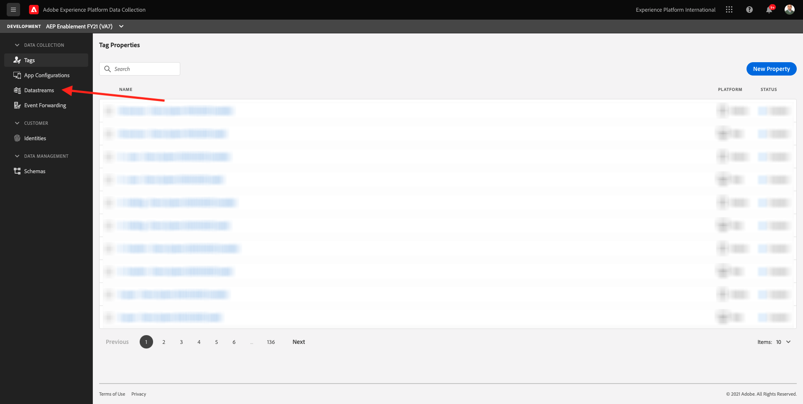
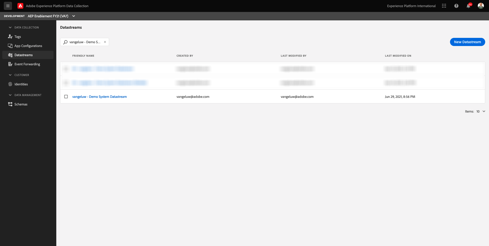
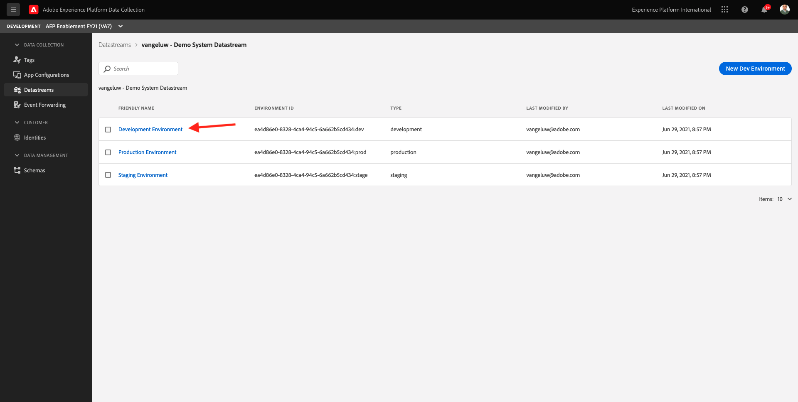
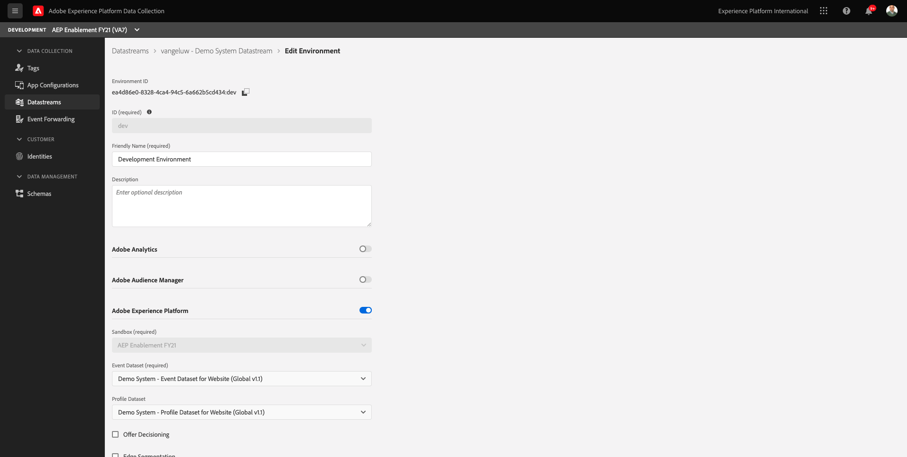
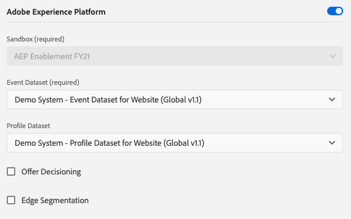

# 1.2 Edge Network, Datastreams and Server Side Data Collection

## Context

In this exercise you'll create a **Datastream**. A **Datastream** tells the Adobe Edge servers where to send the data after it is collected by Web SDK. For example, do you want to send the data to Adobe Experience Platform? Adobe Analytics? Adobe Audience Manager? Adobe Target? 

Datastreams are always managed in the Adobe Experience Platform Data Collection user interface and are critical to Adobe Experience Platform data collection with Web SDK. Even when you implement Web SDK with a non-Adobe tag management solution, you'll still need to create your Datastream in the Adobe Experience Platform Data Collection user interface.

You'll be implementing the Web SDK on the browser in the next exercise. It will then be more clear to you what the data that is being collected looks like. For now, we are just telling the Datastream where to forward the data.

## Create a Datastream

In [Exercise 0.2](./../module0/ex2.md) you already created a Datastream, but we didn't discuss the background and reason for being of the Datastream. 

A Datastream tells the Adobe Edge servers where to send the data after it is collected by the Web SDK. For example, do you want to send the data to Adobe Experience Platform? Adobe Analytics? Adobe Audience Manager? Adobe Target? Datastreams are managed in the Adobe Experience Platform Data Collection user interface and are critical to Platform data collection with Web SDK, regardless of whether or not you are implementing Web SDK via Adobe Experience Platform Data Collection.

Let's review your **[!UICONTROL Datastream]**:

Go to [https://experience.adobe.com/launch/](https://experience.adobe.com/launch/).

Click **[!UICONTROL Datastreams]** in the left menu.

Search for your Datastream, which is named **ldap - Demo System Datastream** (replace **ldap** with your ldap).

Click on your Datastream to open it. You'll then see the three environments (Development, Staging, Production). Click the **Development** environment.

You'll then see the details of your Datastream. 

At this moment, you've only enabled Adobe Experience Platform. Your configuration will look similar to the configuration below. (Depending on your environment and Adobe Experience Platform instance, the Sandbox Name might be different)

You should interpret the below fields like this:

For this Datastream...

- All data that is collected will be stored in the `--aepSandboxId--` sandbox in Adobe Experience Platform
- All Experience Event data is collected by default into the dataset **Demo System - Event Dataset for Website (Global v1.1)**
- All Profile data will be collected by default into the dataset **Demo System - Profile Dataset for Website (Global v1.1)** (ingesting profile data natively with Web SDK currently isn't supported yet by Web SDK, and will be made available at a later stage)
- If you want to use the **Offer Decisioning** application service for this Datastream, you need to check the box for Offer Decisioning. (This will be part of [Module 14](./../module14/offer-decisioning.md))
- If you want to use the **Edge Segmentation**, you need to check the box for Edge Segmentation.

>[!NOTE]
>
> The options to enable Offer Decisioning and Edge Segmentation are currently available in early access to select users. This functionality is not available to all IMS organizations.

For now, no other configuration is needed for your Datastream.

Next Step: [1.3 Introduction to Adobe Experience Platform Data Collection](./ex3.md)

[Go Back to Module 1](./data-ingestion-launch-web-sdk.md)

[Go Back to All Modules](./../../overview.md)
