# 1.4 Client-side Web Data Collection

## 1.4.1 Validate the data in the request

### Install the Adobe Experience Platform Debugger

The Experience Platform Debugger is an extension available for Chrome and Firefox browsers which helps you see the Adobe technology implemented in your web pages. Download the version for your preferred browser:

- [Firefox extension](https://addons.mozilla.org/en-US/firefox/addon/adobe-experience-platform-dbg/)

- [Chrome extension](https://chrome.google.com/webstore/detail/adobe-experience-platform/bfnnokhpnncpkdmbokanobigaccjkpob)

If you've never used the Debugger before - and this one is different from the previous Adobe Experience Cloud Debugger - you might want to watch this five minute overview video:

>[!VIDEO](https://video.tv.adobe.com/v/32156?quality=12&learn=on)

Given that you'll be loading the demo website in incognito mode, you need to make sure the Experience Platform Debugger is also available in incognito mode. To do so, go to **chrome://extensions** in your browser and open the Experience Platform Debugger extension.

Verify that these 2 settings are enabled:

- Developer Mode
- Allow in incognito

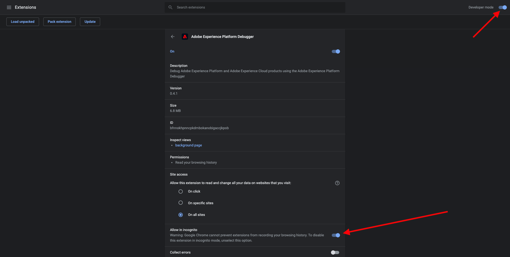

### Open the EXP News website

For this exercise, you'll be using the EXP News website.

In a new incognito/private browser tab, open [https://public.aepdemo.net/](https://public.aepdemo.net/).

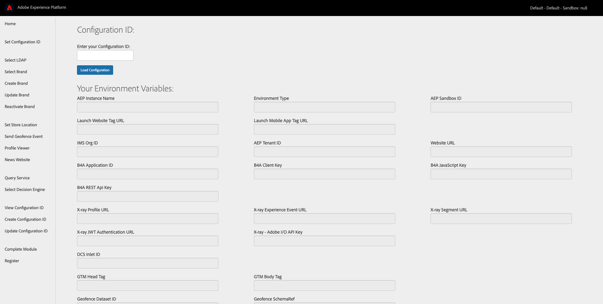

Enter the Configuration ID you created in [Module 0](./../module0/ex1.md) and click **[!UICONTROL Load Configuration]**.

Scroll down and click **[!UICONTROL Save Configuration]**.

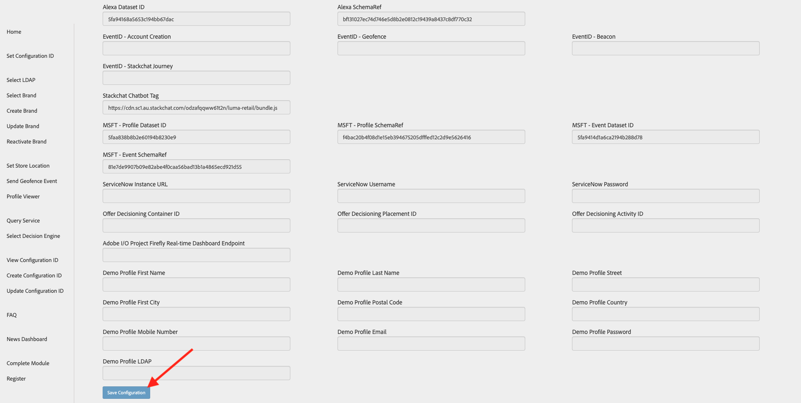

Go to **[!UICONTROL Select LDAP]**, select your LDAP and click **[!UICONTROL Save]**.

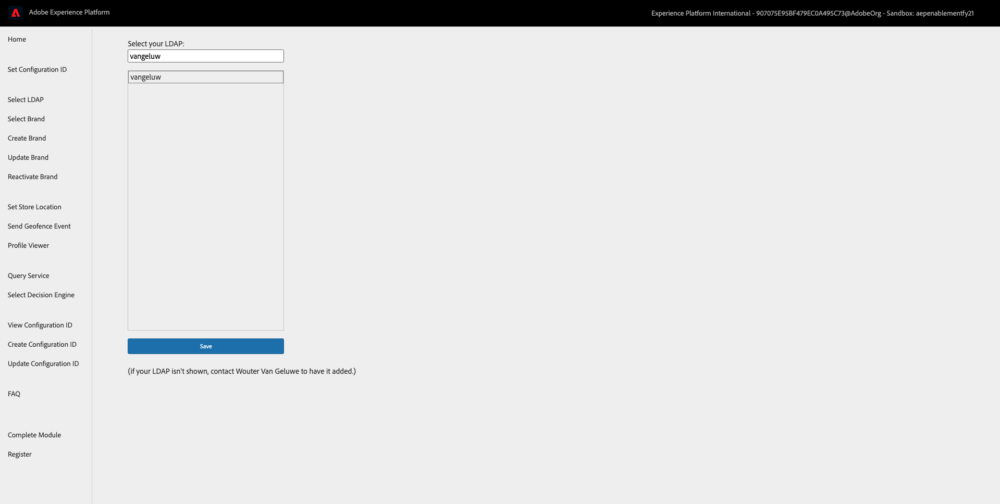

Next, go to **[!UICONTROL Select Brand]** , select **[!UICONTROL EXP News]** and click **[!UICONTROL Save]**.

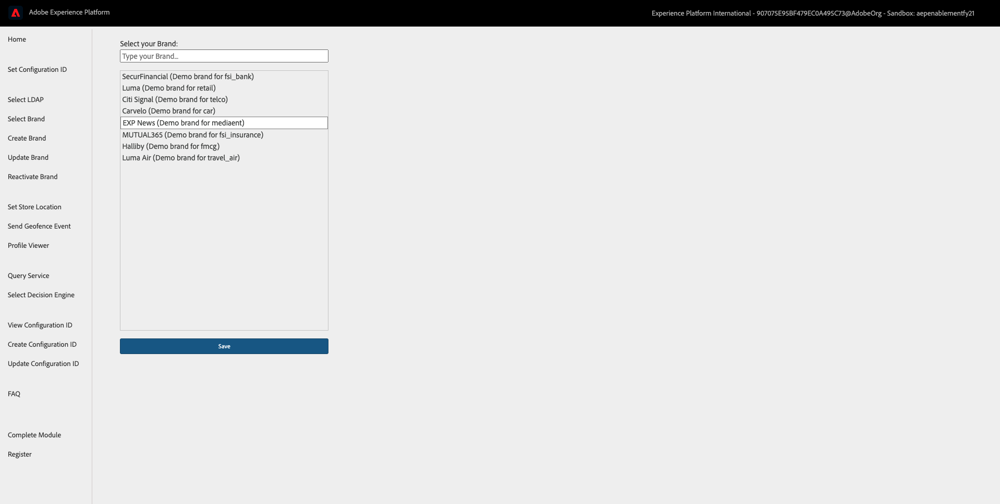

On the **[!UICONTROL Admin]** homepage, click the logo to open the website.

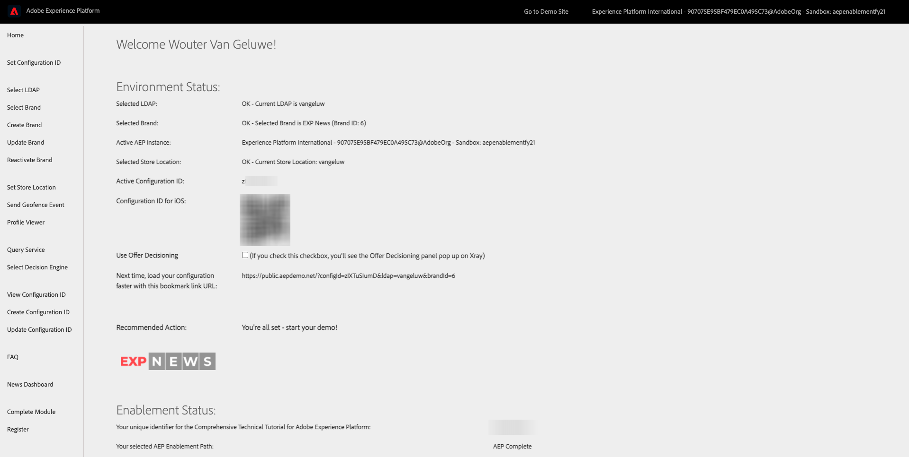

You'll now see the **[!UICONTROL EXP News]** homepage.

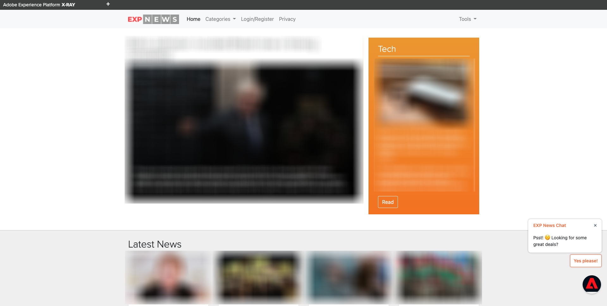

### Use the Experience Platform Debugger to see the calls going to the Experience Edge

Make sure you have the EXP News site open and click the Experience Platform Debugger extension icon. 

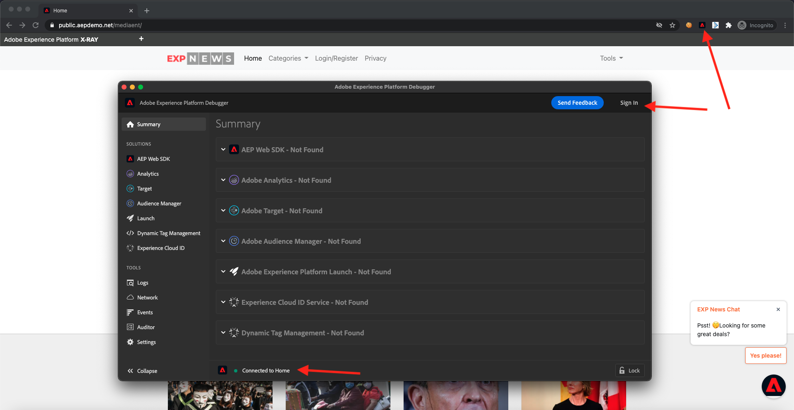

The Debugger will open and show the details of the implementation created in your Adobe Experience Platform Data Collection Property. Remember that you're debugging the Extension and rules that you have just been editing.

Click the **[!UICONTROL Sign In]** button on the top right to authenticate. If you already have a browser tab open with the Adobe Experience Platform Data Collection interface, the authentication step will be automatic and you won't have to enter your username and password again.

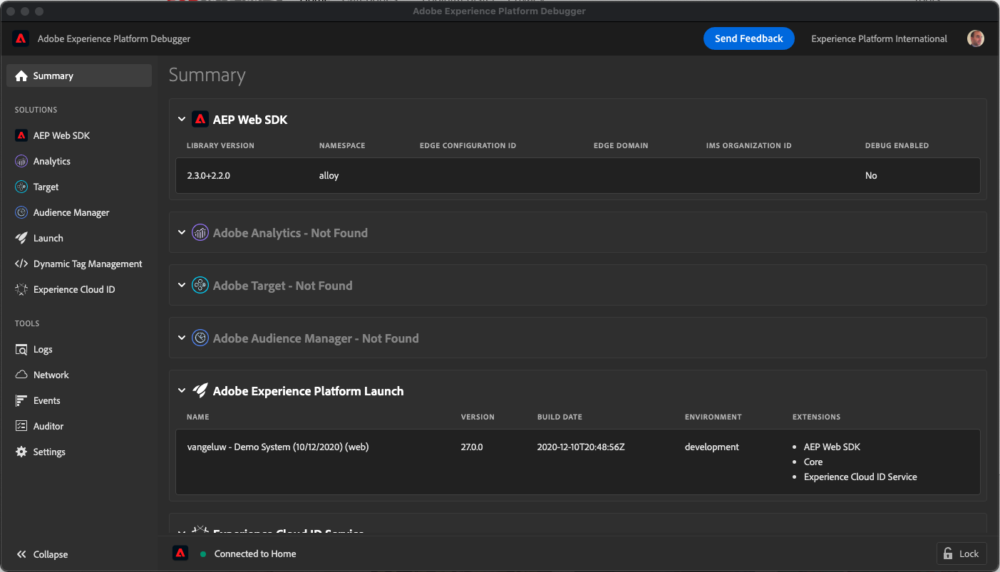

Confirm the Debugger is **[!UICONTROL Connected to Home]** as pictured above and then click the **[!UICONTROL lock]** icon to lock the Debugger to the demo website. If you don't do this, the Debugger will keep switching to expose the implementation details of whatever browser tab is in focus, which can be confusing.

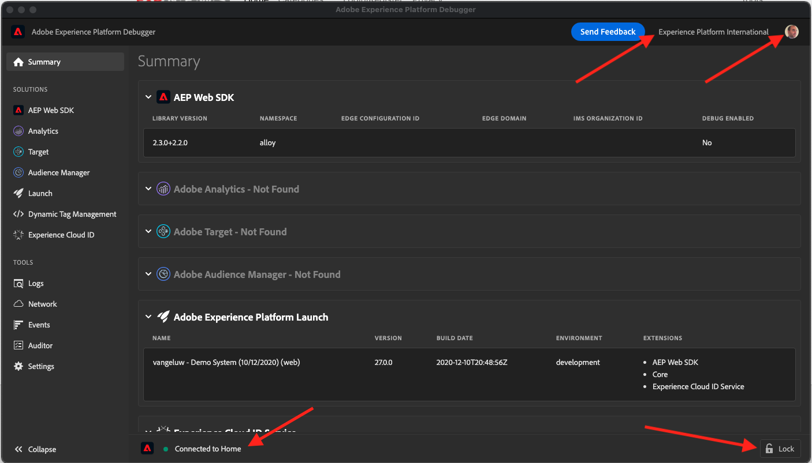

Next, click any random article on the EXP News homepage.

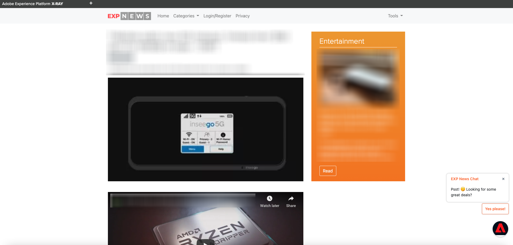

Now click **[!UICONTROL AEP Web SDK]** in the left navigation, to see the **[!UICONTROL Network Requests]**.

Each request contains an **[!UICONTROL events]** row.

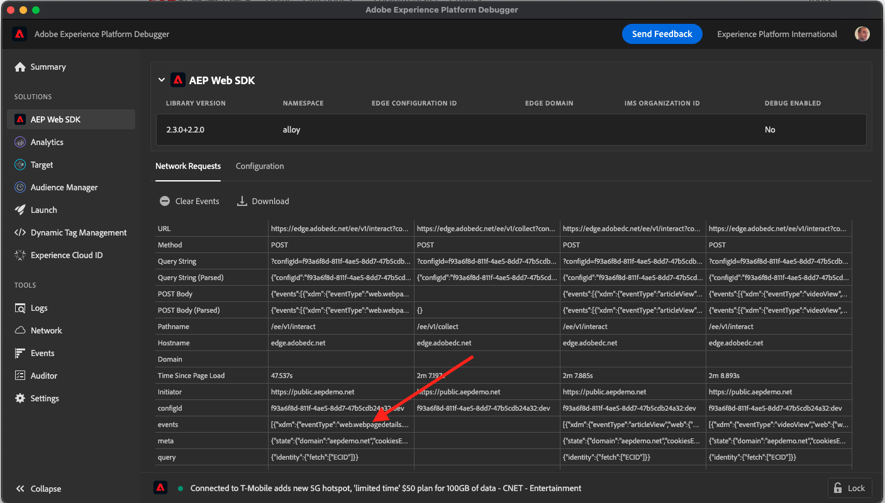

Click to open the **[!UICONTROL events]** row. Note how you can see the **web.webpagedetails.pageViews** event, as well as other, out-of-the-box variables adhering to the **AEP Web SDK ExperienceEvent Mixin** format.

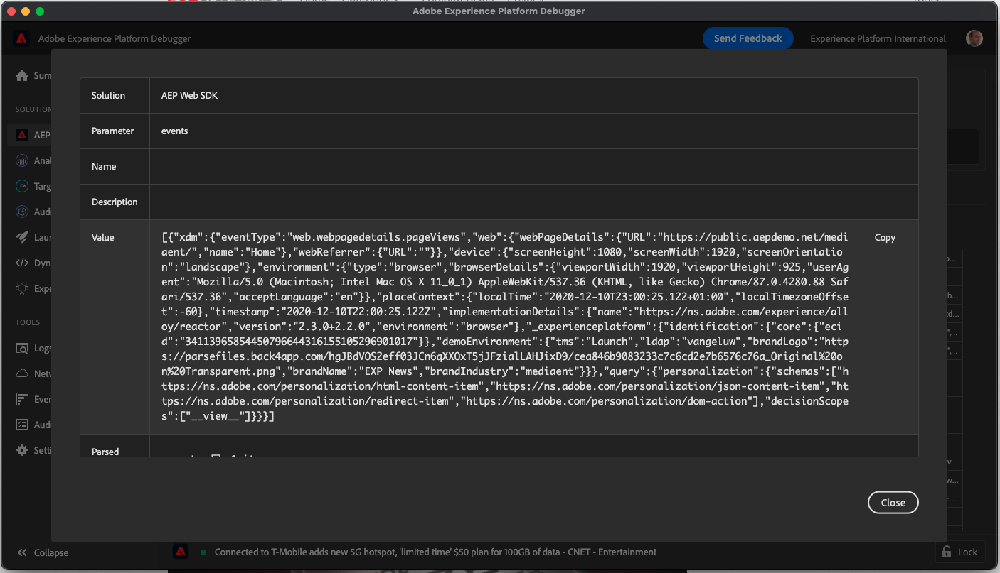

These types of request details are also visible in the Network tab. Filter for requests with **interact** to locate the requests sent by Web SDK. You can find all the details of the XDM payload in the Request Payload Headers:

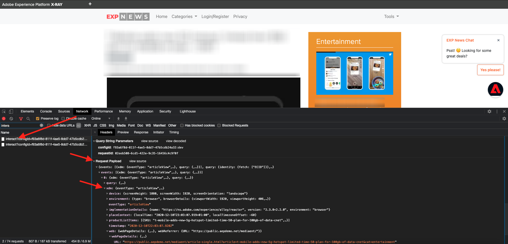

Next step: [1.5 Implement Adobe Analytics and Adobe Audience Manager](./ex5.md)

[Go Back to Module 1](./data-ingestion-launch-web-sdk.md)

[Go Back to All Modules](./../../overview.md)
