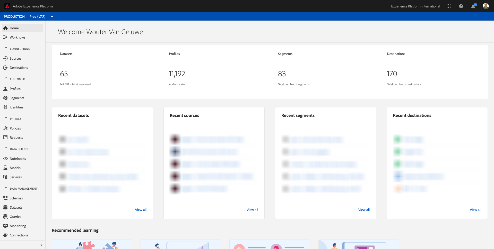
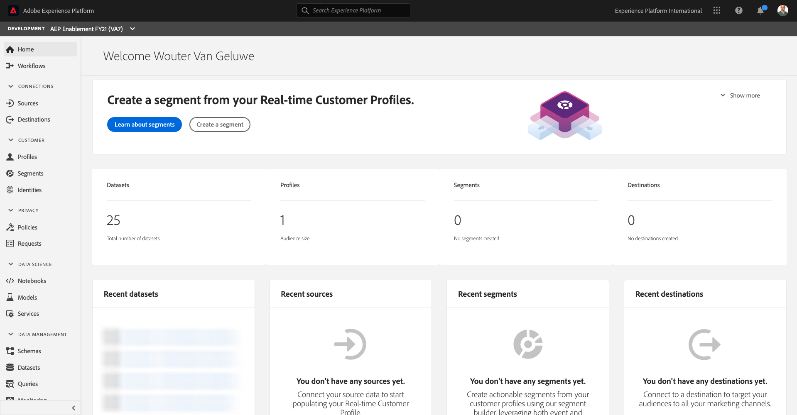
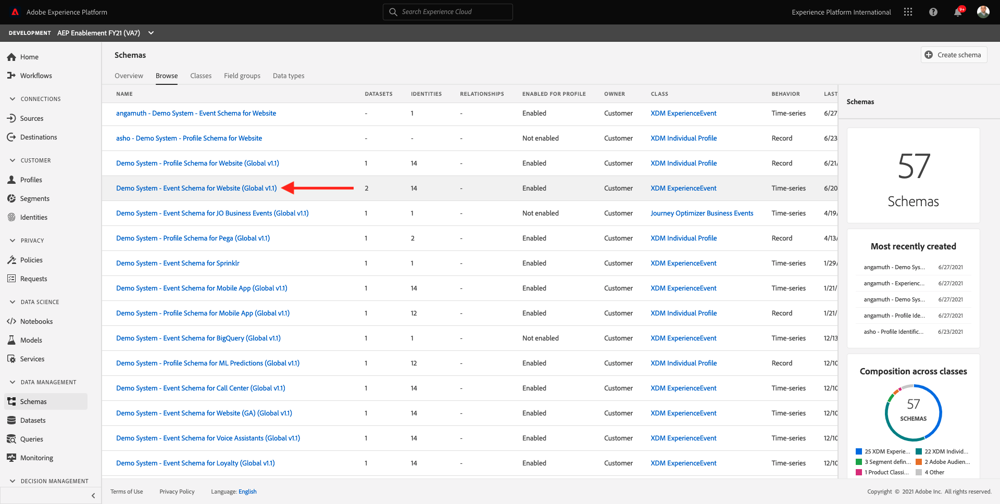
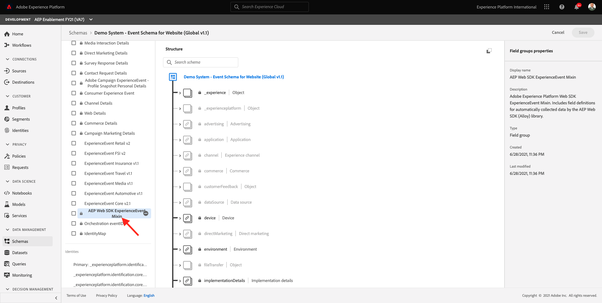

# 1.7 XDM Schema requirements in Adobe Experience Platform

To ensure Web SDK and alloy.js are able to ingest data into Adobe Experience Platform, there is a requirement for a specific XDM Mixin to be part of the XDM Schema in Adobe Experience Platform.

Go to [https://experience.adobe.com/platform](https://experience.adobe.com/platform) and log in.

After logging in, select the appropriate sandbox by clicking the text **Production Prod** in the blue line on top of your screen. Select the sandbox `--aepSandboxId--`.

After selecting your sandbox, you'll see the screen change and now you're in your sandbox.

In the left menu, go to **Schemas** and open the **Demo System - Event Schema for Website (Global v1.1)** Schema.

On that Schema, you'll see that the field group **AEP Web SDK ExperienceEvent Mixin** has been added. This field group adds all the minimally required fields to the Schema. Every Experience Event Schema in Adobe Experience Platform that will be used by Web SDK will always require that field group to be part of the Schema.

In [Module 2](./../module2/data-ingestion.md) you'll learn how to add field groups to schemas.

Next Step: [Summary and benefits](./summary.md)

[Go Back to Module 1](./data-ingestion-launch-web-sdk.md)

[Go Back to All Modules](./../../overview.md)
