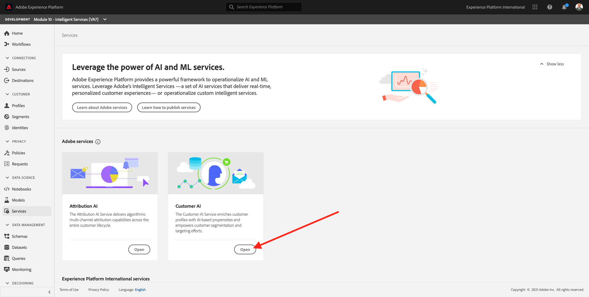
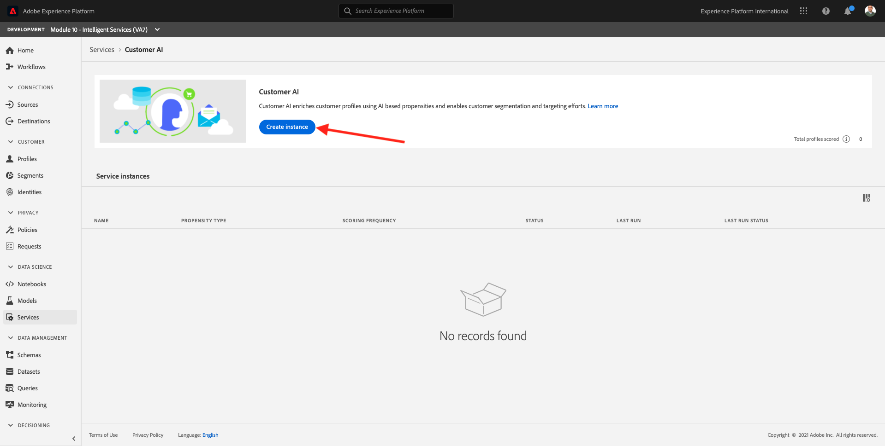
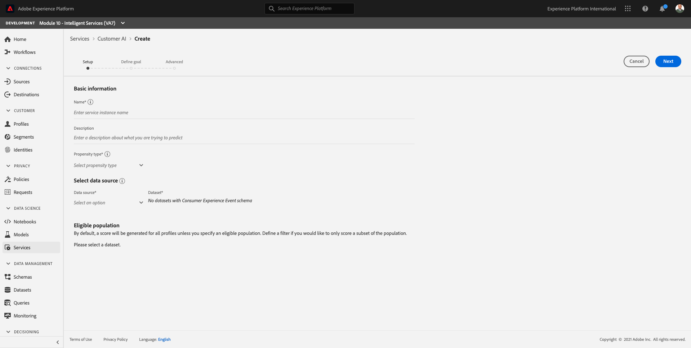
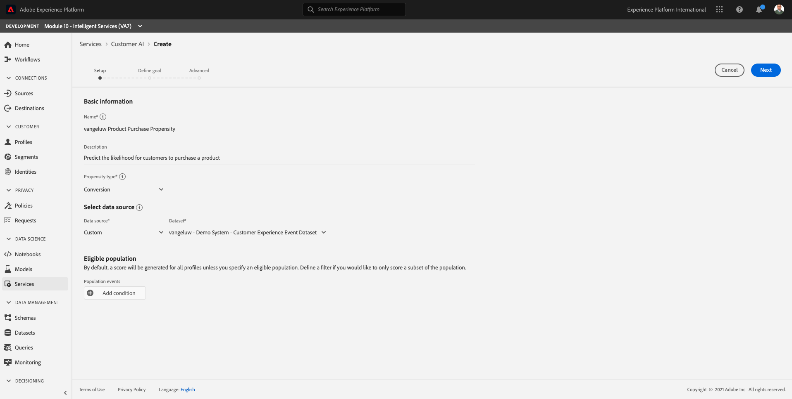
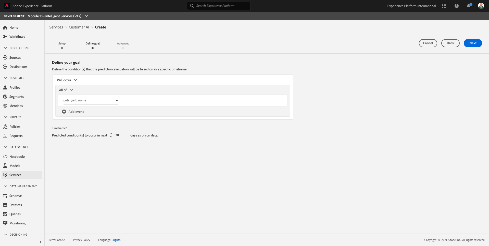
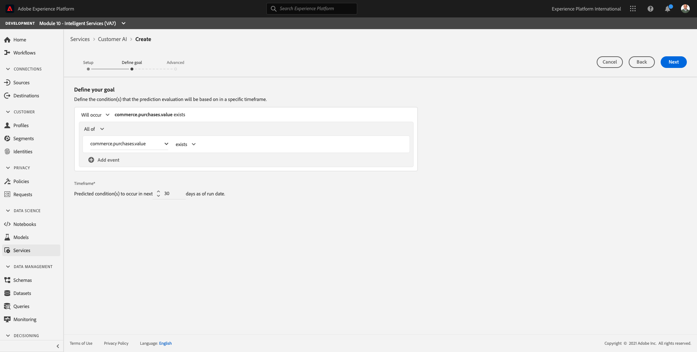
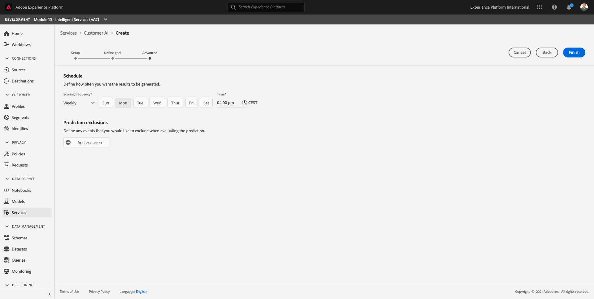
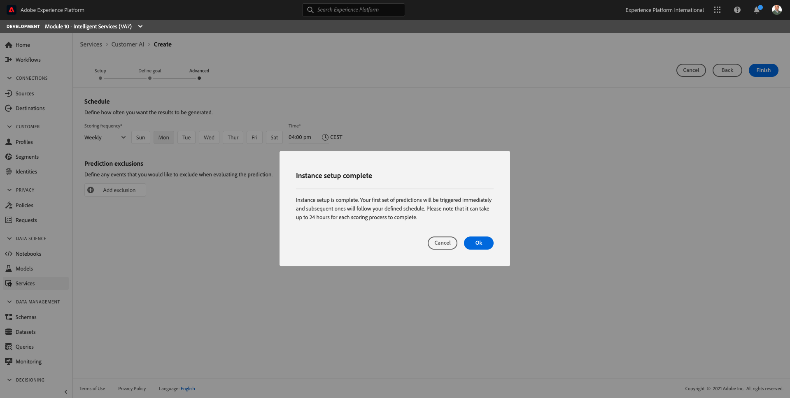
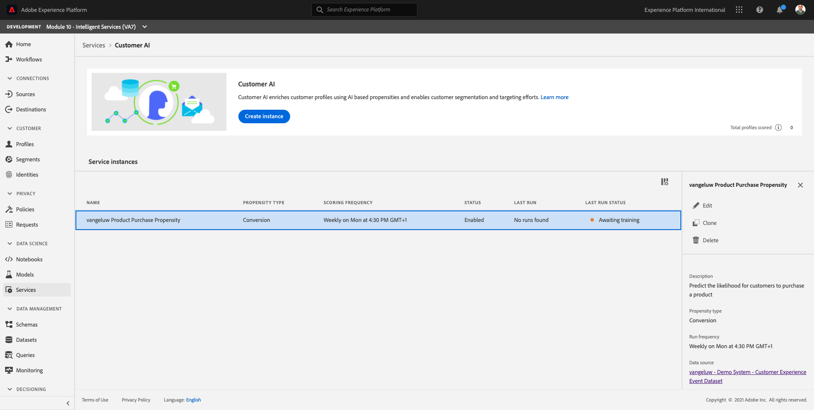

# 10.2 Customer AI - Create a New Instance (Configure)

Customer AI works by analyzing existing Consumer Experience Event data to predict churn or conversion propensity scores. Creating a new Customer AI instance allows marketeers to define goals and measures.

## 10.2.1 Setup a new Customer AI instance

In Adobe Experience Platform, click **Services** in the left menu. The **Services** browser appears and displays all available services at your disposal. In the card for Customer AI, click **Open**.

Click **Create instance**.

You'll then see this.

Enter the required details for the Customer AI instance:

- Name: use **[!UICONTROL ldap Product Purchase Propensity]** and replace ldap by your ldap
- Description: use: **Predict the likelihood for customers to purchase a product**
- Propensity type: select **Conversion**
- Data source: select **Custom**, and then select the dataset you created in the previous exercise, which is named **[!UICONTROL ldap - Demo System - Customer Experience Event Dataset]**
- Eligible population: this is optional and not needed for this exercise

Click **Next**.

You'll then see this.

Select **Will occur** and define the field **commerce.purchases.value** as the target variable.

Click **Next**.

Next, set your schedule to run **Weekly** and set the time as close as possible to your current time.

Click **Finish**.

You'll then see this popup. Click **OK**.

After you configure the instance, you can see it in the Customer AI instance list and also preview the summary of the setup and execution details by clicking on the Customer AI instance row. The summary panel will also display error details in case errors have been found.

>[!NOTE]
>
>You can modify any definition or attribute as long as your Customer AI instance's status is either **Awaiting training** or **Error**

Next Step: [10.3 Customer AI - Scoring Dashboard and Segmentation (Predict & Take Action)](./ex3.md)

[Go Back to Module 10](./intelligent-services.md)

[Go Back to All Modules](./../../overview.md)
