# 10.3 Customer AI - Scoring Dashboard and Segmentation (Predict & Take Action)

Once your Customer AI instance completes a model run, it'll enable you to visualize the propensity score that is evaluated to predict a customer performing a purchase in the next 30 days.

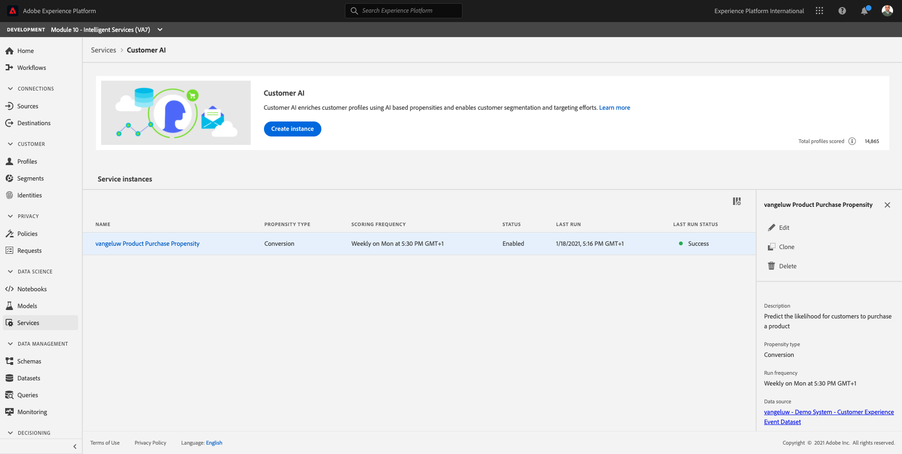

>[!NOTE]
>
>Only a Customer AI instance with a status of **Success** will allow you to preview the service's insights.

## 10.3.1 Propensity Prediction

Now let's review the predicted propensity generated by the Customer AI instance model. Click on the instance name to view the dashboard.

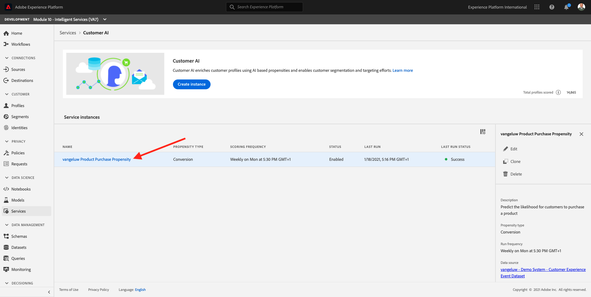

The Customer AI dashboard shows the summary about score, distribution of population and the influential factors for the model to evaluate.

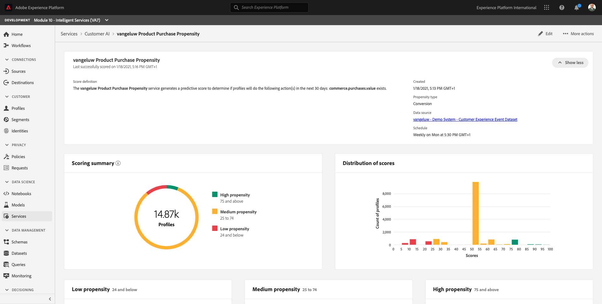

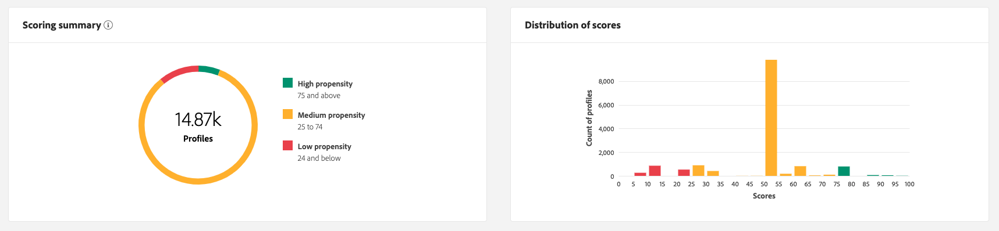

Hover on the influential factors to view the further breakdown of data distribution.

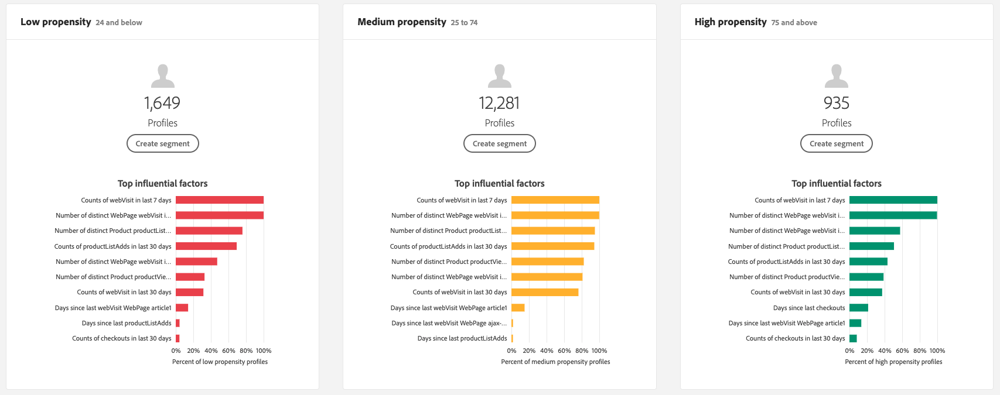

## 10.3.2 Business actions

### 10.3.2.1 Segmenting Customers

The Customer AI dashboard allows to define segments with single click. Click on the **Create Segment** button on the propensity cards.

You'll see that a segment definition is created automatically.

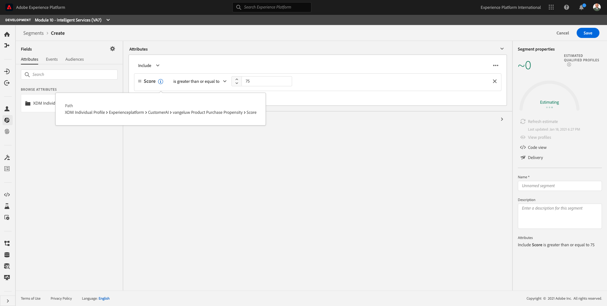

Give your segment a name, following this naming convention: **ldap - Customer AI High Propensity**. Click **Save**.

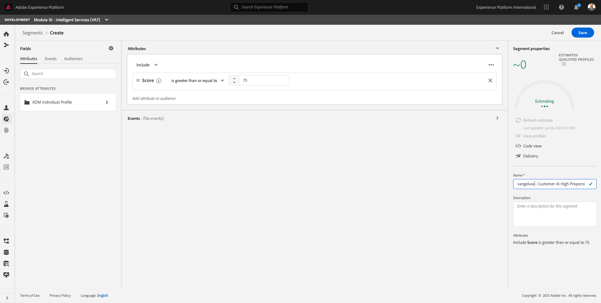

You can now use this segment for targeting using for instance Real-time CDP, Journey Orchestration and Adobe Target.

### 10.3.2.2 Profile overview

Since the Customer AI propensity score becomes part of the Real-time Customer Profile, you can view individual customer's score.

In Adobe Experience Platform, go to **Profiles** in the left menu and select **Browse**.

Search for a profile using any of the identifiers, like for instance **ECID 17416178332558723511413705105123510430**, that are available in the JSON file which you ingested. Click the **Profile ID** to open the profile.

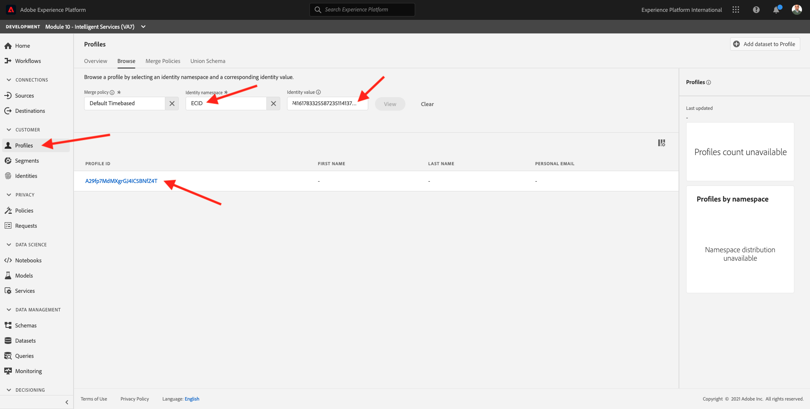

You'll then see this:

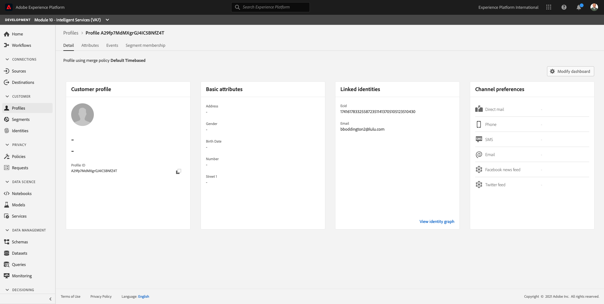

Go to **Attributes**, which contains the output from your Customer AI model.

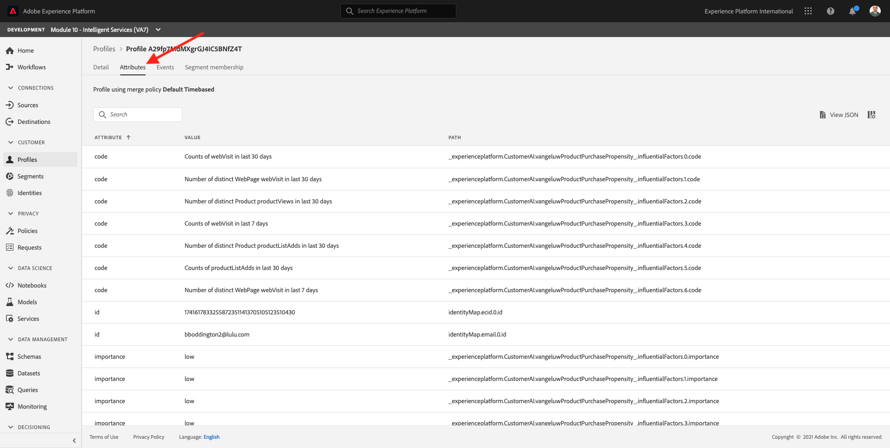

Scroll down to see the Propensity Score as calculated by your Customer AI model.

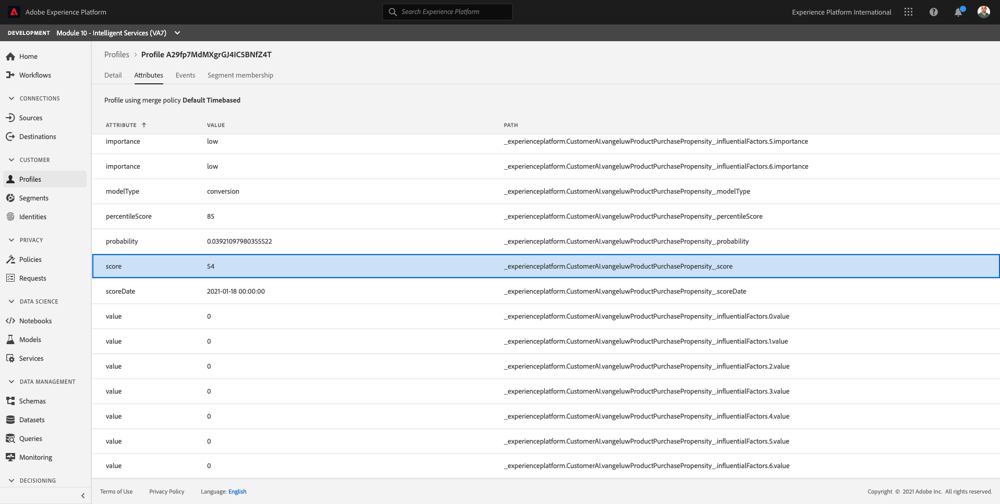

Next Step: [Summary and benefits](./summary.md)

[Go Back to Module 10](./intelligent-services.md)

[Go Back to All Modules](./../../overview.md)
