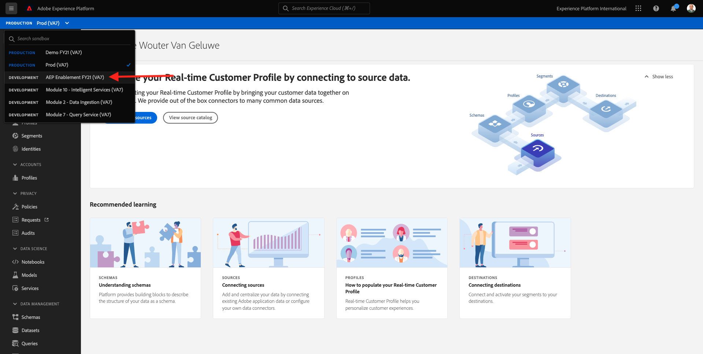
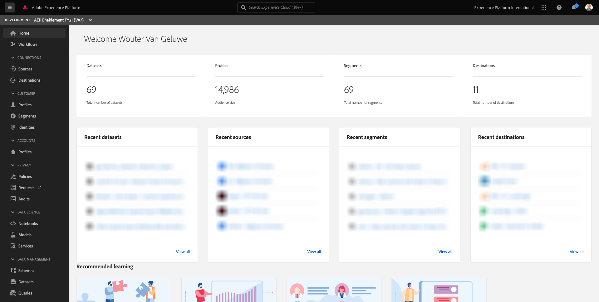

# 11.2 Configure an Advertising Destination like Google DV360

>[!IMPORTANT]
>
>The below content is intended as FYI - You do **NOT** have to configure a new destination for DV360. The destination has already been created and you can use it in the next exercise.

Log in to [Adobe Experience Platform](https://experience.adobe.com/platform).

After logging in, you'll land on the homepage of Adobe Experience Platform.

Before you continue, you need to select a **sandbox**. The sandbox to select is named ``--aepSandboxId--``. You can do this by clicking the text **[!UICONTROL Production Prod]** in the blue line on top of your screen.

After selecting the appropriate sandbox, you'll see the screen change and now you're in your dedicated sandbox.

In the left menu, go to **Destinations**, then go to **Catalog**. You'll then see the **Destinations Catalog**.

In **Destinations**, click on **Google Display & Video 360** and then click **+ Configure**.

You'll then see this. Click the data icon.

Click **Configure new destination**.

In the next screen, you'll see the Self-Service UI to configure your destination to Google DV360.

Enter a value in the fields **Name** and **Description**.

The field **Account ID** is the **Advertiser ID** of the DV360 Account. You can find that here:

The **Account Type** should be set to **Invite Advertiser**.

Now you have this. Click **Next**.

>[!NOTE]
>
>Google needs to allow-list Adobe in order for Adobe Experience Platform to send data to Google DV360. Contact your Google Account Manager to enable this dataflow.

After creating the destination, you'll see this. You can optionally select a data governance policy. Next, click **Create**.

You'll then see a list of available destinations. 
In the next exercise, you'll connect the segment you built in the previous to the Google DV360 destination.

Next Step: [11.3 Take Action: send your segment to DV360](./ex3.md)

[Go Back to Module 11](./real-time-cdp-build-a-segment-take-action.md)

[Go Back to All Modules](../../overview.md)
