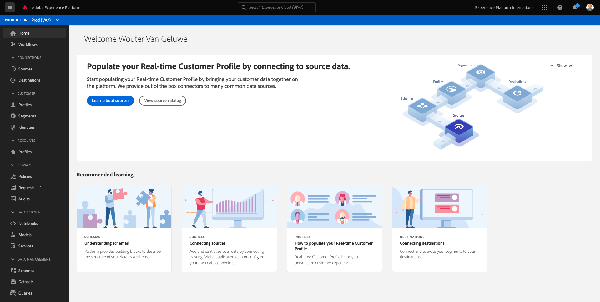
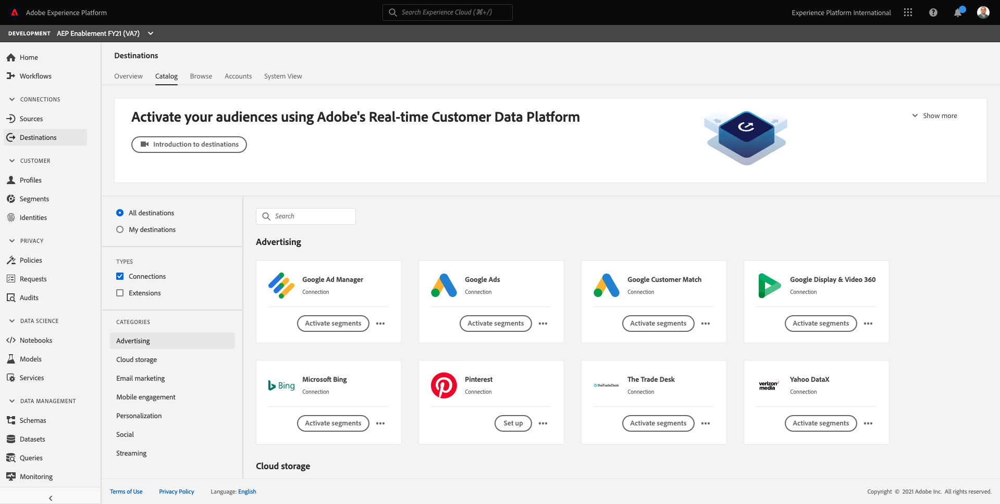
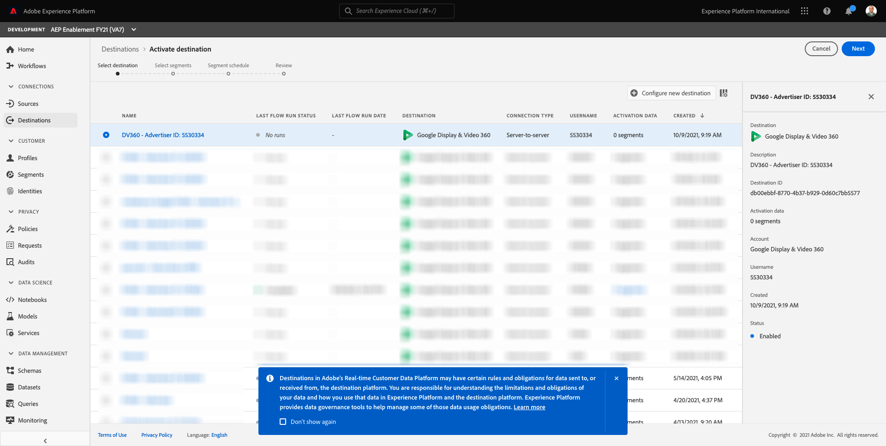
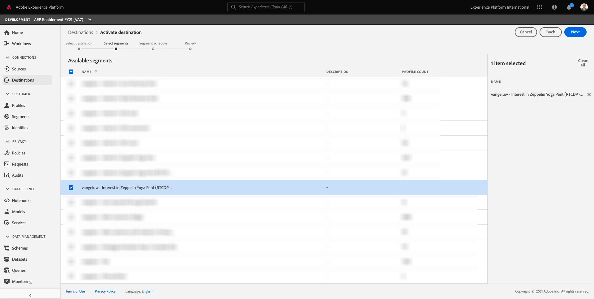
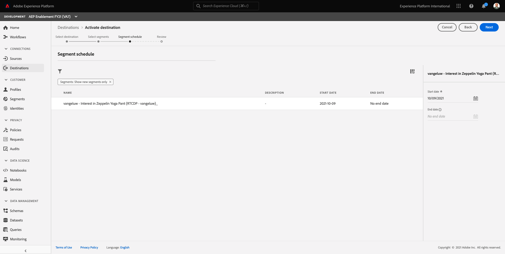
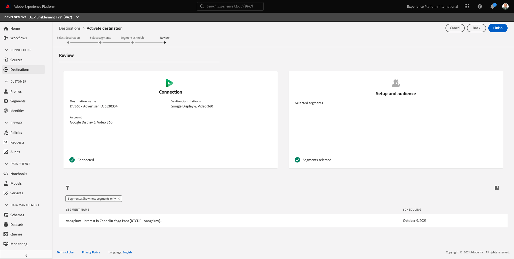
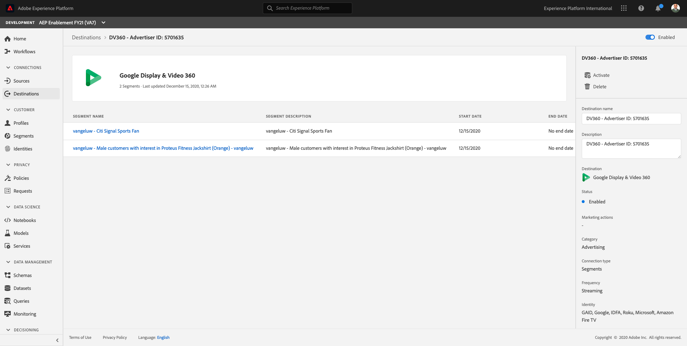

# 11.3 - Take Action: send your segment to DV360

Log in to [Adobe Experience Platform](https://experience.adobe.com/platform).

After logging in, you'll land on the homepage of Adobe Experience Platform.

Before you continue, you need to select a **sandbox**. The sandbox to select is named ``--aepSandboxId--``. You can do this by clicking the text **[!UICONTROL Production Prod]** in the blue line on top of your screen.

After selecting the appropriate sandbox, you'll see the screen change and now you're in your dedicated sandbox.

In the left menu, go to **Destinations**, then go to **Catalog**. You'll then see the **Destinations Catalog**.

In **Destinations**, click the **Activate Segments** on the **Google Display & Video 360** card.

Select your destination and click **Next**.

In the list of available segments, select the segment you created in the previous exercise. Click **Next**.

On the **Segment Schedule** page, click **Next**.

Finally, on the **Review** page, click **Finish**.

Your segment is now linked to Google DV360. Every time a customer qualifies for this segment, a signal will be sent to Google DV360 to include that customer in the Audience at Google DV360 side.

Next Step: [11.4 Take Action: send your segment to an S3-destination](./ex4.md)

[Go Back to Module 11](./real-time-cdp-build-a-segment-take-action.md)

[Go Back to All Modules](../../overview.md)
