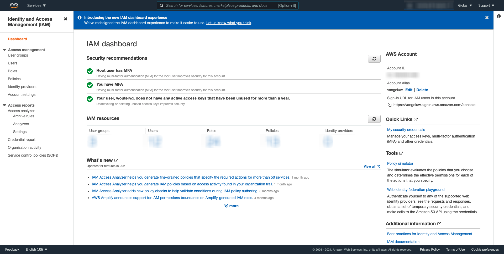

# 11.4 Take Action: send your segment to an S3-destination

Adobe Experience Platform also has the ability to share Audiences to Email Marketing Destinations such as Salesforce Marketing Cloud, Oracle Eloqua, Oracle Responsys and Adobe Campaign.

You can use FTP or SFTP as part of the dedicated destinations for each of these Email Marketing Destinations, or you can use AWS S3 to exchange lists of customers between Adobe Experience Platform and these Email Marketing Destinations.

In this module, you'll configure such a destination by making use of an AWS S3 bucket.

## 11.4.1 Create your S3 bucket

Go to [https://console.aws.amazon.com](https://console.aws.amazon.com) and sign in with the Amazon-account you created in Module 5.

After logging in, you'll be redirected to the **AWS Management Console**.

In the **Find Services** menu, search for **s3**.

Click the first search result: **S3 - Scalable Storage in the Cloud**.

You'll then see the **Amazon S3** homepage. Click **Create Bucket**.

In the **Create Bucket** screen, you need to configure two things:
  
- Name: use the name **aepmodule11LDAP** and replace LDAP by your LDAP. As an example, in this exercise the bucket name is **aepmodule11vangeluw**
- Region: use the region **EU (Frankfurt) eu-central-1**

Leave all the other default settings as they are. Scroll down and click **Create bucket**.

You'll then see your bucket being created and will be redirected to the Amazon S3 homepage.

## 11.4.2 Set permissions to access your S3 bucket

The next step is to setup access to your S3 bucket.

To do that, go to [https://console.aws.amazon.com/iam/home](https://console.aws.amazon.com/iam/home).

Access to AWS resources is controlled by Amazon Identity and Access Management (IAM).

You'll now see this page.

In the left menu, click **Users**. You'll then see the **Users** screen. Click **Add Users**.

Next, configure your user:

- User Name: use `s3_ldap_module11` as a name, so in this example the name is `s3_vangeluw_module11`.
- AWS access type: select **Access key - Programmatic access**.

Click **Next: Permissions**.

You'll then see this permissions screen. Click **Attach existing policies directly**.

Enter the search term **s3** to see all related S3 policies. Select the policy **AmazonS3FullAccess**. Click **Next: Tags**.

On the **Tags** screen, there's no need to configure anything. Click **Next: Review**.

Review your configuration. Click **Create User**.

Your user is now created and you're seeing your credentials to access your S3 environment. This is the only time you'll see your credentials so please write them down.

Click **Show** to see your Secret access key:

>[!IMPORTANT]
>
>Store your credentials in a text-file in your computer.
>
> - Access key ID: ...
> - Secret access key: ...
>
> Once you click **Close** you'll never see your credentials again!

Click **Close**. 

You've now successfully created an AWS S3 bucket and you've created a user with permissions to access this bucket.

## 11.4.3 Configure Destination in Adobe Experience Platform

Log in to [Adobe Experience Platform](https://experience.adobe.com/platform).

After logging in, you'll land on the homepage of Adobe Experience Platform.

Before you continue, you need to select a **sandbox**. The sandbox to select is named ``--aepSandboxId--``. You can do this by clicking the text **[!UICONTROL Production Prod]** in the blue line on top of your screen.

After selecting the appropriate sandbox, you'll see the screen change and now you're in your dedicated sandbox.

In the left menu, go to **Destinations**, then go to **Catalog**. You'll then see the **Destinations Catalog**.

Click **Cloud Storage**, then click the **Activate Segments** button on the **Amazon S3** card.

Next, click **+ Configure new destination**.

Select **New Account** as Account Type. Please use the S3 credentials that were given to you in the previous step:

| Access Key ID             | Secret Access Key             |
|:-----------------------:| :-----------------------:|
| AKIA..... |Cm5Ln.....|

Click **Connect to destination**.

You'll then see a visual confirmation that this destination is now connected.

You have to provide a name and folder so that Adobe Experience Platform can connect to the S3 bucket.

As a naming convention, please use the following:

| Access Key ID             | Secret Access Key             |
|:-----------------------:| :-----------------------:|
| Name |AWS - S3 - ldap, replace **ldap** with your ldap.|
| Description |AWS - S3 - ldap, replace **ldap** with your ldap.|
| Bucket Name |aepmodule11ldap|
| Folder Path |/|

Click **Next**.

You can now optionally attach a Data Governance Policy to your new destination. Click **Create**.

Your destination is now created and you'll see it in the list of available destinations.

After creating the destination, you can select segments to send to your AWS S3 destination. First, select your destination and then click **Next**.

In the list of segments, search for the segment you created in exercise 1 and select it. Click **Next**.

You'll then see this. Click **Create Schedule**.

Define your schedule of choice. Select **Export incremental files** and set the frequency to **Hourly** every **3 hours**. Click **Create**.

You'll then have this. Click **Next**.

You can now select attributes for the export towards AWS S3. Click **Add new field** and ensure the field `--aepTenantId--.identification.core.ecid` is added and marked as **Deduplication Key**.

Optionally, you can add as many other fields as required.

Once you've added all fields, click **Next**.

Review your configuration. Click **Finish** to finish your configuration.

You'll then be back at the Destination Activation screen and you'll see your segment added to this destination.

If you'd like to add more segment exports, you can click **Activate Segments** to restart the process and add more segments.

Next Step: [11.5 Take Action: send your segment to Adobe Target](./ex5.md)

[Go Back to Module 11](./real-time-cdp-build-a-segment-take-action.md)

[Go Back to All Modules](../../overview.md)
