# 12.1 Define an event

Login to Adobe Journey Optimizer by going to [Adobe Experience Cloud](https://experience.adobe.com). Click **Journey Optimizer**.

You'll be redirected to the **Home**  view in Journey Optimizer.

First, make sure you're using the correct sandbox. The sandbox to use is called `--aepSandboxId--`. To change from one sandbox to another, click on **PRODUCTION Prod (VA7)** and select the sandbox from the list. In this example, the sandbox is named **AEP Enablement FY21**.

You'll then be in the **Home** view of your sandbox `--aepSandboxId--`.

In the left menu, scroll down and click **Configurations**. Next, click the **Manage** button under **Events**.

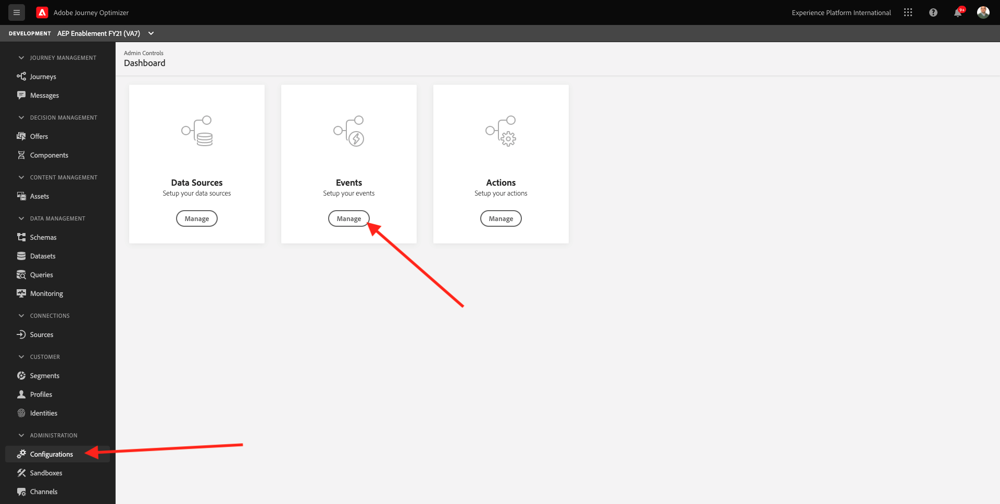

You'll then see an overview of all available events. Click **Create Event** to start creating your own event.

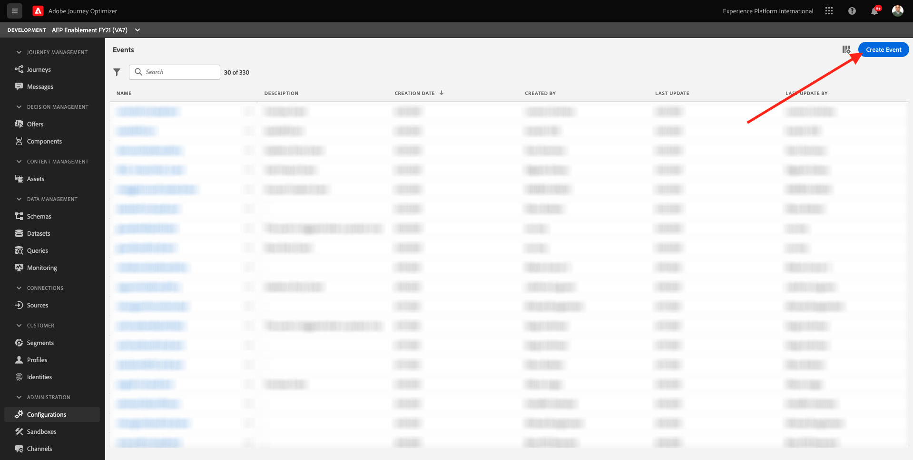

A new, empty event window will then pop up.

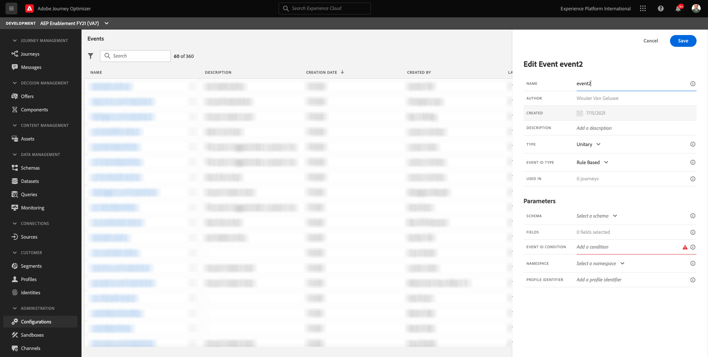

As a Name for the Event, use `ldapGeofenceEntry` and replace `Ldap` with your LDAP. In this example, the Event Name is `vangeluwGeofenceEntry`.

Set Description to: `Geofence Entry Event`.

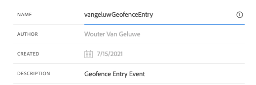

Next, make sure the **Type** is set to **Unitary**, and for the **Event ID Type** selection, select **System Generated**

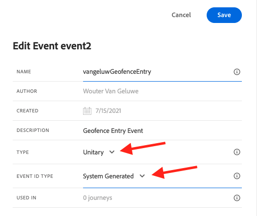

Next, you need to select a Schema. All Schemas that are shown here, are Adobe Experience Platform Schemas.

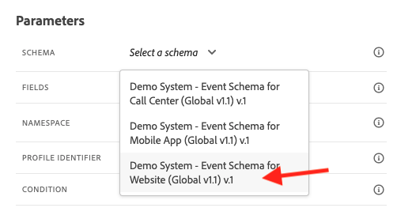

You'll notice that not all Schemas are shown. There are many more Schemas available in Adobe Experience Platform.
To show up in this list, a Schema needs to have a very specific Mixin linked to it. The Mixin that is needed to show up here is called `Orchestration eventID`.

Let's have a quick look how these Schemas are defined in Adobe Experience Platform.

In the left menu, go to **Schemas** and open this in a new browser tab. In **Schemas**, go to **Browse** to see the list of available Schemas.
Open the Schema `Demo System - Event Schema for Website (Global v1.1)`.

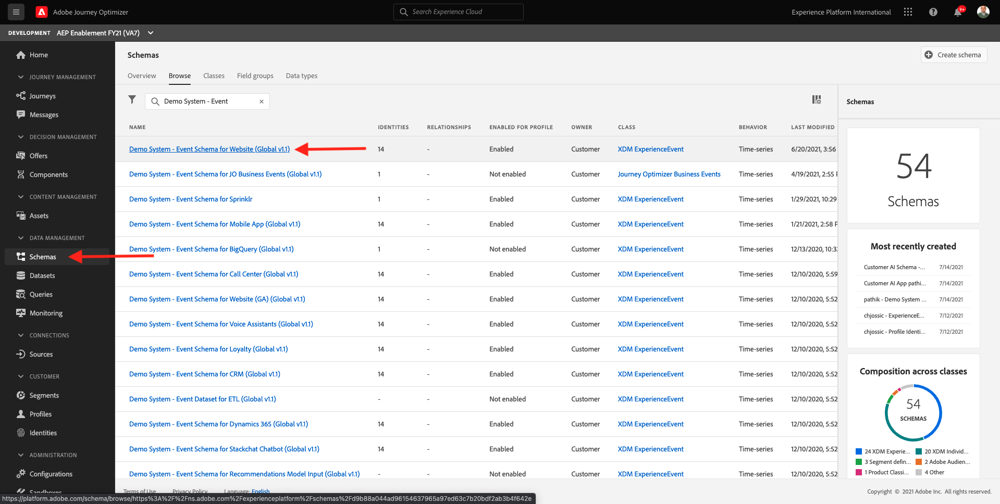

After opening the Schema, you'll see that the field group `Orchestration eventID` is part of the schema.
This field group only has two fields, `_experience.campaign.orchestration.eventID` and `originJourneyID`.

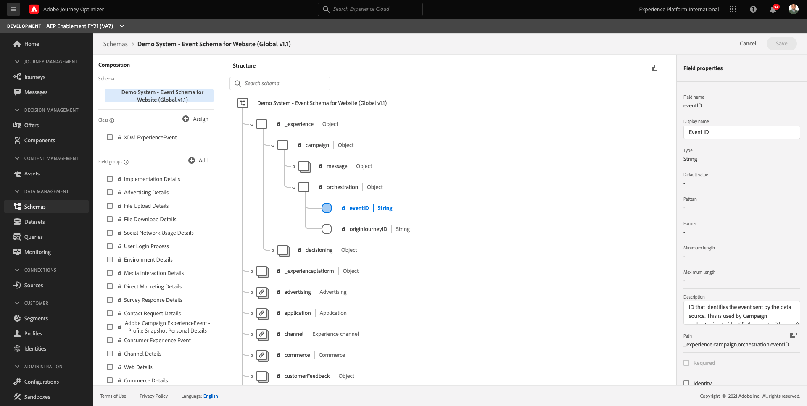

Once this field group and this specific eventID field are part of a schema, that schema will be available for usage by Adobe Journey Optimizer.

Go back to your event configuration in Adobe Journey Optimizer.

In this use case, you want to listen to a Geofence Event to understand if a customer is in a specific location, so now, select the Schema `Demo System - Event Schema for Website (Global v1.1)` as the Schema for your Event.

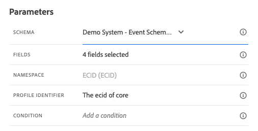

Adobe Journey Optimizer will then automatically select some required fields, but you can edit the fields that are made available to Adobe Journey Optimizer.

Click the **pencil** icon to edit the fields.

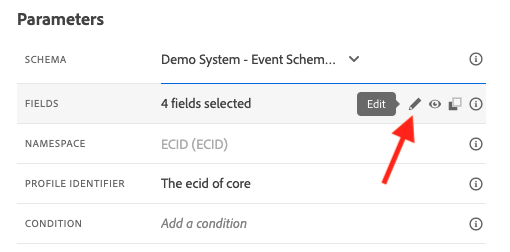

You'll then see a popup-window with a schema hierarchy that allows you to select fields.

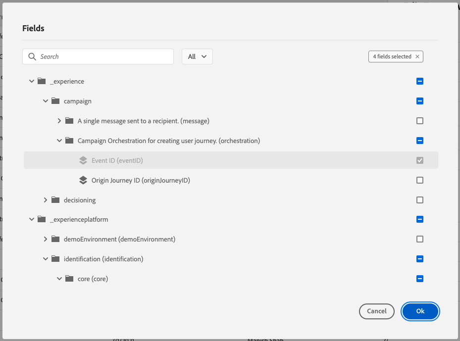

Fields like the ECID and the Orchestration eventID are required and as such preselected.

However, a marketeer needs to have flexible access to all data points that provide context to a Journey. So let's make sure to select the following fields as a minimum as well (found within the Place context node):

- City

Once that's done, click **OK**.

Adobe Journey Optimizer also needs an Identifier to identify the customer. Since Adobe Journey Optimizer is linked to Adobe Experience Platform, the Primary Identifier of a Schema is automatically taken as the Identifier for the Journey.
The Primary Identifier will also automatically take into account the full Identity Graph of Adobe Experience Platform and will link all behavior across all available identities, devices and channels to the same profile, so that Adobe Journey Optimizer is contextual, relevant and consistent.

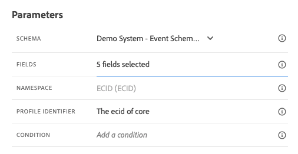

Click **Save** to save your custom event.

Your event will then be part of the list of available events.

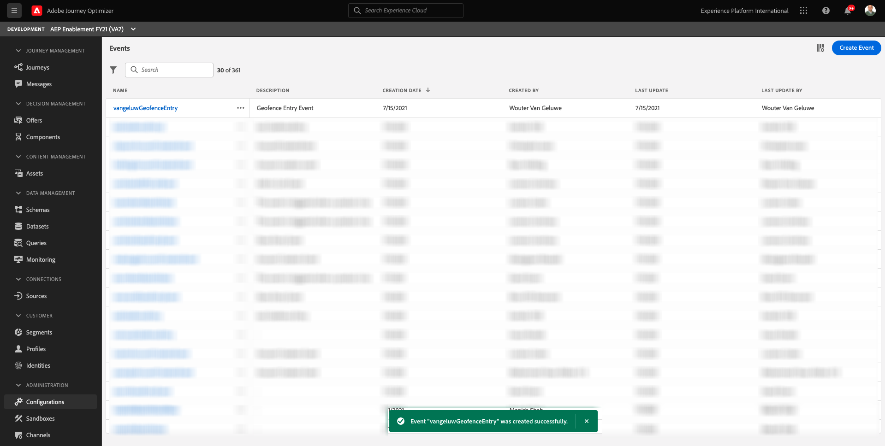

Finally, you need to recover the `Orchestration eventID` for your custom event.

Open your event again by clicking it in the list of events.
On your Event, click on the **View Payload** icon next to **Fields**.

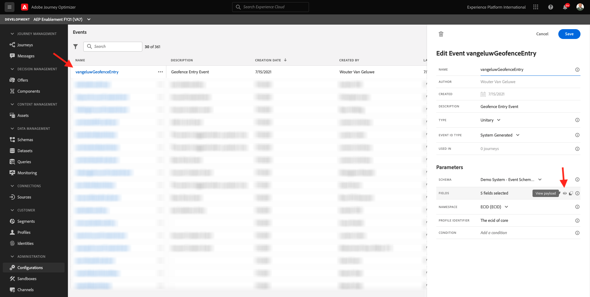

Clicking the **View Payload** icon opens up a sample XDM payload for this event.

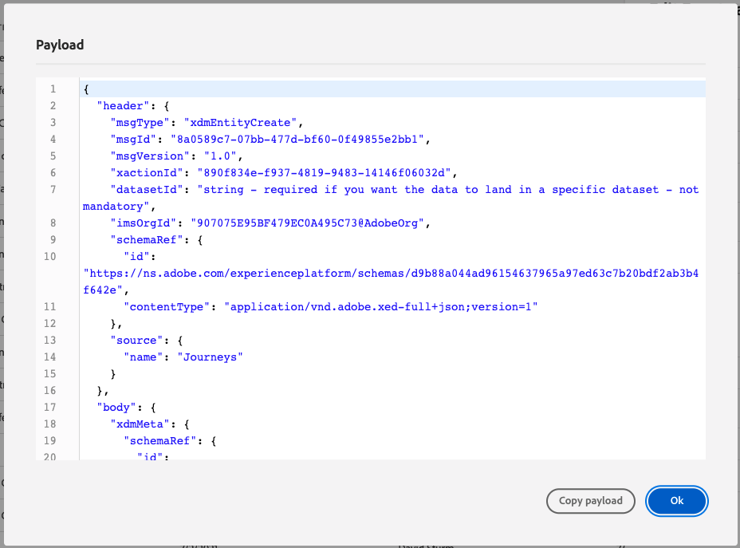

Scroll down in the **Payload** until you see the line `eventID`.

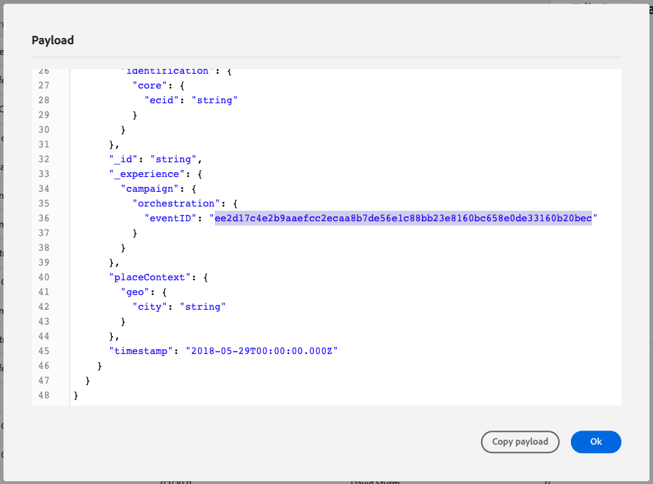

Write down the `eventID` as you'll need it in the last to test your configuration.

In this example, the `eventID` is `ee2d17c4e2b9aaefcc2ecaa8b7de56e1c88bb23e8160bc658e0de33160b20bec`.

You've now defined the event that will trigger the Journey we're building. Once the Journey is triggered, the geofence-fields like City, and any others you may have chosen (like Country, Latitude and Longitude) will be made available to the Journey.

As discussed in the use-case description, we then need to provide contextual promotions that depend on the weather. In order to get weather information, we'll need to define an external data sources that will provide us with the weather information for that location. You'll use the **OpenWeather** service to provide us what that information, as part of 2.

Next Step: [12.2 Define an external data source](./ex2.md)

[Go Back to Module 12](journey-orchestration-external-weather-api-sms.md)

[Go Back to All Modules](../../overview.md)
