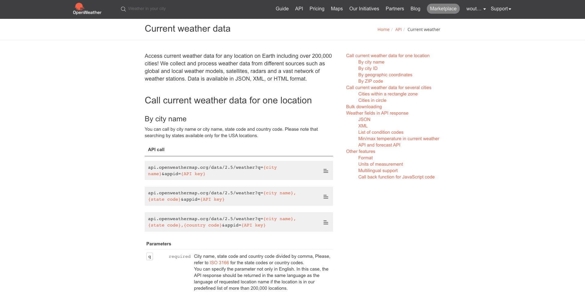
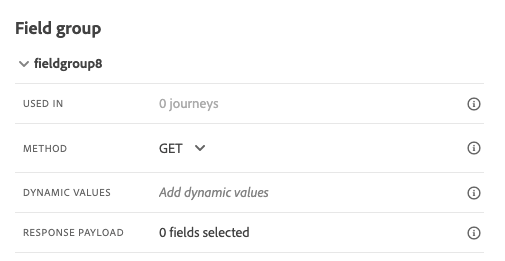

# 12.2 Define an external data source

In this exercise, you'll create a custom external data source by making use of Adobe Journey Optimizer.

Login to Adobe Journey Optimizer by going to [Adobe Experience Cloud](https://experience.adobe.com). Click **Journey Optimizer**.


You'll be redirected to the **Home**  view in Journey Optimizer.


First, make sure you're using the correct sandbox. The sandbox to use is called `--aepSandboxId--`. To change from one sandbox to another, click on **PRODUCTION Prod (VA7)** and select the sandbox from the list. In this example, the sandbox is named **AEP Enablement FY21**.


You'll then be in the **Home** view of your sandbox `--aepSandboxId--`.


In the left menu, scroll down and click **Configurations**. Next, click the **Manage** button under **Data Sources**.


You'll then see the **Data Sources** list.
Click **Create Data Source** to start adding your data source.


You'll see an empty data source popup.


Before you can start configuring this, you'll need an account with the **Open Weather Map** service. Follow these steps to create your account and get your API key.

Go to [https://openweathermap.org/](https://openweathermap.org/). On the homepage, click **Sign In**.


Click **Create an Account**.


Fill out the details.


Click **Create Account**.


You'll then be redirected to your Account Page.


In the menu, click **API Keys** to retrieve your API Key, which you'll need to setup your custom external data source.


An **API Key** looks like this: `b2c4c36b6bb59c3458d6686b05311dc3`.

You can find the **API Documentation** for the **Current Weather** [here](https://openweathermap.org/current).

In our use-case, we'll implement the connection with Open Weather Map based on the city the customer is in.



Go back to **Adobe Journey Optimizer**, to your empty **External Data Source** popup.


As a Name for the data source, use `ldapWeatherApi` and replace `Ldap` with your LDAP. In this example, the data source Name is `vangeluwWeatherApi `.

Set Description to: `Access to the Open Weather Map`.

The URL for the Open Weather Map API is: **http://api.openweathermap.org/data/2.5/weather?units=metric**


Next, you need to select the Authentication to use.

Use these variables:

| Field               | Value              |
|:-----------------------:| :-----------------------|
| Type            |**API key**            |
| Name           | **APPID**         |
| Value           | **your API Key**         |
| Location           | **Query Parameter**         |


Finally, you need to define a **FieldGroup**, which is basically the request you'll be sending to the Weather API. In our case, we want to use the name of the City to request the Current Weather for that City.



According to the Weather API Documentation, we need to send a parameter `q=City`.


In order to match the expected API Request, configure your FieldGroup as follows:

>[!IMPORTANT]
>
>The Field group name has to be unique, please use this naming convention: `ldapWeatherByCity` so in this case, the name should be `vangeluwWeatherByCity`


For the Response Payload, you need to paste an example of the Response that will be sent by the Weather API.

You can find the expected API JSON Response on the API Documentation page [here](https://openweathermap.org/current).


Or you can copy the JSON Response from here:

```json
{"coord": { "lon": 139,"lat": 35},
  "weather": [
    {
      "id": 800,
      "main": "Clear",
      "description": "clear sky",
      "icon": "01n"
    }
  ],
  "base": "stations",
  "main": {
    "temp": 281.52,
    "feels_like": 278.99,
    "temp_min": 280.15,
    "temp_max": 283.71,
    "pressure": 1016,
    "humidity": 93
  },
  "wind": {
    "speed": 0.47,
    "deg": 107.538
  },
  "clouds": {
    "all": 2
  },
  "dt": 1560350192,
  "sys": {
    "type": 3,
    "id": 2019346,
    "message": 0.0065,
    "country": "JP",
    "sunrise": 1560281377,
    "sunset": 1560333478
  },
  "timezone": 32400,
  "id": 1851632,
  "name": "Shuzenji",
  "cod": 200
}
```

Copy the above JSON Response to your clipboard, then go to your custom data source configuration screen.

Click the **Edit Payload** icon.


You'll see a popup where you now have to paste the above JSON Response.


Paste your JSON Response, after which you'll see this. Click **Save**.


Your custom data source configuration is now complete. Scroll up and click **Save**.


Your data source has now been created successfully and is part of the **Data Sources** list.


Next Step: [12.3 Define a custom action](./ex3.md)

[Go Back to Module 12](journey-orchestration-external-weather-api-sms.md)

[Go Back to All Modules](../../overview.md)