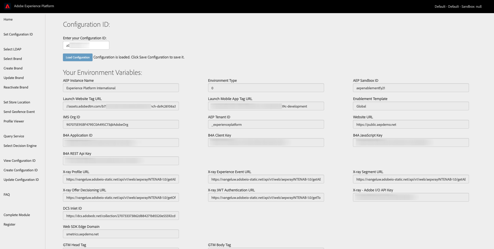
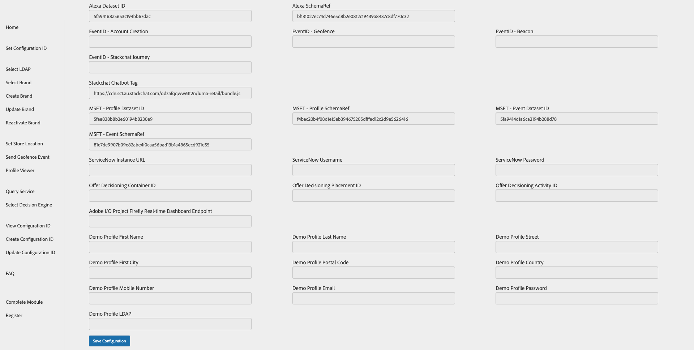
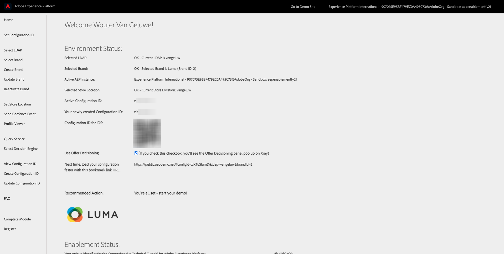
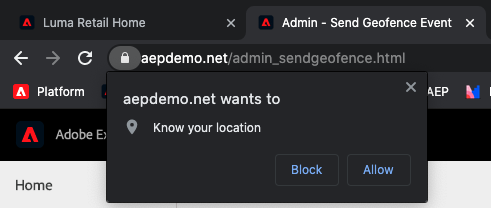
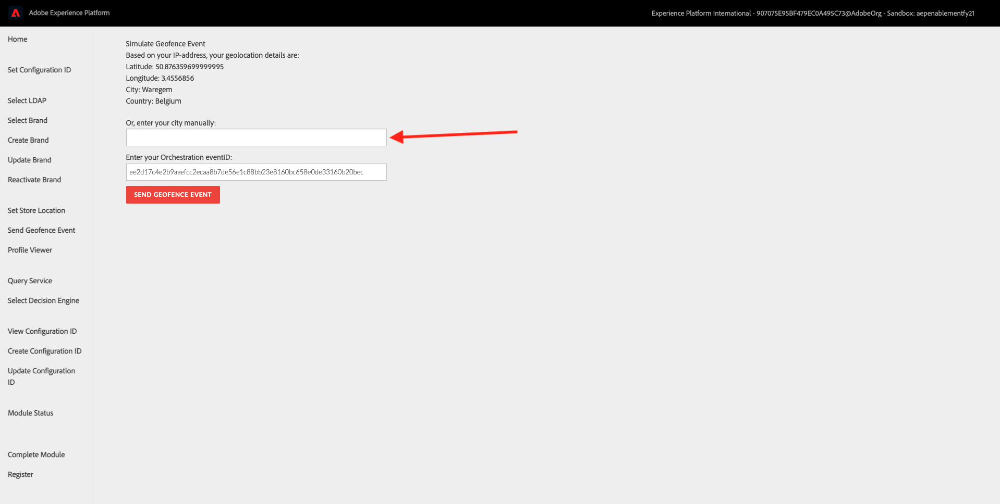

# 12.5 Trigger your journey

In this exercise, you'll test and trigger the journey you configured in this module.

## Update your Configuration ID

Before you can test your journey, you'll need to update your Configuration ID settings and enter the EventID of the **geofenceEntryLdap** event on the **Update Configuration ID** page of the demo website, on the admin page.

Go to [https://public.aepdemo.net/admin_configuration_update.html](https://public.aepdemo.net/admin_configuration_update.html).

You'll then see this:

Click **Load Configuration**. After clicking **Load Configuration**, scroll down until you see the fields **EventID - Geofence**.

In exercise 12.1, you created your event and collected the EventID. You can find it here:

In this example, the `eventID` is `7cfd3b394bbe3fa3a74815628f1499896f92dc39237bd1e6b866795f5c18c093`.

Go back to the **Update Configuration ID** screen and paste the code that you copied in the field **EventID - Geofence**.

Next, scroll down and click **Update Configuration ID**.

After this change, your Configuration ID is ready for testing!

## Trigger your journey

For every demonstration, you'll need to use a fresh, incognito browser window. After opening a fresh, incognito browser window, go to [https://public.aepdemo.net/](https://public.aepdemo.net/).

You'll be redirected to this page:

Enter the Configuration ID you created in the previous step. Click **Load Configuration**.

Scroll down so you can see the **Save Configuration** button. Click **Save Configuration**.

After a couple of seconds you'll be redirected to the Admin homepage and you'll see this:

Go to **Select LDAP** in the left side menu, select your LDAP in the list and click **Save**.

Go to **Select Brand** in the left side menu, select a brand of choice and click **Save**.

You'll now see a similar Admin homepage. Click the brand logo to go to the demo website.

You'll then be redirected to the **Luma Retail** homepage.

   

Go to the Register/Login page
  
>[!IMPORTANT]
>
> Please use the following naming convention for your Mobile Phone Number:
> If your number is 0473622044, you have to enter **+32473622044+DDMMYYYY-XX** as a number, otherwise the sending of SMSs doesn't work. For instance, **+32473622044+26052020-1**
  

Fill out your registration details and click **CREATE ACCOUNT**.

After login, go to the Homepage of the website and open the X-ray panel, go to Real-time Customer Profile. On the X-ray panel, you should see all of your personal data displayed.

In the website's menu, click on the **3 dots** and select **Admin**.

You'll then see the **Admin** page. Click **Send Geofence Event**.

You'll then see this:

On the **Send Geofence Event** page, click **Allow** on the prompt to **Know your location**.

After 1-2 seconds (sometimes this can take up to 1-2 minutes), you'll see the coordinates, city and country of your approximate location. Once the coordinates are shown, you have to enter your Orchestration eventID from 1. In this example, the **eventID** is **d9b5069cebd47bb3394e192da031d933a9e10d67046dadde999ec7401eb7bd51**.

If it takes too long to get your location dynamically, or if it doesn't work, you can also fill out your city manually in the input field.

Click **Send Geofence Event**. You'll get a visual confirmation when the Geofence Event has been sent.

You should then receive an SMS on the mobile phone number that was attached to your Real-time Customer Profile. The SMS will depend on the current weather and the temperature, just like you configured in your Journey.

>[!NOTE]
>
>Twilio doesn't support Indian Mobile Numbers, so if you have an mobile phone number starting with +91, you won't receive any SMS. 

The same message will also be sent to the Adobe Hands-On Lab Slack channel. Your trainer is able to show you the received messages in the Slack channel.
  

Next Step: [Summary and benefits](./summary.md)

[Go Back to Module 12](journey-orchestration-external-weather-api-sms.md)

[Go Back to All Modules](../../overview.md)
