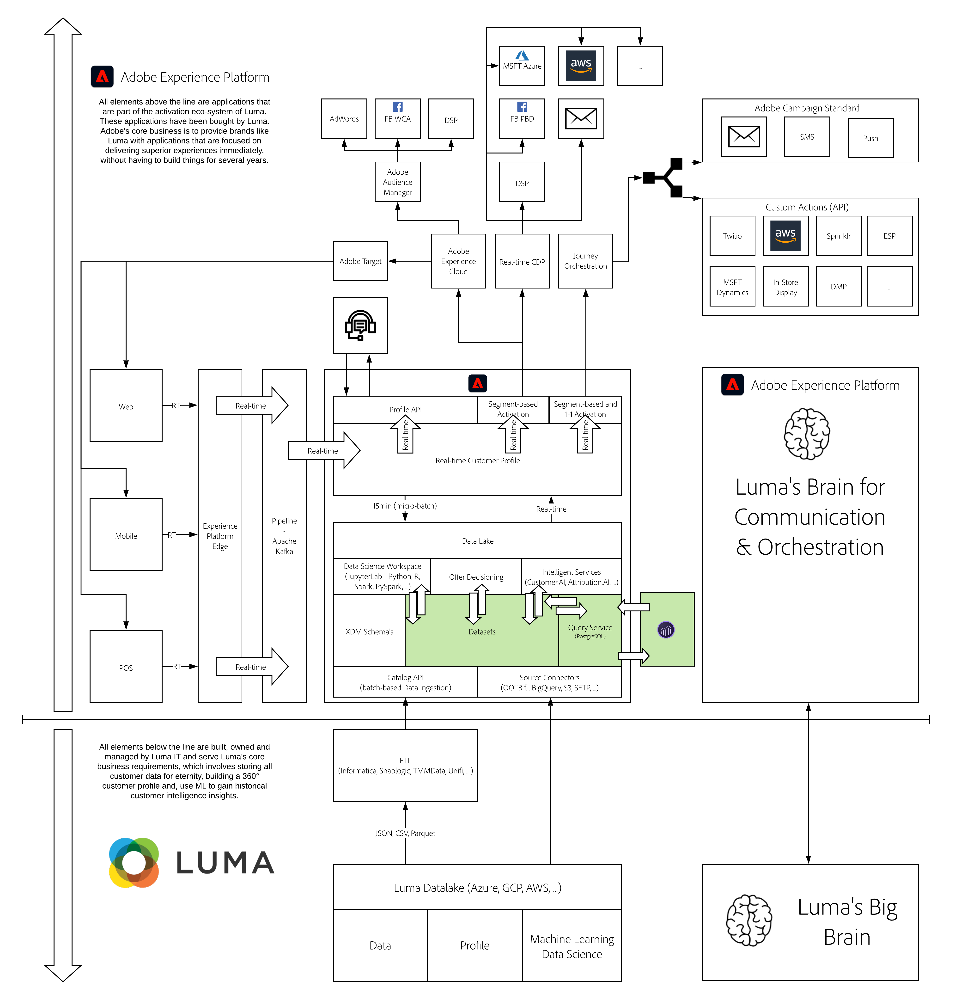

# 13. Customer Journey Analytics - Build a dashboard using Analysis Workspace on top of Adobe Experience Platform

**Author: [Victor de la Iglesia](https://www.linkedin.com/in/victordelaiglesia/), [Wouter Van Geluwe](https://www.linkedin.com/in/woutervangeluwe/)**

In this module, you will get hands-on experience with the Customer Journey Analytics application service.

Customer Journey Analytics provides a toolkit to business intelligence and data science teams for stitching and analysis of cross-channel data (online and offline). The capabilities within Customer Journey Analytics deliver context and clarity to the complex multi-channel customer journeys. The provided context generates actionable insight into how to remove pain points from the customer conversion process and deliver positive experiences in the moments that matter most.

Have a look at this video to understand the value, customer journey and configuration process:

>[!VIDEO](https://video.tv.adobe.com/v/327188?quality=12&learn=on)

More info on Customer Journey Analytics can be found [here](https://spark.adobe.com/page/t62eiRu9l6iWJ/).

## Learning Objectives

- Become familiar with the Customer Journey Analytics UI
- Bring Adobe Experience Platform data sets into Customer Journey Analytics
- Understand the Person ID and data stitching in Customer Journey Analytics
- Understand the concepts of a data connection and a data view
- Use Analysis Workspace with Adobe Experience Platform data sets

## Prerequisites

- Some familiarity with Analysis Workspace is preferred, but not required
- Access to Adobe Experience Platform: [https://experience.adobe.com/platform](https://experience.adobe.com/platform) 
- Access to Customer Journey Analytics Application Service

>[!IMPORTANT]
>
>This tutorial was created to facilitate a particular workshop format. It uses specific systems and accounts to which you might not have access. Even without access, we think you can still learn a lot by reading through this very detailed content. If you're a participant in one of the workshops and need your access credentials, please contact your Adobe representative who will provide you with the required information.

## Architecture Overview

Have a look at the below architecture, which highlights the components that will be discussed and used in this module.

## Sandbox to use

For this module, please use this sandbox: `--aepSandboxId--`.

>[!NOTE]
>
>Don't forget to install, configure and use the Chrome Extension as referenced in [0.6 - Install the Chrome extension for the Experience League documentation](../module0/ex6.md)

## Exercises

[13.1 Customer Journey Analytics 101](./ex1.md)

Learn all about the Customer Journey Analytics concepts.

[13.2 Connect Adobe Experience Platform Data Sets in Customer Journey Analytics](./ex2.md)

Learn how to consume multiple datasets from Adobe Experience Platform into Customer Journey Analytics.

[13.3 Create a Data View](./ex3.md)

Learn how to configure a data view in Customer Journey Analytics.

[13.4 Data Preparation in Customer Journey Analytics](./ex4.md)

Learn how to do some data preparation before continuing with analysis.

[13.5 Visualization using Customer Journey Analytics](./ex5.md)

Learn how to visualize Adobe Experience Platform data using Customer Journey Analytics.

[Summary and benefits](./summary.md)

Summary of this module and overview of the benefits.

>[!NOTE]
>
>Thank you for investing your time in learning all there is to know about Adobe Experience Platform. If you have questions, want to share general feedback of have suggestions on future content, please contact Wouter Van Geluwe directly, by sending an email to **vangeluw@adobe.com**.

[Go Back to All Modules](../../overview.md)
