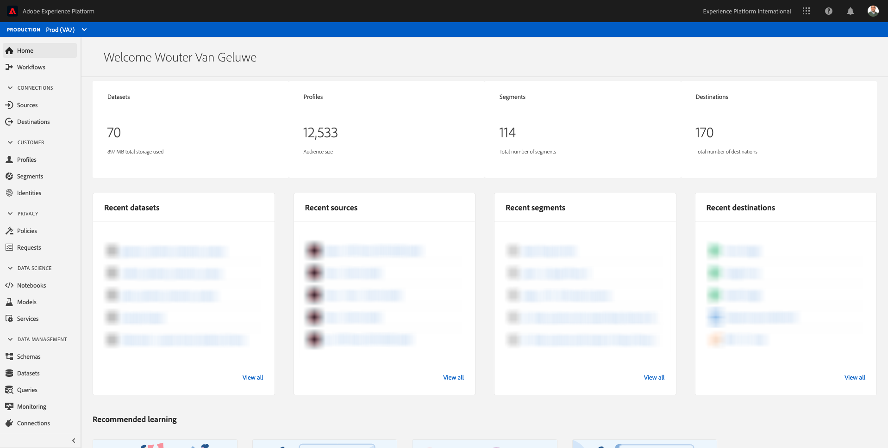

# 13.1 Customer Journey Analytics 101

## Objectives

- Understand the CJA Application Service
- Learn how to position CJA
- Understand the CJA workflow: from data connection to insights

## 13.1.1 What is Customer Journey Analytics?

Customer Journey Analytics (CJA) provides a toolkit to the business intelligence and data science teams for stitching and analysis of cross-channel data (online and offline). The capabilities within CJA deliver context and clarity to the complex multi-channel customer journey. The provided context leads to actionable insight into removing pain points from the customer conversion process and designing and delivering exceptional experiences for the moments that matter most.

CJA brings Analysis Workspace on top of Adobe Experience Platform. Adobe Experience Platform is the brain for communication and orchestration and with CJA, brands can now contextualize and visualize all that data, so that Business and Insight teams can learn from it by analyzing the full online to offline customer journey. 

Business and Insight teams can talk to CJA, ask questions and get answers on the fly with the drag-and-drop, point-and-click and user-friendly UI of Analysis Workspace.

## 13.1.2 Key advantages

The three main benefits for customers are:

- The ability to make insights available to everyone (i.e., democratizing data access)
- The ability to see the customer in a contextual journey (i.e. data can be visualized sequentially, spanning multiple channels both online and offline)
- The ability to harness the power of data without the need of  (i.e., it lets normal humans use data to unlock deep insights and analysis for marketing activation)

## 13.1.3 Why choose Customer Journey Analytics?

CJA isn't intended to replace a current BI application such as Power BI, Microstrategy, Locker or Tableau. These BI applications are meant to visualize data to create corporate dashboards so that everyone in an organization can quickly look at important metrics.  
CJA's goal is to bring analysis power to Marketing and Business teams making it a 'must have' analysis tool for those personas.

Traditionally, BI applications have been incapable of enabling true customer intelligence:

- They can't do attribution and don't do customer journey analysis. 
- BI applications need to know the question ahead of time 
- Interactive queries are limited by the structure of the database
- SQL skills are required. 
- BI applications don't give you the ability to ask why something happened. 
- BI applications have no direct connection to customer touch points. 

Because of the above, business users and analysts hit dead ends almost immediately, making analysis expensive, slow, inflexible and disconnected from systems of action.

With CJA you can have a 360 view of the customer journey, using offline and online data, with the right tools to reduce the time to insight, making business users independent in understanding why something happened, and how to respond to it.

## 13.1.4 Understand the Customer Journey Analytics workflow

Before starting the next exercises it's key to understand what steps are needed to bring data from Adobe Experience Platform into CJA in order to visualize it and get some deep insights. It's what we call CJA Workflow. Let's have a look at it:

Before starting the above steps, don't forget about step 0, which is to understand the data that is available in Adobe Experience Platform.

**Garbage in, garbage out.** Remember? You must have a clear idea of what data is available and how the schemas in Adobe Experience Platform are configured. Understanding the data that is in Adobe Experience Platform will make things easier, not only on the data connection part, but also when building visualizations and doing analysis. 

## 13.1.5 Step 0: Understanding Adobe Experience Platform schemas and datasets

Log in to [Adobe Experience Platform](https://experience.adobe.com/platform).

After logging in, you'll land on the homepage of Adobe Experience Platform.

Before you continue, you need to select a **sandbox**. The sandbox to select is named ``--aepSandboxId--``. You can do this by clicking the text **[!UICONTROL Production Prod]** in the blue line on top of your screen.

After selecting the appropriate sandbox, you'll see the screen change and now you're in your dedicated sandbox.

Please have a look a these schemas and datasets in Adobe Experience Platform.

| Dataset         | Schema|    
| ----------------- |-------------| 
| Demo System - Event Dataset for Website (Global v1.1) | Demo System - Event Schema for Website (Global v1.1) |   
| Demo System - Event Dataset for Call Center (Global v1.1) | Demo System - Event Schema for Call Center (Global v1.1) |   
| Demo System - Event Dataset for Voice Assistants (Global v1.1)| Demo System - Event Schema for Voice Assistants (Global v1.1)|    

Make sure to have at least checked things like:

- Identities: CRMID, phoneNumber, ECID, email. Which identities are the primary identifiers, which ones are the secondary identifiers?
You can find the identifiers by opening a schema and looking at the object `--aepTenantId--.identification.core`. Have a look at the schema [Demo System - Event Schema for Website (Global v1.1)](https://experience.adobe.com/platform/schema).

- Explore the commerce object inside the schema [Demo System - Event Schema for Website (Global v1.1)](https://experience.adobe.com/platform/schema).

- Preview all the [datasets](https://experience.adobe.com/platform/dataset/browse?limit=50&page=1&sortDescending=1&sortField=created) and have a look at the data

You're now ready to start using the Customer Journey Analytics UI.

Next Step: [13.2 Connect Adobe Experience Platform Datasets in Customer Journey Analytics](./ex2.md)

[Go Back to Module 13](./customer-journey-analytics-build-a-dashboard.md)

[Go Back to All Modules](../../overview.md)
