# 13.2 Connect Adobe Experience Platform Datasets in Customer Journey Analytics

## Objectives

- Understand the Data Connection UI
- Bring Adobe Experience Platform data into CJA
- Understand Person ID and data stitching
- Learn the concept of data streaming in Customer Journey Analytics

## 13.2.1 Connection

Go to [analytics.adobe.com](https://analytics.adobe.com) to access Customer Journey Analytics.

On the Customer Journey Analytics-homepage, go to **Connections**. 

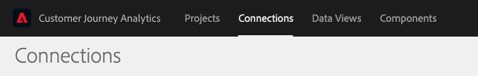

Here you can see all the different connections made between CJA and Platform. These connections have the same goal as report suites in Adobe Analytics. However, the collection of the data is totally different. All data is coming from Adobe Experience Platform datasets. 

Let's create your first connection. 

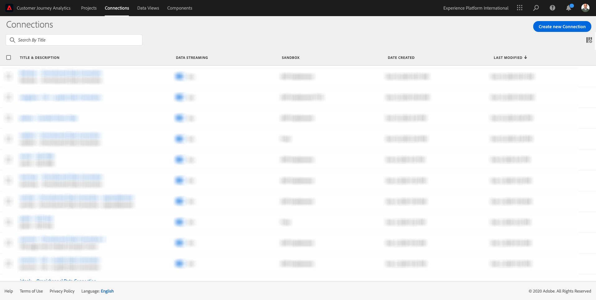

Click **Create new connection**.

You'll then see **Create Connection** UI.

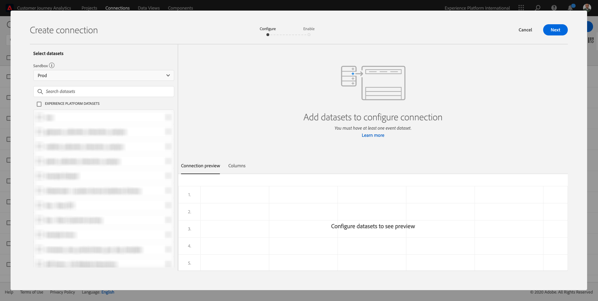

First of all, you need to select the correct sandbox to use. In the sandbox menu, select your sandbox, which should be `--aepSandboxId--`. In this example, the sandbox to use is **AEP Enablement FY21**.

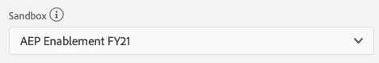

After selecting your sandbox, the available datasets will be updated.

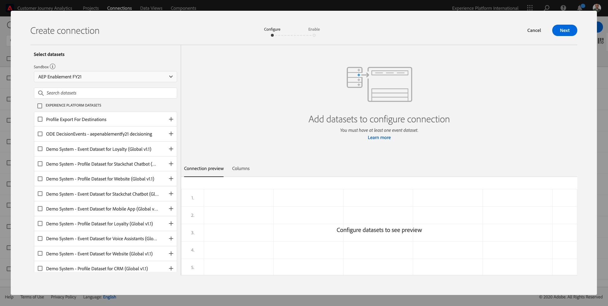

In the left menu, you can see all available Adobe Experience Platform datasets.

There are three different areas. Let's start from the left side.

On the left side, you'll find all the available Adobe Experience Platform **datasets**.
In the middle, you'll find the **drag-and-drop area for the datasets** you want to connect to.
On the right side, you'll find the **stitching area**, where you’ll select the Person Id.

## 13.2.2 Select Adobe Experience Platform datasets

Search for the dataset `Demo System - Event Dataset for Website (Global v1.1)`. Click **+** to add the dataset to this connection.

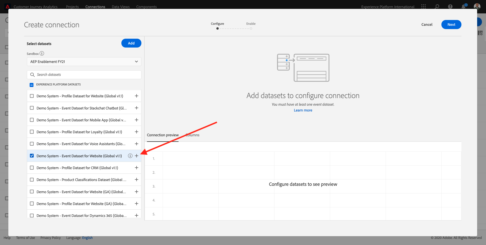

You'll see the dataset being added to the canvas.

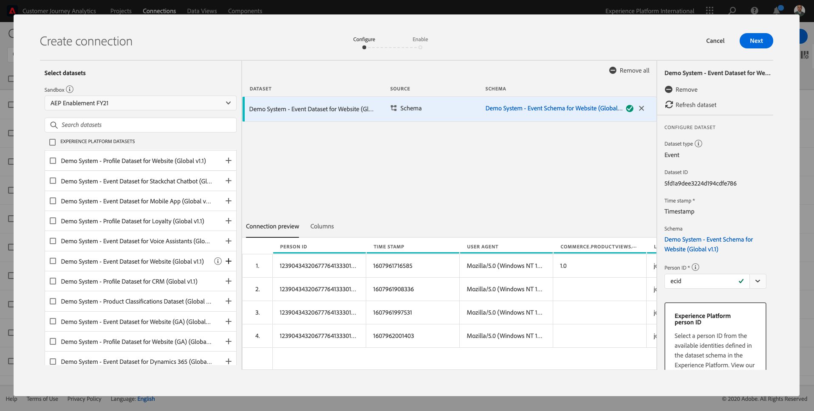

Now search and check the checkboxes for `Demo System - Event Dataset for Voice Assistants (Global v1.1)` and `Demo System - Event Dataset for Call Center (Global v1.1)`. 

Next, click **Add**.

You'll then have this:

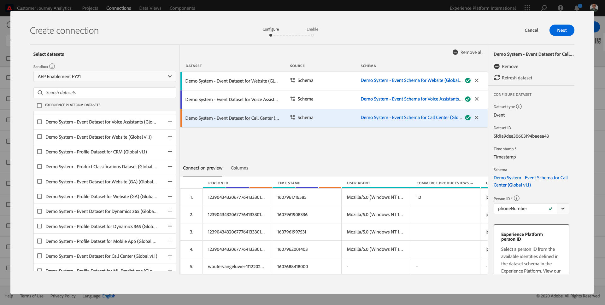

## 13.2.3 Person ID and Data Stitching

### Person ID

The goal now is to join these datasets. If you look at the right side you’ll see a field called **Person ID**. 

Each data source has its own Person ID field. Check each dataset by clicking on them.

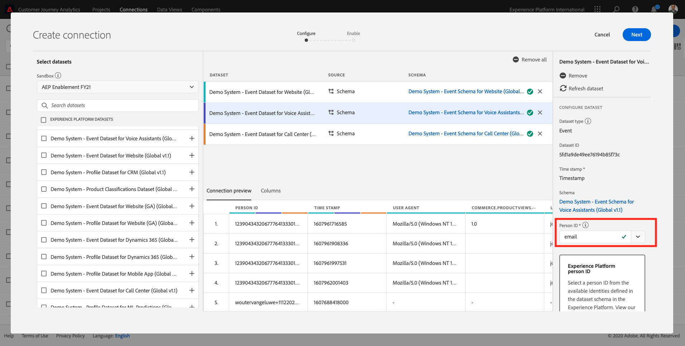

As you can see, most of them have the Person ID selected automatically. This is because a Primary Identifier is selected in every schema in Adobe Experience Platform. As an example, here's the schema for `Demo System - Event Schema for Call Center (Global v1.1)`, where you can see that the Primary Identifier is set to `phoneNumber`.

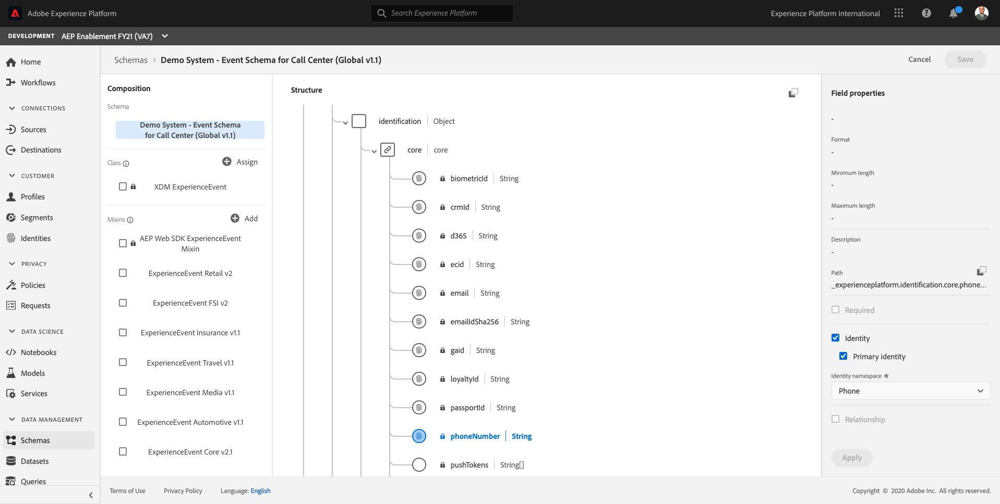

However, you can still influence which identifier will be used to stitch datasets together for your connection. You can use any identifier that is configured in the schema linked to your dataset. Click on the dropdown to explore the IDs available on each dataset.

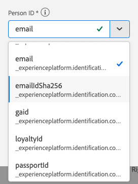

As mentioned, we can set different Person IDs for each dataset. This allows you to bring different datasets from multiple origins together in CJA. Imagine bringing in NPS or survey data which would be very interesting and helpful to understand the context and why something has happened.

The name of the Person ID field isn't important, as long as the value in the Person ID fields correspond. Let say we have `email` in one dataset and `emailAddress` in another dataset defined as Person ID. If `delaigle@adobe.com` is the same value for the Person ID-field on both datasets, CJA will be able to stitch the data.

Currently there are some other limitations such us stitching the anonymous behavior to known. Please review the FAQs here: [FAQ](https://experienceleague.adobe.com/docs/analytics-platform/using/cja-overview/cja-faq.html). 

### Stitching the data using the Person ID

Now that you understand the concept of stitching datasets using the Person ID, let's choose `email` as your Person ID for each dataset. 

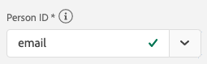

Select each dataset by clicking on it. 

Now fill the field Person ID choosing the `email` on the dropdown list.

Once you have stitched the three datasets, we are ready to continue. 

|  dataset       | Person ID | 
| ----------------- |-------------| 
| AEP Demo - Website Interactions | email         | 
| Demo System - Event Dataset for Voice Assistants (Global v1.1) | email          | 
| Demo System - Event Dataset for Call Center (Global v1.1) | email         | 

Click on Next.

## 13.2.4 Connection - Naming & Streaming

Here you need to give a name to your connection. 

Please use this naming convention: `ldap – Omnichannel Data Connection`. 

Example: `vangeluw - Omnichannel Data Connection`

Before finishing, please also activate **Automatically import all new data for all datasets in this connection, beginning today.** as in the image below. 

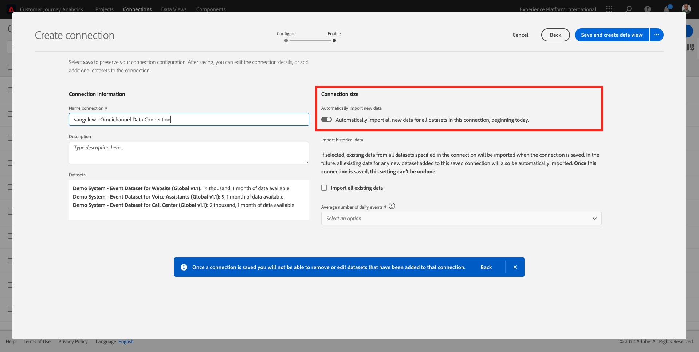

This will start a data flow from Adobe Experience Platform to CJA every 60 minutes, however with high volumes of data it can take up to 24 hours. 

If you also want to backfill historical data, check the checkbox for **Import all existing data** and select **less than 1 million** under **Average number of daily events**.

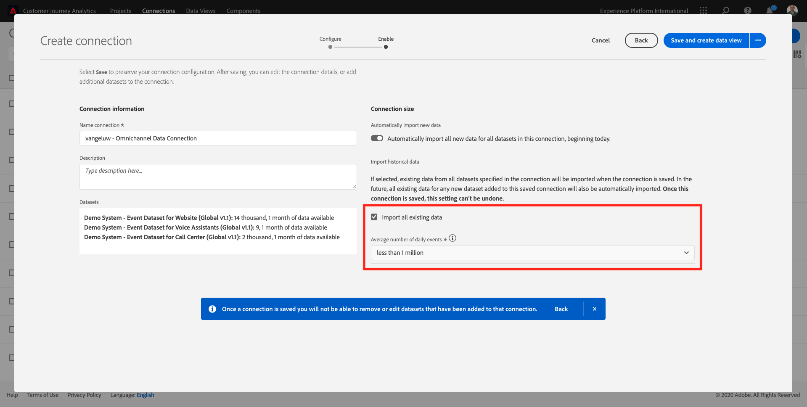

After having created your **Connection** it may take a few hours before your data is available in CJA.

Click **Save** and go to the next exercise. 

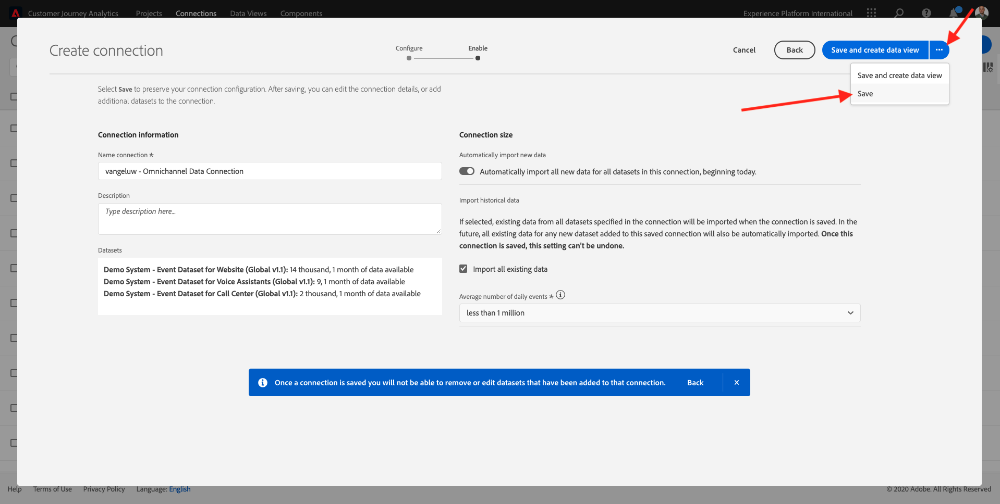

Next Step: [13.3 Create a Data View](./ex3.md)

[Go Back to Module 13](./customer-journey-analytics-build-a-dashboard.md)

[Go Back to All Modules](./../../overview.md)
