# 13.3 Create a Data View

## Objectives

- Understand the Data View UI
- Understand the basic settings of visit definition
- Understand Attribution and Persistence within a Data View

## 13.3.1 Data View

With your connection done, you can now progress to influencing visualization. A difference between Adobe Analytics and CJA, is that CJA needs a Data View in order to clean and prepare the data before visualization. 

A Data View is similar to the concept of Virtual Report Suites in Adobe Analytics, where you  define context-aware visit definitions, filtering and also, how the components are called. 

You'll need a minimum of one Data View per Connection. However, for some use-cases, it's great to have multiple Data Views for the same connection, with the goal of giving different insights to different teams. 
If you want your company to become data-driven, you should adapt how data is viewed in each team. Some examples:

- UX metrics only for the UX Design team
- Use the same names for KPIs and Metrics for Google Analytics as for Customer Journey Analytics so that the digital analytics team can speak 1 language only.
- Data View filtered to show for instance data for one market only, or one brand, or only for Mobile Devices.

On the **Connections** screen, check the checkbox in front of the connection you just created.

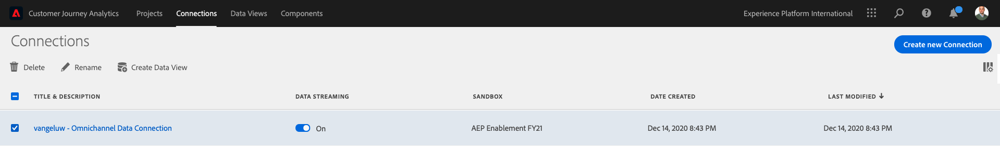

Now click **Create Data View**.

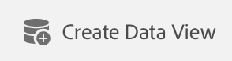

You'll be redirected to the **Create Data View** workflow.

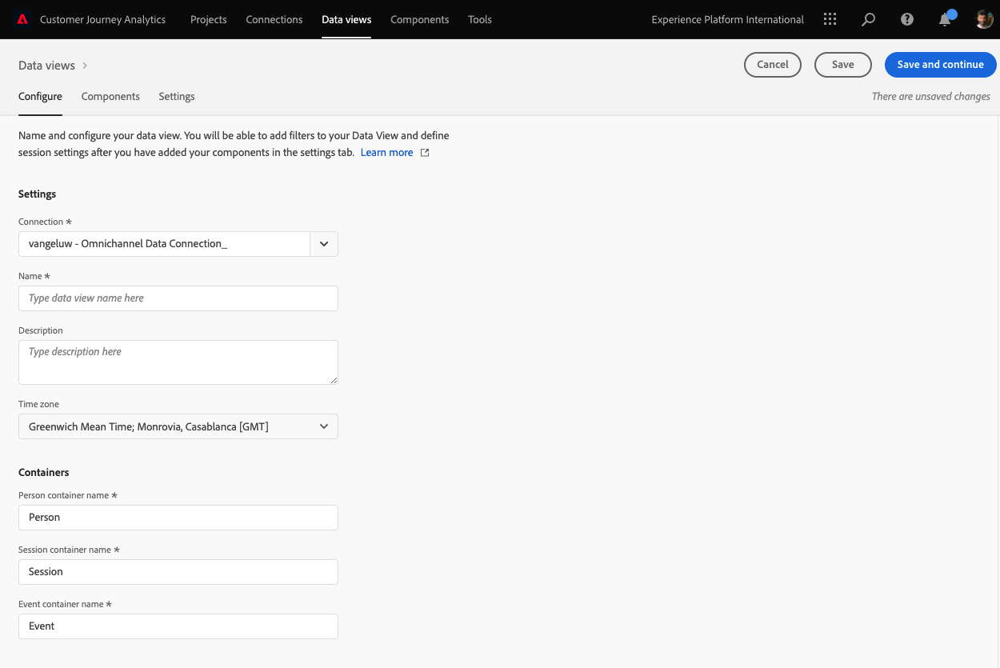

## 13.3.2 Data View Definition

You can now configure the basic definitions for your Data View. 

The **Connection** you created in the previous exercise is already selected. Your connection is named `ldap – Omnichannel Data Connection`.

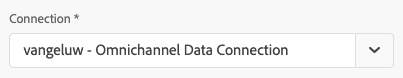

Next, give your Data View a name following this naming convention: `ldap – Omnichannel Data View`. 

Enter the same value for the description: `ldap – Omnichannel Data View`.

| Name         | Description|    
| ----------------- |-------------| 
| ldap – Omnichannel Data View | ldap – Omnichannel Data View          |  

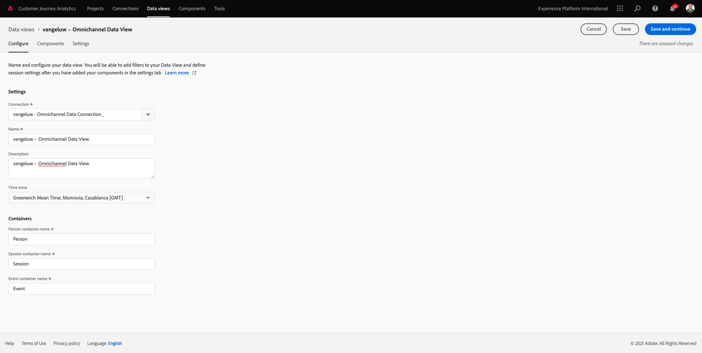

For the **Time Zone**, select the timezone **Greenwich Mean Time; Monrovia, Casablanca [GMT]**. This is a really interesting setting as some companies operate in different countries and geographies. Allocating the right time zone for each country will avoid typical data mistakes such as believing that for instance, in Peru, the majority of the people buy T-shirts at 4:00 AM.

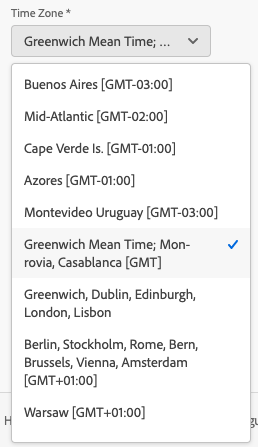

You can also modify the main metrics naming (Person, Session and Event). This is not required but some customers like to use People, Visits and Hits instead of Person, Session and Events (default naming convenction from Customer Journey Analytics).

You should now have the following settings configured:

Click **Save and Continue**.

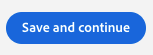

## 13.3.3 Data View Components

In this exercise, you'll configure the components you need to analyze the data and visualize it using Analysis Workspace. In this UI, there are three main areas:

- Left side: Available components from the selected datasets
- Middle: Added components to the Data View
- Right side: Component settings

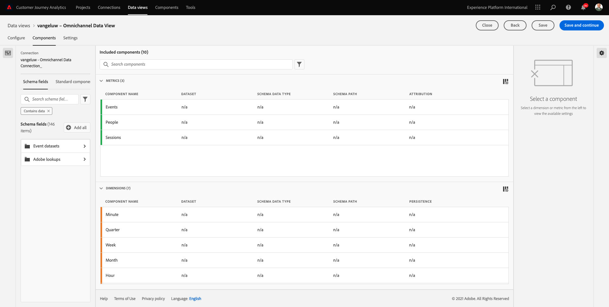

You now have to drag and drop the components you need for the analysis to the **Components Added**. To do this, you need to select the components in the left menu and drag and drop them onto the canvas in the middle.

Let's start with the first component:**Name (web.webPageDetails.name)**. Search for this component, then drag and drop it onto the canvas.

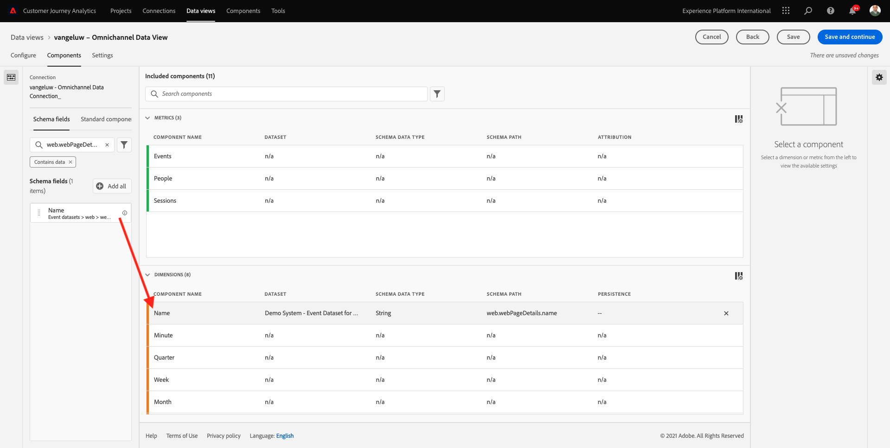

This component is the page name, as you can derive from reading the schema field `(web.webPageDetails.name)`. 

However, using **Name** as the name is not the best naming convention for a business user to quickly understand this dimension. 

Let's change the name to be **Page Name**. Click on the component and rename it in the **Component Settings** area.

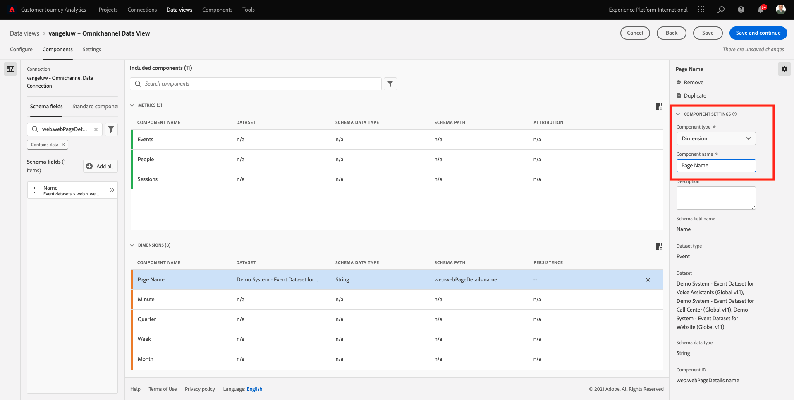

Something really important is the **Persistence settings**. The concept of evars and prop doesn't exist in CJA but the Persistence settings make a similar behavior possible. 

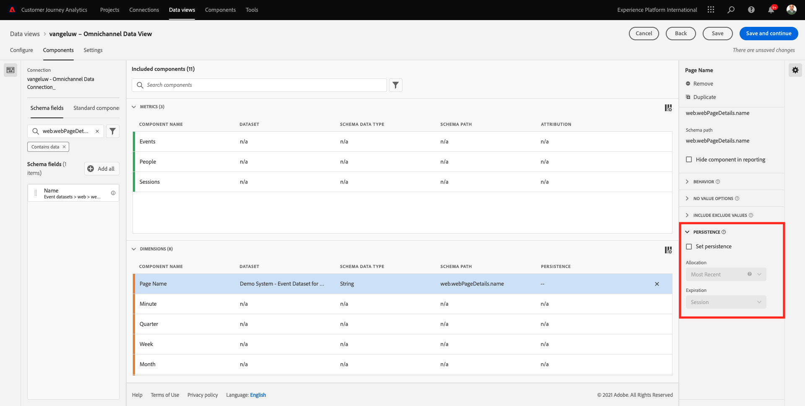

If you don't change these settings, CJA will interpret the dimension as a **Prop** (hit level). Also, we can change the Persistence to make the dimension an **eVar** (persist the value across the journey).

If you aren't familiar with eVars and Props, you can [read more about them in the documentation](https://experienceleague.adobe.com/docs/analytics/landing/an-key-concepts.html).

Let's leave the Page Name as a Prop. As such, you don't need to change any **Persistence Settings**.

| Component Name to Search           | New Name   | Persistence Settings  | 
| ----------------- |-------------| --------------------| 
| Name (web.webPageDetails.name) | Page Name          |          | 

Next, pick the dimension **phoneNumber** and drop it on the canvas. The new name should be **Phone Number**. 

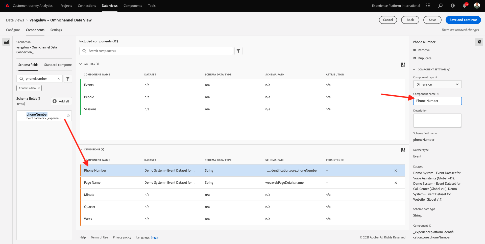

Finally let's change the Persistence settings, as the Mobile Number should persist at user level. 

To change the Persistence, scroll down in the right menu and open the **Persistence** tab:

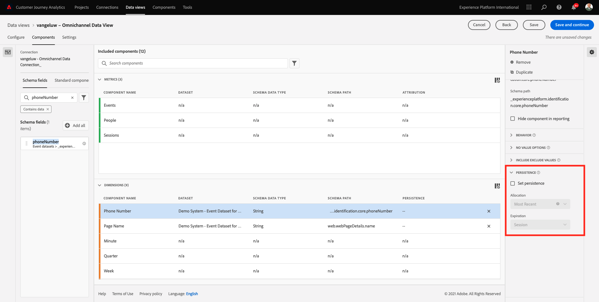

Check the checkbox to modify the persistence settings. Select **Most Recent** and the **Person (Reporting window)** scope, as we only care about the last mobile number of that person. If the customer doesn't fill out the mobile in future visits, you'll still see this value populated.

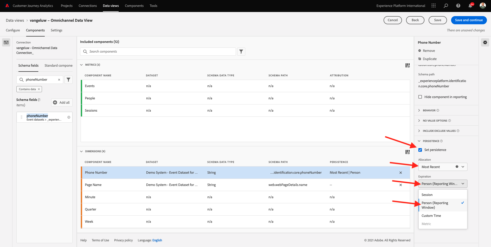

| Component Name to Search           | New Name    | Persistence Settings  | 
| ----------------- |-------------| --------------------| 
| phoneNumber | Phone Number          |    Most Recent, Person (reporting window)     | 

The next component is `web.webPageDetails.pageViews.value`.

In the left side menu, search for `web.webPageDetails.pageViews.value`. Drag and drop this metric onto the canvas. 

Change the name to be **Page Views** under the **Component settings**.

| Component Name to Search           | New Name    | Attribution Settings  | 
| ----------------- |-------------| --------------------| 
| web.webPageDetails.pageViews.value | Page Views          |         | 

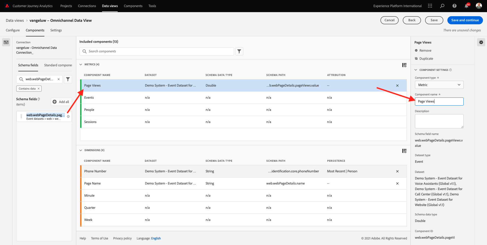

For the attribution settings we will leave this empty. 

Note: Persistence settings on metrics can also be changed in Analysis Workspace. In some cases you may choose to set it here to avoid business users from having to think which is the best persistence model. 

Next, you'll have to configure a lot of Dimensions and Metrics, as indicated in the below table.

### DIMENSIONS

| Component Name to Search           | New Name      | Persistence Settings  | 
| ----------------- |-------------| --------------------| 
| brandName | Brand Name          | Most Recent, Session         | 
| callfeeling | Call Feeling          |          | 
| call ID | Call Interaction Type          |          | 
| callTopic | Call Topic          | Most Recent, Session   | 
| ecid  | ECID          | Most Recent, Person (reporting window)       | 
| email | Email ID          | Most Recent, Person (reporting window)        | 
| Payment Type | Payment Type          |          | 
| Product add method | Product add method          | Most Recent, Session         | 
| Event Type | Event Type         |         | 
| Name (productListItems.name) | Product Name          |         | 
| SKU | SKU (Session)          | Most Recent, Session         | 
| Transaction ID | Transaction ID          |         | 
| URL (web.webPageDetails.URL) | URL          |         | 
| User Agent | User Agent          | Most Recent, Session         |

### METRICS

| Component Name to Search           | New Name    | Attribution Settings  | 
| ----------------- |-------------| --------------------| 
| Quantity | Quantity          |          | 
| commerce.order.priceTotal | Revenue          |         | 

Your configuration should then look like this:

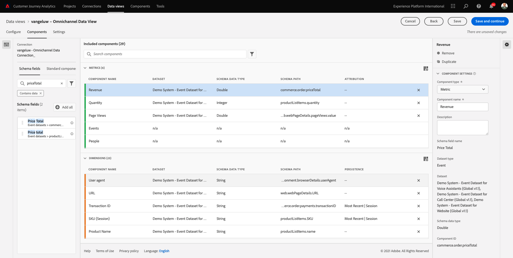

Don't forget to **Save** your Data View. So click **Save and continue** now.

## 13.3.4 Data View Settings

You should be redirected to this screen:

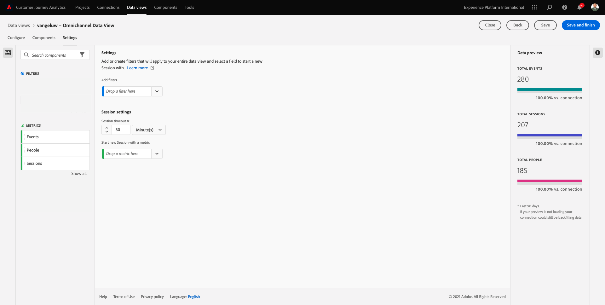

In this tab, you can mofify some important settings to change how data is processed. Let's start by setting the **Session Timeout** to 30 min. Thanks to every experience event's timestamp you can extend the concept of a session across all channels. For instance, what happens if a customer calls the call-center after visiting the website? Using custom Session Timeouts you have loots of flexibility in deciding what a session is, and how that session will merge data together.

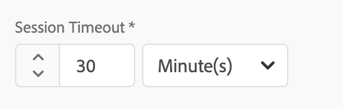

In this tab you can modify other things like filtering the data by using a segment/filter. You won't need to do that in this exercise. 

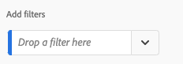

Once you are done, please click **Save and finish**.

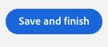

>[!NOTE]
>
>You can come back to this Data View afterwards and change settings and components at any time. Changes will affect how historical data is shown.

You can now continue with the visualization and analysis part!

Next Step: [13.4 Data Preparation in Customer Journey Analytics](./ex4.md)

[Go Back to Module 13](./customer-journey-analytics-build-a-dashboard.md)

[Go Back to All Modules](./../../overview.md)
