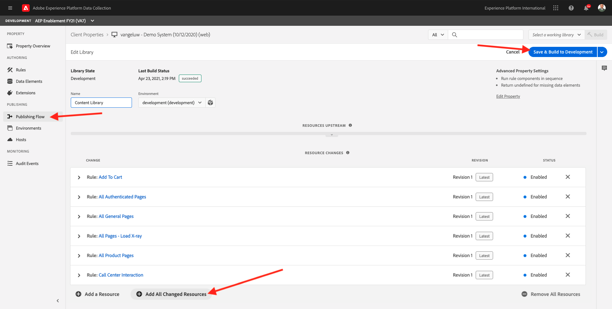

# 14.3 Prepare your Adobe Experience Platform Data Collection Client property and Web SDK setup for Offer Decisioning

>[!NOTE]
>
>The use of Offer Decisioning in Adobe Experience Platform Web SDK is currently available in early access to select users. This functionality is not available to all IMS organizations.

## 14.3.1 Update your Datastream

In [Exercise 0.2](./../../modules/module0/ex2.md), you created your own **[!UICONTROL Datastream]**. You then used the name **ldap - Demo System Datastream** and replaced **ldap** with your ldap.

In this exercise, you need to configure that **[!UICONTROL Datastream]** to work with **[!DNL Offer Decisioning]**.

To do that, go to [https://experience.adobe.com/#/data-collection/](https://experience.adobe.com/#/data-collection/). You'll then see this. Click **[!UICONTROL Datastreams]**. Search for your **[!UICONTROL Datastream]**. Click your **[!UICONTROL Datastream]** to open it. 


You'll then see this. Click **[!UICONTROL Development Environment]**.


In the **[!UICONTROL Development Environment]**, you'll see your Adobe Experience Platform configuration. 


To enable **[!DNL Offer Decisioning]**, check the box for **[!DNL Offer Decisioning]**.


Click **[!UICONTROL Save]**


You'll then be back here. Click **[!UICONTROL Staging Environment]**.


To enable **[!DNL Offer Decisioning]**, check the box for **[!DNL Offer Decisioning]**.


Click **[!UICONTROL Save]**


You'll then be back here. Click **[!UICONTROL Production Environment]**.


To enable **[!DNL Offer Decisioning]**, check the box for **[!DNL Offer Decisioning]**.


Click **[!UICONTROL Save]**


Your **[!UICONTROL Datastream]** is now ready to work with **[!DNL Offer Decisioning]**.

## 14.3.2 Configure your Adobe Experience Platform Data Collection Client property to request Personalized Offers

Go to [https://experience.adobe.com/#/data-collection/](https://experience.adobe.com/#/data-collection/), to **[!UICONTROL Client]**. Search for your Adobe Experience Platform Data Collection Client properties, which are named **ldap - Demo System (DD/MM/YYYY)**. Open your Adobe Experience Platform Data Collection Client property for web.


In you property, go to **[!UICONTROL Rules]** and open the rule **[!UICONTROL All General Pages]**. 


Click to open the [!UICONTROL Action] **[!UICONTROL AEP Web SDK - Send Event]**.


You'll then see this. You'll notice the menu option for **[!UICONTROL Decision Scopes]**.


For every request sent to the Edge and to Adobe Experience Platform, it's possible to provide one or more **[!UICONTROL Decision Scopes]**. A **[!UICONTROL Decision Scope]** is a combination of two elements:

- [!UICONTROL Decision ID]
- [!UICONTROL Placement ID]

Let's first have a look where you can find those two elements.

### 14.3.2.1 Retrieve your [!UICONTROL Placement ID]

The [!UICONTROL Placement ID] identifies the location and type of asset that is required. For instance, the hero image on the Luma website homepage corresponds with the [!UICONTROL Placement ID] for [!UICONTROL Web - Image].


To find the [!UICONTROL Placement ID] for [!UICONTROL Web - Image] go to [https://platform.adobe.com](https://platform.adobe.com). 

Next, go to [!UICONTROL Components] and then to [!UICONTROL Placements]. Click the [!UICONTROL Web - Image] placement to see its details.


As you can see in the above image, in this example the [!UICONTROL Placement ID] is `xcore:offer-placement:129048460001fd30`. Write down the [!UICONTROL Placement ID] for your placement for [!UICONTROL Web - Image] as you'll need it in the next exercise.

### 14.3.2.2 Retrieve your [!UICONTROL Decision ID]

The [!UICONTROL Decision ID] identifies which combination of Personalized Offers and Fallback Offer you'd like to use. In the previous exercise, you created your own [!UICONTROL Decision] and named it **[!UICONTROL ldap - Luma Decision]**.

To find the [!UICONTROL Decision ID] for your **[!UICONTROL ldap - Luma Decision]**, go to [https://platform.adobe.com](https://platform.adobe.com). 

Next, go to [!UICONTROL Offers] and then go to [!UICONTROL Decisions]. Click to select your [!UICONTROL Decision], which is named **[!UICONTROL ldap - Luma Decision]**.


As you can see in the above image, in this example the [!UICONTROL Decision ID] is `xcore:offer-activity:1290525f4441fd6e`. Write down the [!UICONTROL Decision ID] for your decision [!UICONTROL ldap - Luma Decision] as you'll need it in the next exercise.

Now that you've retrieved the two elements you need to create a **[!UICONTROL Decision Scopes]**, you can continue with the next step, which involves encoding the decision scope.

### 14.3.2.3 BASE64 Encoding

The **[!UICONTROL Decision Scope]** you need to enter is a BASE64-encoded string. This BASE64-encoded string is a combination of the [!UICONTROL Placement ID] and the [!UICONTROL Decision ID], as you can see below. 

```json
{
  "activityId":"xcore:offer-activity:1290525f4441fd6e",
  "placementId":"xcore:offer-placement:129048460001fd30"
}
```

The **[!UICONTROL Decision Scope]** can be generated in two ways:

- Use a public service like [https://www.base64encode.org/](https://www.base64encode.org/). Enter the JSON code as mentioned above, click **[!UICONTROL Encode]** and you'll get your BASE64 encoded string below.

  

- Retrieve the BASE64 encoded string from Adobe Experience Platform. To do so, go to [https://platform.adobe.com](https://platform.adobe.com). Next, go to [!UICONTROL Decisions] and click to open your [!UICONTROL Decision], which is named **[!UICONTROL ldap - Luma Decision]**.

  
  
  After opening your **[!UICONTROL ldap - Luma Decision]**, you'll see this. Locate the placement [!UICONTROL Web - Image] and click the **[!UICONTROL Copy]** button. Next, click **[!UICONTROL Encoded decision scope]**. The **[!UICONTROL Decision Scope]** is now copied to your clipboard.
    
  

Next, go back to Launch, to your action **[!UICONTROL AEP Web SDK - Send Event]**.


Make sure to select the option **[!UICONTROL Enter values]** and then paste your BASE64 encoded decision scope in the input field.


Save your changes in the action **[!UICONTROL AEP Web SDK - Send Event]** by clicking **[!UICONTROL Keep Changes]**. 


Next, click **[!UICONTROL Save]** or **[!UICONTROL Save to Library]**


In Adobe Experience Platform Data Collection, go to **[!UICONTROL Publishing Flow]** and open your **[!UICONTROL Development Library]** which is named **[!UICONTROL Content Library]**. Click **[!UICONTROL + Add All Changed Resources]** and then click **[!UICONTROL Save & Build for Development]**. Your changes will now be published to your demo website.



Every time you're loading a **General Page** now, like for instance the homepage of the demo website, Offer Decisioning will evaluate what the applicable offer is and will return a response back to the website with the details of the the offer to show. Showing the offer on the website requires additional configuration, which you'll do in the next step.

## 14.3.3 Configure your Adobe Experience Platform Data Collection Client property to receive and apply Personalized Offers

Go to [https://experience.adobe.com/#/data-collection/](https://experience.adobe.com/#/data-collection/), to **[!UICONTROL Properties]**. Search for your Adobe Experience Platform Data Collection Client properties, which are named **ldap - Demo System (DD/MM/YYYY)**. Open your Adobe Experience Platform Data Collection Client property for web.


In you property, go to **[!UICONTROL Rules]**.


Click **[!UICONTROL Add Rule]**.


As the name for your rule, use **Homepage - Decision Received**.


### 14.3.3.1 Event

Click **[!UICONTROL + Add]** under **[!UICONTROL EVENTS]** to add a new event.


For the **[!UICONTROL Event Configuration]**, select this:

- **[!UICONTROL Extension]**: **[!UICONTROL AEP Web SDK]**
- **[!UICONTROL Event Type]**: **[!UICONTROL Decisions Received]**


Click **[!UICONTROL Keep Changes]**.


### 14.3.3.2 Condition

You'll now see this. Click **[!UICONTROL + Add]** under **[!UICONTROL CONDITIONS]** to add a new condition.


For the **[!UICONTROL Condition Configuration]**, select this:

- **[!UICONTROL Logic Type]**: **[!UICONTROL Regular]**
- **[!UICONTROL Extension]**: **[!UICONTROL Core]**
- **[!UICONTROL Condition type]**: **[!UICONTROL Value Comparison]**
- **[!UICONTROL Name]**: **[!UICONTROL Core - Value Comparison]**
- Return true if
  - `%pageName%`
  - [!UICONTROL Equals]
  - `Luma Home`


Click **[!UICONTROL Keep Changes]**.


### 14.3.3.3 Action

You'll then see this. Click **[!UICONTROL + Add]** under **[!UICONTROL ACTIONS]** to add a new action.


For the **[!UICONTROL Action Configuration]**, select this:

- **[!UICONTROL Extension]**: **[!UICONTROL Core]**
- **[!UICONTROL Action Type]**: **[!UICONTROL Custom Code]**
- **[!UICONTROL Language]**: **[!UICONTROL JavaScript]**

Next, click **[!UICONTROL Open Editor]**


Paste the below code in the editor.

```javascript
event.decisions.forEach(function(payload) {
  payload.items.forEach(function(item) {
    console.log(">>>>> Offer Decisioning Web SDK Response", item);
    document.getElementById("brandhero").src = item.data.deliveryURL;
  });
});
```


Click **[!UICONTROL Save]**.


Click **[!UICONTROL Keep Changes]**.


Next, click **[!UICONTROL Save]** or **[!UICONTROL Save to Library]**


In Adobe Experience Platform Data Collection, go to **[!UICONTROL Publishing Flow]** and open your **[!UICONTROL Development Library]** which is named **[!UICONTROL Content Library]**. Click **[!UICONTROL + Add All Changed Resources]** and then click **[!UICONTROL Save & Build for Development]**. Your changes will now be published to your demo website.


With this change, this rule in Adobe Experience Platform Data Collection will now be listening to the response from Offer Decisioning which is part of the Web SDK response, and when the response is received, the image of the offer will be displayed on the homepage.

Looking at the Luma demo website, you'll see that this image will be replaced now:


And instead of the default Luma hero image, you will now see an offer like this one:


In the next exercise, you'll go through a step-by-step demo scenario.

Next Step: [14.4 Test your Decision using the demo website](./ex4.md)

[Go Back to Module 14](./offer-decisioning.md)

[Go Back to All Modules](./../../overview.md)
