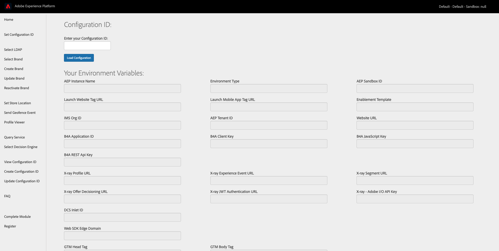
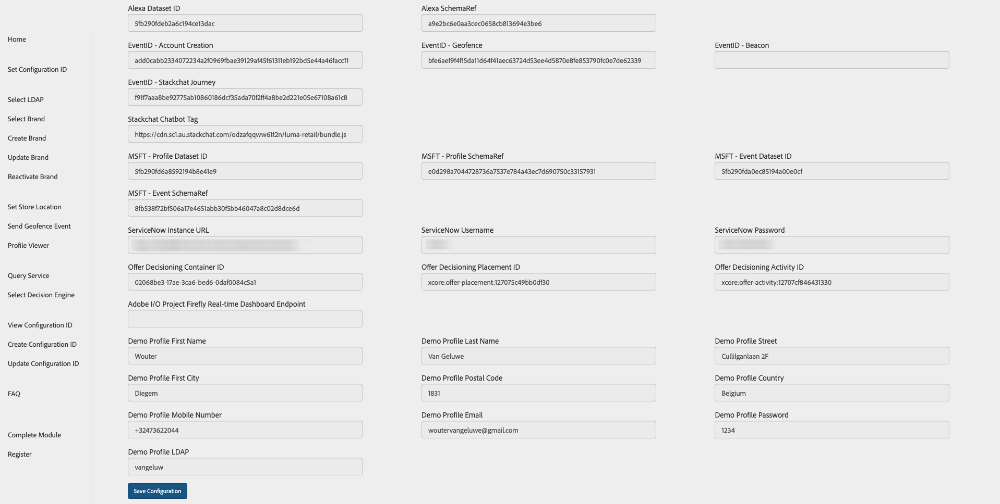
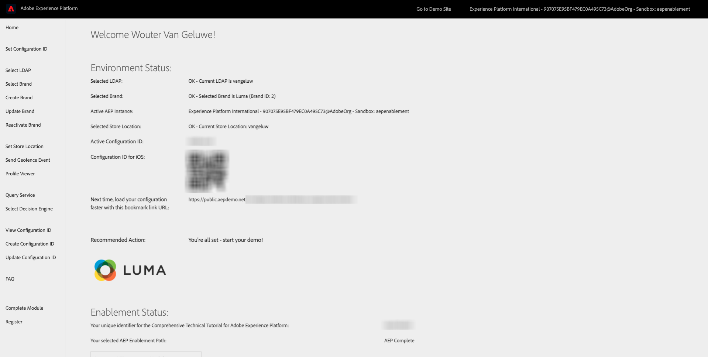
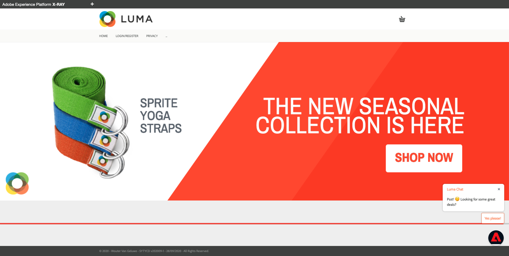
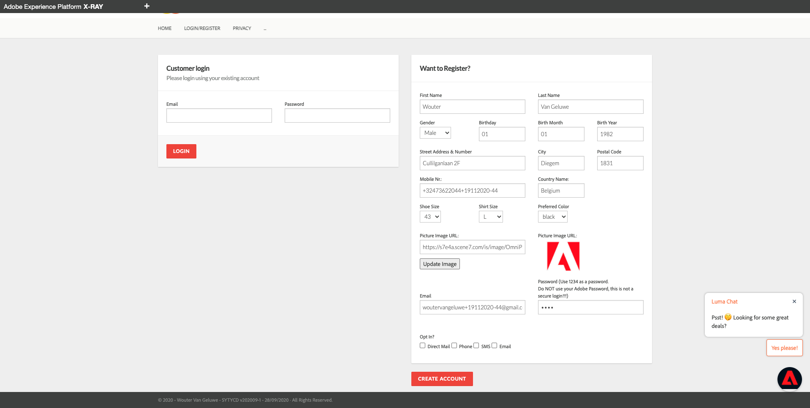
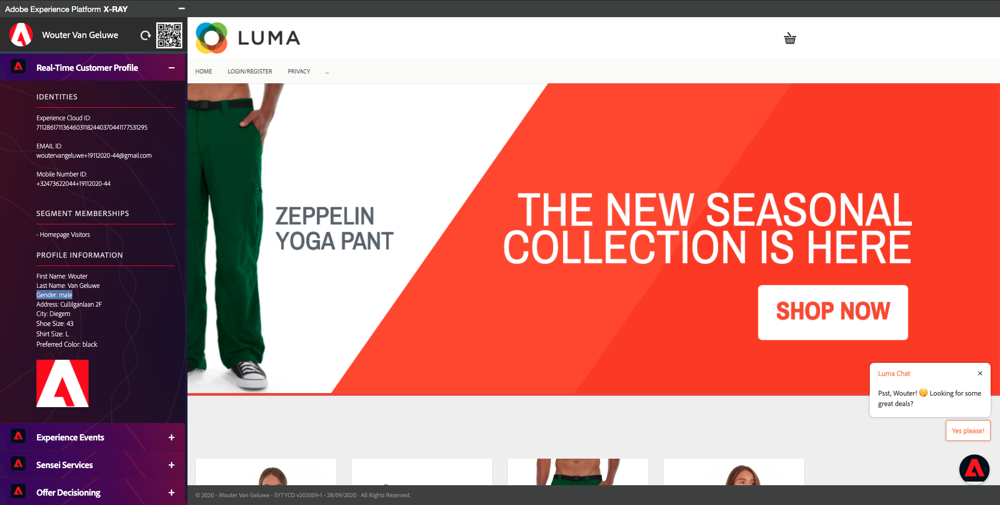
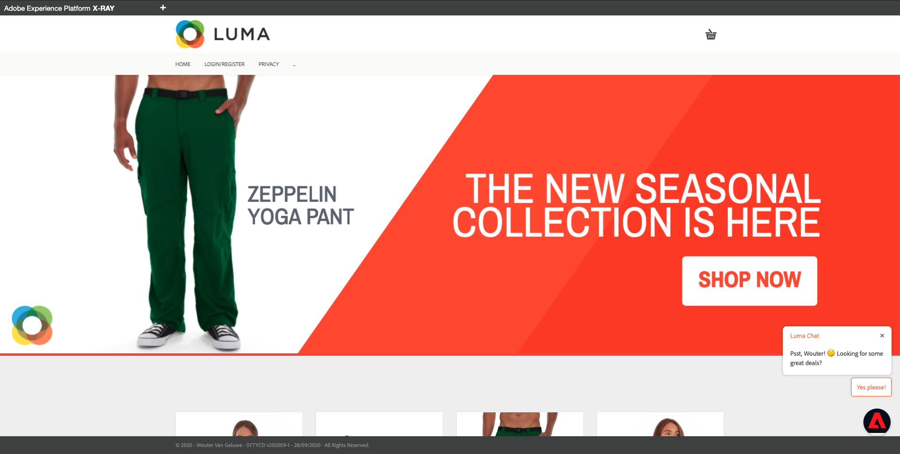

# 14.4 Test your Decision using the demo website

## 14.4.1 Load website and brand

Open a new, clean incognito browser window and go to [https://public.aepdemo.net](https://public.aepdemo.net). 

You'll then see this. 

Enter your Configuration ID and click **Load Configuration**. Your configuration is then loaded.

Scroll down and click **Save Configuration**.

You'll then be redirected to the Admin homepage. Go to **Select LDAP**. Select your LDAP and click **Save**.

You'll then be redirected to the Admin homepage. Go to **Select Brand** and select the brand **Luma**, click **Save**.

You'll then be redirected to the Admin homepage. Click the **Luma** logo.

## 14.4.2 Customer browses the website

You'll then see the Luma homepage. You should immediately see your hero image change, and you should see the Fallback Offer that was defined as part of your Decision.

Go to the page **Login/Register**. Fill out the fields and then click **CREATE ACCOUNT** to create your account.

As part of the configuration of your Personalized Offers, you defined offers for either male customers or female customers. Based on the gender selection you made on the **Login/Register** page, you'll now see another offer on the Luma homepage. This time it isn't a Fallback Offer anymore, but instead a Personalized Offer.

In this example, the gender selection is male. For male customers, the highest priority offer is the offer for the Zeppelin Yoga Pant.

Thanks to the integration between Web SDK and Adobe Experience Platform, offers can be delivered in a nice and easy way, with a limited amount of configuration.

In the next exercise, you'll see how to work with offers using the API.

Next Step: [14.5 Test your Decision using the API](./ex5.md)

[Go Back to Module 14](./offer-decisioning.md)

[Go Back to All Modules](./../../overview.md)
