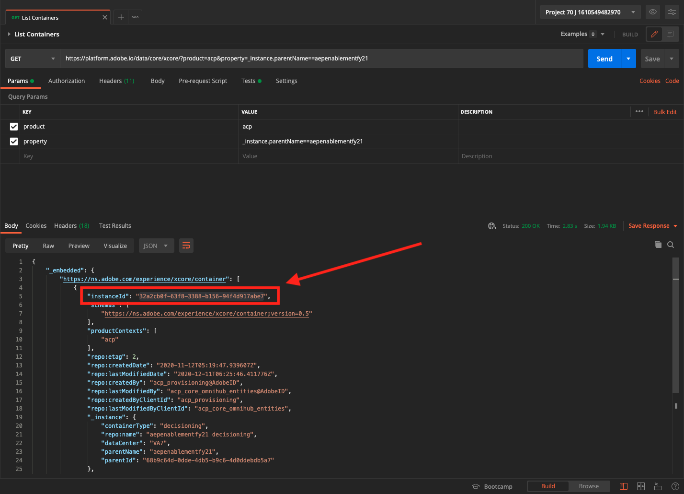
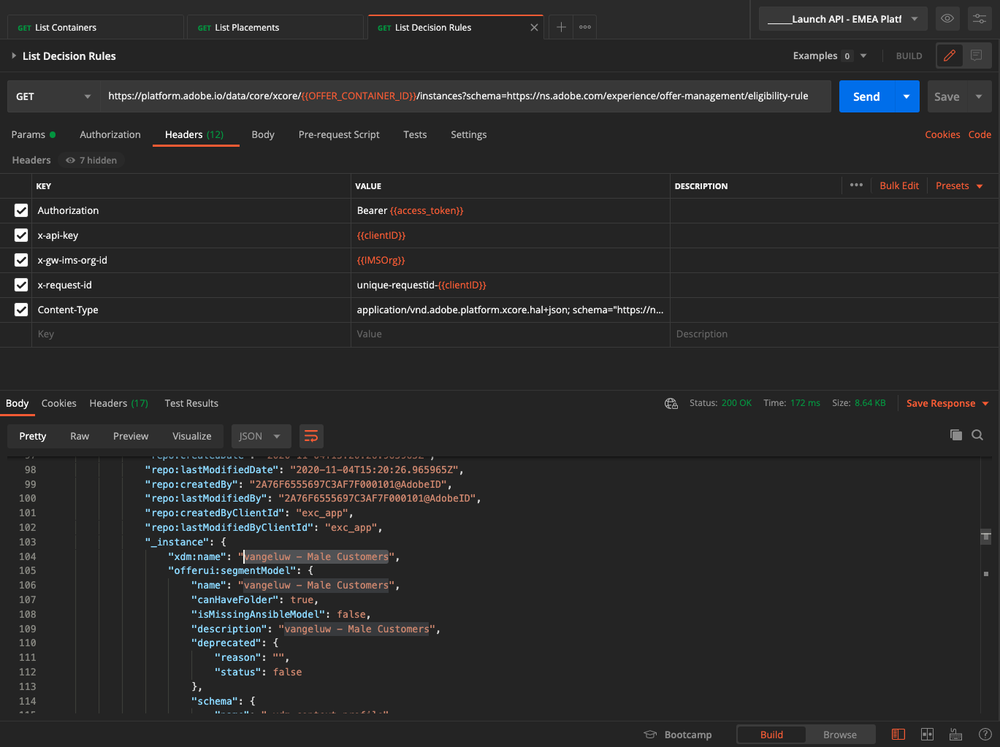
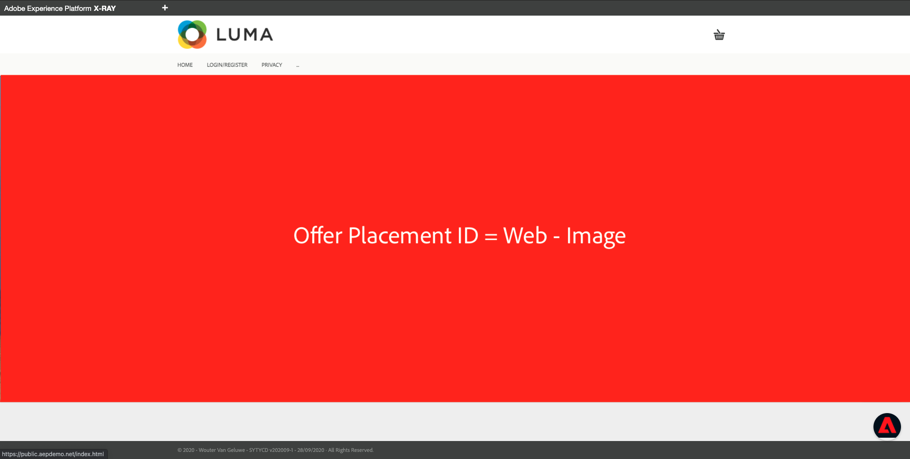
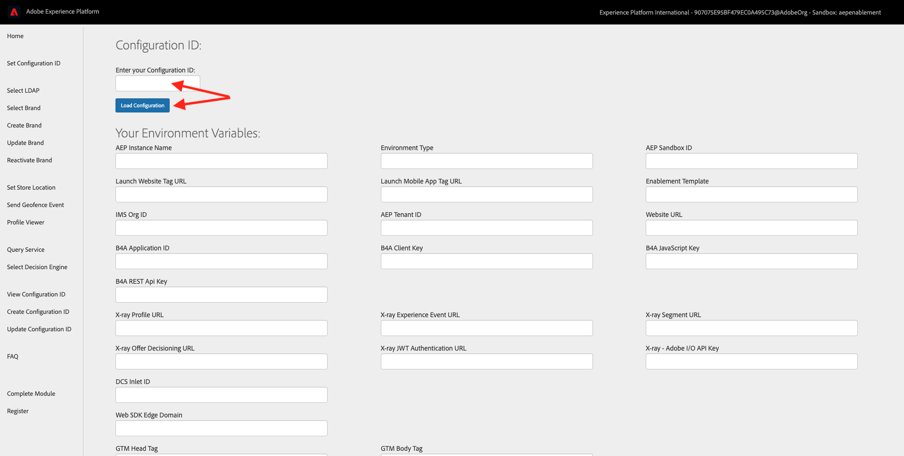
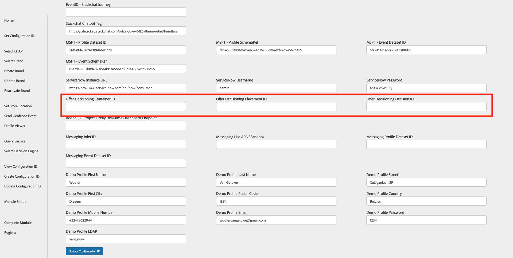

# 14.5 Test your Decision using the API

## 14.5.1 Work with the Offer Decisioning API using Postman

Download [this Postman Collection for Offer Decisioning](./../../assets/postman/postman_module14_offer-decisioning.zip) to your desktop and unzip it. You'll then have this:

You now have this file on your desktop:

- [!UICONTROL _Module 14- Decisioning Service.postman_collection.json]

In [Exercise 3.3.3 - Postman authentication to Adobe I/O](./../../modules/module3/ex3.md) you installed Postman. You'll need to use Postman again for this exercise.

Open Postman. Click **[!UICONTROL Import]**.

Click on **[!UICONTROL Upload files]**.

Select the file **[!UICONTROL _Module 14- Decisioning Service.postman_collection.json]** and click **[!UICONTROL Open]**.

You'll then have this collection available in Postman.

You now have everything you need in Postman to start interacting with Adobe Experience Platform through the APIs.

### 14.5.1.1 List Containers

Click to open the request **[!UICONTROL GET - List Containers]**. 

Under **[!UICONTROL Params]**, you'll see this: 

- property: `_instance.parentName==aepenablementfy21`

In that parameter, **[!UICONTROL aepenablementfy21]** is the name of the sandbox that is used in Adobe Experience Platform. The sandbox you should use is `--aepSandboxId--`. Replace the text **[!UICONTROL aepenablementfy21]** by `--aepSandboxId--`.

After replacing the sandbox name, click **[!UICONTROL Send]**.

This is the response, which shows the offer container for the sandbox that you specified. Please copy the **[!UICONTROL container instanceId]** as indicated below and write it down in a text file on your computer. You'll need to use this **[!UICONTROL container instanceId]** for the next exercise!

### 14.5.1.2 List Placements

Click to open the request **[!UICONTROL GET - List Placements]**. Click **[!UICONTROL Send]**.

You're now seeing all available placements in your offer container. The placements you're seeing were defined in the Adobe Experience Platform UI, as you could see in [Exercise 14.1.3](./ex1.md).

### 14.5.1.3 List Decision Rules

Click to open the request **[!UICONTROL GET - List Decision Rules]**. Click **[!UICONTROL Send]**.

In the response, you'll see the Decision Rules that you defined in the Adobe Experience Platform UI, as you could see in [Exercise 14.1.4](./ex1.md).

### 14.5.1.4 List Personalized Offers

Click to open the request **[!UICONTROL GET - List Personalized Offers]**. Click **[!UICONTROL Send]**.

In the response, you'll see the Personalized Offers that you defined in the Adobe Experience Platform UI in [Exercise 14.2.1](./ex2.md).

### 14.5.1.5 List Fallback Offers

Click to open the request **[!UICONTROL GET - List Fallback Offers]**. Click **[!UICONTROL Send]**.

In the response, you'll see the Fallback Offer that you defined in the Adobe Experience Platform UI in [Exercise 14.2.2](./ex2.md).

### 14.5.1.6 List Collections

Click to open the request **[!UICONTROL GET - List Collections]**.

In the response, you'll see the Collection that you defined in the Adobe Experience Platform UI in [Exercise 14.2.3](./ex2.md).

### 14.5.1.7 Get Detailed Offers for Customer Profile

Click to open the request **[!UICONTROL POST - Get Detailed Offers for Customer Profile]**. This request is similar to the previous one, but will actually return details like image URLs, text etc.

For this request, similar to the previous exercise which has similar requirements, you need to provide the values for **[!UICONTROL xdm:placementId]** and **[!UICONTROL xdm:activityId]** to retrieve the specific offer details for a customer.

The field **[!UICONTROL xdm:activityId]** is already populated as the result of a previous request you sent, after which you stored the key **[!UICONTROL OFFER_ACTIVITY_ID]** in your Postman environment.

The field **[!UICONTROL xdm:placementId]** needs to be filled out. You can retrieve that in the Adobe Experience Platform UI, as indicated below. In the below example, you can see the placementId for the placement **[!UICONTROL Web - Image]**.

Go to **[!UICONTROL Body]** and enter the email address of the customer for whom you'd like to request an offer. Click **[!UICONTROL Send]**.

Finally, you'll then see the result of what kind of personalized offer and what assets need to be displayed to this customer.

## 14.5.2 Use the Offer Decisioning API to showcase offers on Xray

In the previous exercise you used the API to retrieve information from Adobe Experience Platform and Offer Decisioning. Let's now have a look at a practical example.

You've seen the Xray panel on the website before. The Xray panel is using the Adobe Experience Platform API's to retrieve information on every payload. Let's now add the response from the Offer Decisioning API on Xray.

In order to make this possible, you'll need three values:

- [!UICONTROL Offer Decisioning Container ID]
- [!UICONTROL Offer Decisioning Placement ID]
- [!UICONTROL Offer Decisioning Decision ID]

Where can you find these values?

### 14.5.2.1 [!UICONTROL Offer Decisioning Container ID]

The container instanceId was returned by the first API call you sent as part of this exercise. Scroll back up  you see the **[!UICONTROL List Containers]** step. Follow the instructions there to collect the container instanceId. 

The format of the container instanceId looks like this: **[!UICONTROL 02068be3-17ae-3ca6-bed6-0daf0084c5a1]** and it was part of the output of the **[!UICONTROL List Containers]** request:

### 14.5.2.2 [!UICONTROL Offer Decisioning Placement ID]

The [!UICONTROL Offer Placement ID] identifies the location and type of asset that is required. For instance, the hero image on the Luma website homepage corresponds with the [!UICONTROL Offer Placement ID] for [!UICONTROL Web - Image].

To find the [!UICONTROL Offer Placement ID] for [!UICONTROL Web - Image] go to [https://platform.adobe.com](https://platform.adobe.com). 

Next, go to [!UICONTROL Components] and then to [!UICONTROL Placements]. Click the [!UICONTROL Web - Image] placement to see its details.

As you can see in the above image, in this example the [!UICONTROL Offer Placement ID] is `xcore:offer-placement:129048460001fd30`. Write down the [!UICONTROL Offer Placement ID] for your placement for [!UICONTROL Web - Image] as you'll need it in the next exercise.

### 14.5.2.3 [!UICONTROL Offer Decisioning Decision ID]

The [!UICONTROL Decision ID] identifies which combination of Personalized Offers and Fallback Offer you'd like to use. In the previous exercise, you created your own [!UICONTROL Decision] and named it **[!UICONTROL ldap - Luma Decision]**.

To find the [!UICONTROL Decision ID] for your **[!UICONTROL ldap - Luma Decision]**, go to [https://platform.adobe.com](https://platform.adobe.com). 

Next, go to [!UICONTROL Offers], then go to [!UICONTROL Decisions] and click to select your [!UICONTROL Decision], which is named **[!UICONTROL ldap - Luma Decision]**.

As you can see in the above image, in this example the [!UICONTROL Decision ID] is `xcore:offer-activity:1290525f4441fd6e`. Write down the [!UICONTROL Decision ID] for your Decision [!UICONTROL ldap - Luma Decision] as you'll need it in the next exercise.

### 14.5.2.4 Update your Enablement Configuration ID

Before you can test your end-to-end demonstration, you'll need to update your Configuration ID settings and update the fields for **[!UICONTROL Offer Decisioning Container ID]**, **[!UICONTROL Offer Decisioning Placement ID]** and **[!UICONTROL Offer Decisioning Decision ID]** on the **Update Configuration ID** page of the demo website.

Go to [https://public.aepdemo.net/admin_configuration_update.html](https://public.aepdemo.net/admin_configuration_update.html).

You'll then see this:

Enter your Configuration ID and then click **[!UICONTROL Load Configuration]**. You'll see your Configuration ID values being loaded.

Scroll down until you see the fields **[!UICONTROL Offer Decisioning Container ID]**, **[!UICONTROL Offer Decisioning Placement ID]** and **[!UICONTROL Offer Decisioning Decision ID]**.

You now need to enter the values for these three fields. You collected these values a couple of minutes ago in the previous step.

  
Next, on the Update Configuration ID page, scroll down and click **[!UICONTROL Update Configuration ID]**.

After this change, the Offer Decisioning API response will be showcased on Xray!

## 14.5.2 Test Xray

### 14.5.2.1 Load website and brand

Open a new, clean incognito browser window and go to [https://public.aepdemo.net](https://public.aepdemo.net). 

You'll then see this. 

Enter your Configuration ID and click **Load Configuration**. Your configuration is then loaded.

Scroll down and click **Save Configuration**.

You'll then be redirected to the Admin homepage. Go to **Select LDAP**. Select your LDAP and click **Save**.

You'll then be redirected to the Admin homepage. Go to **Select Brand** and select the brand **Luma**, click **Save**.

You'll then be redirected to the Admin homepage. Click the **Luma** logo.

### 14.5.2.2 Customer browses the website

You'll then see the Luma homepage. You should immediately see your hero image change, and you should see the Fallback Offer that was defined as part of your Decision, just like in the previous exercise. Additionally, when you open the Xray panel and have a look at the Offer Decisioning panel, you'll now also see the applicable offer being displayed there.

It's important to understand the difference:

- the hero image in the website is being delivered by Web SDK, thanks to the integration between Web SDK, Edge and Offer Decisioning
- the Xray panel, and the offer being shown on Xray, is made possible by consuming the Offer Decisioning APIs

This means that there are two ways of getting the offer in the context where it is needed, which offers you a lot of flexibility!

Go to the page **Login/Register**. Fill out the fields and then click **CREATE ACCOUNT** to create your account.

As part of the configuration of your Personalized Offers, you defined offers for either male customers or female customers. Based on the gender selection you made on the **Login/Register** page, you'll now see another offer on the Luma homepage. This time it isn't a Fallback Offer anymore, but instead a Personalized Offer. You can now again see the same offer on the hero image and on Xray.

In this example, the gender selection is male. For male customers, the highest priority offer is the offer for the Zeppelin Yoga Pant.

Thanks to the integration between Web SDK and Adobe Experience Platform, offers can be delivered in a nice and easy way, with a limited amount of configuration.

You've now completed this exercise.

Next Step: [14.6 Test your Decision using Journey Orchestration](./ex6.md)

[Go Back to Module 14](./offer-decisioning.md)

[Go Back to All Modules](./../../overview.md)
