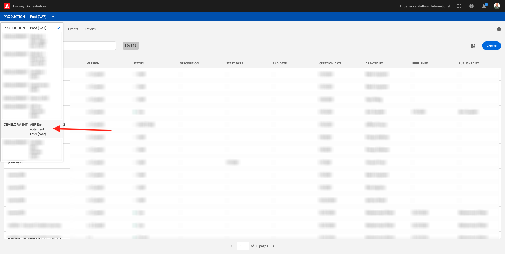
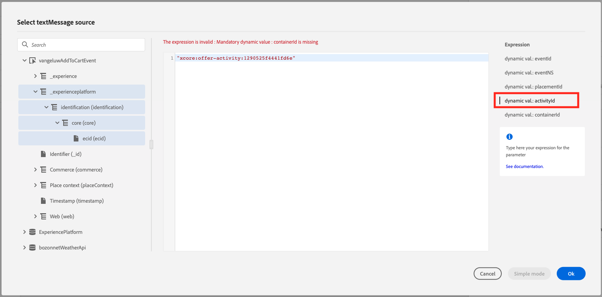

# 14.6 Test your Decision using Journey Orchestration

In this exercise, you'll configure the event and the journey that needs to be triggered when someone likes a product as part of the chatbot flow.

## 14.6.1 Create a new event in Journey Orchestration

Login to Journey Orchestration by going to [Adobe Experience Cloud](https://experience.adobe.com).


Click on **Journey Orchestration**.


You'll be redirected to the **Journeys** view in Journey Orchestration.

First, make sure you're using the correct sandbox. The sandbox to use is called `--aepSandboxId--`. To change from one sandbox to another, click on **PRODUCTION Prod (VA7)** and select the sandbox from the list. In this example, the sandbox is named **AEP Enablement FY21**.



You'll then be in the **Home** view of your sandbox `--aepSandboxId--`.


In the menu, click **Events**.


On the **Events** screen, you'll see a view similar to this. Click the **Add** button.


You'll then see an empty event configuration.


First of all, give your Event a Name like this: **ldapAddToCartEvent** and replace **ldap** with your ldap and add a description like this **Add To Cart Event**.


Next is the **Event ID Type** selection. Select **System Generated**


Next is the Schema selection. A schema was prepared for this exercise. Please use the schema **Demo System - Event Schema for Website (Global v1.1) v.1**.


After selecting the Schema, you'll see a number of fields being selected in the **Payload** section. There's no need to add any fields.

Click **Save** to save your changes.


Your Event is now configured and saved.


Click on your event again to open up the **Edit Event** screen again.


Hover over the **Payload** field again to see three icons. 
Click on the **View** icon. You'll now see an example of the expected payload.


Your Event has a unique orchestration eventID, which you can find by scrolling down in that payload until you see **_experience.campaign.orchestration.eventID**.


The event ID is what needs to be sent to Adobe Experience Platform in order to trigger the Journey that you'll build next. Remember this eventID, as you'll need it in one of the next exercises.
**"eventID": "8f38f6c9bc62d0617d0cf8d151921ad537f00c138cc4420a27624d9231e27aae"**

Click **Ok** and click **Save** to close your event popup.

## 14.6.2 Update your Adobe Experience Platform Data Collection Client property - Add To Cart Rule 

Go to [https://experience.adobe.com/#/data-collection/](https://experience.adobe.com/#/data-collection/) and open your web property.


In the left menu, select **Data Elements**, search for the data element **ruleAddToCart** and open that data element.


In the configuration of that Web SDK data element, go to **_experience.campaign.orchestration.eventID** and paste the eventID of the event that you created in the previous step.


Click **Save** or **Save to Library**.


In Adobe Experience Platform Data Collection, go to **[!UICONTROL Publishing Flow]** and open your **[!UICONTROL Development Library]** which is named **[!UICONTROL Content Library]**. Click **[!UICONTROL + Add All Changed Resources]** and then click **[!UICONTROL Save & Build for Development]**. Your changes will now be published to your demo website.


## 14.6.3 Create External Data Sources in Journey Orchestration for Offer Decisioning

In this exercise, you'll create an External Data Source to connect Journey Orchestration to Offer Decisioning.

In the menu, click on **Data Sources**.


You'll then see the **Data Sources** list.


Click **Add** to start adding your data source.


You'll see an empty data source popup.


As a Name for the Data Source, use `ldapXrayGetOffersInfo` and replace `ldap` with your LDAP. In this example, the Data Source Name is `vangeluwXrayGetOffersInfo`.

Set Description to: `Retrieve Offers from Offer Decisioning`.

The URL you need to use is: `--jwtOfferDecisioning--`. In this example, the URL is **https://vangeluw.adobeio-static.net/api/v1/web/aepxrayINTENAB-1.0/getOfferForCustomer.json**.


For the Authentication to use, select **No Authentication**.


You now need to define a first **FieldGroup**, which is basically the name of the request you'll be sending to the Offer Decisioning API. Use this naming convention: `ldapGetOfferText` so in this case, the name should be `vangeluwGetOfferText`

You also need to specify 5 dynamic values: `eventId,eventNS,placementId,activityId,containerId`.

Next, set the **Cache Duration** to **1 Minute**.

You should now have this:


For the Response Payload, you need to paste an example of the Response that will be sent by the Offer Decisioning API. Copy the JSON Response from here:

```json
{
  "offerResponse": {
    "ode:createDate": 1605829730428,
    "xdm:factors": {
      "xdm:numberOfIneligibleOffers": "2"
    },
    "xdm:propositionID": "6ef540a3-df9a-4f6d-ae98-eb8f74a7172c",
    "xdm:propositions": [
      {
        "xdm:activity": {
          "repo:etag": "1",
          "xdm:id": "xcore:offer-activity:1272b0c7aee6156b"
        },
        "xdm:options": [
          {
            "@type": "https://ns.adobe.com/experience/offer-management/content-component-text",
            "dc:format": "text/plain",
            "dc:language": [
              "en-us"
            ],
            "repo:etag": "1",
            "xdm:content": "10% discount on Zeppelin Yoga Pant",
            "xdm:id": "xcore:personalized-offer:1272a68868fcb019"
          }
        ],
        "xdm:placement": {
          "repo:etag": "1",
          "xdm:id": "xcore:offer-placement:12729df1e87caffa"
        }
      }
    ]
  },
  "placementId": "xcore:offer-placement:12729df1e87caffa"
}
```

Copy the above JSON Response to your clipboard, then go to your custom Data Source configuration screen.

Click the **Edit Payload** icon.


You'll see a popup where you now have to paste the above JSON Response.


Paste your JSON Response.


Click **Save**.


Next, click the **Add a New Field Group** button.


You now have another empty field group.


You now need to define a second **FieldGroup** to retrieve the Offer Image to be used. Use this naming convention: `ldapGetOfferImage` so in this case, the name should be `vangeluwGetOfferImage`.

You also need to specify 5 dynamic values: `eventId,eventNS,placementId,activityId,containerId`.

Next, set the **Cache Duration** to **1 Minute**.

You should now have this:


For the Response Payload, you need to paste an example of the Response that will be sent by the Offer Decisioning API. Copy the JSON Response from here:

```json
{
  "offerResponse": {
    "ode:createDate": 1605830325292,
    "xdm:factors": {
      "xdm:numberOfIneligibleOffers": "2"
    },
    "xdm:propositionID": "3478addf-773e-4b9c-9d28-133b3311e04f",
    "xdm:propositions": [
      {
        "xdm:activity": {
          "repo:etag": "1",
          "xdm:id": "xcore:offer-activity:1272b0c7aee6156b"
        },
        "xdm:options": [
          {
            "@type": "https://ns.adobe.com/experience/offer-management/content-component-imagelink",
            "dc:format": "image/png",
            "dc:language": [
              "en-us"
            ],
            "repo:etag": "1",
            "xdm:deliveryURL": "https://bit.ly/2IOaItW",
            "xdm:id": "xcore:personalized-offer:1272a68868fcb019"
          }
        ],
        "xdm:placement": {
          "repo:etag": "1",
          "xdm:id": "xcore:offer-placement:1270759fed831304"
        }
      }
    ]
  },
  "placementId": "xcore:offer-placement:1270759fed831304"
}
```

Copy the above JSON Response to your clipboard, then go to your custom Data Source configuration screen.

Click the **Edit Payload** icon.


You'll see a popup where you now have to paste the above JSON Response.


Paste your JSON Response.


Click **Save**.


Your custom Data Source configuration is now complete. Scroll up and click **Save**.


Your Data Source has now been created successfully and is part of the **Data Sources** list.


## 14.6.4 Create a new journey in Journey Orchestration

In the menu, click **Home**.


Let's create a new journey by clicking the **Create** button.


You'll then see an empty Journey screen.


In the previous exercise, you created a new **Event**. You named it like this **ldapAddToCartEvent** and replaced **ldap** with your ldap. This was the result of the Event creation:


You now need to take this event as the start of this Journey. You can do this by going to the left side of your screen and searching for your event in the list of events.


Select your event, drag and drop it on the Journey  canvas. Your Journey now looks like this:


As the second step in the journey, you need to add an **ldapSmsTwilio** action. Go to the left side of your screen to **Actions**. Next, select the **ldapSmsTwilio** action, then drag and drop it on the second node in your journey.


You'll see this panel open up.


Navigate to the **Action Parameters**.


Click on the **Edit** icon for the Action Parameter **TEXTMESSAGE**.


In the popup you'll see, click on **Advanced Mode**.


You'll then see this:


Select the below code, copy it and paste it in the **Advanced Mode Editor**. Replace `ldap` by your own ldap.

`#{ldapXrayGetOffersInfo.ldapGetOfferText.offerResponse.'xdm:propositions'.at(0).'xdm:options'.at(0).'xdm:content'}`


You now need to configure the 5 dynamic parameters as indicated on the right side of the popup:

- dynamic val.: eventId
- dynamic val.: eventNS
- dynamic val.: placementId
- dynamic val.: activityId
- dynamic val.: containerId

Click the parameter `dynamic val.: eventId`. For `eventId`, you need to select the ECID. To do that, paste the below code. Replace `ldap` by your own ldap.

`@{ldapAddToCartEvent.--aepTenantId--.identification.core.ecid}`


Next, click the parameter `dynamic val.: eventNS`. For `eventNS`, you need to select the ECID. To do that, paste the below text. 

`"ecid"`


Next, click the parameter `dynamic val.: placementId`. For `placementId`, you need to enter the **[!UICONTROL Offer Decisioning Placement ID]** for the placement [!UICONTROL Non-digital - Text]. You can find the **[!UICONTROL Offer Decisioning Placement ID]** by going into Adobe Experience Platform, to Components, to Placements, and by selecting the placement [!UICONTROL Non-digital - Text].


Copy the [!UICONTROL Placement ID] and paste it into the popup in Journey Orchestration, and don't forget to add `"` at the beginning and ending of the [!UICONTROL Placement ID]. It should look like this:

`"xcore:offer-placement:12904821b6d8626f"`


Next, click the parameter `dynamic val.: activityId`. For `activityId`, you need to enter the **[!UICONTROL Offer Decisioning Decision ID]**. You can find the **[!UICONTROL Offer Decisioning Decision ID]** by going into Adobe Experience Platform, to Offers, to Decisions, and by selecting your Decision.


Copy the [!UICONTROL Decision ID] and paste it into the popup in Journey Orchestration, and don't forget to add `"` at the beginning and ending of the [!UICONTROL Decision ID]. It should look like this:

`"xcore:offer-activity:1290525f4441fd6e"`



Next, click the parameter `dynamic val.: containerId`. For `containerId`, you need to enter the **container instanceId**, which you retrieved through the API in the previous exercise. Copy the container instanceId and don't forget to add `"` at the beginning and ending of the [!UICONTROL Decision ID]. It should look like this:

`"32a2cb0f-63f8-3388-b156-94f4d917abe7"`


Click **OK**.

Click on the **Edit** icon for the Action Parameter **MOBILENR**.


You'll see a popup with the **Simple Mode Editor**.


In the popup you'll see, click on **Advanced Mode**.


Paste this code in the **Advanced Mode Editor**. Click **OK**.

`substr(#{ExperiencePlatform.ProfileFieldGroup.profile.mobilePhone.number}, 0, 12)`

FYI: This code is intended to work with mobile phone numbers that have 12 digits (including the +), like this one: +32463622044.
Several other countries have 13-digit phone numbers. If your mobile phone number has 13 digits (including the +), you need to update this code to:

`substr(#{ExperiencePlatform.ProfileFieldGroup.profile.mobilePhone.number}, 0, 13)`


Click **OK** twice.


Your journey now looks like this:


As the third step in the journey, you need to add an **Email** action. Go to the left side of your screen to **Actions** and clear the search filter. Next, select the **Email** action, then drag and drop it on the second node in your journey.


On the right side of your screen, you now need to configure the email.


Go to **Message** and open the dropdown list. In that list, you need to select the template with the name **all - Email with Offer**.


Selecting this message automatically opens up a number of additional fields. These are the fields that. have been configured to be dynamic field in the email template. You now need to link each of the expected dynamic fields to a field coming from the Payload that is sent to Platform.


Let's start with the **EMAIL** field.

Click on the **Edit** icon.


You'll then see a window to select a source field to use as Email Source.

Navigate to `#{ExperiencePlatform.ProfileFieldGroup.profile.personalEmail.address}`.


Click **OK**.


Next, click the **Edit** icon for the field **BRAND LOGO**. 


Go to **Advanced Mode** and paste this value:

`"https://parsefiles.back4app.com/hgJBdVOS2eff03JCn6qXXOxT5jJFzialLAHJixD9/d632e769791f0a4dbe0b84058d282d45_logo.png"`


Click **OK**.


Next, click the **Edit** icon for the field **BRAND NAME**. 


Go to **Advanced Mode** and paste this value:

`"Luma"`


Click **OK**.


Next, click the **Edit** icon for the field **FIRST NAME**. 


You'll then see a window to select a source field to use as Email Source.

Navigate to `#{ExperiencePlatform.ProfileFieldGroup.profile.person.name.firstName}`.


Click **OK**.


Next, click the **Edit** icon for the field **OFFER IMAGE**. 


In the popup you'll see, click on **Advanced Mode**.


You'll then see this:


Select the below code, copy it and paste it in the **Advanced Mode Editor**. Replace `ldap` by your own ldap.

`#{ldapXrayGetOffersInfo.ldapGetOfferImage.offerResponse.'xdm:propositions'.at(0).'xdm:options'.at(0).'xdm:deliveryURL'}`


You now need to configure the 5 dynamic parameters as indicated on the right side of the popup:

- dynamic val.: eventId
- dynamic val.: eventNS
- dynamic val.: placementId
- dynamic val.: activityId
- dynamic val.: containerId

Click the parameter `dynamic val.: eventId`. For `eventId`, you need to select the ECID. To do that, paste the below code. Replace `ldap` by your own ldap.

`@{ldapAddToCartEvent.--aepTenantId--.identification.core.ecid}`


Next, click the parameter `dynamic val.: eventNS`. For `eventNS`, you need to select the ECID. To do that, paste the below code. Replace `ldap` by your own ldap.

`"ecid"`


Next, click the parameter `dynamic val.: placementId`. For `placementId`, you need to enter the **[!UICONTROL Offer Decisioning Placement ID]** for the placement [!UICONTROL Email - Image]. You can find the **[!UICONTROL Offer Decisioning Placement ID]** by going into Adobe Experience Platform, to Components, to Placements, and by selecting the placement [!UICONTROL Email - Image].


Copy the [!UICONTROL Placement ID] and paste it into the popup in Journey Orchestration, and don't forget to add `"` at the beginning and ending of the [!UICONTROL Placement ID]. It should look like this:

`"xcore:offer-placement:1290486b19d86276"`


Next, click the parameter `dynamic val.: activityId`. For `activityId`, you need to enter the **[!UICONTROL Offer Decisioning Decision ID]**. You can find the **[!UICONTROL Offer Decisioning Decision ID]** by going into Adobe Experience Platform, to Offers, to Decisions, and by selecting your Decision.


Copy the [!UICONTROL Decision ID] and paste it into the popup in Journey Orchestration, and don't forget to add `"` at the beginning and ending of the [!UICONTROL Decision ID]. It should look like this:

`"xcore:offer-activity:1290525f4441fd6e"`


Next, click the parameter `dynamic val.: containerId`. For `containerId`, you need to enter the **container instanceId**, which you retrieved through the API in the previous exercise. Copy the container instanceId and don't forget to add `"` at the beginning and ending of the [!UICONTROL Decision ID]. It should look like this:

`"32a2cb0f-63f8-3388-b156-94f4d917abe7"`


Click **OK**.


Next, click the **Edit** icon for the field **OFFER TEXT**. 


In the popup you'll see, click on **Advanced Mode**.


You'll then see this:


Select the below code, copy it and paste it in the **Advanced Mode Editor**. Replace `ldap` by your own ldap.

`#{ldapXrayGetOffersInfo.ldapGetOfferText.offerResponse.'xdm:propositions'.at(0).'xdm:options'.at(0).'xdm:content'}`


You now need to configure the 5 dynamic parameters as indicated on the right side of the popup:

- dynamic val.: eventId
- dynamic val.: eventNS
- dynamic val.: placementId
- dynamic val.: activityId
- dynamic val.: containerId

Click the parameter `dynamic val.: eventId`. For `eventId`, you need to select the ECID. To do that, paste the below code. Replace `ldap` by your own ldap.

`@{ldapAddToCartEvent.--aepTenantId--.identification.core.ecid}`


Next, click the parameter `dynamic val.: eventNS`. For `eventNS`, you need to select the ECID. To do that, paste the below code. Replace `ldap` by your own ldap.

`"ecid"`


Next, click the parameter `dynamic val.: placementId`. For `placementId`, you need to enter the **[!UICONTROL Offer Decisioning Placement ID]** for the placement [!UICONTROL Non-digital - Text]. You can find the **[!UICONTROL Offer Decisioning Placement ID]** by going into Adobe Experience Platform, to Components, to Placements, and by selecting the placement [!UICONTROL Non-digital - Text].


Copy the [!UICONTROL Placement ID] and paste it into the popup in Journey Orchestration, and don't forget to add `"` at the beginning and ending of the [!UICONTROL Placement ID]. It should look like this:

`"xcore:offer-placement:12904821b6d8626f"`


Next, click the parameter `dynamic val.: activityId`. For `activityId`, you need to enter the **[!UICONTROL Offer Decisioning Decision ID]**. You can find the **[!UICONTROL Offer Decisioning Decision ID]** by going into Adobe Experience Platform, to Offers, to Decisions, and by selecting your Decision.


Copy the [!UICONTROL Decision ID] and paste it into the popup in Journey Orchestration, and don't forget to add `"` at the beginning and ending of the [!UICONTROL Decision ID]. It should look like this:

`"xcore:offer-activity:1290525f4441fd6e"`


Next, click the parameter `dynamic val.: containerId`. For `containerId`, you need to enter the **container instanceId**, which you retrieved through the API in the previous exercise. Copy the container instanceId and don't forget to add `"` at the beginning and ending of the [!UICONTROL Decision ID]. It should look like this:

`"32a2cb0f-63f8-3388-b156-94f4d917abe7"`


Click **OK** twice.


For this exercise, your Journey is fine like it is now.


Let's add an Orchestration Event to **End** the Journey. In the left side of the screen, go to **Orchestration** and select **End**. Drag and Drop this onto the 3rd step of the Journey.


Click **OK**.


Your Journey now looks like this.


You still need to give your Journey a Name. You can do that by clicking the **Edit** icon in the top right side of your screen.


You can then enter the Journey's name here. Please use **ldap - Add To Cart + Offers Journey** as a naming convention and replace **ldap** with your LDAP.
  


Click **OK** to save your changes.


You now have this. You can now publish your journey by clicking **Publish**.


Click **Publish** again.


You'll then see a green confirmation bar saying that your Journey is now published.


## 14.6.5 Test your journey

After the previous exercise, you had created an account on the website already. You should see something like this on Xray.


Go to any product of choice, and click **Add To Cart**. 


Clicking the **Add To Cart** button will trigger your journey, and you should now receive an sms and an email.


You've now finished this exercise.

Next Step: [Summary and benefits](./summary.md)

[Go Back to Module 14](./offer-decisioning.md)

[Go Back to All Modules](./../../overview.md)
