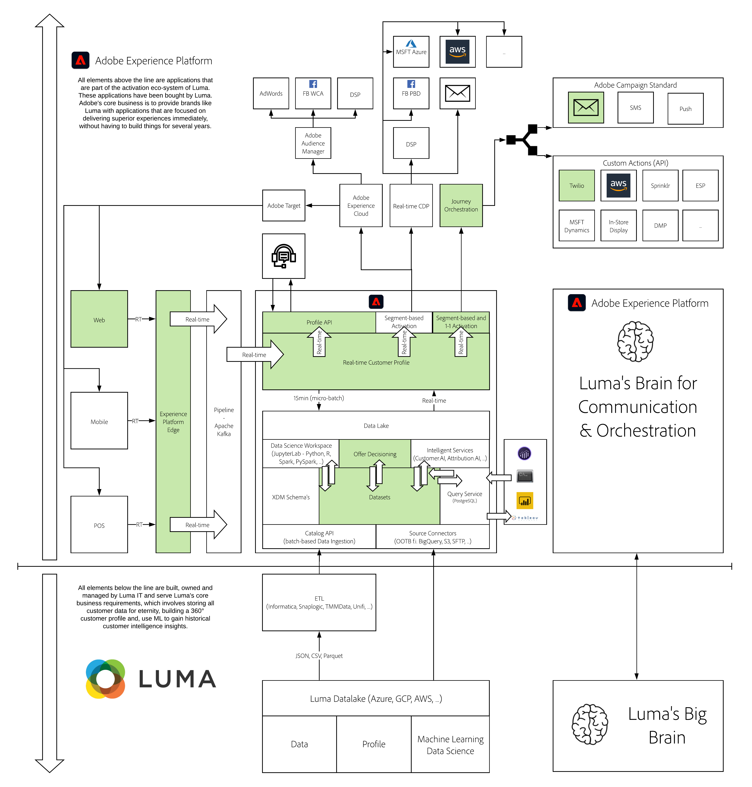

# 14. Offer Decisioning

**Authors: [Rob In der Maur](https://www.linkedin.com/in/ridmaur/), [Wouter Van Geluwe](https://www.linkedin.com/in/woutervangeluwe/)**

In this module, you will get a hands-on walkthrough of Adobe Experience Platform Offer Decisioning.

The Adobe Experience Platform Offer Decisioning Application Service provides the ability to create personalized offers and deliver them in an orchestrated way to all destinations that are linked to Adobe Experience Platform.

With Offer Decisioning, you can determine the best option from a set of available choices. These options could be offers, product recommendations, content components for a web experience, conversation scripts, and actions to take. 

Please watch this video to understand the value and customer journey:

>[!VIDEO](https://video.tv.adobe.com/v/328829?quality=12&learn=on)

## Learning Objectives

- Understand basic terminology used as part of Offer Decisioning,
- Understand how to configure the Offer Decisioning application service to impact real-life customer journeys.

## Prerequisites

- Access to Adobe Experience Platform: [https://experience.adobe.com/platform](https://experience.adobe.com/platform) 
- Access to Offer Decisioning

>[!IMPORTANT]
>
>This tutorial was created to facilitate a particular workshop format. It uses specific systems and accounts to which you might not have access. Even without access, we think you can still learn a lot by reading through this very detailed content. If you're a participant in one of the workshops and need your access credentials, please contact your Adobe representative who will provide you with the required information.

## Architecture Overview

Have a look at the below architecture, which highlights the components that will be discussed and used in this module.

## Sandbox to use

For this module, please use this sandbox: `--aepSandboxId--`.

>[!NOTE]
>
>Don't forget to install, configure and use the Chrome Extension as referenced in [0.6 - Install the Chrome extension for the Experience League documentation](../module0/ex6.md)

## Exercises

[14.1 Offer Decisioning 101](./ex1.md)

In this exercise you'll get a better understanding of all the different concepts of Offer Decisioning, and how to access Offer Decisioning in Adobe Experience Platform.

[14.2 Configure your Offers and Decision](./ex2.md)

In this exercise you'll configure your own Personalized Offers and your own Decision, which will then be published.

[14.3 Prepare your Adobe Experience Platform Data Collection Client property and Web SDK setup for Offer Decisioning](./ex3.md)

In this exercise you'll use the demo website to test your Decision.

[14.4 Test your Decision using the demo website](./ex4.md)

In this exercise you'll use the demo website to test your Decision.

[14.5 Test your Decision using the API](./ex5.md)

In this exercise you'll use Postman and the Adobe Experience Platform API's to test your Decision.

[14.6 Test your Decision using Journey Orchestration](./ex6.md)

In this exercise you'll use Postman and the Adobe Experience Platform API's to test your Decision.

[Summary and benefits](./summary.md)

Summary of this module and overview of the benefits.

>[!NOTE]
>
>Thank you for investing your time in learning all there is to know about Adobe Experience Platform. If you have questions, want to share general feedback of have suggestions on future content, please contact Wouter Van Geluwe directly, by sending an email to **vangeluw@adobe.com**.

[Go Back to All Modules](../../overview.md)
