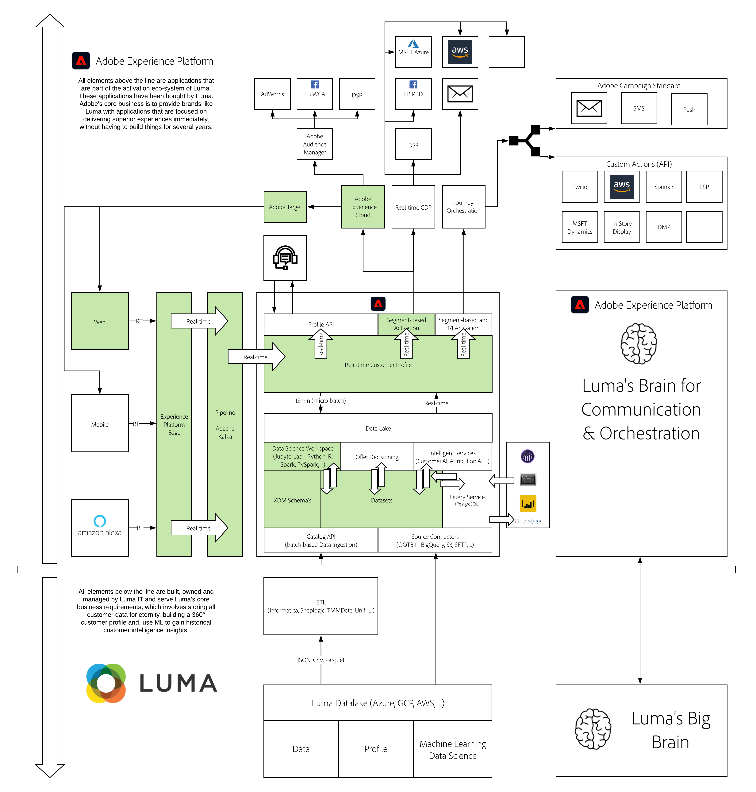

# 15. Data Science Workspace - Car Insurance Sales Propensity

In this module, you'll learn basic Data Science concepts, and also, how to use Adobe Experience Platform Data Science Workspace to build a Car Insurance Sales Propensity Model, schedule the model to re-train, and prepare the model for Real-time Scoring.

Please watch this video to understand the value, customer journey and configuration process:

>[!VIDEO](https://video.tv.adobe.com/v/35498?quality=12&learn=on)

## Learning Objectives

In this module, you'll...

- Understand the **MUTUAL365** real-time machine Learning use-case
- Learn how to use Anaconda and a local JupyterLab instance to interact with data in Adobe Experience Platform for building an ML Model
- Learn how to operationalize an ML model by creating a recipe to then train and score that recipe.
- Learn how to publish a recipe as a service for recurring, automated training.

## Prerequisites

- Access to Adobe Experience Platform: [https://experience.adobe.com/platform](https://experience.adobe.com/platform) 
- Access to Anaconda (you will install it in Exercise 15.2)
- **Download these assets**: 
  - [JSON - Sample Data: Car Insurance Interactions](./../../assets/json/m15_carinsurance.json)

>[!IMPORTANT]
>
>This tutorial was created to facilitate a particular workshop format. It uses specific systems and accounts to which you might not have access. Even without access, we think you can still learn a lot by reading through this very detailed content. If you're a participant in one of the workshops and need your access credentials, please contact your Adobe representative who will provide you with the required information.

## Architecture Overview

Have a look at the below architecture, which highlights the components that will be discussed and used in this module.

## Business Context

MUTUAL365 is a typical Insurance Company with a big offline dealer-network and a website with lots of traffic.

MUTUAL365 has been trying to personalize their digital communication for years, but it’s very hard to personalize anything if you don’t know to whom you’re speaking. As most of the traffic on the website is from unknown, anonymous users who only visit the website once or twice, it’s difficult for MUTUAL365 to build out a deep customer profile.

Most of these unknown, anonymous visitors only come to the website with one goal: get a quick indication of the cost of an insurance, by filling out a form which then gives them an idea of the insurance cost.

Because of this limited amount of information, MUTUAL365 has a hard time optimizing any kind of digital campaign which leads to prospects being bombarded with irrelevant and inconsistent messaging.

As a consequence, MUTUAL365 can’t understand which customer are interesting targets and which customers aren’t, they’re unable to optimize their ad spend and they’re unable to understand which channels are best used to interact with any given customer.

## Sandbox to use

For this module, please use this sandbox: `--aepSandboxId--`.

>[!NOTE]
>
>Don't forget to install, configure and use the Chrome Extension as referenced in [0.6 - Install the Chrome extension for the Experience League documentation](../module0/ex6.md)

## Exercises

[15.1 Introduction to MUTUAL365](./ex1.md)

Learn how to use the MUTUAL365 Demo Brand and how to demo the Real-time ML Use-Case.

[15.2 Interact with data in Adobe Experience Platform from a local JupyterLab environment](./ex2.md)

Install Anaconda on your local machine so you can run Jupyter Notebooks on your local machine, to then interact with the data in Adobe Experience Platform through the Query Service.

[15.3 Operationalize your model using a Recipe](./ex3.md)

Take your model and operationalize it in Adobe Experience Platform by creating a recipe.

[15.4 Train and Score your Recipe](./ex4.md)

Train and score your recipe without having to touch code again.

[15.5 Publish your Recipe as a Scheduled Service](./ex5.md)

Select your best experiment and Publish it as a Scheduled Service which will score customers and their propensity to buy on a recurring basis.

[Summary and benefits](./summary.md)

Summary of this module and overview of the benefits.

### FAQ

Go to [FAQ](./qa.md)

>[!NOTE]
>
>Thank you for investing your time in learning all there is to know about Adobe Experience Platform. If you have questions, want to share general feedback of have suggestions on future content, please contact Wouter Van Geluwe directly, by sending an email to **vangeluw@adobe.com**.

[Go Back to All Modules](../../overview.md)
