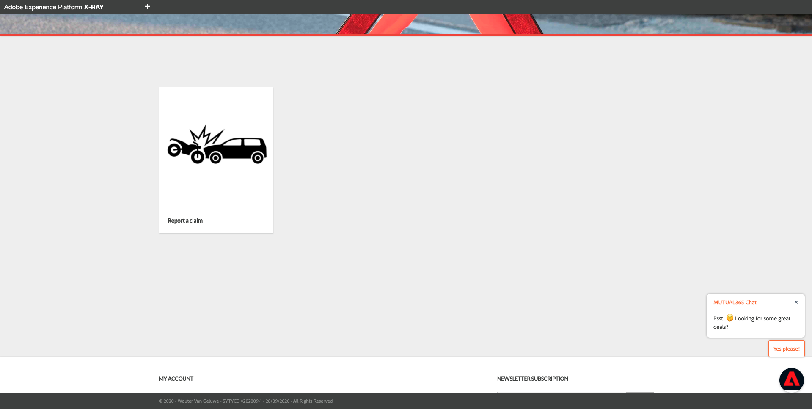

# 15.1 Introduction to MUTUAL365

In this exercise, you'll learn how to use the MUTUAL365 demo brand and how to demo the real-time ML use-case.

## Business Context

MUTUAL365 is a typical insurance company with a big offline dealer-network and a website with lots of traffic.

MUTUAL365 has been trying to personalize their digital communication for years, but it’s very hard to personalize anything if you don’t know to whom you’re speaking. As most of the traffic on the website is from unknown, anonymous users who only visit the website once or twice, it’s difficult for MUTUAL365 to build out a deep customer profile.

Most of these unknown, anonymous visitors only come to the website with one goal: get a quick indication of the cost of an insurance, by filling out a form which then gives them an idea of the insurance cost.

Because of this limited amount of information, MUTUAL365 has a hard time optimizing any kind of digital campaign which leads to prospects being bombarded with irrelevant and inconsistent messaging.

As a consequence, MUTUAL365 can’t understand which customer are interesting targets and which customers aren’t, they’re unable to optimize their ad spend and they’re unable to understand which channels are best used to interact with any given customer.

Let's have a look at the demo scenario.

## Demo Scenario

Open a new, clean incognito browser window and go to [https://public.aepdemo.net](https://public.aepdemo.net). 

You'll then see this. 

Enter your Configuration ID and click **Load Configuration**. Your configuration is then loaded.

Scroll down and click **Save Configuration**.

You'll then be redirected to the Admin homepage. Go to **Select LDAP**.

Select your LDAP and click **Save**.

You'll then be redirected to the Admin homepage. Go to **Select Brand**.

Select the brand **MUTUAL365** and click **Save**.

You'll then be redirected to the Admin homepage. Click the **MUTUAL365** logo.

You'll then see the MUTUAL365 homepage.

From the MUTUAL365 homepage, scroll down to see the MUTUAL365 **product** that allows you to report a claim.

The **MUTUAL365** - demo brand also allows you to visit pages like **Car Insurance**, **Travel Insurance** and **Household Insurance**.

Go to the **Car Insurance** page.

Go back to the MUTUAL365 homepage and open the Xray-panel, go to Experience Events.

**MUTUAL365** offers a standard template for the Insurance-industry, which includes a Car Insurance Simulator and also, Sensei Services with Real-time Machine Learning (RTML).

Let's have a look at that template. Click on the **Get A Car Insurance Quote** menu option.

You'll then be redirected to the **Get A Car Insurance Quote** page and you'll be able to start the Car Insurance process.

Just like in reality, at this moment, you're an unknown, anonymous customer to **MUTUAL365**. Unknown customers do Car Insurance simulations every day and it's important for any insurance company to react in an intelligent way to this specific customer behavior.

To react in an intelligent way, **MUTUAL365** has implemented Adobe Experience Platform Data Science Workspace and has a real-time Sales Prediction model running. The Sales Prediction model will look at all available information, like all of the form fields a customer has filled out and will combine this with any other temporal, behavioral or device data. Obviously, if MUTUAL365 has seen this customer on their website before, they'll have more information available for this customer which will make any ML model even better.

This unknown, anonymous customer decides to fill out the fields on this form (you can use the default values which are pre-populated on the form) and clicks **Get Quote**.

By clicking **Get Quote**, the customer is presented with the different Insurance types and their price.
Also, by clicking **Get Quote**, an Experience Event for this Car Insurance Get Quote-action is sent to Adobe Experience Platform and will be taken into account by the Sales Prediction model in real-time.

If you wish, you may decide to simulate a Car Insurance Purchase by pushing the **Purchase** button.

Go back to the MUTUAL365 homepage, open the X-ray panel and go to Sensei Services.
As you can see, a Car Insurance Sales Prediction score was calculated based on the information you provided on the **Get Quote**-form. In this example, the propensity score is **75**.

Every change in the information you provide on the form will influence the score in real-time, so if you wish, please go back to the **Get Quote**-form and fill out different information, followed by clicking the **Get Quote** button.

Additionally, you'll also find your Car Insurance Experience Events in the Experience Events - section of X-ray.

And finally, based on the calculated propensity score, you'll also see specific segments qualify. In this example, this anonymous customer now qualifies for the segment **- Car Insurance Sales Propensity 60-80**.

This segment qualification can then be shared through the bi-directional segment sharing connector between Adobe Experience Platform and Adobe Experience Cloud, which means that solutions like Adobe Audience Manager and Adobe Target are now able to use that segment qualification and deliver an alternative, more personal experience to the customer.

Next Step: [15.2 Interact with data in Adobe Experience Platform from a local JupyterLab environment](./ex2.md)

[Go Back to Module 15](./data-science-workspace-car-insurance-sales-propensity.md)

[Go Back to All Modules](../../overview.md)
