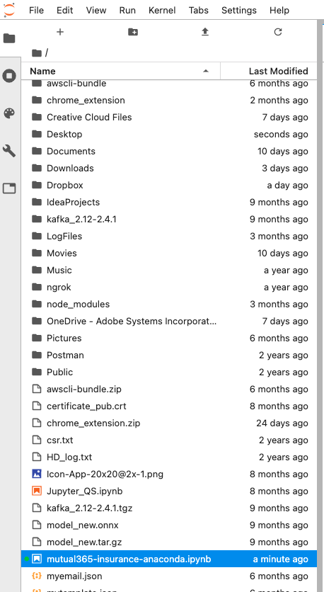
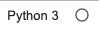

# 15.2 Interact with data in Adobe Experience Platform from a local JupyterLab environment

In this exercise, you'll install Anaconda on your local machine so you can run Jupyter Notebooks on your local machine, to then interact with the data in Adobe Experience Platform through the Query Service.

## Business Context

With Adobe Experience Platform Data Science Workspace we're making Jupyter Notebooks available natively on top of Adobe Experience Platform. With this, Data Scientists can now read data from and write data to Platform natively.

Many data scientists however still prefer to work on their local machines for data exploration and model building. This is a pattern that Adobe Experience Platform also supports through Adobe Experience Platform Query Service. With this, data scientists can load data from Platform directly in their local environment of choice.

## Prerequisites

For this exercise, we're using **Anaconda Navigator** which you can download and install from [here](https://docs.anaconda.com/anaconda/install/).

If you're using a MacBook, please make sure to have **brew** installed. You can find installation instructions for **brew** here: [https://brew.sh/](https://brew.sh/)

Also, after installing **brew**, you'll need to install the **postgres** package, by running the **brew install postgres** command in a Terminal window.


The following are alternative ways to make sure you have the required packages installed on your machine:

Run this command in a Terminal window: (try these commands first)

- **sudo easy_install pip**
- **pip install psycopg2-binary**

Run this command in a Terminal window:

- **conda install psycopg2**

Run these 2 commands in a Terminal window:

- **$ /opt/anaconda3/bin/python -m pip install ipykernel**
- **$ /opt/anaconda3/bin/python -m  ipykernel install**

## Use Anaconda

After installing Anaconda, open Anaconda and you'll see the below page.


Click on the **Launch** button for JupyterLab.


After that, your browser should open and show you the JupyterLab start page.
Open a new **Python 3** notebook by clicking the below button as indicated.


You'll then have a new, empty notebook.


You'll then have a blank, empty new Python 3 notebook. Before you continue, give your notebook a descriptive name. Right-click on the **Untitled.ipynb** file and click **Rename**.


Enter **mutual365-insurance-anaconda.ipynb** as the name for your notebook and hit **Enter**. You'll then have this:



### Load Libraries

This cell will download and install 2 external libraries that are required to support **PostgreSQL**. Executing this cell the first time may take a couple of minutes.

FYI: if you get an error on loading **psycopg2**, you will need to install **postgres** on your computer by opening a terminal window and executing the command **brew install postgres** (which assumes you have 'brew' already installed on your MacBook).

Click in the first empty cell in the notebook.


Copy the below code and paste it in the first cell in your notebook.

```python
!pip install --user psycopg2-binary
!pip install --user sql_magic

import sys
import pprint
import psycopg2
```

You'll then have this in cell 1:


Click the **Play** icon to execute this cell. If you run into an error with this cell, please verify the alternative ways of installing postgres as mentioned above in the  **Prerequisites** section.


Wait until the indicator looks like this before continuing:



The result looks like this:


### Configure Query Service Connection Details

In this step, you need to connect to Query Service. 

Scroll down and click in the next empty cell.


Copy the below code and paste it in the first cell in your notebook.

```python
# Copy these settings from https://platform.adobe.com/query/configuration
connection = psycopg2.connect(
    sslmode='require',
     host='',
     port='80',
     dbname='prod:all',
     user='',
     password='')
```

In order to connect, you'll have to update the following fields in the above code based on the information you can find inside Adobe Experience Platform.

- host
- port
- dbname
- user
- password

To retrieve these settings from Query Service, go into Adobe Experience Platform, to **Queries** > **Credentials** > **Postgres Credentials**.


After copying the above code and updating the fields as indicated, you should have something like this:


Click the **Play** icon to execute this cell. This might take a couple of seconds.


Wait until the indicator looks like this before continuing:


### Enable SQL

In this step, you'll enable SQL in your notebook. 

Scroll down and click in the next empty cell.


Copy the below code and paste it in the first cell in your notebook.

```python
# Enable sql magic
%load_ext sql_magic
%config SQL.conn_name = 'connection'
```

You should now have something like this:


Click the **Play** icon to execute this cell. This might take a couple of seconds.


Wait until the indicator looks like this before continuing:


### Show Tables

In this step, you'll start interacting with datasets in Adobe Experience Platform from your local Anaconda environment and Jupyter Notebook. 

Scroll down and click in the next empty cell.


Copy the below code and paste it in the first cell in your notebook.

```python
%%read_sql
show tables
```

You should now have something like this:


Click the **Play** icon to execute this cell. This might take a couple of seconds.


Wait until the indicator looks like this before continuing:


You'll then see all available datasets in Adobe Experience Platform being returned on your local Anaconda environment and Jupyter Notebook.


### Load Car Insurance Interactions into a data-frame-

Go to the next cell. In this cell you'll load specific fields from the **Demo System - Event Dataset for Website (Global v1.1)** dataset from Adobe Experience Platform into a data-frame. 

Scroll down and click in the next empty cell.


Copy the below code and paste it in the first cell in your notebook.

```sql
%%read_sql df_result
SELECT  --aepTenantId--.identification.core.ecid as ecid,
        --aepTenantId--.interactionDetails.insurance.car.numberKm as km,
        --aepTenantId--.interactionDetails.insurance.car.type as cartype,
        --aepTenantId--.interactionDetails.insurance.car.customerAge as age,
        --aepTenantId--.interactionDetails.insurance.car.customerGender as gender,
        --aepTenantId--.interactionDetails.insurance.car.brand as carbrand,
        --aepTenantId--.interactionDetails.insurance.car.leasing as leasing,
        --aepTenantId--.interactionDetails.insurance.car.customerCity as city,
        --aepTenantId--.interactionDetails.insurance.car.customerCountry as country,
        --aepTenantId--.interactionDetails.insurance.car.customerNationality as nationality,
        --aepTenantId--.interactionDetails.insurance.car.isCustomerPrimaryDriver as primaryuser,
        --aepTenantId--.interactionDetails.insurance.car.hasCustomerPurchased as purchase,
        --aepTenantId--.interactionDetails.insurance.car.priceBasic as pricequote,
        timestamp
FROM demo_system_event_dataset_for_website_global_v1_1
WHERE --aepTenantId--.interactionDetails.insurance.car.type <> ''
```

You should now have something like this:


Click the **Play** icon to execute this cell. This might take a couple of minutes.


Wait until the indicator looks like this before continuing:


You'll then see a similar result:


The **Demo System - Event Dataset for Website (Global v1.1)** dataset is now assigned to a data-frame, and now a data scientist can continue Exploration, Visualization and Model Development based on this data-frame on their local computer using Anaconda and Query Service.

Next Step: [15.3 Operationalize your model using a Recipe](./ex3.md)

[Go Back to Module 15](./data-science-workspace-car-insurance-sales-propensity.md)

[Go Back to All Modules](../../overview.md)
