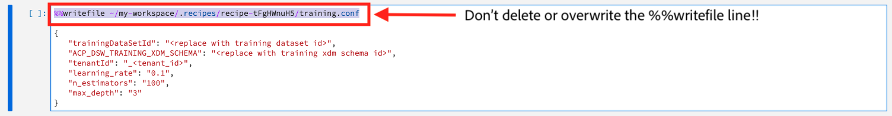
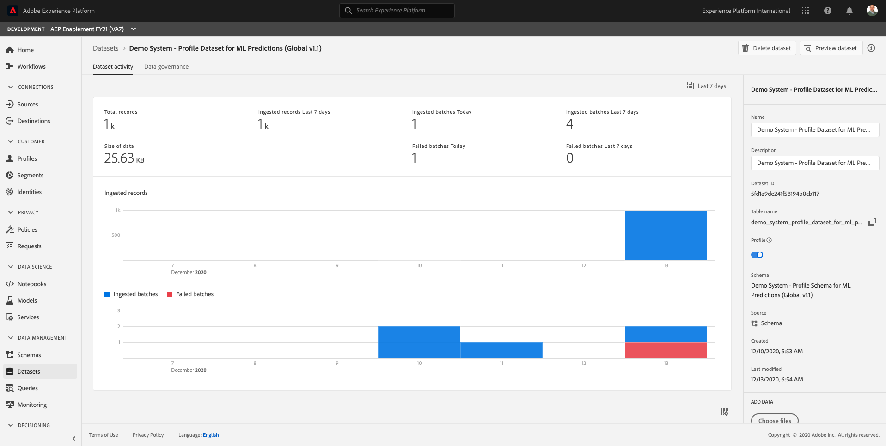

# 15.3 Operationalize your model using a Recipe

In this exercise, you'll take your model and operationalize it in Adobe Experience Platform by creating a recipe.

The recipe builder notebook templatizes your model to automatically package and operationalize it. The notebook has multiple templated cells that you fit your model code into:

- The requirements and configuration cells allow you to add additional libraries and configure datasets and tuning parameters for your model
- The evaluator cell enables you to split your data and evaluate the performance of your model
- The training and scoring data loader cells allow you to load the data you need for training and scoring
- Finally, the pipeline cell contains logic required for both training and scoring your model.

We have streamlined the steps needed to operationalize a model by giving you the ability to train, evaluate and score it at scale and then package it in one seamless flow on Adobe Experience Platform. Packaging to a Recipe also allows you to use the same code with different datasets to power different use cases in your organizations. Our specific use case revolves around using the recommendations model code for users searching for products to purchase on the website.

Log in to Adobe Experience Platform by going to this URL: [https://experience.adobe.com/platform](https://experience.adobe.com/platform).

After logging in, you'll land on the homepage of Adobe Experience Platform.


Before you continue, you need to select a **sandbox**. The sandbox to select is named ``--aepSandboxId--``. You can do this by clicking the text **[!UICONTROL Production Prod]** in the blue line on top of your screen.


After selecting the appropriate sandbox, you'll see the screen change and now you're in your dedicated sandbox.


In Adobe Experience Platform, click on **[!UICONTROL Notebooks]** in the menu on the left side of your screen, and then go to **[!UICONTROL JupyterLab]**.


In Jupyter Notebooks, open the **Launcher** page by clicking the **+** icon in the taskbar.


You'll then see this:


Open a blank **Recipe Builder** notebook by clicking the Recipe Builder button on the Launcher.


You'll then have a blank, empty new Recipe Builder notebook. Before you continue, give your notebook a descriptive name. Right-click on the **[Python 3] Recipe Builder.ipynb** file and click **Rename**.


Enter **mutual365-insurance-sales-propensity.ipynb** as the name for your notebook and hit **Enter**. You'll then have this:


In this notebook, you'll do the following:

- Train a model
- Score a model
- Create a recipe from the model

Let's configure all steps in detail.

## Configuration Files

Scroll down in the Recipe Builder notebook until you see **Configuration Files**.


You now need to update the cells for **Training Configuration** and **Scoring Configuration**.

### Training Configuration

Click in the cell for **Training Configuration**. 

Before you do anything, please pay attention!! Whatever you do, don't delete or overwrite the line that starts with **%%writefile**. This line is required by the Recipe Builder notebook.

```python
%%writefile ~/my-workspace/.recipes/recipe-tFgHWnuH5/training.conf
```



You'll also see similar code in that same cell:

```python
{
   "trainingDataSetId": "<replace with training dataset id>",
   "ACP_DSW_TRAINING_XDM_SCHEMA": "<replace with training xdm schema id>",
   "tenantId": "_<tenant_id>", 
   "learning_rate": "0.1",
   "n_estimators": "100",
   "max_depth": "3"
}
```

Replace that code by this code:

```python
{
    "trainingDataSetId": "--aepCarInsuranceInteractionsDatasetId--",
    "ACP_DSW_TRAINING_XDM_SCHEMA": "https://ns.adobe.com/--aepTenantIdSchema--/schemas/--aepCarInsuranceInteractionsSchemaRef--",
    "train_records_limit":1000000,
    "n_estimators": "80",
    "max_depth": "5",
    "ten_id": "--aepTenantId--"
}
```

>[!IMPORTANT]
>
>The environment variables **aepCarInsuranceInteractionsDatasetId** and **aepCarInsuranceInteractionsSchemaRef** refer to a dataset ID of dataset that has been created in your Adobe Experience Platform instance and to a schema ref ID of a schema that has been created in your Adobe Experience Platform Instance. 
>
>**aepCarInsuranceInteractionsDatasetId** refers to the dataset ID of the dataset **Demo System - Event Dataset for Website (Global v1.1)**, **aepCarInsuranceInteractionsSchemaRef** refers to the Schema Ref ID of the schema **Demo System - Event Schema for Website (Global v1.1)**. Replace the environment variables by the dataset ID and Schema Ref ID when you paste the code in the **Training Configuration** cell in your notebook.

You should now have something similar in the **Training Configuration** cell:


### Scoring Configuration

Click in the cell for **Scoring Configuration**. 

Before you do anything, please pay attention!! Whatever you do, don't delete or overwrite the line that starts with **%%writefile**. This line is required by the Recipe Builder notebook.

```python
%%writefile ~/my-workspace/.recipes/recipe-tFgHWnuH5/scoring.conf
```


You'll also see similar code in that same cell:

```python
{
   "scoringDataSetId": "<replace with scoring input dataset id>",
   "scoringResultsDataSetId": "<replace with scoring results dataset id>",
   "ACP_DSW_SCORING_RESULTS_XDM_SCHEMA": "<replace with scoring results xdm schema id>",
   "tenantId": "_<tenant_id>"
}
```

Replace that code by this code:

```python
{
   "scoringDataSetId": "--aepCarInsuranceInteractionsDatasetId--",
   "scoringResultsDataSetId": "--aepMlPredictionsDatasetId--",
   "ACP_DSW_SCORING_RESULTS_XDM_SCHEMA": "https://ns.adobe.com/--aepTenantIdSchema--/schemas/--aepMlPredictionsSchemaRef--",
   "ten_id": "--aepTenantId--"
}
```

>[!IMPORTANT]
>
>The environment variables **aepCarInsuranceInteractionsDatasetId**, **aepMlPredictionsDatasetId** and **aepMlPredictionsSchemaRef** refer to dataset IDs of datasets and Schema Ref ID of schemas that have been created in your Adobe Experience Platform instance. 
>
>**aepCarInsuranceInteractionsDatasetId** refers to the dataset ID of the dataset **Demo System - Event Dataset for Website (Global v1.1)**, **aepMlPredictionsDatasetId** refers to the dataset ID of the dataset **Demo System - Profile Dataset for ML Predictions (Global v1.1)**, **aepMlPredictionsSchemaRef** refers to the Schema Ref ID of the schema **Demo System - Profile Schema for ML Predictions (Global v1.1) Schema**. Replace the environment variables by the dataset ID and Schema Ref ID when you paste the code in the **Scoring Configuration** cell in your notebook.

You should now have something similar in the **Scoring Configuration** cell:


## Training Data Loader File

Scroll down in the Recipe Builder notebook until you see **Training Data Loader File**.


You now need to update the code for **Training Data Loader File**.

Before you do anything, please pay attention!! Whatever you do, don't delete or overwrite the line that starts with **%%writefile**. This line is required by the Recipe Builder notebook.


In that cell, you'll find code similar to this:

```python
import pandas as pd
from datetime import datetime, timedelta
from platform_sdk.dataset_reader import DatasetReader
from .utils import get_client_context

def load(config_properties):
    print("Training Data Load Start")

    #########################################
    # Load Data
    #########################################    
    client_context = get_client_context(config_properties)
    
    dataset_reader = DatasetReader(client_context, config_properties['trainingDataSetId'])
    
    timeframe = config_properties.get("timeframe")
    tenant_id = config_properties.get("tenant_id")
    
    if (timeframe is not None):
        date_before = datetime.utcnow().date()
        date_after = date_before - timedelta(minutes=int(timeframe))
        dataframe = dataset_reader.where(dataset_reader[tenant_id + '.date'].gt(str(date_after)).And(dataset_reader[tenant_id + '.date'].lt(str(date_before)))).read()
    else:
        dataframe = dataset_reader.read()

    if '_id' in dataframe.columns:
        #Rename columns to strip tenantId
        dataframe = dataframe.rename(columns = lambda x : str(x)[str(x).find('.')+1:])
        #Drop id and timestamp
        dataframe.drop(['_id', 'timestamp'], axis=1, inplace=True)
    
    #########################################
    # Data Preparation/Feature Engineering
    #########################################    
    dataframe.date = pd.to_datetime(dataframe.date)
    dataframe['week'] = dataframe.date.dt.week
    dataframe['year'] = dataframe.date.dt.year

    dataframe = pd.concat([dataframe, pd.get_dummies(dataframe['storeType'])], axis=1)
    dataframe.drop('storeType', axis=1, inplace=True)
    dataframe['isHoliday'] = dataframe['isHoliday'].astype(int)

    dataframe['weeklySalesAhead'] = dataframe.shift(-45)['weeklySales']
    dataframe['weeklySalesLag'] = dataframe.shift(45)['weeklySales']
    dataframe['weeklySalesDiff'] = (dataframe['weeklySales'] - dataframe['weeklySalesLag']) / dataframe['weeklySalesLag']
    dataframe.dropna(0, inplace=True)

    dataframe = dataframe.set_index(dataframe.date)
    dataframe.drop('date', axis=1, inplace=True)

    print("Training Data Load Finish")
    return dataframe
```

Replace that code (without overwriting the **%%writefile** line) with this code:

```python
import numpy as np
import pandas as pd
from datetime import datetime, timedelta
from platform_sdk.dataset_reader import DatasetReader
from .utils import get_client_context

def load(config_properties):
    print("Training Data Load Start")

    #########################################
    # Load Data
    #########################################    
    client_context = get_client_context(config_properties)
    train_records_limit = config_properties['train_records_limit']
    
    dataset_reader = DatasetReader(client_context, config_properties['trainingDataSetId'])
    
    #timeframe = config_properties.get("timeframe")
    #tenant_id = config_properties.get("tenant_id")
    print('Reading Training Data')
    df1 = dataset_reader.limit(train_records_limit).read()
    df1.rename(columns = {config_properties['ten_id']+'.identification.core.ecid' : 'ecid',
                     config_properties['ten_id']+'.interactionDetails.insurance.car.numberKm': 'km',
                     config_properties['ten_id']+'.interactionDetails.insurance.car.type': 'cartype',
                     config_properties['ten_id']+'.interactionDetails.insurance.car.customerAge': 'age',
                     config_properties['ten_id']+'.interactionDetails.insurance.car.customerGender' : 'gender',
                     config_properties['ten_id']+'.interactionDetails.insurance.car.brand' : 'carbrand',
                     config_properties['ten_id']+'.interactionDetails.insurance.car.leasing' : 'leasing',
                     config_properties['ten_id']+'.interactionDetails.insurance.car.customerCity' : 'city',
                     config_properties['ten_id']+'.interactionDetails.insurance.car.customerCountry' : 'country',
                     config_properties['ten_id']+'.interactionDetails.insurance.car.customerNationality' : 'nationality',
                     config_properties['ten_id']+'.interactionDetails.insurance.car.isCustomerPrimaryDriver' : 'primaryuser',
                     config_properties['ten_id']+'.interactionDetails.insurance.car.hasCustomerPurchased' : 'purchase',
                     config_properties['ten_id']+'.interactionDetails.insurance.car.priceBasic' : 'pricequote'}, inplace=True)
    df1 = df1[['ecid', 'km', 'cartype', 'age', 'gender', 'carbrand', 'leasing', 'city', 
           'country', 'nationality', 'primaryuser', 'purchase', 'pricequote', 'timestamp']]
    df1 = df1.loc[df1['age'] != 0]
    
    #########################################
    # Data Rollup
    ######################################### 
    df1['timestamp'] = pd.to_datetime(df1.timestamp)
    df1['hour'] = df1['timestamp'].dt.hour.astype(int)
    df1['dayofweek'] = df1['timestamp'].dt.dayofweek
    df1.loc[(df1['purchase'] == 'true'), 'purchase'] = 1
    df1.loc[(df1['purchase'] == 'false'), 'purchase'] = 0
    df1.loc[(df1['purchase'] == ''), 'purchase'] = 0
    df1.purchase.fillna(0, inplace=True)
    df1['purchase'] = df1['purchase'].astype(int)
    
    df1.dropna(subset = ['ecid'], inplace=True)
    df1['ecid'] = df1['ecid'].astype(str)
    df_conv_dict = df1.groupby('ecid').max()[['purchase']]
    df_conv_dict = df_conv_dict.to_dict()
    
    idx = df1.groupby('ecid')['timestamp'].transform(max) == df1['timestamp']
    df1 = df1[idx]
    df1 = df1.drop_duplicates(subset = 'ecid', keep = 'last', inplace = False)
    #df1['purchase'] = df1['ecid'].map(df_conv_dict['purchase'])

    #########################################
    # Data Preparation/Feature Engineering
    #########################################      
    
    df1['carbrand'] = df1['carbrand'].str.lower()
    df1['country'] = df1['country'].str.lower()
    df1.loc[(df1['carbrand'] == 'vw'), 'carbrand'] = 'volkswagen'
    df1.loc[(df1['carbrand'] == 'citroen'), 'carbrand'] = 'cadillac'
    df1.loc[(df1['carbrand'] == 'opel'), 'carbrand'] = 'bmw'
    df1.loc[(df1['carbrand'] == 'mini'), 'carbrand'] = 'volkswagen'
    
    df1.loc[(df1['cartype'] == 'SUV / Geländewagen') | (df1['cartype'] == 'SUV / Tout terrain'), 'cartype'] = 'suv'
    df1.loc[(df1['cartype'] == 'Kleinwagen') | (df1['cartype'] == 'Untere Mittelklasse') | (df1['cartype'] == 'Mikroklasse'), 'cartype'] = 'hatchback'
    df1.loc[(df1['cartype'] == 'Mittelklasse') | (df1['cartype'] == 'Obere Mittelklasse'), 'cartype'] = 'sedan'
    df1.loc[(df1['cartype'] == 'Kompaktvan / Minivan'), 'cartype'] = 'minivan'
    df1.loc[(df1['cartype'] == 'Cabriolet / Roadster'), 'cartype'] = 'convertible'
    df1.loc[(df1['cartype'] == 'Coupé / Sportwagen'), 'cartype'] = 'coupe'
    df1.loc[(df1['cartype'] == 'dataLayerNull'), 'cartype'] = pd.np.nan
    df1.loc[(df1['cartype'] == 'Luxusklasse'), 'cartype'] = 'luxury'
    df1.loc[(df1['cartype'] == 'Strasse'), 'cartype'] = 'mpv'
    
    df1.loc[(df1['leasing'] == 'false'), 'leasing'] = 'no'
    df1.loc[df1['country'] == 'at', 'country'] = 'austria'
    df1.loc[(df1['leasing'] == 'dataLayerNull'), 'leasing'] = pd.np.nan
    df1.loc[(df1['gender'] == 'dataLayerNull'), 'gender'] = pd.np.nan
    df1.loc[(df1['carbrand'] == 'dataLayerNull'), 'carbrand'] = pd.np.nan

    df1['age'].fillna(df1['age'].median(), inplace=True)
    df1['gender'].fillna('notgiven', inplace=True)
    df1['leasing'].fillna('notgiven', inplace=True)
    df1['carbrand'].fillna('bmw', inplace=True)
    df1['country'].fillna('germany', inplace=True)
    df1['cartype'].fillna('na', inplace=True)
    df1['primaryuser'].fillna('na', inplace=True)
    df1['nationality'].fillna('na', inplace=True)
    df1['km'].fillna('na', inplace=True)
    
    df1['city'] = df1.groupby('country')['city'].transform(lambda x : x.fillna(x.mode()))
    #df1.dropna(subset = ['pricequote'], inplace=True)
    
    #grouping
    grouping_cols = ['carbrand', 'cartype', 'city', 'country']
    
    for col in grouping_cols:
        df_idx = pd.DataFrame(df1[col].value_counts().head(6))

        def grouping(x):
            if x in df_idx.index:
                return x
            else:
                return "Others"
        df1[col] = df1[col].apply(lambda x: grouping(x))
        
    def age(x):
        if x < 20:
            return "u20"
        elif x > 19 and x < 29:
            return "20-28"
        elif x > 28 and x < 43:
            return "29-42"
        elif x > 42 and x < 55:
            return "43-54"
        elif x > 54 and x < 65:
            return "55-64"
        elif x >= 65: 
            return "65+"
        else: 
            return "Others"
        
    df1['age'] = df1['age'].astype(int)
    df1['age_bucket'] = df1['age'].apply(lambda x: age(x))
    
    df_final = df1[['hour', 'dayofweek','age_bucket', 'gender', 'city',  
       'country', 'carbrand', 'cartype', 'leasing', 'pricequote', 'purchase']]
    
    cat_cols = ['age_bucket', 'gender', 'city', 'dayofweek', 'country', 'carbrand', 'cartype', 'leasing']
    df_final = pd.get_dummies(df_final, columns = cat_cols)
    
    dataframe = df_final.copy()
    
    df_final.head(20)
 
    print("Training Data Load Finish")
    return dataframe
```

You should now have something similar in the **Training Data Loader File** cell:


## Scoring Data Loader File

Scroll down in the Recipe Builder notebook until you see **Scoring Data Loader File**.


You now need to update the code for **Scoring Data Loader File**.

Before you do anything, please pay attention!! Whatever you do, don't delete or overwrite the line that starts with **%%writefile**. This line is required by the Recipe Builder notebook.


In that cell, you'll find code similar to this:

```python
import pandas as pd
from datetime import datetime, timedelta
from .utils import get_client_context
from platform_sdk.dataset_reader import DatasetReader

def load(config_properties):

    print("Scoring Data Load Start")

    #########################################
    # Load Data
    #########################################
    client_context = get_client_context(config_properties)

    dataset_reader = DatasetReader(client_context, config_properties['scoringDataSetId'])
    timeframe = config_properties.get("timeframe")
    tenant_id = config_properties.get("tenant_id")

    if (timeframe is not None):
        date_before = datetime.utcnow().date()
        date_after = date_before - timedelta(minutes=int(timeframe))
        dataframe = dataset_reader.where(dataset_reader[tenant_id + '.date'].gt(str(date_after)).And(dataset_reader[tenant_id + '.date'].lt(str(date_before)))).read()
    else:
        dataframe = dataset_reader.read()
        print(dataframe)

    #########################################
    # Data Preparation/Feature Engineering
    #########################################
    if '_id' in dataframe.columns:
        #Rename columns to strip tenantId
        dataframe = dataframe.rename(columns = lambda x : str(x)[str(x).find('.')+1:])
        #Drop id and timestamp
        dataframe.drop(['_id', 'timestamp'], axis=1, inplace=True)

    dataframe.date = pd.to_datetime(dataframe.date)
    dataframe['week'] = dataframe.date.dt.week
    dataframe['year'] = dataframe.date.dt.year

    dataframe = pd.concat([dataframe, pd.get_dummies(dataframe['storeType'])], axis=1)
    dataframe.drop('storeType', axis=1, inplace=True)
    dataframe['isHoliday'] = dataframe['isHoliday'].astype(int)

    dataframe['weeklySalesAhead'] = dataframe.shift(-45)['weeklySales']
    dataframe['weeklySalesLag'] = dataframe.shift(45)['weeklySales']
    dataframe['weeklySalesDiff'] = (dataframe['weeklySales'] - dataframe['weeklySalesLag']) / dataframe['weeklySalesLag']
    dataframe.dropna(0, inplace=True)

    dataframe = dataframe.set_index(dataframe.date)
    dataframe.drop('date', axis=1, inplace=True)

    print("Scoring Data Load Finish")

    return dataframe
```

Replace that code (without overwriting the **%%writefile** line) with this code:

```python
import pandas as pd
from datetime import datetime, timedelta
from .utils import get_client_context
from platform_sdk.dataset_reader import DatasetReader

def load(config_properties):

    print("Scoring Data Load Start")

    #########################################
    # Load Data
    #########################################    
    client_context = get_client_context(config_properties)
    
    dataset_reader = DatasetReader(client_context, config_properties['scoringDataSetId'])
    
    #timeframe = config_properties.get("timeframe")
    #tenant_id = config_properties.get("tenant_id")
    df1 = dataset_reader.read()
    df1.rename(columns = {config_properties['ten_id']+'.identification.core.ecid' : 'ecid',
                     config_properties['ten_id']+'.interactionDetails.insurance.car.numberKm': 'km',
                     config_properties['ten_id']+'.interactionDetails.insurance.car.type': 'cartype',
                     config_properties['ten_id']+'.interactionDetails.insurance.car.customerAge': 'age',
                     config_properties['ten_id']+'.interactionDetails.insurance.car.customerGender' : 'gender',
                     config_properties['ten_id']+'.interactionDetails.insurance.car.brand' : 'carbrand',
                     config_properties['ten_id']+'.interactionDetails.insurance.car.leasing' : 'leasing',
                     config_properties['ten_id']+'.interactionDetails.insurance.car.customerCity' : 'city',
                     config_properties['ten_id']+'.interactionDetails.insurance.car.customerCountry' : 'country',
                     config_properties['ten_id']+'.interactionDetails.insurance.car.customerNationality' : 'nationality',
                     config_properties['ten_id']+'.interactionDetails.insurance.car.isCustomerPrimaryDriver' : 'primaryuser',
                     config_properties['ten_id']+'.interactionDetails.insurance.car.hasCustomerPurchased' : 'purchase',
                     config_properties['ten_id']+'.interactionDetails.insurance.car.priceBasic' : 'pricequote'}, inplace=True)
    df1 = df1[['ecid', 'km', 'cartype', 'age', 'gender', 'carbrand', 'leasing', 'city', 
           'country', 'nationality', 'primaryuser', 'purchase', 'pricequote', 'timestamp']]
    df1 = df1.loc[df1['age'] != 0]
    
    #########################################
    # Data Rollup
    ######################################### 
    df1['timestamp'] = pd.to_datetime(df1.timestamp)
    df1['hour'] = df1['timestamp'].dt.hour.astype(int)
    df1['dayofweek'] = df1['timestamp'].dt.dayofweek
    
    df1.loc[(df1['purchase'] == 'true'), 'purchase'] = 1
    df1.loc[(df1['purchase'] == 'false'), 'purchase'] = 0
    df1.loc[(df1['purchase'] == ''), 'purchase'] = 0
    df1.purchase.fillna(0, inplace=True)
    df1['purchase'] = df1['purchase'].astype(int)
    
    df1.dropna(subset = ['ecid'], inplace=True)
    df1['ecid'] = df1['ecid'].astype(str)
    df_conv_dict = df1.groupby('ecid').max()[['purchase']]
    df_conv_dict = df_conv_dict.to_dict()
    
    idx = df1.groupby('ecid')['timestamp'].transform(max) == df1['timestamp']
    df1 = df1[idx]
    df1 = df1.drop_duplicates(subset = 'ecid', keep = 'last', inplace = False)
    df1['purchase'] = df1['ecid'].map(df_conv_dict['purchase'])
    
    #########################################
    # Data Preparation/Feature Engineering
    #########################################      
    
    df1['carbrand'] = df1['carbrand'].str.lower()
    df1['country'] = df1['country'].str.lower()
    df1.loc[(df1['carbrand'] == 'vw'), 'carbrand'] = 'volkswagen'
    df1.loc[(df1['carbrand'] == 'citroen'), 'carbrand'] = 'cadillac'
    df1.loc[(df1['carbrand'] == 'opel'), 'carbrand'] = 'bmw'
    df1.loc[(df1['carbrand'] == 'mini'), 'carbrand'] = 'volkswagen'
    
    df1.loc[(df1['cartype'] == 'SUV / Geländewagen') | (df1['cartype'] == 'SUV / Tout terrain'), 'cartype'] = 'suv'
    df1.loc[(df1['cartype'] == 'Kleinwagen') | (df1['cartype'] == 'Untere Mittelklasse') | (df1['cartype'] == 'Mikroklasse'), 'cartype'] = 'hatchback'
    df1.loc[(df1['cartype'] == 'Mittelklasse') | (df1['cartype'] == 'Obere Mittelklasse'), 'cartype'] = 'sedan'
    df1.loc[(df1['cartype'] == 'Kompaktvan / Minivan'), 'cartype'] = 'minivan'
    df1.loc[(df1['cartype'] == 'Cabriolet / Roadster'), 'cartype'] = 'convertible'
    df1.loc[(df1['cartype'] == 'Coupé / Sportwagen'), 'cartype'] = 'coupe'
    df1.loc[(df1['cartype'] == 'dataLayerNull'), 'cartype'] = pd.np.nan
    df1.loc[(df1['cartype'] == 'Luxusklasse'), 'cartype'] = 'luxury'
    df1.loc[(df1['cartype'] == 'Strasse'), 'cartype'] = 'mpv'
    
    df1.loc[(df1['leasing'] == 'false'), 'leasing'] = 'no'
    df1.loc[df1['country'] == 'at', 'country'] = 'austria'
    df1.loc[(df1['leasing'] == 'dataLayerNull'), 'leasing'] = pd.np.nan
    df1.loc[(df1['gender'] == 'dataLayerNull'), 'gender'] = pd.np.nan
    df1.loc[(df1['carbrand'] == 'dataLayerNull'), 'carbrand'] = pd.np.nan

    df1['age'].fillna(df1['age'].median(), inplace=True)
    df1['gender'].fillna('notgiven', inplace=True)
    df1['leasing'].fillna('notgiven', inplace=True)
    df1['carbrand'].fillna('bmw', inplace=True)
    df1['country'].fillna('germany', inplace=True)
    df1['cartype'].fillna('na', inplace=True)
    df1['primaryuser'].fillna('na', inplace=True)
    df1['nationality'].fillna('na', inplace=True)
    df1['km'].fillna('na', inplace=True)
    
    df1['city'] = df1.groupby('country')['city'].transform(lambda x : x.fillna(x.mode()))
    df1.dropna(subset = ['pricequote'], inplace=True)
    
    #grouping
    grouping_cols = ['carbrand', 'cartype', 'city', 'country']
    
    for col in grouping_cols:
        df_idx = pd.DataFrame(df1[col].value_counts().head(6))

        def grouping(x):
            if x in df_idx.index:
                return x
            else:
                return "Others"
        df1[col] = df1[col].apply(lambda x: grouping(x))
        
    def age(x):
        if x < 20:
            return "u20"
        elif x > 19 and x < 29:
            return "20-28"
        elif x > 28 and x < 43:
            return "29-42"
        elif x > 42 and x < 55:
            return "43-54"
        elif x > 54 and x < 65:
            return "55-64"
        elif x >= 65: 
            return "65+"
        else: 
            return "Others"
        
    df1['age'] = df1['age'].astype(int)
    df1['age_bucket'] = df1['age'].apply(lambda x: age(x))
    
    df_final = df1[['ecid', 'hour', 'dayofweek','age_bucket', 'gender', 'city',  
       'country', 'carbrand', 'cartype', 'leasing', 'pricequote']]
    
    #cat_cols = ['age_bucket', 'gender', 'city', 'dayofweek', 'country', 'carbrand', 'cartype', 'leasing']
    #df_final = pd.get_dummies(df_final, columns = cat_cols)
    
    dataframe = df_final.copy()

    print("Scoring Data Load Finish")

    return dataframe
```

You should now have something similar in the **Scoring Data Loader File** cell:


## Pipeline File

Scroll down in the Recipe Builder notebook until you see **Pipeline File**.


You now need to update the code for **Pipeline File**.

Before you do anything, please pay attention!! Whatever you do, don't delete or overwrite the line that starts with **%%writefile**. This line is required by the Recipe Builder notebook.


In that cell, you'll find code similar to this:

```python
from sklearn.ensemble import GradientBoostingRegressor

def train(config_properties, data):

    print("Train Start")

    #########################################
    # Extract fields from configProperties
    #########################################
    learning_rate = float(config_properties['learning_rate'])
    n_estimators = int(config_properties['n_estimators'])
    max_depth = int(config_properties['max_depth'])


    #########################################
    # Fit model
    #########################################
    X_train = data.drop('weeklySalesAhead', axis=1).values
    y_train = data['weeklySalesAhead'].values

    seed = 1234
    model = GradientBoostingRegressor(learning_rate=learning_rate,
                                      n_estimators=n_estimators,
                                      max_depth=max_depth,
                                      random_state=seed)

    model.fit(X_train, y_train)
    print("Train Complete")
    return model

def score(config_properties, data, model):

    print("Score Start")

    X_test = data.drop('weeklySalesAhead', axis=1).values
    y_test = data['weeklySalesAhead'].values
    y_pred = model.predict(X_test)

    data['prediction'] = y_pred
    data = data[['store', 'prediction']].reset_index()
    data['date'] = data['date'].astype(str)

    print("Score Complete")
    return data
```

Replace that code (without overwriting the **%%writefile** line) with this code:

```python
import pandas as pd
import numpy as np
from sklearn import metrics
from sklearn.metrics import roc_curve, auc, mean_squared_error
from sklearn.ensemble import RandomForestClassifier
import os

def underSample(data):
    conv = data[data['purchase'] > 0]
    non_conv = data[data['purchase'] == 0]
    sample_size = len(conv)
    non_sample = non_conv.sample(n = sample_size)
    frames = [conv, non_sample]
    result = pd.concat(frames)
    return result

class RandomForest():
    def __init__(self, config_properties, X, y):
        print("initiating model")
        self.n_estimators = int(config_properties['n_estimators'])
        self.max_depth = int(config_properties['max_depth'])
        self.X = X
        self.y = y
        self.features = X.columns.values.tolist()
        self.model = RandomForestClassifier(n_estimators=self.n_estimators, max_depth=self.max_depth, random_state=32)
        self.trained_model = self.model.fit(self.X,self.y)
    def train_model(self):
        print('fitting model')
        return self.model.fit(self.X,self.y)
    
    def make_tarfile(self, output_filename, source_dir):
        with tarfile.open(output_filename, "w:gz") as tar:
            tar.add(source_dir, arcname=os.path.basename(source_dir))
    
    #for generating onnx
    def generate_onnx_resources(self):        
        install_dir = os.path.expanduser('~/my-workspace')
        print("Generating Onnx")
        try:
            subprocess.check_call(["conda", "uninstall", "-y", "protobuf"])
        except:
            print("protobuf not installed via conda")
        
        subprocess.check_call(["python", '-m', 'pip', 'install', 'skl2onnx'])
        
        from skl2onnx import convert_sklearn
        from skl2onnx.common.data_types import FloatTensorType
        
        # ONNX-ification
        initial_type = [('float_input', FloatTensorType([None, self.feature_len]))]

        print("Converting Model to Onnx")
        onx = convert_sklearn(self.model, initial_types=initial_type)
             
        with open("model_new.onnx", "wb") as f:
            f.write(onx.SerializeToString())
            
        self.make_tarfile('model_new.tar.gz', 'model.onnx')
        print("Model onnx created")

def train(config_properties, data):

    print("Train Start")  
    y_train = data['purchase']
    X_train = data.drop('purchase', axis=1)
    # Fit model
    lead_score = RandomForest(config_properties, X_train, y_train)
    lead_score.train_model()

    print("Train Complete")
    
    return lead_score

def score(config_properties, data, model):

    print("Score Start")
    cat_cols = ['age_bucket', 'gender', 'city', 'dayofweek', 'country', 'carbrand', 'cartype', 'leasing']
    data = pd.get_dummies(data, columns = cat_cols)
    
    X_score = data.drop('ecid', axis=1)
    train_feats = model.features
    print(train_feats)
    
    trained_model = model.trained_model
    score_feats = X_score.columns.values.tolist()
    missing_feats = list(set(train_feats) - set(score_feats))
    extra_feats = list(set(score_feats) - set(train_feats))
    for c in extra_feats:
        X_score.drop(c, axis=1, inplace=True)
    for c in missing_feats:
        X_score[c] = 0
    X_score = X_score[train_feats]
    print(X_score.columns.values.tolist())
    y_preds = trained_model.predict_proba(X_score)[:,1]
    
    data.rename(columns = {'ecid' : config_properties['ten_id']+'.identification.core.ecid'}, inplace=True)
    
    data[config_properties['ten_id']+'.individualScoring.insurance.carInsuranceSalesPrediction'] = y_preds
    data = data[[config_properties['ten_id']+'.identification.core.ecid', config_properties['ten_id']+'.individualScoring.insurance.carInsuranceSalesPrediction']]

    print("Score Complete")
    return data
```

You should now have something similar in the **Pipeline File** cell:


## Evaluator File

Scroll down in the Recipe Builder notebook until you see **Evaluator File**.


You now need to update the code for **Evaluator File**.

Before you do anything, please pay attention!! Whatever you do, don't delete or overwrite the line that starts with **%%writefile**. This line is required by the Recipe Builder notebook.


In that cell, you'll find code similar to this:

```python
from ml.runtime.python.core.regressionEvaluator import RegressionEvaluator
import numpy as np

class Evaluator(RegressionEvaluator):
    def __init__(self):
        print ("Initiate")

    def split(self, config={}, dataframe=None):
        train_start = '2010-02-12'
        train_end = '2012-01-27'
        val_start = '2012-02-03'
        train = dataframe[train_start:train_end]
        val = dataframe[val_start:]

        return train, val

    def evaluate(self, data=[], model={}, config={}):
        print ("Evaluation evaluate triggered")
        val = data.drop('weeklySalesAhead', axis=1)
        y_pred = model.predict(val)
        y_actual = data['weeklySalesAhead'].values
        mape = np.mean(np.abs((y_actual - y_pred) / y_actual))
        mae = np.mean(np.abs(y_actual - y_pred))
        rmse = np.sqrt(np.mean((y_actual - y_pred) ** 2))

        metric = [{"name": "MAPE", "value": mape, "valueType": "double"},
                  {"name": "MAE", "value": mae, "valueType": "double"},
                  {"name": "RMSE", "value": rmse, "valueType": "double"}]
        
        print(metric)
        return metric
```

Replace that code (without overwriting the **%%writefile** line) with this code:

```python
from ml.runtime.python.core.regressionEvaluator import RegressionEvaluator
import numpy as np
from sklearn import metrics
from sklearn.metrics import roc_curve, auc
from sklearn.model_selection import train_test_split

class Evaluator(RegressionEvaluator):
    def __init__(self):
        print ("Initiate")

    def split(self, config={}, dataframe=None):
        
        train, val = train_test_split(dataframe, test_size = 0.2, random_state = 32)

        return train, val

    def evaluate(self, data=[], model={}, config={}):
        model = model.trained_model
        print ("Evaluation evaluate triggered")
        val = data.drop('purchase', axis=1)
        y_pred = model.predict(val)
        y_actual = data['purchase']
        
        y_pred_proba = model.predict_proba(val)[:,1]
       
        accuracy = metrics.accuracy_score(y_actual, y_pred, normalize=True, sample_weight=None)
        recall = metrics.recall_score(y_actual, y_pred, labels=None, pos_label=1, average='binary', sample_weight=None)
        precision = metrics.precision_score(y_actual, y_pred, labels=None, pos_label=1, average='binary', sample_weight=None)
        
        val_fpr, val_tpr, _ = roc_curve(y_actual, y_pred_proba)
        roc_auc = auc(val_fpr, val_tpr)

        metric = [{"name": "Accuracy", "value": accuracy, "valueType": "double"},
                  {"name": "Recall", "value": recall, "valueType": "double"},
                  {"name": "Precision", "value": precision, "valueType": "double"}]
        
        print(metric)
        return metric
```

You should now have something similar in the **Evaluator File** cell:


## Data Saver File

Scroll down in the Recipe Builder notebook until you see **Data Saver File**.


You now need to update the code for **Data Saver File**.

Before you do anything, please pay attention!! Whatever you do, don't delete or overwrite the line that starts with **%%writefile**. This line is required by the Recipe Builder notebook.


In that cell, you'll find code similar to this:

```python
import pandas as pd
from .utils import get_client_context
from platform_sdk.models import Dataset
from platform_sdk.dataset_writer import DatasetWriter

def save(config_properties, prediction):
  print("Datasaver Start")

  client_context = get_client_context(config_properties)
  tenant_id = config_properties.get("tenantId")
  prediction = prediction.add_prefix(tenant_id+".")

  prediction = prediction.join(pd.DataFrame(
      {
          '_id': "",
          'timestamp': '2019-01-01T00:00:00',
          'eventType': ""
      }, index=prediction.index))

  dataset = Dataset(client_context).get_by_id(config_properties['scoringResultsDataSetId'])
  dataset_writer = DatasetWriter(client_context, dataset)
  dataset_writer.write(prediction, file_format='json')

  print("Datasaver Finish")
  print(prediction)
```

Replace that code (without overwriting the **%%writefile** line) with this code:

```python
from .utils import get_client_context
from platform_sdk.models import Dataset
from platform_sdk.dataset_writer import DatasetWriter

def save(config_properties, prediction):
  print("Datasaver Start")

  client_context = get_client_context(config_properties)
  dataset = Dataset(client_context).get_by_id(config_properties['scoringResultsDataSetId'])
  dataset_writer = DatasetWriter(client_context, dataset)
  dataset_writer.write(prediction, file_format='json')

  print("Datasaver Finish")
  print(prediction)
```

You should now have something similar in the **Data Saver File** cell:

 

You've now configured all the code you need to execute your notebook.

## Train a model

Training a model is done by clicking the **Train** button.


Click **Train** on the top toolbar to create a training run in the notebook. This executes the training data loader, pipeline and evaluator cells and generates evaluation metrics to gauge model performance. A log of commands and outputs from the training script will appear in the notebook (under the Evaluator - cell).

After clicking **Train**, the Training Run will start and will need a couple of minutes to complete.


...

...


When you click **Train**, the following cells are executed:

- Requirements File
- Configuration Files - Training
- Training Data Loader File
- Pipeline File
- Evaluator File

## Score a model

Scoring a model is done by clicking the **Score** button.


Click **Score** on the top toolbar to create a training run in the cell. This executes the scoring data loader, pipeline and evaluator cells and generates evaluation metrics to gauge model performance. A log of commands and outputs from the training script will appear in the notebook (under the **pipeline.py** cell).

After clicking **Score**, the Training Run will start and will need a couple of minutes to complete.


...

...


When you click **Score**, the following cells are executed:

- Requirements File
- Configuration Files - Scoring
- Scoring Data Loader File
- Pipeline File
- Evaluator File

Additionally, at the end of the Scoring Run, the output with propensity scores is stored in Adobe Experience Platform, in the **Demo System - Profile Dataset for ML Predictions (Global v1.1)** Dataset.

You can verify this [here](https://experience.adobe.com/platform/dataset).



## Create a recipe from the model

Creating a recipe is done by clicking the **Create Recipe** button.


When you are satisfied with the outputs of training and scoring, you can create a recipe. Click the **Create Recipe** button to start the process.

Creating a recipe enables you to test your model at scale.

After clicking the **Create Recipe** button, you have to enter a name for your recipe.


As a naming convention, please use:

- **ldap**CarInsurancePropensity

Replace **ldap** with your ldap.

Example: for ldap **vangeluw**, the name of your recipe should be: **vangeluwCarInsurancePropensity**.


After entering a Recipe Name, click **OK**.

A second popup is shown, telling you that your Recipe is being created. This could take up to 5 minutes, please wait until the process finishes.


You can view the progress of the recipe creation process in the top right corner of Jupyter Notebooks.


Don't do anything else, you need to keep this browser window open on the Notebook with the Recipe Creation process ongoing.

After a couple of minutes, the recipe creation is finished.

Click **View Recipes** on the popup-window.


You'll then see all available Recipes, which now includes your Recipe as well.


Now that you've created your recipe, let's continue with the next exercise in which you'll start scalable training and experimentation.

Next Step: [15.4 Train and Score your Recipe](./ex4.md)

[Go Back to Module 15](./data-science-workspace-car-insurance-sales-propensity.md)

[Go Back to All Modules](../../overview.md)
