# 15.5 Publish your Recipe as a Scheduled Service

Finally, you can select your best experiment and Publish it as a Scheduled Service which will score customers and their propensity to buy on a recurring basis.

Log in to Adobe Experience Platform by going to this URL: [https://experience.adobe.com/platform](https://experience.adobe.com/platform).

After logging in, you'll land on the homepage of Adobe Experience Platform.

Before you continue, you need to select a **sandbox**. The sandbox to select is named ``--aepSandboxId--``. You can do this by clicking the text **[!UICONTROL Production Prod]** in the blue line on top of your screen.

After selecting the appropriate sandbox, you'll see the screen change and now you're in your dedicated sandbox.

From the left menu, click on **Models**.

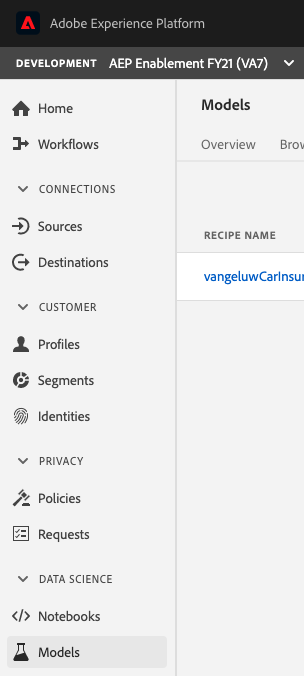

In this exercise, we'll use a prebuilt recipe to create a model for car insurance sales predictions.

In the top menu, click on **Recipes**.

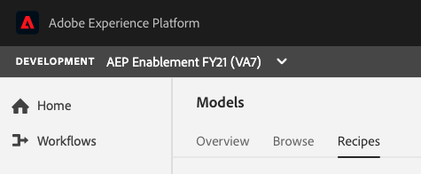

In Recipes, you'll find multiple recipes. Look for your own recipe in the list, which should be named `ldapCarInsurancePropensity`. Click the `ldapCarInsurancePropensity` recipe to open it.

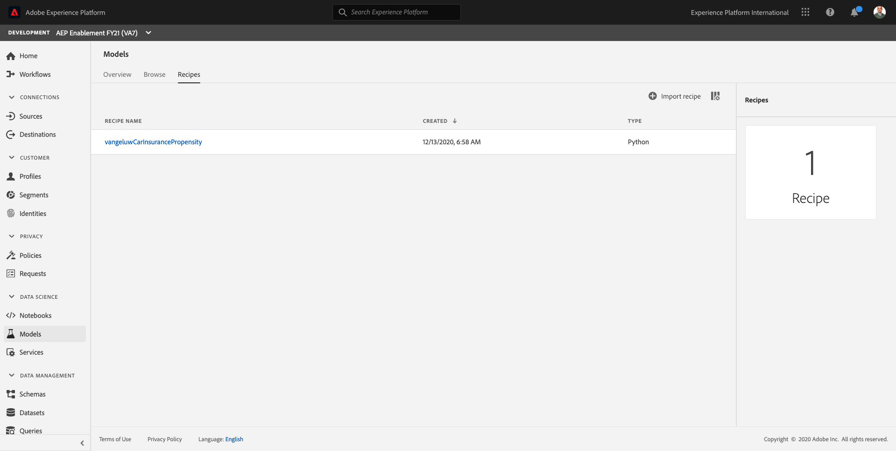

Click to open the Model you created in the previous exercise, `ldap - CarInsurancePropensity Model`.

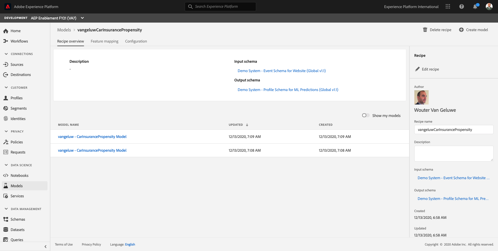

You'll then see this:

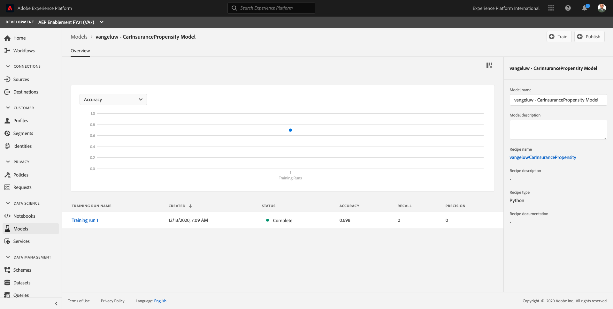

Click the button **+ Publish**.

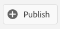

You then have to name your Service.

As a name, use `ldap` - Car Insurance Propensity Service.

In this example, for ldap `vangeluw`, the name should be `vangeluw - Car Insurance Propensity Service`.

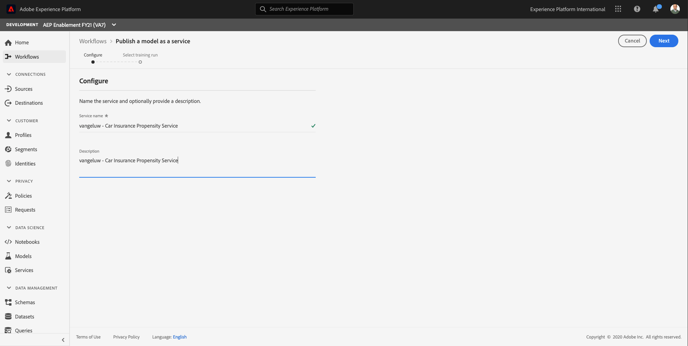

Click **Next**.

In the next screen, you need to select a Training Run to run as part of this Service.

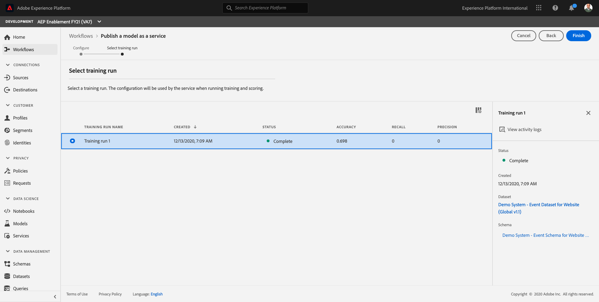

Next, click **Finish**.

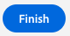

Your service is now almost created. Click **Set Schedule** to configure your schedule for this service.

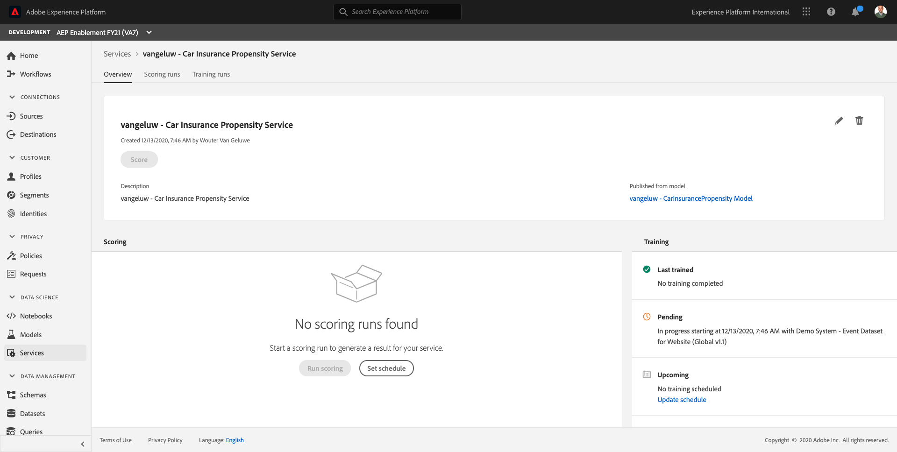

Configure your schedule so that your Service runs in the weekend, on Saturday or Sunday. You can choose the time yourself.

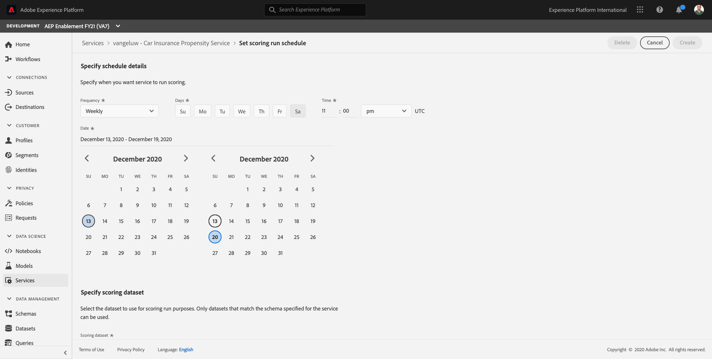

Next, you need to select the **Scoring Dataset** and the **Scoring Results Dataset**.

The **Scoring Dataset** should be `Demo System - Event Dataset for Website (Global v1.1)`.

The **Scoring Results Dataset** should be `Demo System - Profile Dataset for ML Predictions (Global v1.1)`.

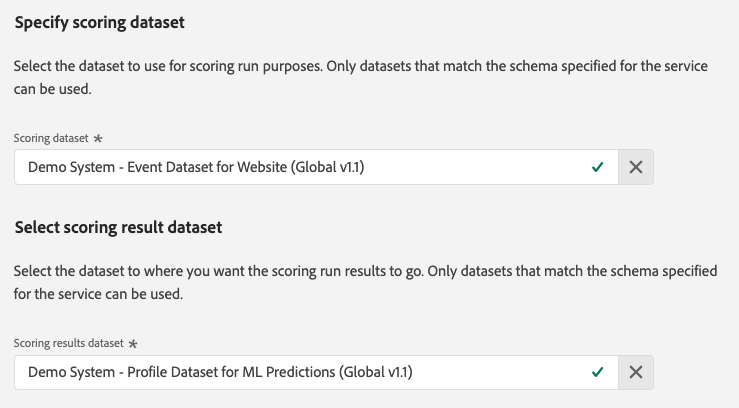

Next, click **Create**.

And you're done. Your service is now created and the schedule is set.

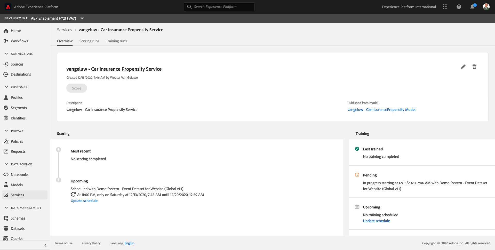

Next Step: [Summary & benefits](./summary.md)

[Go Back to Module 15](./data-science-workspace-car-insurance-sales-propensity.md)

[Go Back to All Modules](../../overview.md)
