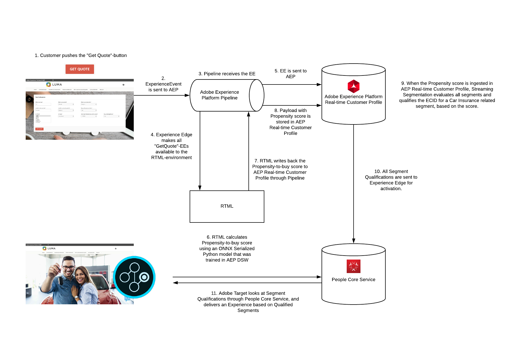

# FAQ

On this page, you'll find answers to common questions related to this specific ML model.

## What is the Architecture behind this use-case?



## What are the datasets involved?

The model relies on two datasets:

- `AEP Demo - Car Insurance Interactions`. This is the training and scoring input dataset. All customer behavior like **Get Quote** and **Purchase Insurance** - events are stored in this dataset.

- `AEP Demo - ML Predictions`. This is the scoring output dataset. When the ML Model calculates a propensity score, it stores that score in this dataset.

## What does the training data look like?

When a customer clicks the **Get Quote** button, this data is collected:

```json
{
  "header": {
    "datasetId": "5e18200afe31e818a8d616b6",
    "imsOrgId": "907075E95BF479EC0A495C73@AdobeOrg",
    "source": {
      "name": "vangeluw Launch 2"
    },
    "schemaRef": {
      "id": "https://ns.adobe.com/experienceplatform/schemas/cc85bf9611e1df1c6ef9d0a237c3e9ec",
      "contentType": "application/vnd.adobe.xed-full+json;version=1"
    }
  },
  "body": {
    "xdmMeta": {
      "schemaRef": {
        "id": "https://ns.adobe.com/experienceplatform/schemas/cc85bf9611e1df1c6ef9d0a237c3e9ec",
        "contentType": "application/vnd.adobe.xed-full+json;version=1"
      }
    },
    "xdmEntity": {
      "_id": "8194664889569.993",
      "web": {
        "webPageDetails": {
          "URL": "https://platformdemo.net/fsi_carinsurance.html",
          "name": "Car Insurance Simulator"
        }
      },
      "eventType": "carInsuranceGetQuote",
      "timestamp": "2020-03-12T22:55:26Z",
      "--aepTenantId--": {
        "carinsurance": {
          "insuranceKm": "+50000",
          "insuranceAge": "37",
          "insuranceCity": "Brussels",
          "insuranceGender": "female",
          "insuranceCarType": "hatchback",
          "insuranceCountry": "belgium",
          "insuranceLeasing": "yes",
          "insuranceCarBrand": "alfaromeo",
          "insuranceGetQuote": 1,
          "insuranceFullPrice": "1025",
          "insuranceBasicPrice": "574",
          "insuranceMediumPrice": "820",
          "insuranceNationality": "belgium",
          "insurancePrimaryDriver": "yes"
        },
        "identification": {
          "ecid": "39948201868485073490150335797615706955"
        }
      }
    }
  }
}
```

When a customer purchases car insurance, this data is collected:

```json
{
  "header": {
    "datasetId": "5e18200afe31e818a8d616b6",
    "imsOrgId": "907075E95BF479EC0A495C73@AdobeOrg",
    "source": {
      "name": "vangeluw Launch 2"
    },
    "schemaRef": {
      "id": "https://ns.adobe.com/experienceplatform/schemas/cc85bf9611e1df1c6ef9d0a237c3e9ec",
      "contentType": "application/vnd.adobe.xed-full+json;version=1"
    }
  },
  "body": {
    "xdmMeta": {
      "schemaRef": {
        "id": "https://ns.adobe.com/experienceplatform/schemas/cc85bf9611e1df1c6ef9d0a237c3e9ec",
        "contentType": "application/vnd.adobe.xed-full+json;version=1"
      }
    },
    "xdmEntity": {
      "_id": "6155761227236.238",
      "web": {
        "webPageDetails": {
          "URL": "https://platformdemo.net/fsi_carinsurance.html",
          "name": "Car Insurance Simulator"
        }
      },
      "eventType": "carInsurancePurchase",
      "timestamp": "2020-03-12T22:56:30Z",
      "--aepTenantId--": {
        "carinsurance": {
          "insurancePurchase": "yes"
        },
        "identification": {
          "ecid": "39948201868485073490150335797615706955"
        }
      }
    }
  }
}
```

## How is the training data set created?

The training dataset populates in real-time, based on customer interactions on the website. The dataset is configured to collect data in a streaming way and is activated for Profile.
As indicated in the previous questions, the dataset collects both **Get Quote**-events as **Purchase**-events.
Data is collected on the website through Launch and `alloy.js`, which streams data in real-time to Adobe Experience Platform.

## What is the Target Predictor Variable?

The Target Predictor Variable is the below field. This is the value that indicated the desired behavior, namely a purchase.

```json
"_experienceplatform": {
 "carinsurance": {
  "insurancePurchase": "yes"
},
```

## How is traffic forwarded from Pipeline to the RTML endpoint?

In this demo environment, Launch Server Side Forwarding is used to forward data from Pipeline to the RTML endpoint. This functionality is currently in beta and will become available later this year.

## What is the latency?

The end-to-end latency, from clicking the **Get Quote** button to delivering an experience by Adobe Target, based on the score calculated by the RTML-endpoint is 1-1.5 seconds.

## How does the output from the RTML endpoint get sent back to Platform?

Given that this is a custom implementation, the way to send the output of the score back to Adobe Experience Platform is by sending an XDM Payload to an HTTP API endpoint.

We're reusing an existing DCS Inlet ID, that was created through the Platform Extension in Launch.

The RTML write back into the `EMEA ML Predictions (API)` dataset which is the scoring output dataset. When the ML model calculates a propensity score, it stores that score in this dataset by sending an XDM payload to the DCS Inlet ID.

This is a sample of the XDM payload sent by the RTML endpoint to the DCS Inlet ID:

```json
{
  "header": {
    "datasetId": "5d918f445dad97163733422e",
    "imsOrgId": "907075E95BF479EC0A495C73@AdobeOrg",
    "source": {
      "name": "vangeluw Launch 2"
    },
    "schemaRef": {
      "id": "https://ns.adobe.com/experienceplatform/schemas/8d8773d1cffdd8ed8de7f6d42778a527",
      "contentType": "application/vnd.adobe.xed-full+json;version=1"
    }
  },
  "body": {
    "xdmMeta": {
      "schemaRef": {
        "id": "https://ns.adobe.com/experienceplatform/schemas/8d8773d1cffdd8ed8de7f6d42778a527",
        "contentType": "application/vnd.adobe.xed-full+json;version=1"
      }
    },
    "xdmEntity": {
      "_id": "6749627040993.491",
      "_experienceplatform": {
        "identification": {
          "ecid": "50684336701781569260739091385360831781"
        },
        "salesPrediction": {
          "carInsuranceSalesPrediction": 82
        }
      }
    }
  }
}
```

[Go Back to Module 15](./data-science-workspace-car-insurance-sales-propensity.md)

[Go Back to All Modules](../../overview.md)
