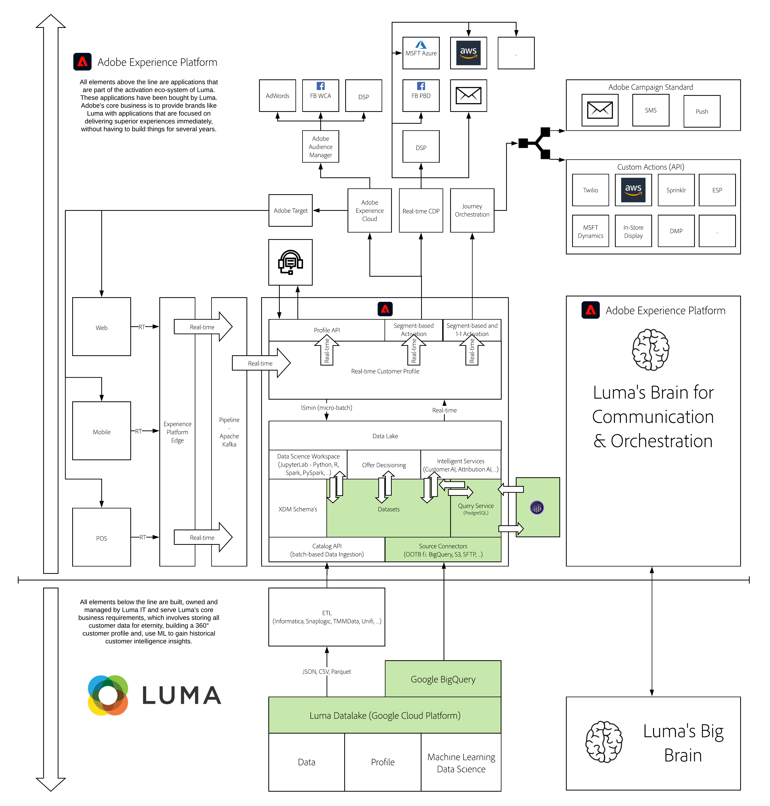

# 16. Ingest & Analyze Google Analytics data in Adobe Experience Platform with the BigQuery Source Connector

**Authors: [Victor de la Iglesia](https://www.linkedin.com/in/victordelaiglesia/), [Wouter Van Geluwe](https://www.linkedin.com/in/woutervangeluwe/)**

In this module, you'll set up your own instance of Google Cloud Platform, load sample data in Google Cloud Platform and you'll then use the BigQuery Source Connector to ingest that data from Google Cloud Platform into Adobe Experience Platform. Finally, you'll use Customer Journey Analytics to visualize that data.

Source connectors in Adobe Experience Platform make the process of getting data into Adobe Experience Platform easy. Google BigQuery is one of the already available connectors. Thanks to Adobe Experience Platform and the BigQuery Source Connector we can now bring Google Analytics data into Analysis Workspace in Customer Journey Analytics. 

In addition, we can enrich that Google Analytics data by joining it with other data sources such as CRM, Call Center or Loyalty data within Customer Journey Analytics.

## Learning Objectives

- Become familiar with the Google Cloud Platform and BigQuery User Interface
- Ingest Google Analytics data into Adobe Experience Platform
- Use Customer Journey Analytics to perform analysis of Google Analytics data
- Enrich Google Analytics data with offline data

## Prerequisites

- Some familiarity with Customer Journey Analytics is preferred, but not required
- Access to Adobe Experience Platform: [https://experience.adobe.com/platform](https://experience.adobe.com/platform) 
- Access to Customer Journey Analytics
- Access to Google Cloud Platform and Google BigQuery
- **Download these assets**: 
  - [JSON - Sample Data: Loyalty Data](./../../assets/json/m16_bqLoyalty.json)

>[!IMPORTANT]
>
>This tutorial was created to facilitate a particular workshop format. It uses specific systems and accounts to which you might not have access. Even without access, we think you can still learn a lot by reading through this very detailed content. If you're a participant in one of the workshops and need your access credentials, please contact your Adobe representative who will provide you with the required information.

## Architecture Overview

Have a look at the below architecture, which highlights the components that will be discussed and used in this module.

## Sandbox to use

For this module, please use this sandbox: `--aepSandboxId--`.

>[!NOTE]
>
>Don't forget to install, configure and use the Chrome Extension as referenced in [0.6 - Install the Chrome extension for the Experience League documentation](../module0/ex6.md)

## Exercises

[16.1 Create your Google Cloud Platform Account](./ex1.md)

Create your Google Cloud Platform account.

[16.2 Create your first query in BigQuery](./ex2.md)

Learn how to use BigQuery to prepare the data for loading into Platform.

[16.3 Connect GCP & BigQuery to Adobe Experience Platform](./ex3.md)

Learn how to setup the source connector in Adobe Experience Platform.

[16.4 Load data from BigQuery into Adobe Experience Platform](./ex4.md)

Learn how to configure the BigQuery source connector in Adobe Experience Platform to ingest your Google Analytics Data.

[16.5 Analyze Google Analytics Data using Customer Journey Analytics](./ex5.md)

Learn how to analyze Google Analytics data in Customer Journey Analytics and combine it with Loyalty data.

[Summary and benefits](./summary.md)

Summary of this module and overview of the benefits.

>[!NOTE]
>
>Thank you for investing your time in learning all there is to know about Adobe Experience Platform. If you have questions, want to share general feedback of have suggestions on future content, please contact Wouter Van Geluwe directly, by sending an email to **vangeluw@adobe.com**.

[Go Back to All Modules](../../overview.md)
