# 16.1 Create your Google Cloud Platform Account

## Objectives

- Create your Google Cloud Platform Account
- Become familiar with Google Cloud Platform Console
- Create and prepare your BigQuery project

## 16.1.1 Why connect Google BigQuery to Adobe Experience Platform to get Google Analytics data

Google Cloud Platform (GCP) is a suite of public cloud computing services offered by Google. The Google Cloud Platform includes a range of hosted services for compute, storage and application development that run on Google hardware. 

BigQuery is one of these services and it is always included with Google Analytics 360. Google Analytics data is frequently sampled when we try to get data directly from it (API for example). That's why Google includes BigQuery to get unsampled data, so brands can do advanced analysis using SQL and benefit from the power of GCP.

Google Analytics data is loaded daily into BigQuery using a batch-mechanism. As such, it doesn't make any sense to use this GCP/BigQuery integration for Real-time personalization and activation use-cases.

If a brand wants to deliver real-time personalization use-cases based on Google Analytics data, it can collect that data on the website with Google Tag Manager and then stream it to Adobe Experience Platform in real-time ([just like you did in Module 9](../../modules/module9/data-ingestion-using-google-tag-manager-and-google-analytics.md)). 

The GCP/BigQuery Source Connector should be used to...

- track all customer behavior on the website and load that data in Adobe Experience Platform for analysis, data science and personalization use-cases that don't require real-time activation.
- load Google Analytics historical data into Adobe Experience Platform, again for analysis and data science use-cases

## 16.1.2 Create your Google Account

In order to get a Google Cloud Platform account you need a Google account. If you are here, you've finished Module 9 already so you should have a Google account. 

If you don't have it, please go to Module 9 to learn how to create your Google Account: [Exercise 9.2.0 - Create a Google Account](../../modules/module9/ex0.md)

## 16.1.3 Activate your Google Cloud Platform Account

Now that you have you Google Account, you can create a Google Cloud Platform environment. To do that, go to [https://console.cloud.google.com/](https://console.cloud.google.com/).

On the next page, Accept the Terms & Conditions.

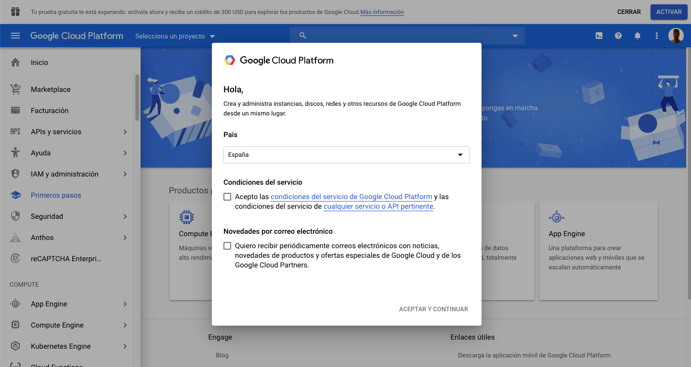 

Next, click on **Select a project**.

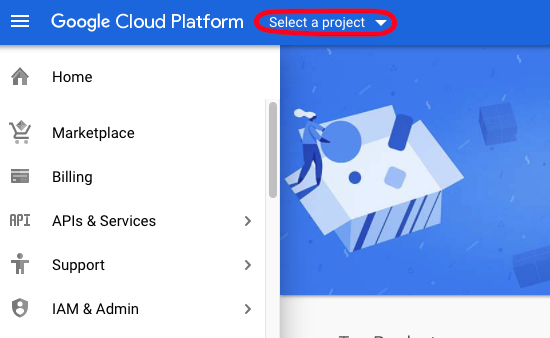

Click on **NEW PROJECT**.

Name your project following this naming convention:

| Convention         | Example|    
| ----------------- |-------------| 
| ldap-googlecloud | delaigle-googlecloud          |   

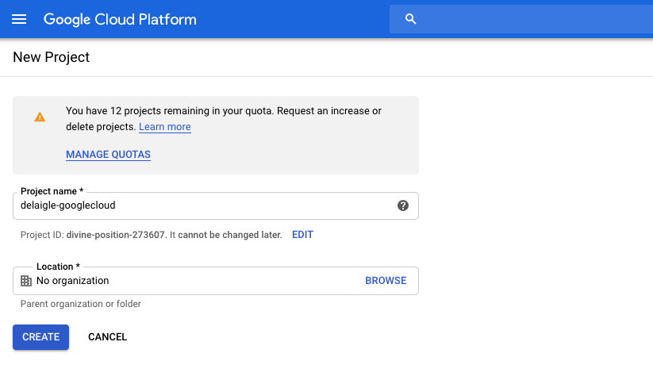

Click **Create**.

Wait until the notification in the top right side of your screen tells you that the creation is finished. Then, click  on **View project**.

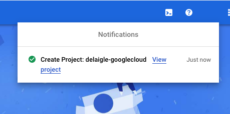

Next, go to the search bar on top of the screen and type **BigQuery**. Select the first result.

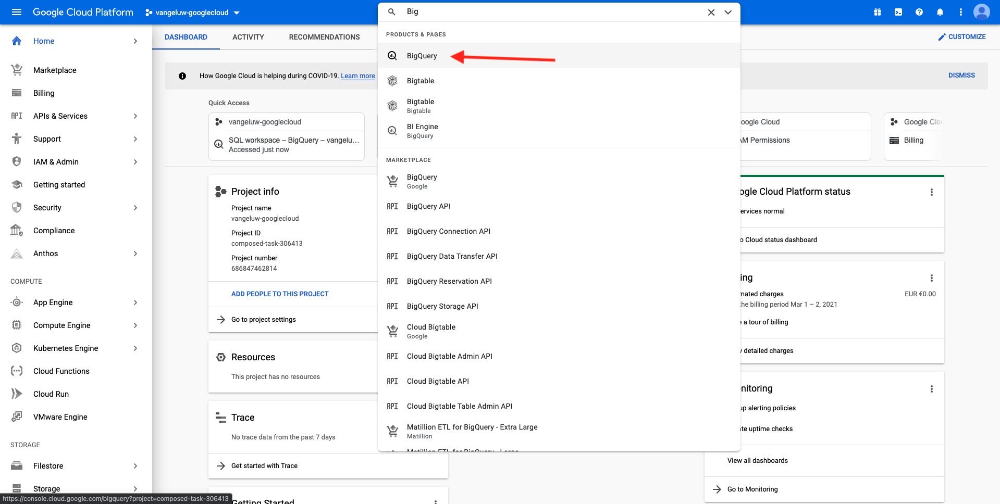

You'll then be redirected to the BigQuery Console and you'll see a popup message. 

**Click Done**.

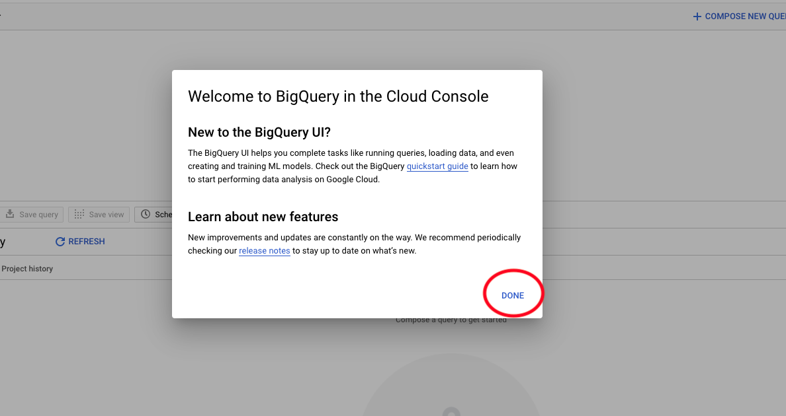

The goal of this module is to get Google Analytics data into Adobe Experience Platform. To do that, we need dummy data in a Google Analytics dataset to start with. 

Click on **Add Data** on the left side menu, followed by clicking **Explore public datasets**.

You'll then see this window: 

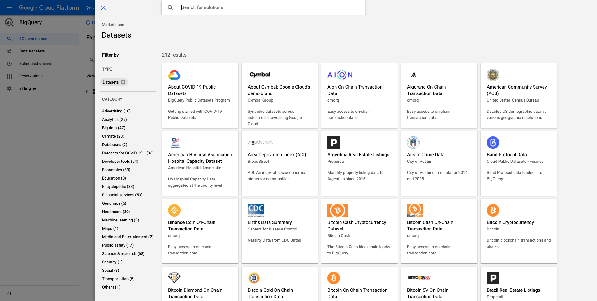

Enter the search term **Google Analytics Sample** in the search bar and select the first result.

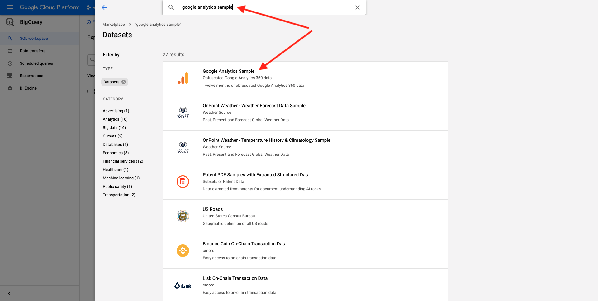

You'll see the following screen with a description of the dataset. Click on **VIEW DATASET**.

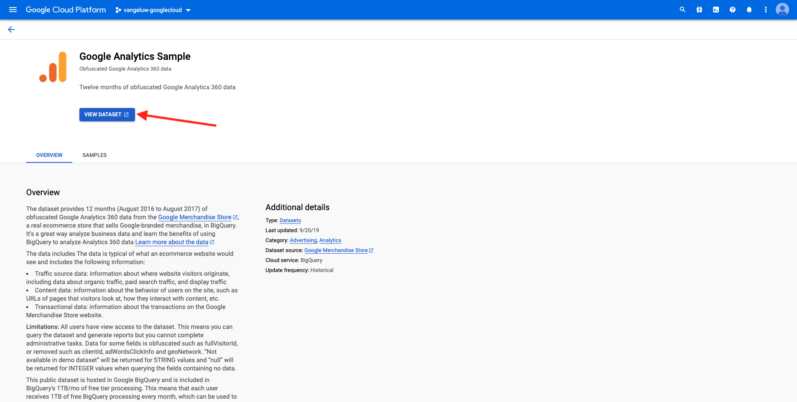

You'll then be redirected to BigQuery where you'll see this **bigquery-public-data** dataset under **Explorer**.

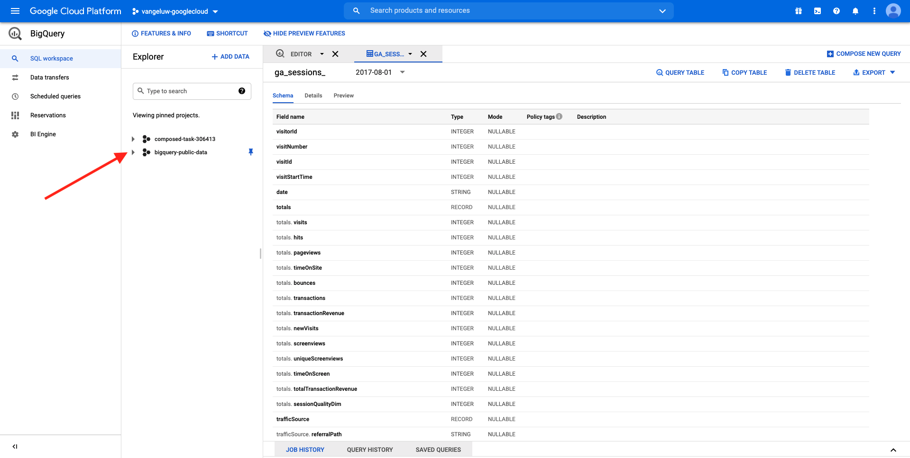

In **Explorer**, you should now see a number of tables. Feel free to explore them. Go to `google_analytics_sample`.

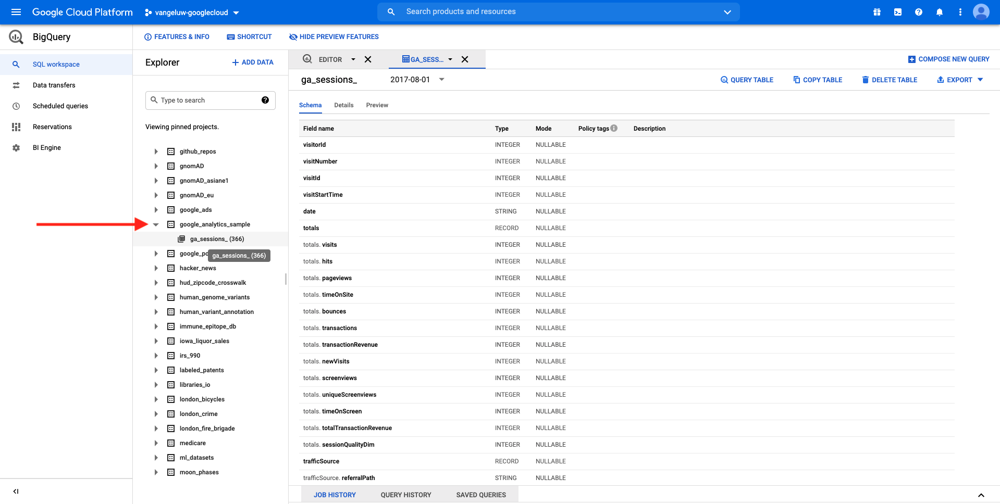

Click to open the table `ga_sessions`.

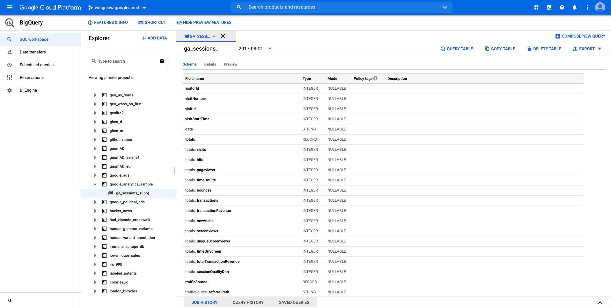

Before you continue with the next exercise, please write down the following things in a separate text file on your computer:

| Credential         | Naming| Example|   
| ----------------- |-------------| -------------|
| Project Name | ldap-googlecloud | vangeluw-googlecloud  |
| Project ID | random | composed-task-306413 |

You can find your Project Name and Project ID by clicking on your **Project Name** in the top menu bar:

You'll then see your Project ID on the right side:

You can now move to Exercise 16.2 where you'll get your hands dirty by querying Google Analytics data.

Next Step: [16.2 Create your first query in BigQuery](./ex2.md)

[Go Back to Module 16](./customer-journey-analytics-bigquery-gcp.md)

[Go Back to All Modules](./../../overview.md)
