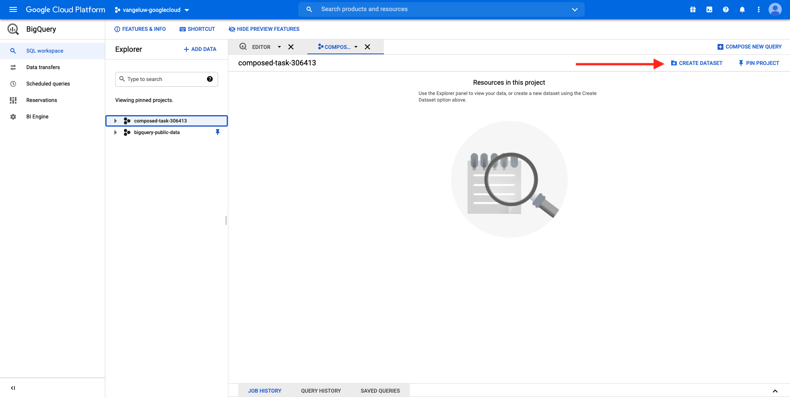

# 16.2 Create your first query in BigQuery

## Objectives

- Explore the BigQuery UI
- Create a SQL query within BigQuery
- Save your SQL query's results in a dataset within BigQuery

## Context

When Google Analytics data is in BigQuery, dimensions, metrics and other variables are all nested. Also, Google Analytics data is loaded daily into different tables. This means that trying to connect Google Analytics tables within BigQuery to Adobe Experience Platform directly is very hard and not a good idea.

The solution to this problem is to transform Google Analytics data into a readable format to make the ingestion into Adobe Experience Platform easier.

## Exercise 16.2.1 – Create a dataset to save new BigQuery Tables

Go to the [BigQuery Console](https://console.cloud.google.com/bigquery).


In **Explorer**, you'll see your Project ID. Click your Project ID (don't click on the **bigquery-public-data** dataset).


You can see that there isn't a dataset yet, so let's create one now.
Click **CREATE DATASET**.



On the right side of your screen, you'll see the **Create dataset** menu.


For the **Dataset ID**, use the below naming convention. For the other fields, please leave the default settings.

| Naming         | Example |    
| ----------------- | ------------- | 
| ldap_BigQueryDataSets | vangeluw_BigQueryDataSets |  


Next, click **Create dataset**.


You'll then be back in the BigQuery Console with your dataset created.


## Exercise 16.2.2 – Create your first SQL BigQuery

Next, you'll create your first query in BigQuery. The goal of this query is to take the Google Analytics sample data and transform it so that it can be ingested in Adobe Experience Platform. Go to the **EDITOR** tab.


Please copy the following SQL query and paste it into that Query Editor. Feel free to read the query and understand the Google Analytics BigQuery syntax.


```sql
SELECT
  CONCAT(fullVisitorId, CAST(hitTime AS String), '-', hitNumber) AS _id,
  TIMESTAMP(DATETIME(Year_Current, Month_Current, Day_Current, Hour, Minutes, Seconds)) AS timeStamp,
  fullVisitorId as GA_ID,
  -- Fake CUSTOMER ID
  CONCAT('3E-D4-',fullVisitorId, '-1W-93F' ) as customerID,
  Page,
  Landing_Page,
  Exit_Page,
  Device,
  Browser,
  MarketingChannel,
  TrafficSource,
  TrafficMedium,
  -- Enhanced Ecommerce
  TransactionID,
  CASE
      WHEN EcommerceActionType = '2' THEN 'Product_Detail_Views'
      WHEN EcommerceActionType = '3' THEN 'Adds_To_Cart'
      WHEN EcommerceActionType = '4' THEN 'Product_Removes_From_Cart'
      WHEN EcommerceActionType = '5' THEN 'Product_Checkouts'
      WHEN EcommerceActionType = '6' THEN 'Product_Refunds'
    ELSE
    NULL
  END
     AS Ecommerce_Action_Type,
  -- Entrances (metric)
  SUM(CASE
      WHEN isEntrance = TRUE THEN 1
    ELSE
    0
  END
    ) AS Entries,
    
--Pageviews (metric)
    COUNT(*) AS Pageviews,
    
 -- Exits 
    SUM(
    IF
      (isExit IS NOT NULL,
        1,
        0)) AS Exits,
        
 --Bounces
   SUM(CASE
      WHEN isExit = TRUE AND isEntrance = TRUE THEN 1
    ELSE
    0
  END
    ) AS Bounces,
        
  -- Unique Purchases (metric)
  COUNT(DISTINCT TransactionID) AS Unique_Purchases,
  -- Product Detail Views (metric)
  COUNT(CASE
      WHEN EcommerceActionType = '2' THEN fullVisitorId
    ELSE
    NULL
  END
    ) AS Product_Detail_Views,
  -- Product Adds To Cart (metric)
  COUNT(CASE
      WHEN EcommerceActionType = '3' THEN fullVisitorId
    ELSE
    NULL
  END
    ) AS Adds_To_Cart,
  -- Product Removes From Cart (metric)
  COUNT(CASE
      WHEN EcommerceActionType = '4' THEN fullVisitorId
    ELSE
    NULL
  END
    ) AS Product_Removes_From_Cart,
  -- Product Checkouts (metric)
  COUNT(CASE
      WHEN EcommerceActionType = '5' THEN fullVisitorId
    ELSE
    NULL
  END
    ) AS Product_Checkouts,
  -- Product Refunds (metric)
  COUNT(CASE
      WHEN EcommerceActionType = '7' THEN fullVisitorId
    ELSE
    NULL
  END
    ) AS Product_Refunds
  FROM (
  SELECT
    -- Landing Page (dimension)
    CASE
      WHEN hits.isEntrance = TRUE THEN hits.page.pageTitle
    ELSE NULL
  END
    AS Landing_page,
    
        -- Exit Page (dimension)
    CASE
      WHEN hits.isExit = TRUE THEN hits.page.pageTitle
    ELSE
    NULL
  END
    AS Exit_page,
    
    hits.page.pageTitle AS Page,
    hits.isEntrance,
    hits.isExit,
    hits.hitNumber as hitNumber,
    hits.time as hitTime,
    date as Fecha,
    fullVisitorId,
    visitStartTime,
    device.deviceCategory AS Device,
    device.browser AS Browser,
    channelGrouping AS MarketingChannel,
    trafficSource.source AS TrafficSource,
    trafficSource.medium AS TrafficMedium,
    hits.transaction.transactionId AS TransactionID,
    CAST(EXTRACT(YEAR FROM CURRENT_DATE()) AS INT64) AS Year_Current,
    CAST(EXTRACT(MONTH FROM CURRENT_DATE()) AS INT64) AS Month_Current,
     CAST(EXTRACT(DAY FROM CURRENT_DATE()) AS INT64) AS Day_Current,
    CAST(EXTRACT(DAY FROM DATE_SUB(CURRENT_DATE(),INTERVAL 1 DAY)) AS INT64) AS Day_Current_Before,
    CAST(FORMAT_DATE('%Y', PARSE_DATE("%Y%m%d", date)) AS INT64) AS Year,
  CAST(FORMAT_DATE('%m', PARSE_DATE("%Y%m%d",date)) AS INT64) AS Month,
  CAST(FORMAT_DATE('%d', PARSE_DATE("%Y%m%d",date)) AS INT64) AS Day,
    CAST(EXTRACT (hour FROM TIMESTAMP_SECONDS(hits.time)) AS INT64) AS Hour,
  CAST(EXTRACT (minute FROM TIMESTAMP_SECONDS(hits.time)) AS INT64) AS Minutes,
  CAST(EXTRACT (second FROM TIMESTAMP_SECONDS(hits.time)) AS INT64) AS SecondS,
    hits.eCommerceAction.action_type AS EcommerceActionType
  
  FROM
    `bigquery-public-data.google_analytics_sample.ga_sessions_*`,
     UNNEST(hits) AS hits
  WHERE
    _table_suffix BETWEEN '20170101'
    AND '20170331'
    AND totals.visits = 1
    AND hits.type = 'PAGE'
    )
    
GROUP BY
  1,
  2,
  3,
  4,
  5,
  6,
  7,
  8,
  9,
  10,
  11,
  12,
  13,
  14
    
  ORDER BY 2 DESC

```

When you are ready, click **Run** to run the query:


Executing the query can take a couple of minutes.

Once the query has finished running, you'll see the below output in the **Query results**.


## Exercise 16.2.3 – Save the results of your BigQuery SQL query

The next step is to save the output of your query by clicking the **SAVE RESULTS** button.


As the location for your output, select **BigQuery table**.


You'll then see a new popup, where your **Project Name** and **Dataset Name** are pre-populated. The dataset name should be the dataset that you created in the beginning of this exercise, with this naming convention:

| Naming         | Example |    
| ----------------- | ------------- | 
| `ldap_BigQueryDataSets` | `vangeluw_BigQueryDataSets` |  

You now need to enter a Table name. Please use this naming convention:

| Naming         | Example |    
| ----------------- |------------- | 
| `ldap_GAdataTableBigQuery` | `vangeluw_GAdataTableBigQuery` |  


Click **SAVE**.

It may take some time until the data is ready in the table you've created. After a couple of minutes, refresh the browser. You should then see within your dataset the `ldap_GAdataTableBigquery` table under **Explorer** inside your BigQuery project.


You con now continue with the next exercise, where you'll connect this table to Adobe Experience Platform.

Next Step: [16.3 Connect GCP & BigQuery to Adobe Experience Platform](./ex3.md)

[Go Back to Module 16](./customer-journey-analytics-bigquery-gcp.md)

[Go Back to All Modules](./../../overview.md)
