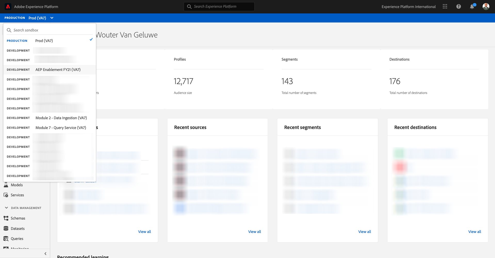

# 16.3 Connect GCP & BigQuery to Adobe Experience Platform

## Objectives

- Explore the API & Services within Google Cloud Platform 
- Be familiar with OAuth Playground for testing Google APIs 
- Create your first BigQuery connection in Adobe Experience Platform

## Context

Adobe Experience Platform provides a connector within **Sources** that will help you bring BigQuery datasets into Adobe Experience Platform. This data connector is based on the Google BigQuery API. Therefore, it's important to properly prepare your Google Cloud Platform and your BigQuery environment to receive API calls from Adobe Experience Platform.

To configure the BigQuery Source Connector in Adobe Experience Platform, you'll need these 4 values:

- project
- clientId
- clientSecret
- refreshToken

So far you only have the first one, the **Project ID**. This **Project ID** value is a random ID that was generated by Google when you created your BigQuery project during exercise 16.1. 

Please copy project id in a separated text file.

| Credential         | Naming| Example|   
| ----------------- |-------------| -------------|
| Project ID | random | composed-task-306413 |

You can check your Project ID any time by clicking on your **Project Name** in the top menu bar:

You'll see you Project ID on the right side:

In this exercise you'll learn how to get the other 3 required fields:

- clientId
- clientSecret
- refreshToken

## 16.3.1 Google Cloud API & Services

To start, please go back to the Google Cloud Platform home page. To do this, simply click on the logo in the top left-corner of your screen.

Once you are on the home page, go to left menu and click **APIs & Services**, then Click on **Dashboard**.

You'll now see the **APIs & Services** homepage. 

On this page, you're able to see the usage of your various Google API connections. In order to setup an API Connection so that Adobe Experience Platform can read from BigQuery, you need to follow these steps:

- First, you need to create an OAuth consent screen to enable future authentications. Google's security reasons also require a human being to make the first authentication, before a programmatic access is allowed.
- Second, you need API Credentials (clientId and clientSecret) that will be used for API authentication and access to your BigQuery Connector.

## 16.3.2 OAuth Consent Screen

Let's start with creating the OAuth Consent Screen. In the left menu on the **APIs & Services** homepage, click **OAuth consent screen**.

You'll then see this:

Select the User Type: **External**. Next, click **CREATE**.

You'll then be on the **OAuth Consent Screen configuration** window. 

The only thing to do here is to enter the name of the consent screen in the **Application name** field and select the **User support email**. For the Application name, use this naming convention:

| Naming         | Example|    
| ----------------- |-------------| 
| ldap - AEP BigQuery Connector | vangeluw - Platform BigQuery Connector |  

Next, scroll down until you see **Developer contact information** and fill out an email address. 

Click **SAVE AND CONTINUE**.

You'll then see this. Click **SAVE AND CONTINUE**.

You'll then see this. Click **SAVE AND CONTINUE**.

You'll then see this. Click **BACK TO DASHBOARD**.

You'll then see this. Click **PUBLISH APP**.

Click **CONFIRM**.

You'll then see this.

In the next step step, you'll finish the API setup and get your API credentials.

## 16.3.3 Google API Credentials: Client Secret and Client Id

In the left menu, click **Credentials**. You'll then see this:

Click the **+ CREATE CREDENTIALS** button.

You'll see 3 options. Click the **OAuth client ID**:

In the next screen, select **Web application**.

Several new fields will pop up. You now need to enter the **Name** of the OAuth Client ID and also enter the **Authorised redirect URIs**. 

Follow this naming convention:

| Field         | Value  | Example  |   
| ----------------- |-------------| -------------| 
| Name | ldap - AEP BigQuery Connector  |  vangeluw - Platform BigQuery Connector  |
| Authorised redirect URIs | https://developers.google.com/oauthplayground | https://developers.google.com/oauthplayground  | 

The **Authorised redirect URIs** field is a very important field because you'll need it later to get the RefreshToken you need to finish the setup of the BigQuery Source Connector in Adobe Experience Platform.

Before you continue, you need to physically push the **Enter** button after entering the URL to store the value in the **Authorised redirect URIs** field. If you don't click the **Enter** button, you'll run into issues at a later stage, in the **OAuth 2.0 Playground**.

Next, click **Create**:

You'll now see now your Client ID and your Client Secret.

Please copy these two fields and paste them in a text file on your desktop. You can always access these credentials at a later stage, but it's easier if you save them in a text file next to your BigQuery Project ID.

As recap for your BigQuery Source Connector setup in Adobe Experience Platform, you now have these values already available:

| BigQuery Connector Credentials         | Value |  
| ----------------- |-------------| 
| Project ID | your own Project ID (ex.: composed-task-306413)| 
| clientid | yourclientid| 
| cilentsecret | yourclientsecret |

You're still missing the **refreshToken**. The refreshToken is a requirement because of security reasons. In the world of APIs, tokens typically expire every 24 hours. So the **refreshToken** is needed to refresh the security token every 24 hours, so that your Source Connector setup can keep connecting to Google Cloud Platform and BigQuery.

## 16.3.4 BigQuery API and the refreshToken

There are many ways to get a refreshToken to access Google Cloud Platform APIs. One of these options is for instance using Postman.
However, Google has built something easier to test and play with their APIs, a tool called **OAuth 2.0 Playground**.

To access **OAuth 2.0 Playground**, go to [https://developers.google.com/oauthplayground](https://developers.google.com/oauthplayground).

You'll then see the **OAuth 2.0 Playground** homepage.

Click on the **gear** icon in the top right side of your screen:

Make sure your settings are the same as what you can see in the image above.

Double check the settings to be 100% sure. 

Once you are done, check the box of **Use your own OAuth credentials**

Two fields should appear, and you have the value for them.

Please fill the fields following this table:

| Playground API settings         | Your Google API credentials |  
| ----------------- |-------------| 
| OAuth Client ID | your own Client ID (in the text file on your desktop) | 
| OAuth Client Secret | your own Client Secret (in the text file on your desktop) | 

Copy the **Client ID** and **Client Secret** from the text file you created on your desktop.

Once you've fill out your credentials, please click **Close**

In the left menu, you can see all available Google APIs. Search for **BigQuery API v2**.

Next, select the scope as indicated in the below image:

Once you have selected them, you should see a blue button which says **Authorize APIs**. Click on it.

Select the Google Account you used for setting up GCP and BigQuery.

You might see a big warning: **This app isn't verified**. This is happening because your Platform BigQuery Connector hasn't been formally reviewed yet, so Google doesn't know if it's an authentic app or not. You should disregard this notification.

Click **Advanced**.

Next, click on **Go to ldap - AEP BigQuery Connector (unsafe)**.

You'll be redirected to our OAuth Consent Screen that you created. 

If you use Two-Factor Authentication (2FA), enter the verification code sent to you.

Google will now show you eight different **Permission** prompts. Click **Allow** for all eight permission-requests. (This is a procedure that has to be followed and confirmed once by a real human being, before the API will allow programmatic requests)

Again, **eight different popup-windows** will not be shown, you have to click **Allow** for all of them. 

After the eight permission requests, you'll see this overview. Click **Allow** to finish the process.

After the last **Allow**-click, you'll be sent back to the OAuth 2.0 Playground and you'll see this:

Click **Exchange authorization code for tokens**. 

After a couple of seconds, the **Step 2 - Exchange authorization code for tokens** view will automatically close, and you'll see **Step 3 - Configure request to API**.

You have to go back to **Step 2 Exchange authorization code for tokens**, so click on **Step 2 Exchange authorization code for tokens** again to visualize the **Refresh token**.

You'll now see the **Refresh token**. 

Copy the **Refresh token** and paste it in the text file on your desktop along with the other BigQuery Source Connector Credentials:

| BigQuery Source Connector Credentials         | Value |  
| ----------------- |-------------| 
| Project ID | your own random Project ID (ex.: apt-summer-273608)| 
| clientid | yourclientid| 
| cilentsecret | yourclientsecret | 
| refreshtoken | yourrefreshtoken | 

Next, let's setup your Source Connector in Adobe Experience Platform.

## Exercise 16.3.5 - Connect Platform with your own BigQuery table

Log in to Adobe Experience Platform by going to this URL: [https://experience.adobe.com/platform](https://experience.adobe.com/platform).

After logging in, you'll land on the homepage of Adobe Experience Platform.

Before you continue, you need to select a **sandbox**. The sandbox to select is named ``--aepSandboxId--``. You can do this by clicking the text **[!UICONTROL Production Prod]** in the blue line on top of your screen.

After selecting the appropriate sandbox, you'll see the screen change and now you're in your dedicated sandbox.

In the left menu, go to Sources.

You'll then see the **Sources** homepage. In the **Sources** menu, click on **Databases**.

Click the **Google BigQuery** card. Next, click on **+ Configure**.

You should now create a new connection. 

Click on **New account**. You now need to fill out all the below fields, based on the setup you did in GCP and BigQuery. 

Let's start by naming the connection:

Please use this naming convention:

| BigQuery Connector Credentials         | Value  | Example  |   
| ----------------- |-------------| -------------| 
| Account Name | ldap - BigQuery Connection  |  vangeluw - BigQuery Connection  |
| Description | ldap - BigQuery Connection | vangeluw - BigQuery Connection  | 

Which should give you something like this:

Next, fill out the GCP and BigQuery API **Account Authentication**-details that you stored in a text-file on your desktop:

| BigQuery Connector Credentials         | Value |  
| ----------------- |-------------| 
| Project ID | your own random Project ID (ex.: apt-summer-273608)| 
| clientId | ...| 
| cilentSecret | ... | 
| refreshToken | ... | 

Your **Account Authentication**-details should now look like this:

After filling out all these fields, click **Connect to source**.

If your **Account Authentication** details were correctly filled out, you should now see a visual confirmation that the connection is working properly, by seeing the **Connected** confirmation.

Now that your connection is created, please click **Next**:

You will now see the BigQuery dataset you created during exercise 16.2. 

Well done! In the next exercise, you'll load data from that table and map it against a schema and dataset in Adobe Experience Platform.

Next Step: [16.4 Load data from BigQuery into Adobe Experience Platform](./ex4.md)

[Go Back to Module 16](./customer-journey-analytics-bigquery-gcp.md)

[Go Back to All Modules](./../../overview.md)
