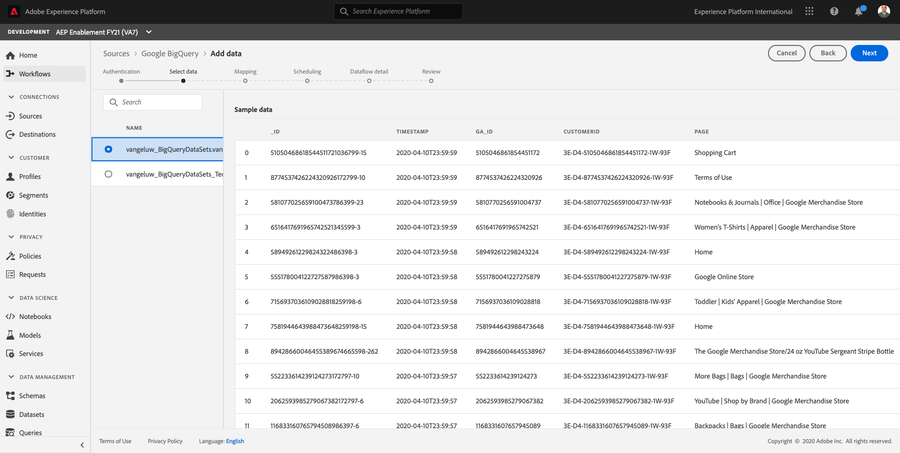
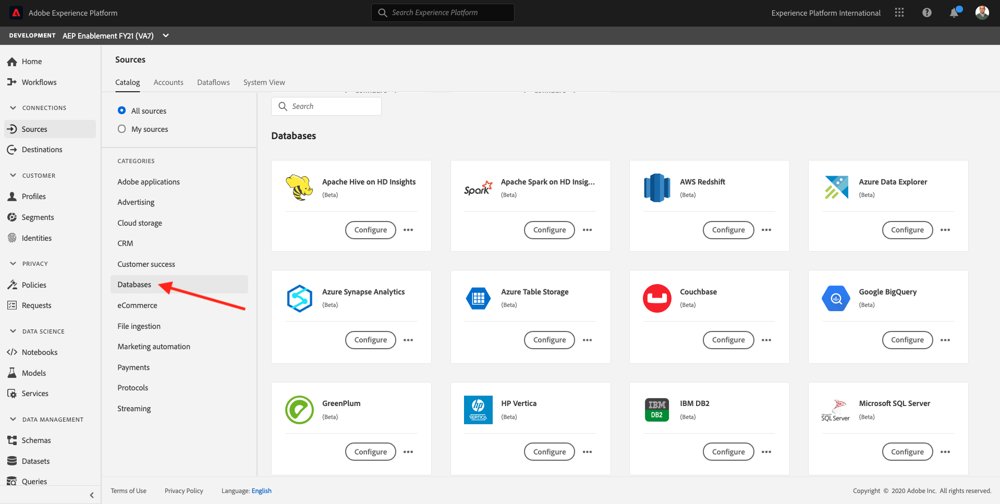

# 16.4 Load data from BigQuery into Adobe Experience Platform

## Objectives

- Map BigQuery data to an XDM schema
- Load BigQuery data into Adobe Experience Platform
- Become familiar with the BigQuery Source Connector UI

## Before you start

After exercise 16.3, you should have this page open in Adobe Experience Platform:

**If you have it open, continue with exercise 16.4.1.**

**If you don't have it open, go to [Adobe Experience Platform](https://experience.adobe.com/platform/home).**

In the left menu, go to Sources. You'll then see the **Sources** homepage. In the **Sources** menu, click on **Databases**.

Select the **Google BigQuery** Source Connector and click on **+ Configure**.

You'll then see the Google BigQuery Account selection screen.

Select your account and click **Next**.

You'll then see the **Add data** view.

## 16.4.1 BigQuery Table Selection

In the **Add data** view, select your BigQuery dataset. 

You can now see a sample data preview of the Google Analytics data in BigQuery.

Click **Next**.

## 16.4.2 XDM mapping

You'll now see the Mapping screen:

You now have to either create a new dataset or select an existing dataset to load the Google Analytics data into. For this exercise, a dataset and schema have already been created. You do not need to create a new schema or dataset.

Select **Existing dataset**. Click the dataset icon to select an existing dataset.

Search for the dataset named `Demo System - Event Dataset for BigQuery (Global v1.1)` and select it.

Next, click **Confirm**.

Scroll down. You now need to map every **Source Field** from Google Analytics/BigQuery to an XDM **Target Field**, field by field.

Use the below mapping table for this exercise.

| Source Field        | Target Field |   
| ----------------- |-------------| 
| **_id** | _id | 
| **_id** | channel._id | 
| timeStamp | timestamp | 
| GA_ID | ``--aepTenantId--``.identification.core.gaid | 
| customerID | ``--aepTenantId--``.identification.core.loyaltyId | 
| Page | web.webPageDetails.name | 
| Device | device.type | 
| Browser | environment.browserDetails.vendor| 
| MarketingChannel | marketing.trackingCode | 
| TrafficSource | channel.typeAtSource | 
| TrafficMedium | channel.mediaType | 
| TransactionID | commerce.order.payments.transactionID | 
| Ecommerce_Action_Type | eventType | 
| Pageviews | web.webPageDetails.pageViews.value| 
| Unique_Purchases | commerce.purchases.value | 
| Product_Detail_Views | commerce.productViews.value | 
| Adds_To_Cart | commerce.productListAdds.value | 
| Product_Removes_From_Cart | commerce.productListRemovals.value | 
| Product_Checkouts | commerce.checkouts.value | 

After copying and pasting the above mapping into the Adobe Experience Platform UI, please verify if you don't see any errors due to typos or leading/trailing spaces.

You now have a **Mapping** like this one:

The source fields **GA_ID** and **customerID** are mapped to an Identifier in this XDM Schema. This will allow you to enrich Google Analytics data (web/app behavior data) with other datasets such as Loyalty or Call Center-data.

Click **Next**.

## 16.4.3 Connection and the data ingestion scheduling

You'll now see the **Scheduling** tab:

In the **Scheduling** tab, you are able to define a frequency for the data ingestion process for this **Mapping** and data. 

As you're using demo data in Google BigQuery that won't be refreshed, there's no real need for setting a schedule in this exercise. You do have to select something, and to avoid too many useless data ingestion processes, you need to set the frequency like this:

- Frequency: **Week**
- Interval: **200**

**Important**: be sure you activate the **Backfill** switch.

Last but not least, you must define a **delta** field. 

The **delta** field is used to schedule the connection and upload only new rows that come into your BigQuery dataset. A delta field is typically always a timestamp column. So for future scheduled data ingestions, only the rows with a new, more recent timestamp will be ingested.

Select **timeStamp** as the delta field.

You now have this.

Click **Next**.

## 16.4.4 Review and launch connection

In the **Dataset flow detail** view. you need to name your connection, which will help you to find it later. 

Please use this naming convention:

| Field         | Naming| Example|   
| ----------------- |-------------| -------------|
| Dataset flow name| DataFlow - ldap - BigQuery Website Interaction | DataFlow - vangeluw - BigQuery Website Interaction  |
| Description | DataFlow - ldap - BigQuery Website Interaction | DataFlow - vangeluw - BigQuery Website Interaction|

Click **Next**.

You now see a detailed overview of your connection. Make sure everything is correct before you continue, as some settings can't be changed anymore afterwards, like for instance the XDM mapping.

Click **Finish**.

Setting up the connection may take some time, so don't worry if you see this:

Once the connection has been created, you'll see this:

You're now ready to continue with the next exercise, in which you'll use Customer Journey Analytics to build powerful visualizations on top of Google Analytics data.

Next Step: [16.5 Analyze Google Analytics Data using Customer Journey Analytics](./ex5.md)

[Go Back to Module 16](./customer-journey-analytics-bigquery-gcp.md)

[Go Back to All Modules](./../../overview.md)
