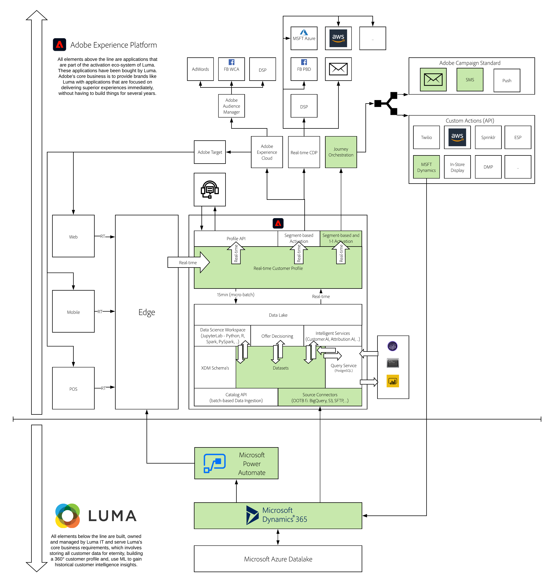

# 17. Adobe Experience Platform and Microsoft Dynamics 365

**Authors: [Nishant Pithia](https://www.linkedin.com/in/npithia/), [Alastair Malkin](https://www.linkedin.com/in/alastair-malkin-068340/), [Prateek Tewari](https://www.linkedin.com/in/prateektewari/), [Wouter Van Geluwe](https://www.linkedin.com/in/woutervangeluwe/)**

In this module, you'll set up your instance of Dynamics 365 for Sales and load sample customer data. You will then use the Dynamics 365 Source Connector in Adobe Experience Platform to ingest that data from Microsoft Dynamics 365 into Adobe Experience Platform.

Finally, you'll use Adobe Journey Optimizer to connect directly with Microsoft Dynamics 365 APIs to create a contract record from the demo website and you'll configure Adobe Journey Optimizer to communicate directly to a customer based on the on a change in sentiment. In addition, you'll also learn how to set up and configure Microsoft Power Automate (Flow) and trigger a custom action directly into Adobe Journey Optimizer based on the Contact record change in Microsoft Dynamics 365. To illustrate the end result, please check out the following video:

>[!VIDEO](https://video.tv.adobe.com/v/328350?quality=12&learn=on)

## Learning Objectives

- Become familiar with the Microsoft Dynamics 365 for Sales 
- Ingest data from Microsoft Dynamics 365 for Sales into Adobe Experience Platform
- Add a custom field in Microsoft Dynamics 365 
- Use Microsoft Power Automate to set up a trigger-based flow towards Adobe Journey Optimizer
- Leverage Adobe Journey Optimizer to connect directly with Microsoft Dynamics 365 to create a contact record

## Prerequisites

- You should have completed [Module 6 - Adobe Journey Optimizer: Orchestration](../module6/journey-orchestration-create-account.md)
- Access to [Adobe Experience Platform](https://experience.adobe.com/platform)
- Access to Adobe Journey Optimizer
- Access to Microsoft Dynamics 365 for Sales, Microsoft Power Automate and Azure Data Lake Storage

>[!IMPORTANT]
>
>This tutorial was created to facilitate a particular workshop format. It uses specific systems and accounts to which you might not have access. Even without access, we think you can still learn a lot by reading through this very detailed content. If you're a participant in one of the workshops and need your access credentials, please contact your Adobe representative who will provide you with the required information.

## Architectural Overview

Have a look at the below architecture, which highlights the components that will be discussed and used in this module.

## Sandbox to use

For this module, please use this sandbox: `--aepSandboxId--`.

>[!NOTE]
>
>Don't forget to install, configure and use the Chrome Extension as referenced in [0.6 - Install the Chrome extension for the Experience League documentation](../module0/ex6.md)

## Exercises

[17.1 Create your Microsoft Dynamics 365 account](./ex1.md)

In this exercise you'll create your Microsoft Azure and Dynamics 365 account.

[17.2 Connect Microsoft Dynamics 365 to Adobe Experience Platform via a Source Connector](./ex2.md)

In this exercise you'll learn how to connect Microsoft Dynamics 365 to Adobe Experience Platform.

[17.3 Create a Contact in Microsoft Dynamics 365 using Adobe Journey Optimizer & Import data from Microsoft Dynamics](./ex3.md)

In this exercise you'll learn how to create a Contact in Microsoft Dynamics 365.

[17.4 Update a contact in Microsoft Dynamics 365 and automatically trigger a journey](./ex4.md)

In this exercise you'll learn how to update a Contact in Microsoft Dynamics 365 and automatically trigger a journey in Adobe Experience Platform and Adobe Journey Optimizer.

[Summary and benefits](./summary.md)

Summary of this module and overview of the benefits.

>[!NOTE]
>
>Thank you for investing your time in learning all there is to know about Adobe Experience Platform. If you have questions, want to share general feedback of have suggestions on future content, please contact Wouter Van Geluwe directly, by sending an email to **vangeluw@adobe.com**.

[Go Back to All Modules](../../overview.md)
