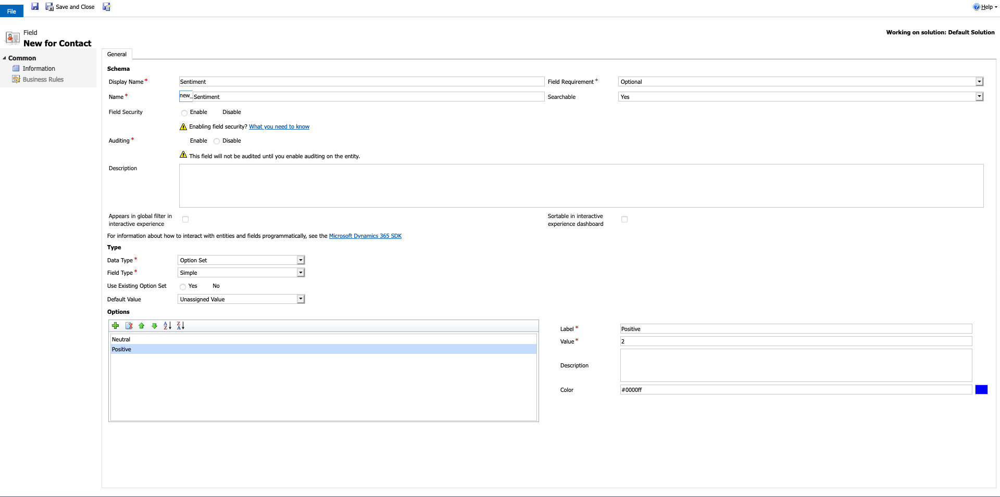
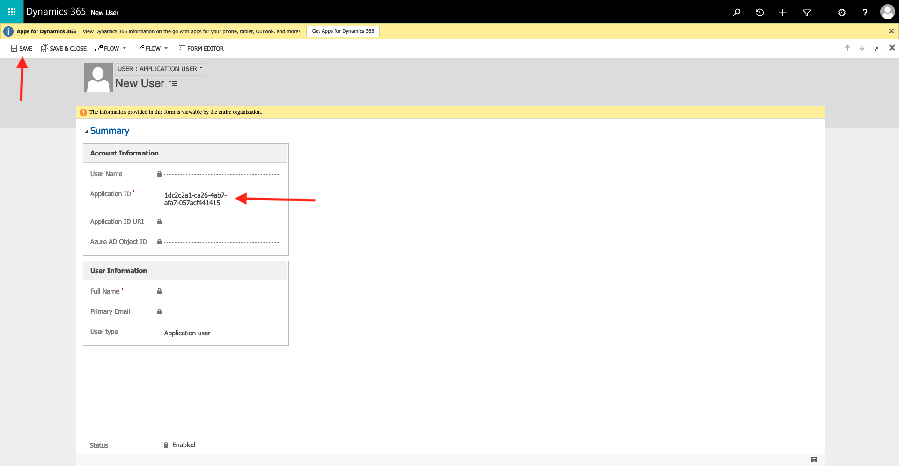
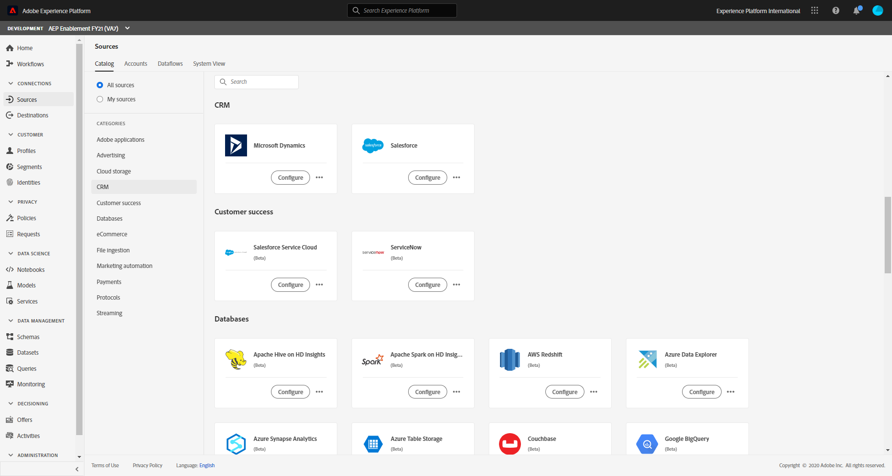

# 17.2 Connect Dynamics to Adobe Experience Platform via RTCDP and Journey Orchestration

## 17.2.1 Update the Contact Entity in Microsoft Dynamics 365

Login to your Microsoft Dynamics 365 account. The URL of your Microsoft Dynamics 365 account looks like this: https://**NAME**.**REGION**.dynamics.com, for instance, https://demosystemvangeluw101.crm4.dynamics.com.

You'll then see this. Click on **Dynamics 365 - custom**.

You'll then see this. Click the **gear** icon.

In the menu, click **Advanced Settings**.

A new browser tab will open. You'll see this.

In the top menu, click **Settings**, then click **Customizations**.

Next, click **Customize the System**.

A new browser tab will open. In the left menu, click to expand **Entities**.

Scroll down to **Contact**. Click to expand **Contact**.

Click **Forms**.

Click **Contact**.

A new browser tab will open to display the Contact Entity form fields.

In the panel **Contact Information** you'll add another field called **Sentiment**, right under the **Address** field.

Click **New Field**.

A new browser tab will appear.

Enter the following details:

- Display Name: **Sentiment**
- Data type: **Option Set**

You'll then have this:

In the Options list, enter the below values. Click the green **+** icon.

| Label | Value |
|--- |--- |
| Neutral | 1 |
| Positive | 2 |
| Negative | 0 |

- Option: Neutral

  

  **NOTE** When entering a single digit into the Value field the following popup will appear. You can click OK to continue:

  

- Option: Positive

  

  **NOTE** When entering a single digit into the Value field the following popup will appear. You can click OK to continue:

  

- Option: Negative

  

  **NOTE** When entering a single digit into the Value field the following popup will appear. You can click OK to continue:

  

After adding the three option values, click **Save and Close**.

Go back to the Contact Entity Form. Click **Save**.

Refresh the browser window.

After refreshing the browser window, go to the Field Explorer on the right and select **Custom Fields**.

You now see the new field called **Sentiment** in the list of Custom Fields.

Now drag your new field **Sentiment** from the Field Explorer window to below the **Address** field.

Click **Save**.

This will take a few seconds and there will be no warning when completed.

Once your changes have been saved, click **Publish**.

This will take a few seconds. You will see the following message but there will be no warning when completed.

Once your changes have been published, you can now close this window.

You'll then be back here, close this window as well.

Return to your Microsoft Dynamics 365 dashboard.

In the left menu, click **Contact**. 

You now see your list of Contacts. Instead of only showing **My Active Contacts**, change that to **All Contacts**.

You'll then have this. Click any contact to view the Contact record.

You should see the new Sentiment field:

## 17.2.3 Create a Microsoft Dynamics 365 User that has permission to access the Azure Sync Contact App via external System

Adobe Experience Platform uses source connectors to synchronize data from systems such as Microsoft Dynamics 365. In the previous exercise we created an Azure application called SyncContact. As part of this we created permissions on this app, including a client secret. We need to create a user that can use this credential - such a user is called an **Application User**.

Return to your Microsoft Dynamics 365 dashboard. You'll then see this. Click the **gear** icon.

In the menu, click **Advanced Settings**.

A new browser tab will open. You'll see this.

In the top menu, click **Settings**, then click **Security**.

You will see this. Click on **Users**.

You will be brought to this screen. You will need to change the view from **Enabled Users** to **Application Users**.

In this view - click **New**.

If selector in the top left does not say **USER: APPLICATION USER** select this from the drop down.

Enter your Application ID. This is the Application (Client) ID that you created in the previous exercise. This can be found on the overview screen of the SyncContact app you created and looks like this: **1dc2c2a1-ca26-4ab7-afa7-057acf441415**.

Click **Save**.

After clicking save, it'll take 1-2 minutes (don't close your window, just wait). You'll then see that several other fields are populated automatically.

You must now assign a user role. Start by clicking **Manage Roles**.

Select appropriate roles for your user. In this case **System Administrator** has been selected.

Click **OK**.  Wait for the role to be updated.

Your user has now been set up, and you can close this window.

## 17.2.3 Connect Adobe Experience Platform to Microsoft Dynamics 365

Go to [Adobe Experience Platform](https://experience.adobe.com/platform/home).  Make sure you are in the correct sandbox.

In the left menu, go to Sources.

You'll then see the **Sources** homepage. In the **Sources** menu, click on **CRM**.

Click **Configure** on the **Microsoft Dynamics** card or click **Add Data** (which you see depends on whether you are the first to use this card). This will bring you to the Microsoft Dynamics account connection screen. Make sure the **New account** radio button is selected.

Next, you have to enter your Microsoft Dynamics 365 details.

Enter your details like this:

| Key | Description| Example|
|--- |--- |--- |
| Account name | **ldap** Demo System Dynamics 365 Account | vangeluw Demo System Dynamics 365 Account | 
| Description | **ldap** Demo System Dynamics 365 Account | vangeluw Demo System Dynamics 365 Account | 
| Authentication type | How to connect to Dynamics | Service-principal and key authentication |
| serviceUri | https://**NAME**.**REGION**.dynamics.com/ | https://demosystemjoconnor1312.crm4.dynamics.com/| 
| Service principal ID | The Application (Client) ID that you created in the previous exercise. You can see this in the Overview screen for the SyncContact App | 7651719a-7f3e-4bc5-af8f-679ead1d2730 | 
| Service principal key | The Client secret value you created in the previous exercise | .Ycc20krN~k5dpCQFv6_Di4-HNQq.rjpt | 

After filling out all the fields, click **Connect to source**.

Wait for the connection to be made. When successful you should see:

Click **Next**.

You now see this. The next step is to select the data from Microsoft Dynamics 365.

From the list of **Table Names**, you need to select **Contact**. Given that the list of **Table Names** isn't sorted in an alphabetical way, the best way to find **Contact** is to use the search functionality of your browser and search for the word **Contact**.

Here's the table name you need. Select **Contact**, and after a couple of seconds you should see a preview of the table on the right side of your screen.

Click **Next**.

You'll now see this. Next, you'll need to setup the mapping between the Microsoft Dynamics 365 fields and Adobe Experience Platform's Experience Data Model (XDM).

For this exercise, a dataset has already been created. Click **Existing dataset**.

Next, click the **database** icon.

Search and select the **Demo System - Profile Dataset for Dynamics 365 (Global v1.1)** dataset.

Click **Confirm**.

You now need to map the fields in the Contacts Entity in Microsoft Dynamics 365 to the **AEP Demo - MSFT Dynamics Profile Schema** in Adobe Experience Platform.

First, click **Clear all mappings** as you don't need to map all the fields.

Next, you need to add the following seven fields from the **Contact** table and map then with the schema for your selected dataset.

For each of the required mappings, click the **Add new mapping** button.

| Source Field | Target Field|
|--- |--- |
| contactid |`--aepTenantId--`.identification.core.d365|
| emailaddress1 |`--aepTenantId--`.identification.core.email|
| emailaddress1 |personalEmail.address|
| firstname |person.name.firstName|
| lastname |person.name.lastName|
| birthdate |person.birthDate|
| mobilephone |mobilePhone.number|
| new_sentiment |`--aepTenantId--`.individualScoring.sentiment|

Your final mapping should look like:

If your mapping looks like the above screenshot, click **Next**.

Next, you need to setup the **Scheduling**.

Define the following fields like this:

- Set **Frequency** to every 15 minutes.
- Make sure that **Backfill** is toggled on.
- Set **Load incremental data by** to **modifiedon**.

Click **Next**.

Now you will need to name your **Flow**.

Set the **Dataflow name** to: **ldap Dynamics Contact Dataflow**. For instance, in this example, the Dataflow Name is **vangeluw Dynamics Contact Dataflow**.

Click **Next**.

Review your configuration

Click **Finish**.

After clicking Finish, you'll see this:

Once you click on finish, it may take up to 15 minutes to ingest the data from Microsoft Dynamics 365 into the **Demo System - Profile Dataset for Dynamics 365** dataset in Adobe Experience Platform.

But, if you go to the **Dataflows** tab later, you should see something like this, to indicate success.

And you can click through to see the batches of data that have been brought through the dataflow to the **Demo System - Profile Dataset for Dynamics 365 (Global v1.1)** dataset.

Next Step: [17.3 Create a Contact in Microsoft Dynamics 365 using Adobe Journey Optimizer & Import data from Microsoft Dynamics](./ex3.md)

[Go Back to Module 17](./adobe-experience-platform-microsoft-dynamics-365.md)

[Go Back to All Modules](./../../overview.md)
