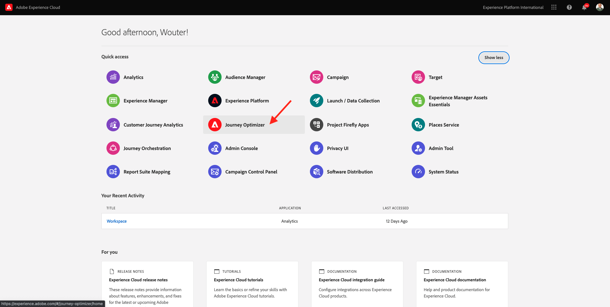

# 17.3 Create a Contact in Microsoft Dynamics 365 using Adobe Journey Optimizer & Import data from Microsoft Dynamics

In this exercise, you'll be doing the following tasks:

- Modify an existing journey, created in Module 6, to enable creation of contact in Microsoft Dynamics 365. For this modification we will be creating an action in Adobe Journey Optimizer.
- Verify the contact is created in Microsoft Dynamics 365 once you have submitted the Registration form on the AEP Demo website. 
- Setup a data flow from Microsoft Dynamics 365 to Adobe Experience Platform using Microsoft Power Automate. Power Automate is a service that helps you create automated workflows between your favorite apps and services to synchronize files, get notifications, collect data and more.
- Lastly, you'll test the complete flow and understand how data flows between applications.

## 17.3.1 Create Contact in Dynamics 365 using Adobe Journey Optimizer 

In this exercise, you'll edit your existing Journey created in Module 6 of Enablement. This new version of Journey will then create a Contact in Microsoft Dynamics 365 whenever a customer creates an account on the Demo System Next website. 

Go to [https://experience.adobe.com/#/home](https://experience.adobe.com/#/home). Click to open **Adobe Journey Optimizer**.



You'll then be redirected to the Adobe Journey Optimizer homepage. In the left menu, go to **Journeys** and search for your Account Creation journey, which is named by this naming convention: **ldap - Account Creation Journey**. This is the journey that you'll update in a couple of minutes. 


Before you can update your journey, you need to create a new **Action** in Adobe Journey Optimizer which will update Microsoft Dynamics 365.

To do that, go to **Configurations** in the left menu and click **Manage** under **Actions**.


Click **Create Action** to add a new action.


You'll then see this:


Fill out the following fields like this:

- Name: **ldapD365ContactCreation**, in this example: **vangeluwD365ContactCreation**
- Description: **Create a Contact in Dynamics 365**
- URL: **Your Web API URL/contacts**, which looks like this: **https://demosystemldapXX.crmX.dynamics.com/api/data/v9.1/contacts**, in this example: **https://demosystemvangeluw101.crm4.dynamics.com/api/data/v9.1/contacts**

**Note** : Make sure that the Web API URL uses https, or the call will be refused by Microsoft Dynamics

Your action now looks like this:


Next, under **Headers** you will need to add the following fields:

| Key | Value |
|----------|-------------|
|If-None-Match | null |
| OData-Version | 4.0 |
| Accept | application/json|
| OData-MaxVersion | 4.0 |

Your action now looks like this:


Next, under **Authentication** you will add how you connect to Microsoft Dynamics. In this case we will use OAuth2.0. 

For **TYPE**, choose **Custom** from the drop-down list.


Then add the following payload by clicking on the pencil icon. 


The payload screen will appear and you'll see this default payload sample.


Replace the default payload sample by the below payload. You will need to add your own connection credentials, as created in exercise 17.1.  Note, we are not using the client secret in this authentication.

Copy and paste this json:

```json
{
    "type": "customAuthorization",
    "authorizationType": "Bearer",
    "endpoint": "https://login.microsoftonline.com/common/oauth2/token",
    "method": "POST",
    "headers": {
        "content-type": "application/x-www-form-urlencoded"
    },
    "body": {
        "bodyType": "form",
        "bodyParams": {
            "grant_type": "password",
            "client_id": "",
            "username": "",
            "password": "",
            "resource": ""
        }
    },
    "tokenInResponse": "json://access_token"
}
```

You should now have this:


You'll now populate the fields with empty strings in this json with values as based on exercise 17.1:

| Field | Description | Example Value |
|--- |--- |--- |
|**client_id** | The Application (Client) ID of the Azure SyncContact app | 1dc2c2a1-ca26-4ab7-afa7-057acf441415 |
| **username** | The username you use to connect to Microsoft Dynamics 365 which will look like **admin@demosystemldapXX.onmicrosoft.com** | **admin@demosystemvangeluw101.onmicrosoft.com** |
| password | the password you use to connect to Microsoft Dynamics 365 | **Password_1234** |
| resource | The URL of the Microsoft Dynamics instance which looks like **https://ldapaepdemoXX.crmX.dynamics.com** | https://demosystemvangeluw101.crm4.dynamics.com/ |


Click **Save**

Click **Click to test the authentication**, and if your payload is correct it should turn green and say that the Authentication was successful.


Next, under **Action parameters** you will need to add the following payload by clicking on the pencil icon. Roll over the **i** icon to display the icon to edit the payload.


The Field configuration screen will appear.


Use this payload json.

Copy this json:

```json
{
    "emailaddress1": {
        "toBeMapped": true,
        "dataType": "string",
        "label": "email"
    },
    "firstname": {
        "toBeMapped": true,
        "dataType": "string",
        "label": "fName"
    },
    "lastname": {
        "toBeMapped": true,
        "dataType": "string",
        "label": "lName"
    }
}
```

Paste it into the Payload window.


Click **Save** on the Field Configuration window.

Click **Save** to save your action.


Now you are ready to edit the **ldap - Account Creation Journey**.

In the left menu, click **Journeys** and search for your **ldap - Account Creation Journey** that you created in Module 6. Click to open the journey and edit it.


Click the arrow next to the **Duplicate** button to see the drop-down. Select **Create a new version**.


Click **Create a new version** in the pop-up.


First you will need to remove the **End** orchestration step. Click **End** and click the bin icon in the right panel. Click **Confirm**.


Now search for your Action from the left panel. Search for **ldapD365** and your Action should appear under **Actions**.


Drag your **ldapD365ContactCreation** action onto the canvas, after the **Email** action.

You'll then see this.


You now need to edit the **Action parameters**.

For the **EMAIL** Parameter, click the pencil/edit icon.


Search for **email** and select the email field under **ldapAccountCreationEvent.``--aepTenantId--``.identification.core.email**.


For the **FNAME** Parameter, click the pencil/edit icon.


Search for **firstName** and select the email field under **ExperiencePlatform.ProfileFieldGroup.profile.person.name.firstName**.


For the **LNAME** Parameter, click the pencil/edit icon.


Search for **lastName** and select the email field under **ExperiencePlatform.ProfileFieldGroup.profile.person.name.lastName**.


Your action now looks like this.


Click **OK**.


Re-add the **End** orchestration. Clear the search term and under **ORCHESTRATION**, drag **End** to the next step in the Journey.


Click **Ok**.


Your Journey should now look like this:


Click **Publish**.


Click **Publish** in the pop-up.


After a couple of seconds, your journey will be published and live.

## 17.3.2 Create your account to test

Open your demo website and load a brand of choice. Go to the **Login/Register**-page.

Fill out the form fields and finish by clicking **CREATE ACCOUNT**.


After clicking **CREATE ACCOUNT**, go back to your Microsoft Dynamics 365 dashboard and go to contacts. Search for your email-address and you'll find your contact created inside Microsoft Dynamics 365 in real-time.


Next Step: [17.4 Update a contact in Microsoft Dynamics 365 and automatically trigger a journey](./ex4.md)

[Go Back to Module 17](./adobe-experience-platform-microsoft-dynamics-365.md)

[Go Back to All Modules](./../../overview.md)
