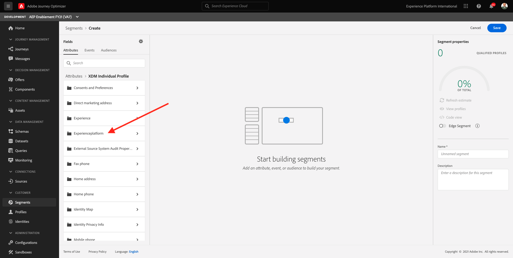
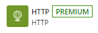
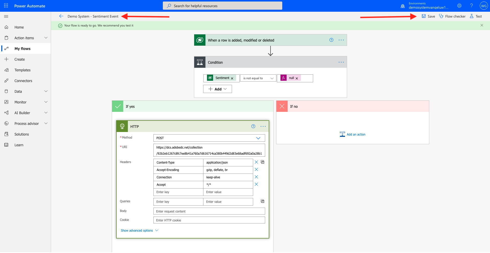

# 17.4 Update a contact in Microsoft Dynamics 365 and automatically trigger a journey

## 17.4.1 Create a segment in Adobe Experience Platform for customers with a negative sentiment

Go to [https://experience.adobe.com/#/home](https://experience.adobe.com/#/home). Click to open **Adobe Journey Optimizer**.


You'll then be redirected to the Adobe Journey Optimizer homepage.


In the left menu, go to **Segments**. Click **+ Create Segment**.


In Attributes, click **XDM Individual Profile**.


Click your tenant specific object, which is similar to `--aepTenantIdSchema--`.



Go to **individualScoring**.


Select **sentiment** and drag and drop it on the canvas.


Enter the values **0** and **Negative**.


Go to **Events** and click **XDM ExperienceEvent**.


Click your tenant specific object, which is similar to `--aepTenantIdSchema--`.


Next, click **demoEnvironment**.


Drag and drop **ldap** to the canvas.


Enter your ldap.


Use this naming convention to name your segment: **ldap - D365 Sentiment: Negative**, in this example that should be **vangeluw - D365 Sentiment: Negative**.


Click **Save**. After clicking Save, you'll be redirected here:


## 17.4.2 Configure a journey to trigger when sentiment becomes negative

Go to **Journeys**. Click **Create Journey** to create a new journey.


You'll then see this. Enter a name for your journey. Use this naming convention: **ldap - D365 Sentiment: Negative**, which in this example becomes **vangeluw - D365 Sentiment: Negative**. 

Click **OK**.


From the left menu, drag and drop the **Segment Qualification** event onto the canvas.


Click the **Edit** icon to select a segment.


In the popup, select the segment you created in exercise 17.4.1, which was named **ldap - D365 Sentiment: Negative**.

Click **Save**.


Make sure that the **Enter** check box is selected (e.g. we want the journey to be triggered on segment qualification). Click **OK**.


In the left menu, go to **Actions** and search for the action **ldapSmsTwilio** that you created in module 12.


Drag and drop the action **ldapSmsTwilio** onto the canvas as the next step in your journey. 

Click on the **Edit** icon for the Action Parameter **TEXTMESSAGE**.


You'll see a popup with the **Simple Mode Editor**.


In the popup you'll see, click on **Advanced Mode**. You'll then see this.


In this text message, you'll use the customer's first name. You can either select the path to the field First name, or you can copy and paste the below text.

Paste this code in the **Advanced Mode Editor**. Click **OK**.

>[!NOTE]
>
>If you paste the below text, please verify the path as it's possible that in your Adobe Experience Platform instance, the data source and field group are named in a different way. 

`#{ExperiencePlatform.ProfileFieldGroup.profile.person.name.firstName} + ", we'd like to apologize for the negative experience you had. We're looking into this and we'll contact you in the next 2 business days."`

You should now have this. Click **OK** to save your changes.


Next, click on the **Edit** icon for the Action Parameter **MOBILENR**.


You'll see a popup with the **Simple Mode Editor**.


In the popup you'll see, click on **Advanced Mode**. 

Paste this code in the **Advanced Mode Editor**. 

`substr(#{ExperiencePlatform.ProfileFieldGroup.profile.mobilePhone.number}, 0, 12)`

You'll then see this.


>[!NOTE]
>
>This code is intended to work with mobile phone numbers that have 12 digits (including the +), like this one: **+32463622044**.
>Several other countries have 13-digit phone numbers. If your mobile phone number has 13 digits (including the +), you need to update this code to:
>
>`substr(#{ExperiencePlatform.ProfileFieldGroup.profile.mobilePhone.number}, 0, 13)`

Click **OK** to save your changes. You'll then have this.


Click **OK** once more.

Next, in the left menu, go to Orchestration. Drag and drop the orchestration event **End** onto the canvas. Click **OK**.


Your journey is ready to be published now. Click **Publish**.


Click **Publish** again.


Your journey is now published.


## 17.4.3 Create automation using Microsoft Automate (Flow) to listen to the sentiment change

After creating a journey that will trigger when customer sentiment changes, you'll now create a flow in Microsoft Power Automate that will listen to a change to the sentiment field in Microsoft Dynamics 365 and then send an update to the Real-time Customer Profile in Adobe Experience Platform.

Go to [https://flow.microsoft.com](https://flow.microsoft.com). Sign in with the Microsoft account you created in exercise 1.

You'll be redirected to the Microsoft Power Automate home screen.


In the top right menu bar, click **Environments** and select the environment you just created.


In the left menu, click **My Flows**.


Click **+ New**, then click **Automated cloud flows - from blank**.


In Choose your flow's trigger, search for **Microsoft Dataverse**. From the result list, select **When a row is added, modified or deleted.**


Click **Create**.


You will be redirected to the **Flow creation** screen.


Select these settings:

- **Change Type**: select **Update**
- **Entity Name**: select **Contacts**
- **Scope**: select **User**


Click **+ New step**.


Click **Condition** from the list of available actions.


You will now see the Condition field and **Yes/No** options


In the **Condition** panel, click the **Choose a value** field and start searching for the **Sentiment** you created in Dynamics. Click **Sentiment Value** and you'll see it assigned into the Condition.


Set the operator to **is not equal to**.


Click in the **Choose a value** field and select the **Expression** option


Type **null** and click **OK**.


Your Condition now looks like this:


Next, you'll enter the **If yes** expression.

Click **Add an action** in the **If yes** expression.


From the **Choose an action**, search for **HTTP**.


Click the **HTTP PREMIUM** option.



You'll now see the expression builder options.


Follow these instructions to set the fields of the HTTP expression builder:

- Method: **POST**
- URI: `--dcsInletId--`

Enter the following Header values

| Header              | Value                 |
| ------------------- | --------------------- |
| **Content-Type**    | **application/json**  |
| **Accept-Encoding** | **gzip, deflate, br** |
| **Connection**      | **keep-alive**        |
| **Accept**          | \*/*                  |

You should now have this:


At the point it is good to save the Flow. Enter the name **Demo System - Sentiment Event** in the title field. Click **Save**.



Next, you need to enter the **Body** of the HTTP request.

Copy the below payload and paste it in the field **Body**.

```json
{
  "header": {
    "datasetId": "--msftProfileDatasetId--",
    "imsOrgId": "--aepImsOrgId--",
    "source": {
      "name": "D365 Sentiment Change"
    },
    "schemaRef": {
      "id": "https://ns.adobe.com/--aepTenantIdSchema--/schemas/--msftProfileSchemaRef--",
      "contentType": "application/vnd.adobe.xed-full+json;version=1"
    }
  },
  "body": {
    "xdmMeta": {
      "schemaRef": {
        "id": "https://ns.adobe.com/--aepTenantIdSchema--/schemas/--msftProfileSchemaRef--",
        "contentType": "application/vnd.adobe.xed-full+json;version=1"
      }
    },
    "xdmEntity": {
      "--aepTenantId--": {
        "identification": {
          "core": {
            "email": "@{triggerOutputs()?['body/emailaddress1']}",
            "d365": "@{triggerOutputs()?['body/contactid']}"
          }
        },
        "individualScoring": {
          "sentiment": "@{triggerOutputs()?['body/new_sentiment']}"
        }
      },
      "person": {
        "name": {
          "firstName": "@{triggerOutputs()?['body/firstname']}",
          "lastName": "@{triggerOutputs()?['body/lastname']}"
        }
      },
      "personalEmail": {
        "address": "@{triggerOutputs()?['body/emailaddress1']}"
      }
    }
  }
}
```

Click **Save**.


To test your automation, go back to your Microsoft Dynamics 365 Dashboard, and go to **Contacts**. Open the contact record for the profile you created on the demo website as part of the previous exercise.


Scroll down to the **Sentiment** field and change the value for that customer to **Negative**. Lastly, save your changes.


By saving your changes in Microsoft Dynamics 365, an automated request will be sent from Microsoft Dynamics 365 to Adobe Experience Platform which will update the Real-time Customer Profile in Adobe Experience Platform and as a consequence, your journey in Adobe Journey Optimizer will be activated. You should now receive the text message within minutes.


Next Step: [Summary & benefits](./summary.md)

[Go Back to Module 17](./adobe-experience-platform-microsoft-dynamics-365.md)

[Go Back to All Modules](./../../overview.md)
