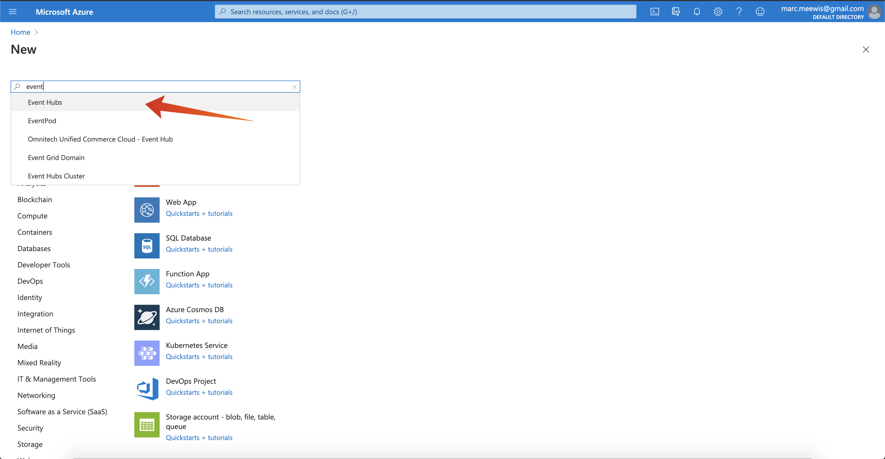
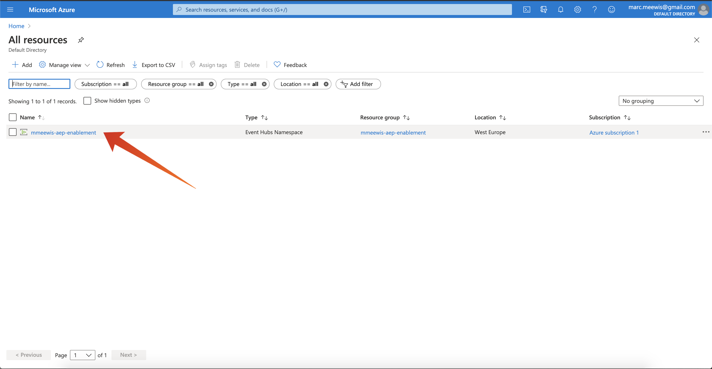

# 18.1 Configure your Microsoft Azure EventHub environment

Azure Event Hubs is a highly scalable publish-subscribe service that can ingest millions of events per second and stream them into multiple applications. This lets you process and analyze the massive amounts of data produced by your connected devices and applications.

## 18.1.1 What is Azure Event Hubs?

Azure Event Hubs is a big data streaming platform and event ingestion service. It can receive and process millions of events per second. Data sent to an event hub can be transformed and stored by using any real-time analytics provider or batching/storage adapters.

Event Hubs represents the **front door** for an event pipeline, often called an event ingestor in solution architectures. An event ingestor is a component or service that sits between event publishers (like Adobe Experience Platform RTCDP) and event consumers to decouple the production of an event stream from the consumption of those events. Event Hubs provides a unified streaming platform with time retention buffer, decoupling event producers from event consumers.

## 18.1.2 Create a Event Hubs namespace

Go to [https://portal.azure.com/#home](https://portal.azure.com/#home) and select **Create a resource**. 

In the resource screen, enter **Event** in the search bar and select **Event Hubs** from the dropdown:

Click **Create**:

If this is the first time that you create a resource in Azure, you will need to create a new **Resource group**. If you have already a resource group you can select it (or create a new one).

Select **Create new**, name your group **ldap-aep-enablement** and replace ldap with your ldap, for example **mmeewis-aep-enablement**

Complete the test of the fields as indicated:

- Namespace : Define your namespace, it has to be unique, use the following pattern **ldap-aep-enablement** and replace **ldap** with your ldap, for example **mmeewis-aep-enablement**
- Location: **West-Europe** refers to the Azure datacenter in Amsterdam
- Pricing tier: **Basic**
- Throughput Units: **1**

Click **Review + create**.

Click **Create**.

The deployment of your resource group can take 1-2 minutes, when successful you will see the following screen:

## 18.1.3 Setup your Event Hub in Azure

Go to [https://portal.azure.com/#home](https://portal.azure.com/#home) and select **All resources**. 

From the resource list, select your **ldap-aep-enablement** namespace:
  

  
In **ldap-aep-enablement** detail screen, select **Event Hubs**:
  

Click **+ Event Hub**.

Use **ldap-aep-enablement-event-hub** as the name, for example **mmeewis-aep-enablement-event-hub** and hit **Create**.

  
Click **Event Hubs** in your event hub namespace. You should now see your **Event Hub** listed. If that is the case you can move on to the next exercise.

## 18.1.4 Setup your Azure Storage Account

To debug your Azure Event Hub function in later exercises, you'll need to provide an Azure Storage Account as part of your Visual Studio Code project setup. You'll now create that Azure Storage Account.

Go to [https://portal.azure.com/#home](https://portal.azure.com/#home) and select **Create a Resource**.

Enter **storage** in the search and select **Storage Account** from the list.

Select **Create**.

Specify your **Resource Group** (created in the beginning of this exercise), use **ldapaepstorage** as your Storage account name, for example **mmeewisaepstorage**, and select **Locally-redundant storage (LRS)**, then click **Review + create**.

Click **Create**.

Your Storage Account creation will take a couple seconds:

When finished your screen will display the **Go to resource** button. 

Click **Microsoft Azure**.

Your Storage Account is now visible under **Recent Resources**.

Next Step: [18.2 Configure your Azure Event Hub Destination in Adobe Experience Platform](./ex2.md)

[Go Back to Module 18](./segment-activation-microsoft-azure-eventhub.md)

[Go Back to All Modules](./../../overview.md)
