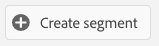

# 18.3 Create a Streaming Segment

## 18.3.1 Introduction

You'll create a simple segment:

- **Citi Signal Sports Fan** for which customer profiles will qualify when they visit the **Sports** page of the Citi Signal brand. 

### Good to know

Adobe Experience Platform Real-time CDP will trigger an activation to a destination when you qualify for a segment that is part of that destination's activation list. When that is the case, the segment qualification payload that will be send to that destination will contain **all the segments for which your profile qualifies**. 

The goal of this module is to show that your Customer Profile's segment qualification is sent to **your** event hub destination in real-time. As a result our segment definition will have to include your **ldap** so that it only identifies your profiles. 

To avoid that and to keep the qualification payload small, we will only look at experience events that contain the field **brand.ldap** equal to **your ldap**

### Segment Status

A segment qualification in Adobe Experience Platform always has a **status**-property and can be one of the following:

- **realized**: this indicates a new segment qualification
- **existing**: this indicates an existing segment qualification
- **exited**: this indicates that the profile does no longer qualify for the segment

## 18.3.2 Build the segment

Building a segment is explained in detail in [Module 11](../module11/real-time-cdp-build-a-segment-take-action.md).

### Create Segment

Log in to Adobe Experience Platform by going to this URL: [https://experience.adobe.com/platform](https://experience.adobe.com/platform).

After logging in, you'll land on the homepage of Adobe Experience Platform.


Before you continue, you need to select a **sandbox**. The sandbox to select is named ``--aepSandboxId--``. You can do this by clicking the text **[!UICONTROL Production Prod]** in the blue line on top of your screen.


After selecting the appropriate sandbox, you'll see the screen change and now you're in your dedicated sandbox.


Go to **Segments**. 


Click the **+ Create segment** button.



Name your segment **ldap - Citi Signal Sports Fan** and add the page name experience event:

Click on **Events**, and drag and drop **XDM ExperienceEvent > Web > Web page details > Name**. Enter **Sports** as the value:


Drag and drop **XDM ExperienceEvent > --aepTenantIdSchema-- > demoEnvironment > ldap**. Enter your **ldap** as the value and click **Save**:


### PQL Definition

The PQL of your segment looks like:

```code
select _Any1 from xEvent where _Any1.web.webPageDetails.name.equals("Sports", false) and _Any1._experienceplatform.demoEnvironment.ldap.equals("vangeluw", false)
```

Next Step: [18.4 Activate Segment](./ex4.md)

[Go Back to Module 18](./segment-activation-microsoft-azure-eventhub.md)

[Go Back to All Modules](./../../overview.md)
