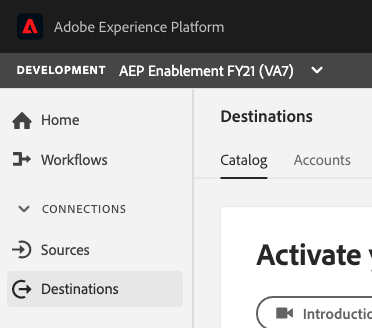
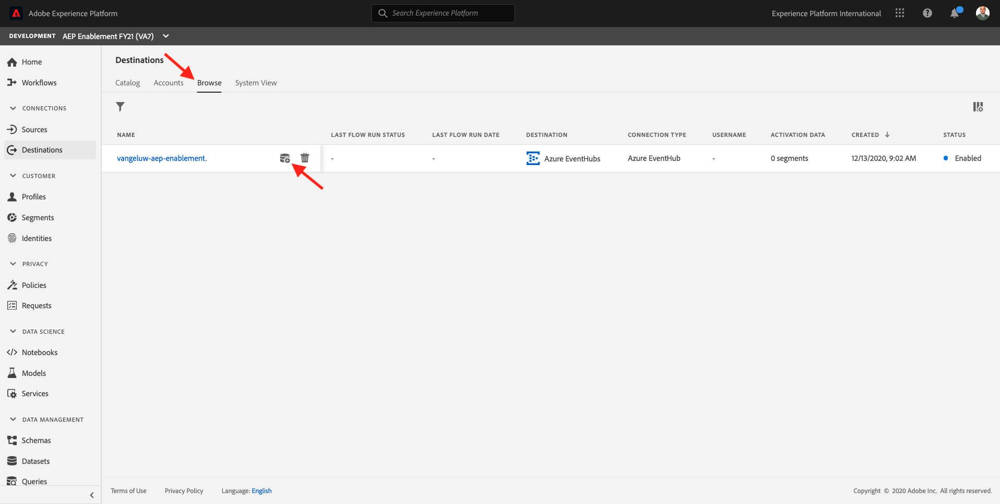
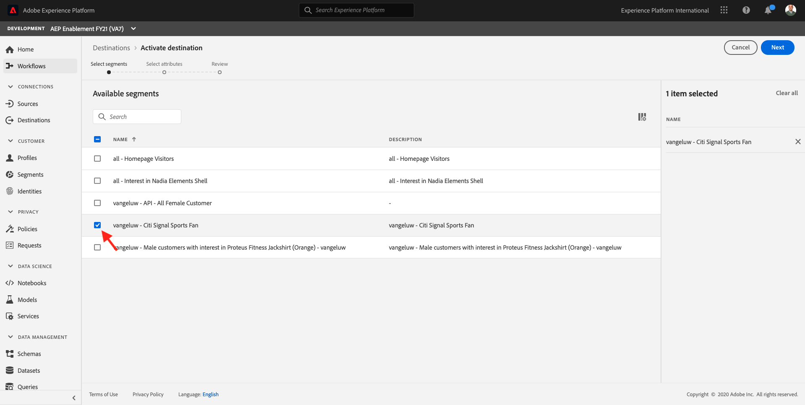
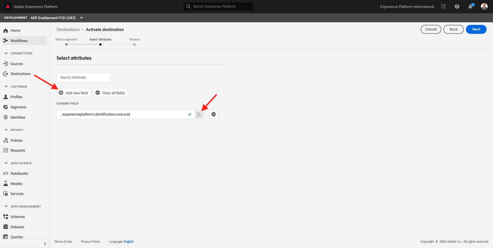
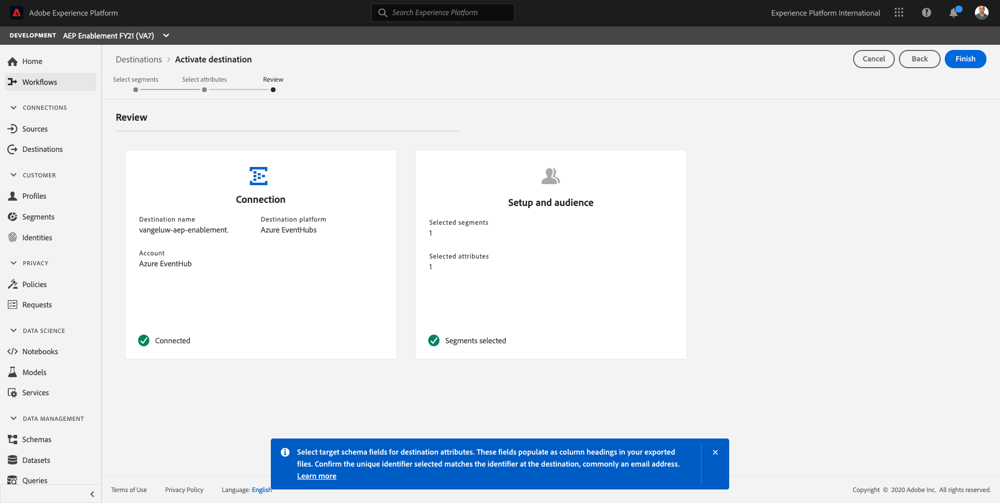
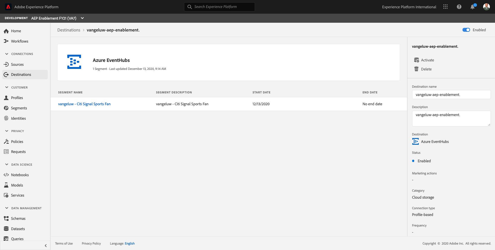

# 18.4 Activate Segment

## 18.4.1 Add Segment to Azure Event Hub Destination

In this exercise you will add your segment **ldap - Citi Signal Sports Fan** to your **ldap-aep-enablement** Azure Event Hub destination.

Log in to Adobe Experience Platform by going to this URL: [https://experience.adobe.com/platform](https://experience.adobe.com/platform).

After logging in, you'll land on the homepage of Adobe Experience Platform.

Before you continue, you need to select a **sandbox**. The sandbox to select is named ``--aepSandboxId--``. You can do this by clicking the text **[!UICONTROL Production Prod]** in the blue line on top of your screen.

After selecting the appropriate sandbox, you'll see the screen change and now you're in your dedicated sandbox.

Go to **Destinations**. 

In **Destinations**, click **Browse**. You'll then see all available destinations. Locate your destination and click the **+** icon as indicated below.

You'll then see this. Search for your segment using your ldap and select **ldap - Citi Signal Sports Fan** from the list of segments.

Click **Next**.

Adobe Experience Platform Real-time CDP can deliver a payload to two types of destinations, segment destinations and profile destinations.

Segment destinations will receive a predefined segment qualification payload that will be discussed later. Such a payload contains **all** the segment qualifications for a specific profile. Even for segments that are not in de destination's activation list. An example of such a segment destination are **Azure Event Hubs** and **AWS Kinesis**.

Profile based destinations let you pick any attribute (firstName, lastName, ...) from the XDM Profile Union Schema and include it in the activation payload. An example of such destination is the **Email Marketing**.

Because your Azure Event Hub destination is a **segment** destination, select for example the field `--aepTenantId--.identification.core.ecid`. 

Click **Add new field**, click browse schema and select the field `--aepTenantId--identification.core.ecid` (delete any other field that would be displayed automatically).

Click **Next**.

Click **Finish**.

Your segment is now activated towards your Microsoft Event Hub destination.

Next Step: [18.5 Create your Microsoft Azure Project](./ex5.md)

[Go Back to Module 18](./segment-activation-microsoft-azure-eventhub.md)

[Go Back to All Modules](./../../overview.md)
