# 18.6 End-to-end scenario

## 18.6.1 Start Azure Event Hub trigger

To show the payload send by Adobe Experience Platform Real-time CDP to our Azure Event Hub upon segment qualification, we need to start our simple Azure Event Hub trigger function. This function will simple "dump" the payload to the console in Visual Studio Code. But remember this function can be extended in any way to interface with all sorts of environments using dedicated API's and protocols.

### Launch Visual Studio Code and start project

Make sure to have your Visual Studio Code project opened and running

To start/stop/restart your Azure function in Visual Studio Code, refer to the following exercises:

- [Exercise 18.5.4 - Start Azure Project](./ex5.md)
- [Exercise 18.5.5 - Stop Azure Project](./ex5.md)

Your Visual Studio Code's **Terminal** should mention:

```code
Hosting environment: Production
Content root path: /Users/mmeewis/Projects/adobe.node/azure.function/event-hub-enablement
Now listening on: http://0.0.0.0:7071
Application started. Press Ctrl+C to shut down.
[22/06/2020 12:55:03] Host lock lease acquired by instance ID '0000000000000000000000006A61AFA2'.
[22/06/2020 12:55:03] Debugger attached.
```

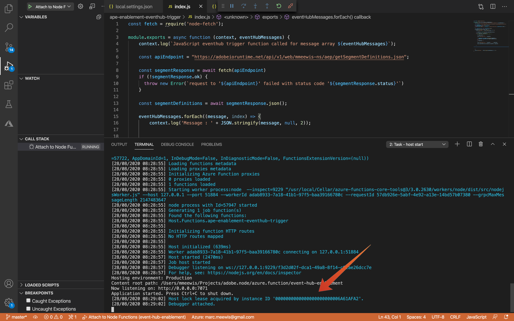

## 18.6.2 Citi Signal

Go to [https://public.aepdemo.net/](https://public.aepdemo.net/). Load and save your Configuration ID. 

>[!NOTE]
>
>Please ensure you're using a Configuration ID that is ingesting data into this sandbox: `--module18sandbox--`

Then, select your **ldap**, select the brand **Citi Signal** and go to the Citi Signal homepage:

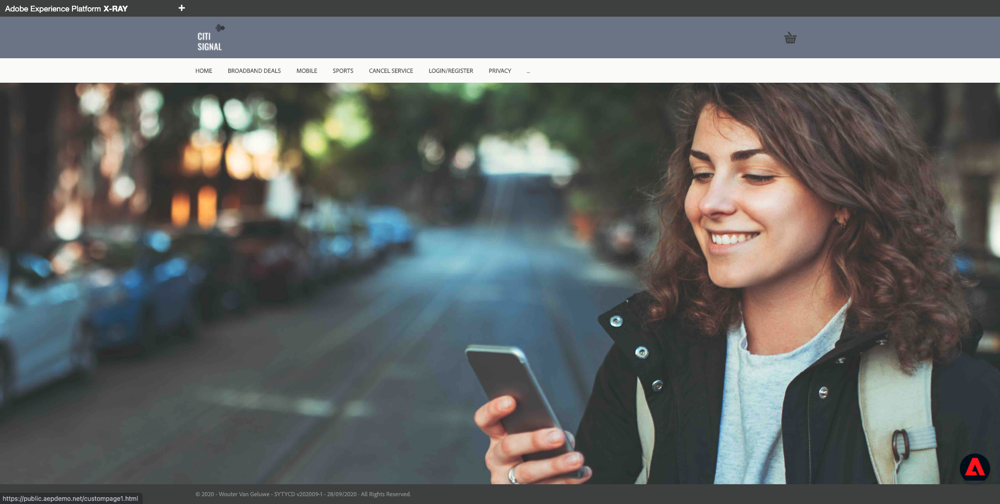

When you open **Adobe Experience Platform X-RAY** you should be anonymous (you only have an ECID identity) and you should be member of only one segment **Homepage Visitors**:

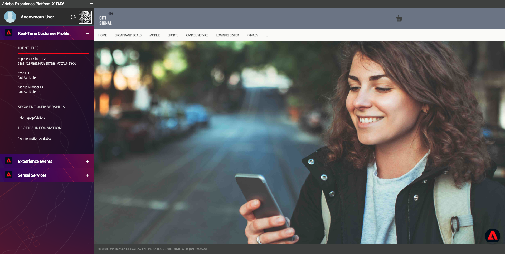

Switch back to Visual Studio Code and look at your **TERMINAL** tab, nothing changed. This is normal because our destination will only trigger when your profile will qualify for **Citi Signal Sports Fan**.

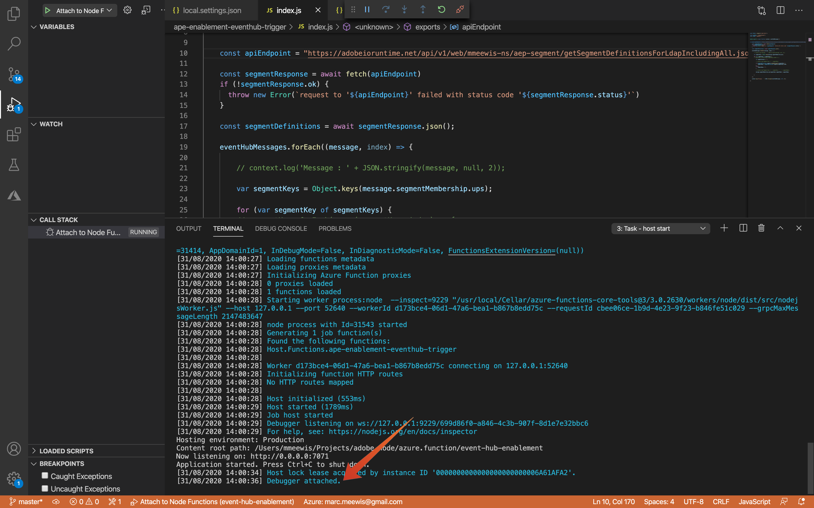


## 18.6.3 Qualify for your Citi Signal Sports Fan segment

Navigate to the **Sports** page once, and **do not reload or refresh it**. This action should qualify you for your **ldap - Citi Signal Sports Fan** segment. 

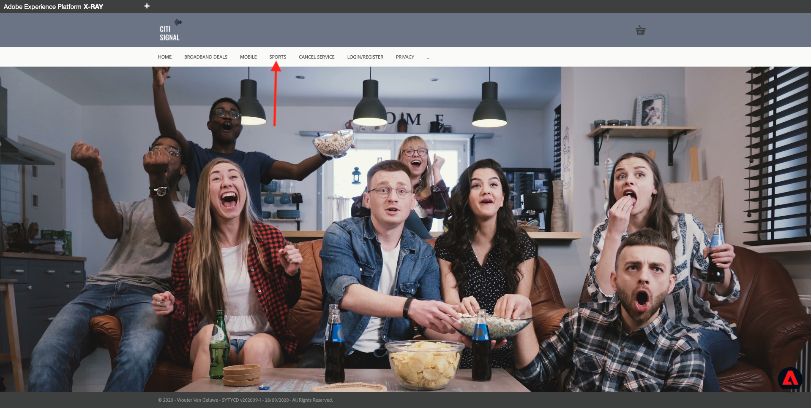

To verify, open another page to make sure that the X-Ray panel refreshes. If you would reload the **Sports** page to refresh the X-Ray panel, the segment qualification status would change and that is not what we want at this moment. 

Instead open **BROADBAND DEALS** and open the X-Ray panel, you should now be a member of both the **Citi Signal Sports Fan**  and the **Homepage Visitor** segments. If you segment memberships are not yet updated in your X-Ray panel, reload the page.  

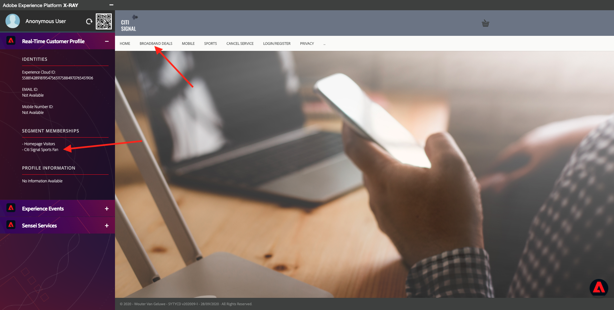

Switch back to Visual Studio Code and look at your **TERMINAL** tab, you should see a list of segments for your specific **ECID**. This activation payload is delivered to your event hub as soon as you qualify for the **Citi Signal Sports Fan** streaming segment. Note that the segment name in the payload has been added by our Azure function because Adobe Experience Platform Real-time CDP only includes the segmentId.

When you take a closer look a the segment payload, you can see that **Homepage Visitor** is in status **existing** and **Citi Signal Sports Fan** is in status **realized**. 

A segment status of **realized** means that our profile is entering the segment. While the **existing** status means that our profile continues to be in the segment.

Although this is our first activation, **Homepage Visitors** already is in status **existing**. The reason is that **Citi Signal Sports Fan** is triggering the activation because we are entering the segment. When a segment triggers an  activation, all segments for which our profile qualifies are included into the activation payload. The segments for which we already qualified before are listed with a status **existing** because our profile continues to be in the segment.

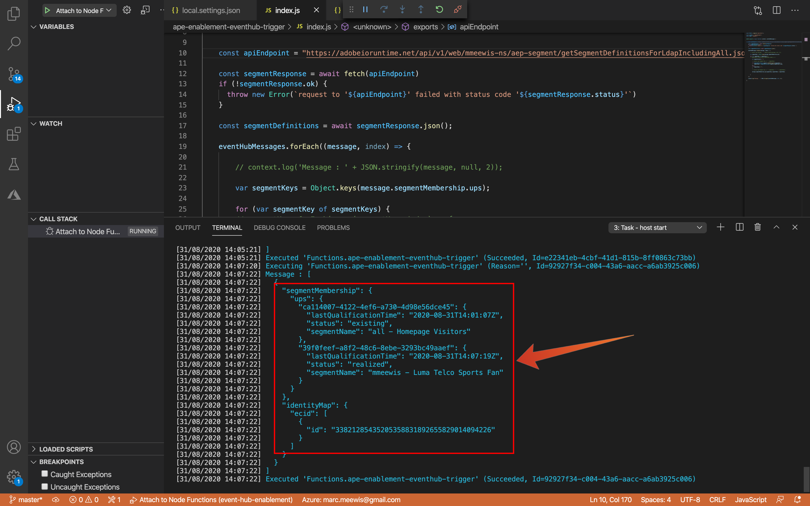

## 18.6.4 Visit the Sports page for a second time

From the **Broadband deals** page navigate back to the **Sports** page.


And Switch back to Visual Studio Code and verify your **TERMINAL** tab. You will see that we still have our two segments, but now in status **existing** which means that our profile continues to be in the segment.

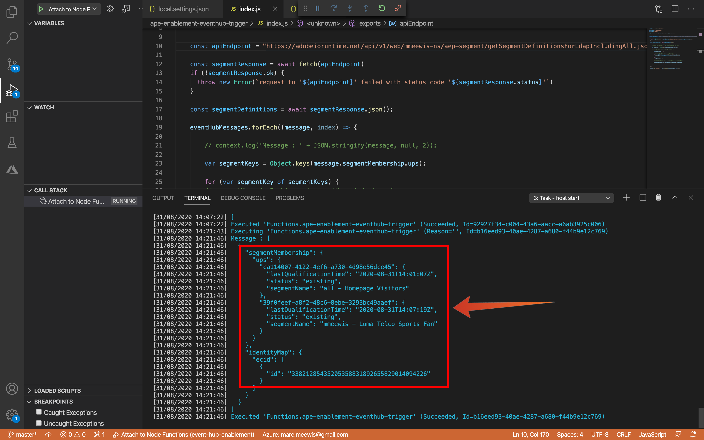

## 18.6.5 Visit the Sports page for a third time

If you would revisit the **Sports** page for a third time, no activation will take place, because there is no state change from a segment point of view. 

Segment activations only happen when the segment's status changes:

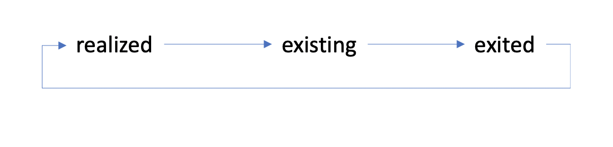

## 18.6.6 - Activation payload for a known profile

In the previous exercises you saw segment activations streamed to Azure Event Hub for anonymous profiles and as a consequence only the **ECID** was included as part of the identity map in the activation payload that was delivered to your Azure Event Hub function. In this last exercise you'll take a look at the activation payload for a known profile.

Quit you browser completely and open Citi Signal again in an incognito window.

Navigate to **Login/Register** and create a profile:

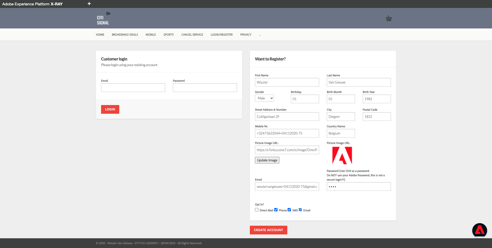

Navigate to the **Sports** page, this will make your known profile qualify for **Citi Signal Sports Fan**. After the page loaded, navigate to the home page and open X-Ray to validate your segment qualifications:

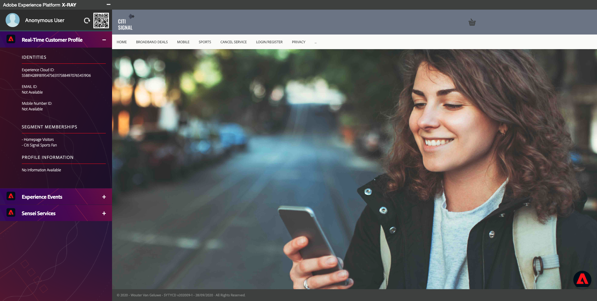

If you see the qualifications, switch to Visual Studio Code and look at your **TERMINAL** tab. The output of the azure function will include the segments and a full identity map of your profile. These identities can be used by the Azure function to link the segments to customer in a third party application using that application's customer identifier:

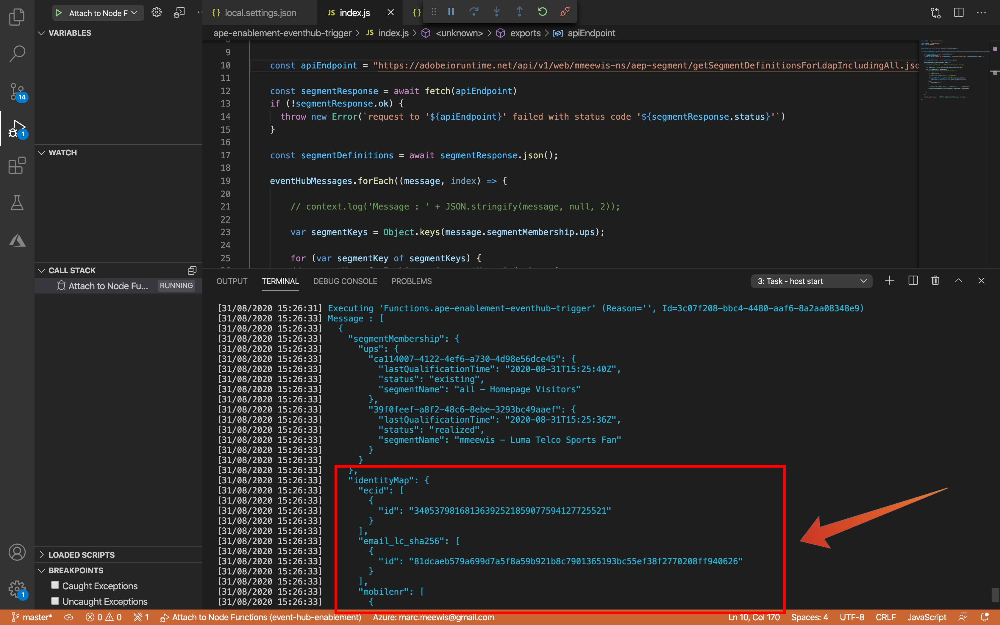

Payload detail:

```json
[
  {
    "segmentMembership": {
      "ups": {
        "3a4ec8f1-5612-47b5-b58a-0b15a91cc7e6": {
          "lastQualificationTime": "2020-12-13T09:11:26Z",
          "status": "existing",
          "segmentName": "all - Homepage Visitors"
        },
        "50a9e917-a7c4-4341-9f85-e3ba22f869a1": {
          "lastQualificationTime": "2020-12-13T09:10:52Z",
          "status": "existing",
          "segmentName": "vangeluw - Citi Signal Sports Fan"
        }
      }
    },
    "identityMap": {
      "phone": [
        {
          "id": "+32473622044+13122020-1"
        }
      ],
      "ecid": [
        {
          "id": "14146183802541965561933129890668766623"
        }
      ],
      "email_lc_sha256": [
        {
          "id": "ac2f9508eda32cd90bcf3f9810837e1a70ffd8bb42cf059a5365f5856f79f5e1"
        }
      ],
      "email": [
        {
          "id": "woutervangeluwe+13122020-1@gmail.com"
        }
      ]
    }
  }
]
```

Next Step: [Summary and benefits](./summary.md)

[Go Back to Module 18](./segment-activation-microsoft-azure-eventhub.md)

[Go Back to All Modules](./../../overview.md)
