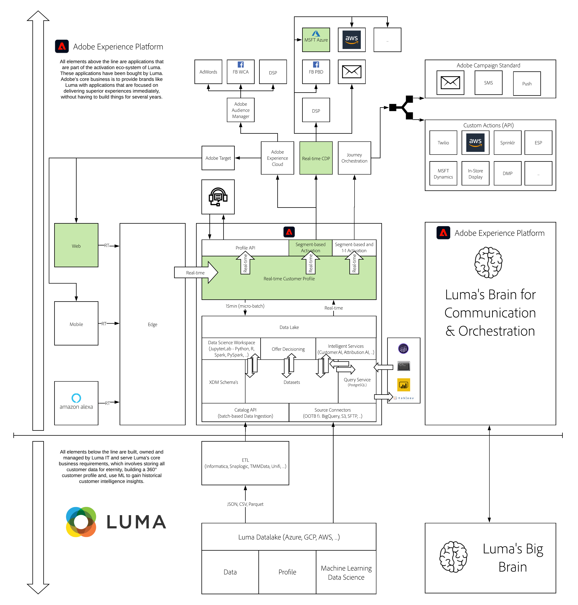

# 18. Segment Activation to Microsoft Azure Event Hub

**Authors: [Marc Meewis](https://www.linkedin.com/in/marcmeewis/), [Wouter Van Geluwe](https://www.linkedin.com/in/woutervangeluwe/)**

In this module, you'll setup a Microsoft Azure EventHub destination as a real-time destination for Adobe Experience Platform Real-time CDP. You will also setup and deploy an Azure function that will be triggered in real-time whenever Adobe Experience Platform delivers a segment payload to your Azure EventHub destination. The Azure Function that you'll trigger will show the mechanism of Adobe Experience Platform Real-time CDP's activation capabilities.

As part of this module you will also get an understanding of what triggers Real-time CDP to actually deliver a payload to a specified destination. We will also discuss the status of a segment qualification and how it relates to activation.

Adobe Experience Platform Real-time CDP supports data activation to streaming cloud storage destinations, allowing you to export audience data and events in real-time to these destinations in JSON format. You can then describe business logic on top of these events in your destinations

Microsoft Azure Event Hubs is a fully managed, real-time data ingestion service that’s simple, trusted, and scalable. Stream millions of events per second from any source to build dynamic data pipelines and immediately respond to business challenges.

## Learning Objectives

- Become familiar with the Microsoft Azure Event Hubs
- Setup an RTCDP destination to your Microsoft Azure Event Hub
- Understand when Real-time CDP activates and what the activation payload looks like
- Setup Visual Studio Code to develop, test and deploy your Azure project
- Create and deploy an Azure function that consumes segments qualifications delivered in real-time by RTCDP

## Prerequisites

- Access to [Adobe Experience Platform](https://experience.adobe.com/platform)
- Familiarity with the AEP Demo website environment
- Understand how to define, use and activate Streaming Segments in Adobe Experience Platform

>[!IMPORTANT] 
>
>This tutorial was created to facilitate a particular workshop format. It uses specific systems and accounts to which you might not have access. Even without access, we think you can still learn a lot by reading through this very detailed content. If you're a participant in one of the workshops and need your access credentials, please contact your Adobe representative who will provide you with the required information.

## Architecture Overview

Have a look at the below architecture, which highlights the components that will be discussed and used in this module.

## Sandbox to use

For this module, please use this sandbox: `--module18sandbox--`.

>[!NOTE]
>
>Don't forget to install, configure and use the Chrome Extension as referenced in [0.6 - Install the Chrome extension for the Experience League documentation](../module0/ex6.md)

## Exercises

[18.0 Configure your environment](./ex0.md)

In this exercise, you'll setup your Microsoft Azure environment.

[18.1 Configure your Microsoft Azure EventHub environment](./ex1.md)

In this exercise you'll setup your Microsoft Azure EventHub environment.

[18.2 Configure your Azure Event Hub Destination in Adobe Experience Platform](./ex2.md)

In this exercise you'll setup your Real-time CDP destination connection that will deliver segments in real-time to the EventHub that you've configured in the previous exercise.

[18.3 Create Streaming Segments](./ex3.md)

In this exercise you will create a streaming segment in Adobe Experience Platform

[18.4 Activate Segment](./ex4.md)

In this exercise you'll activate your streaming segment to your Real-time CDP EventHub destination.

[18.5 Create your Microsoft Azure Project](./ex5.md)

In this exercise you will create an Azure function that will be triggered in real-time when Adobe Experience platform activates segment qualifications to the corresponding Azure Event Hub destination.

[18.6 End-to-end scenario](./ex6.md)

At this point, everything is setup. You can now do some browsing on your AEP Demo website and get segment qualifications delivered to your Microsoft Azure EventHub Trigger function.  

[Summary and benefits](./summary.md)

Summary of this module and overview of the benefits.

>[!NOTE]
>
>Thank you for investing your time in learning all there is to know about Adobe Experience Platform. If you have questions, want to share general feedback of have suggestions on future content, please contact Wouter Van Geluwe directly, by sending an email to **vangeluw@adobe.com**.

[Go Back to All Modules](../../overview.md)
