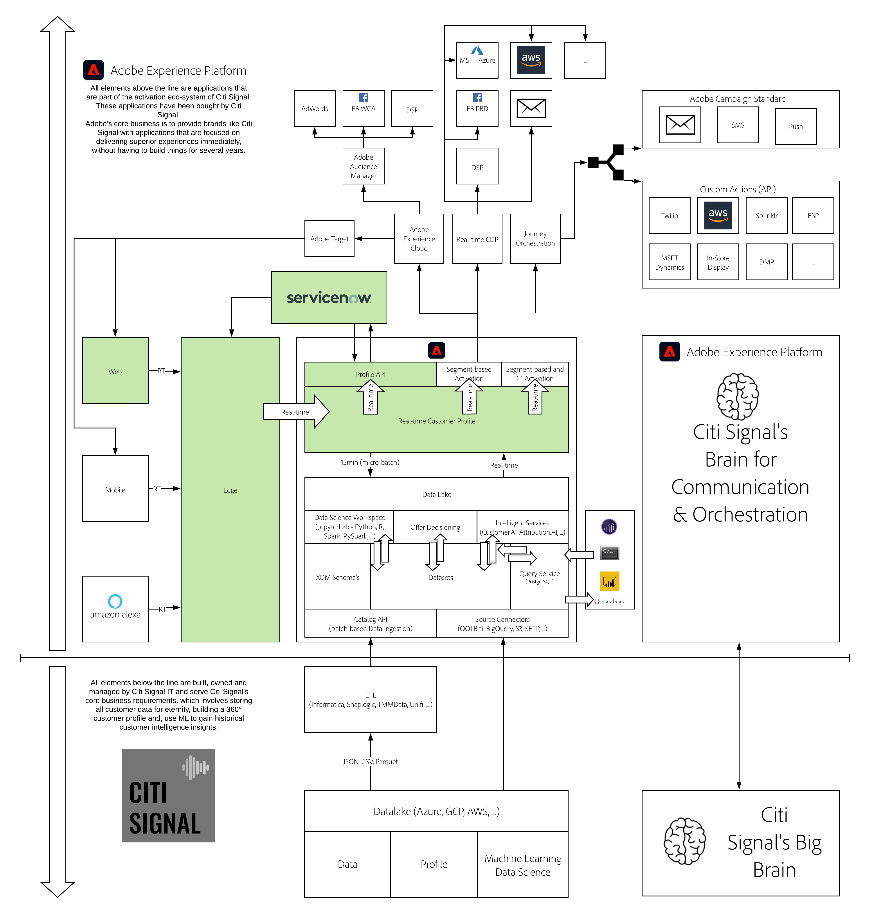

# 19. Adobe Experience Platform and ServiceNow: connecting service to marketing and sales

**Author: [Wouter Van Geluwe](https://www.linkedin.com/in/woutervangeluwe/)**

In this module you'll implement the bi-directional integration between Adobe Experience Platform and ServiceNow. 

Please watch this video to understand the value, customer journey and configuration process:

>[!VIDEO](https://video.tv.adobe.com/v/39483?quality=12&learn=on)

## Learning Objectives

- Become familiar with ServiceNow
- Configure the integration between Adobe Experience Platform and ServiceNow
- Learn to articulate the value proposition of connecting the brain for communication and orchestration in real-time with customer care

## Prerequisites

- Access to [Adobe Experience Platform](https://experience.adobe.com/platform)
- Familiarity with the demo website

>[!IMPORTANT] 
>
>This tutorial was created to facilitate a particular workshop format. It uses specific systems and accounts to which you might not have access. Even without access, we think you can still learn a lot by reading through this very detailed content. If you're a participant in one of the workshops and need your access credentials, please contact your Adobe representative who will provide you with the required information.

## Architecture Overview

Have a look at the below architecture, which highlights the components that will be discussed and used in this module.

## Sandbox to use

For this module, please use this sandbox: `--aepSandboxId--`.

>[!NOTE]
>
>Don't forget to install, configure and use the Chrome Extension as referenced in [0.6 - Install the Chrome extension for the Experience League documentation](../module0/ex6.md)

## Exercises

[19.1 Setup your ServiceNow developer instance](./ex1.md)

In this exercise, you'll create your ServiceNow developer account.

[19.2 Install and configure the integration between ServiceNow and Adobe Experience Platform through Adobe I/O](./ex2.md)

In this exercise, you'll configure your ServiceNow environment, you'll install the Adobe Experience Platform Spoke in ServiceNow and you'll use your Adobe I/O Project to prepare the integration with Adobe Experience Platform.

[19.3 Setup your ServiceNow environment](./ex3.md)

In this exercise, you'll finalize the setup of the Adobe Experience Platform integration in ServiceNow.

[19.4 Setup your ServiceNow UI](./ex4.md)

In this exercise, you'll setup the ServiceNow User Interface to visualize data from Adobe Experience Platform in the ServiceNow UI, and you'll configure the fields needed to send Case information from ServiceNow into Adobe Experience Platform.

[19.5 Setup your ServiceNow Flow](./ex5.md)

In this exercise, you'll setup a ServiceNow Flow to read data from Adobe Experience Platform and send data back into Adobe Experience Platform.

[19.6 Prepare End-to-end Demo](./ex6.md)

For the end-to-end demo, you'll be using the demo website from the URL [https://public.aepdemo.net](https://public.aepdemo.net).

On that website, you'll create your account as part of the demo script and when that happens, that same account needs to be created in ServiceNow. To make that possible, you need to configure some settings in this exercise.

[19.7 End-to-end Demo](./ex7.md)

In this exercise, you'll run through an end-to-end demo that showcases everything you built in the previous steps.

[Summary and benefits](./summary.md)

Summary of this module and overview of the benefits.

>[!NOTE]
>
>Thank you for investing your time in learning all there is to know about Adobe Experience Platform. If you have questions, want to share general feedback of have suggestions on future content, please contact Wouter Van Geluwe directly, by sending an email to **vangeluw@adobe.com**.

[Go Back to All Modules](../../overview.md)
