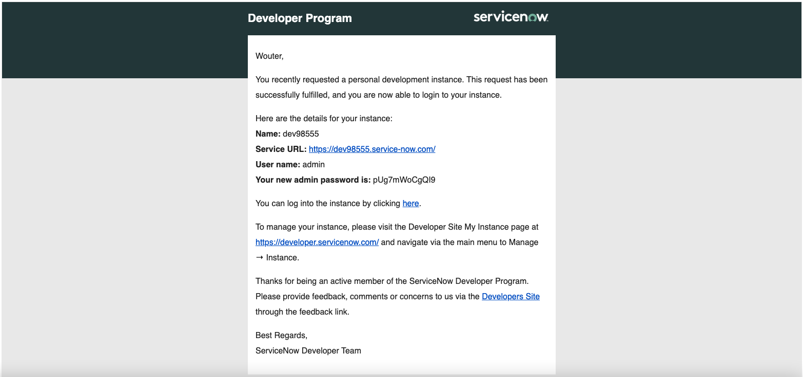
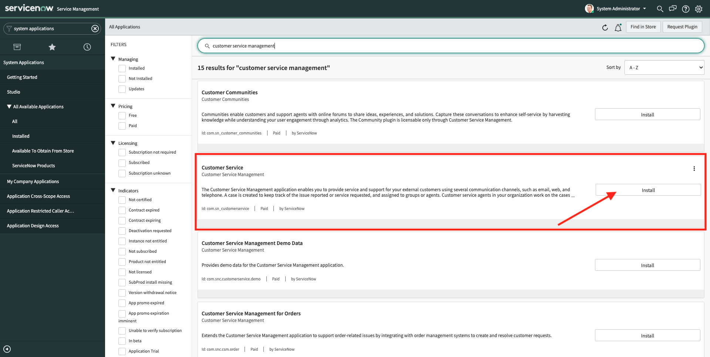

# 19.1 Setup your ServiceNow developer instance

## 19.1.1 Create your ServiceNow account and instance

Go to [https://developer.servicenow.com/dev.do#!/home](https://developer.servicenow.com/dev.do#!/home) and select **Sign up and start building**. 

You'll then see this. 

Fill out the fields and click **Sign Up**.

You'll then see this. 

Next, check your email for a link to activate your account. Click the link.

You'll then see this. Click **Sign In**.

Enter your email and click **Next**.

Enter your password and click **Next**.

You'll then see this. Scroll down until you reach the end of the document.

Check the checkbox to accept the ServiceNow Developer Agreement and click **Submit**.

You'll then see the developer homepage of ServiceNow. Click **Request Instance** to get your own personal ServiceNow instance.

You'll then see this popup.

Your instance is now being created, which might take a couple of minutes. After closing the popup, you'll see this on your Developer homepage.

After a couple of seconds/minutes, you'll see this message. You can see that the username for logging in to your ServiceNow developer instance is **admin**, and you'll also see a default password which you'll need in the next step. You'll have to change that default password in the next step. You'll also get a confirmation email with your login credentials and Service URL. Keep this email as you'll need it in one of the next exercises.

Click **Open Instance**.

You've now successfully logged in to your ServiceNow instance. 

>[!NOTE]
>
>You now have access to a ServiceNow developer instance. A developer instance is intended for testing and development. If you don't use your instance for 10 days, your instance will be reclaimed by ServiceNow and you'll lose access to it. If you want to keep using your ServiceNow instance, you'll have to make sure to log in to [https://developer.servicenow.com/](https://developer.servicenow.com/) at least once every 10 days and then click the **Refresh Status** button.

## 19.1.2 Activate Customer Service Management in ServiceNow

You now need to activate the **Customer Service Management** plugin in ServiceNow.

To install the **Customer Service Management** plugin, type **System Applications** in the **Filter Navigator**. Then, click **All**.

You'll then see this. Search for the plugin **Customer Service Management** and click **Install**.

You'll then see this popup. Scroll down until you see the **Activate** button.

You'll then see a confirmation window. Click **Activate**.

You'll then see a progress bar. 

After a couple of minutes, the **Customer Service Management** plugin will be activated and available. Click **Close & Reload Form**.

## 19.1.3 Activate ServiceNow IntegrationHub Enterprise Pack Installer

Go back to [https://developer.servicenow.com/dev.do#!/home](https://developer.servicenow.com/dev.do#!/home). In the **Your Instance** panel, click **Manage** and then click **Activate Plugin**.

In the list of available plugins, search and find the plugin named **ServiceNow IntegrationHub Enterprise Pack Installer**. Click **Activate**.

You'll then see this. Close this window and wait until you receive an email to confirm that the **ServiceNow IntegrationHub Enterprise Pack** plugin has been activated. This may take 10 minutes.

Once you've received this email, you can continue with the next exercise.

Next Step: [19.2 Install and configure the integration between ServiceNow and Adobe Experience Platform through Adobe I/O](./ex2.md)

[Go Back to Module 19](./call-center-servicenow.md)

[Go Back to All Modules](./../../overview.md)
