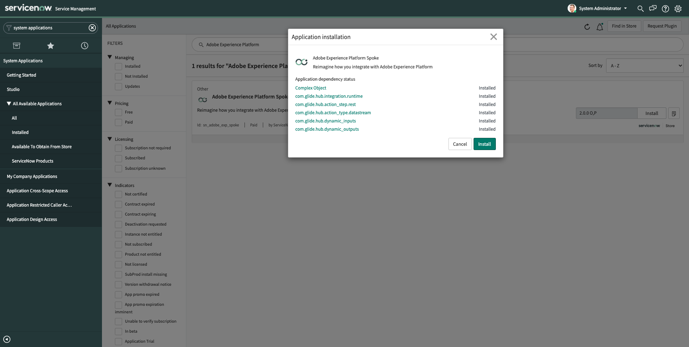
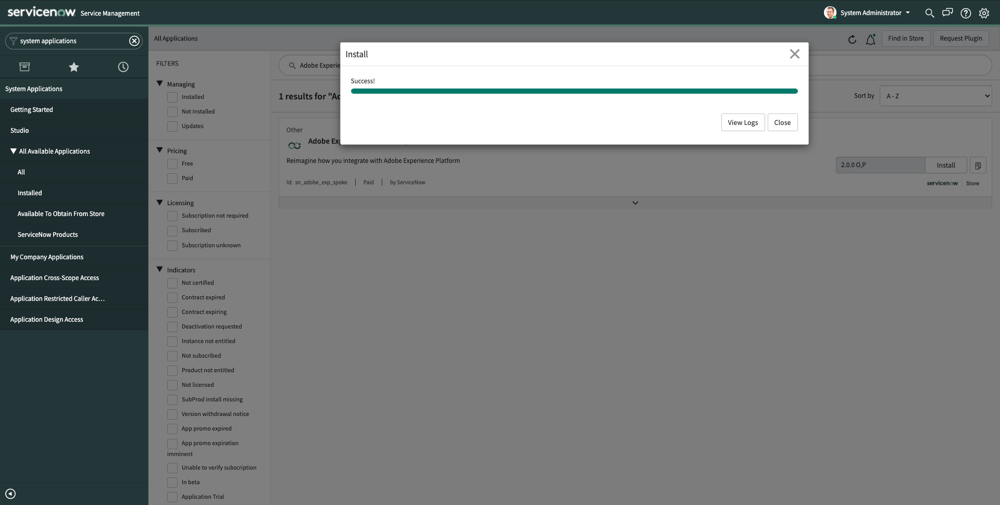
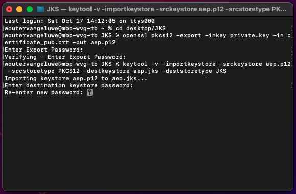

# 19.2 Install and configure the integration between ServiceNow and Adobe Experience Platform through Adobe I/O

Make sure you're successfully logged in to your ServiceNow instance.


## 19.2.1 Install the Adobe Experience Platform Spoke in ServiceNow

As part of the productized integration of Adobe Experience Platform in ServiceNow, a spoke was created.

To install the **Adobe Experience Platform Spoke**, type **System Applications** in the **Filter Navigator**. Then, click **All**.


You'll then see this.


In the search field, enter **Adobe Experience Platform**. Next, click **Install**.


You'll then see this. Click **Install** again.



You'll then see this progress bar. Installing the spoke may take up to 5 minutes.


Once you see this, click **Close**. You can now continue with the next step.



## 19.2.2 Your Adobe I/O Project

In module 3, during exercise [3.3.2 - Setup your Adobe I/O Project](./../module3/ex3.md), you created your own Adobe I/O project. When you created that Adobe I/O project, a certificate pair was created. You will need to use that certificate pair during this exercise. If you don't have it anymore, follow the steps outlined in exercise [3.3.2 - Setup your Adobe I/O Project](./../module3/ex3.md) to create either a new project, or simply to generate a new certificate pair.

Either way, before you continue you need to have these files ready:

- private.key
- certificate_pub.crt

These were generated during the setup of your Adobe I/O project, and they were automatically downloaded to your computer in a zip-file that is named **config.zip**.

Additionally, you'll need to open your Adobe I/O project to retrieve other important information of your **Service Account (JWT)** like Client ID, Client Secret and more.

To do so, go to [https://console.adobe.io/projects](https://console.adobe.io/projects). You'll then see this.


Go to **Projects** in the top navigation. Open you project, which should be named **Platform API ldap**.


After opening your project, you'll have a similar view. Click **Service Account (JWT)** to view the credentials of your Adobe I/O project.


You'll then see this. Keep this screen open during the next 2 steps as you'll need to enter these credentials in the ServiceNow user interface while setting up the integration.


## 19.2.3 Create your Java Key Store

One of the requirements to set up the Adobe Experience Platform spoke inside ServiceNow is that your certificate pair needs to be part of a Java Key Store (JKS) file.

At this moment, you need these 2 files:

- private.key
- certificate_pub.crt

Create a new folder on your desktop and name it **JKS**.


Open the **JKS** folder and copy/paste the 2 certificate files into this folder.


Open a new Terminal window.


Navigate to the **JKS** folder on your desktop, by entering a command similar to this:

```javascript
cd desktop/JKS
```


You'll then see this.


>[!NOTE]
>
>If you're using Microsoft Windows, make sure to have **OpenSSL** installed on your computer before continuing. You can find [instructions to install OpenSSL here](../module5/install-openssl.md).

Next, enter the following command in Terminal:

```javascript
openssl pkcs12 -export -inkey private.key -in certificate_pub.crt -out aep.p12
```

You'll have to enter an **Export Password** - you can choose whichever password you prefer but choose something that is easy to remember as you'll need to use that password several times in the next steps. Also, make sure to have a minimum of 6 characters for your password as that's required by Java Keystore.


Your Terminal window should now look like this.


A this moment, after the previous command, you should now see a new file in your **JKS** folder named **aep.p12**.


>[!NOTE]
>
>If you're using Windows, the below command won't work yet. You need to install Java JDK first, which you can find here: [https://www.oracle.com/de/java/technologies/javase-jdk15-downloads.html](https://www.oracle.com/de/java/technologies/javase-jdk15-downloads.html). 

Next, enter the following command in Terminal:

**On macOS:**

```javascript
keytool -v -importkeystore -srckeystore aep.p12 -srcstoretype PKCS12 -destkeystore aep.jks -deststoretype JKS
```

**On Windows:**

```javascript
"C:\Program Files\Java\jdk-15.0.2\bin\keytool.exe" -v -importkeystore -srckeystore aep.p12 -srcstoretype PKCS12 -destkeystore aep.jks -deststoretype JKS
```

>[!NOTE]
>
> The path to your Java JDK directory may be different depending on what version of Java JDK you have installed. If this command doesn't work, verify the full path exists and update as needed.


You then need to enter the **Destination Password**. Please use the same password as the one you used while executing the previous command.


Confirm your password.



You now need to enter the **Source Password**. This is the password you entered while executing the previous command to create the file **aep.p12**.


Finally, you should see this after executing this command.


And you should now also have a file named **aep.jks**.


If you see the file **aep.jks**, you can continue with the next exercise.

Next Step: [19.3 Setup your ServiceNow environment](./ex3.md)

[Go Back to Module 19](./call-center-servicenow.md)

[Go Back to All Modules](./../../overview.md)
